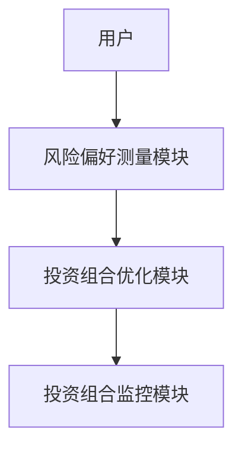
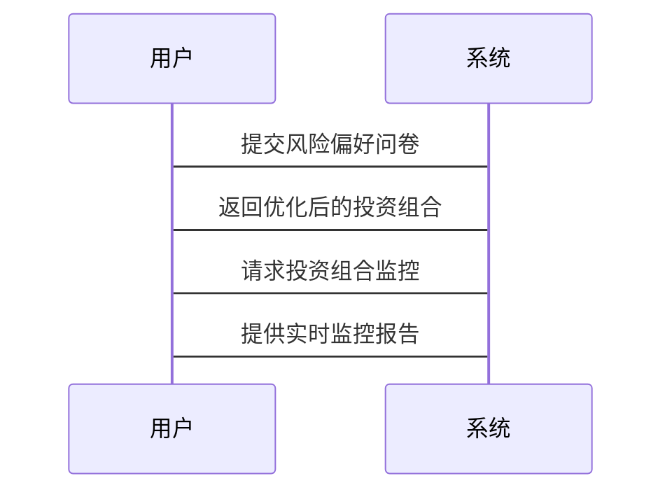

                 


# 投资者风险偏好测量：个性化投资组合构建

---

## 关键词：
投资者风险偏好、个性化投资组合、现代投资组合理论、风险测度模型、大数据分析、机器学习算法

---

## 摘要：
投资者风险偏好是投资决策的核心因素之一。本文通过分析风险偏好测量的理论基础、算法原理和系统架构，详细阐述如何基于投资者的风险偏好构建个性化投资组合。文章从背景介绍出发，逐步分析风险偏好的核心概念、测量方法和投资组合优化策略，结合实际案例和系统设计，为投资者提供科学的决策支持。

---

## 第1章: 投资者风险偏好概述

### 1.1 风险偏好与投资决策的关系
#### 1.1.1 风险偏好的定义
风险偏好是投资者对收益与风险之间关系的偏好程度，反映了投资者在面对不确定性时的态度。

#### 1.1.2 风险偏好与投资决策
投资者的风险偏好直接影响其资产配置和投资策略的选择。例如，风险厌恶者更倾向于选择低风险、稳定收益的资产，而风险偏好者则愿意承担更高的风险以追求更高的回报。

#### 1.1.3 不同投资者类型的风险偏好
- **风险厌恶者**：注重本金安全，追求稳定收益。
- **风险中性者**：关注收益的期望值，对风险持中立态度。
- **风险偏好者**：愿意承担较高风险以获取更高回报。

### 1.2 风险偏好测量的背景与意义
#### 1.2.1 风险偏好测量的重要性
准确测量投资者的风险偏好是构建个性化投资组合的基础，有助于优化资产配置和提升投资收益。

#### 1.2.2 风险偏好测量的挑战
- 数据获取的难度：投资者的主观偏好与实际行为可能存在偏差。
- 模型选择的复杂性：不同模型对风险偏好的衡量标准不同。

### 1.3 风险偏好测量的理论基础
#### 1.3.1 马科维茨现代投资组合理论
马科维茨提出的均值-方差模型是风险偏好测量的经典理论，为现代投资组合优化奠定了基础。

#### 1.3.2 风险偏好与资产定价的关系
投资者的风险偏好直接影响其对资产定价的预期，例如CAPM模型中对风险溢价的计算。

---

## 第2章: 风险偏好测量的核心概念

### 2.1 风险偏好测量的原理
#### 2.1.1 风险偏好的量化方法
通过问卷调查、历史交易数据和市场行为分析等多种方式量化投资者的风险偏好。

#### 2.1.2 风险偏好测度的指标
- 风险厌恶系数（Risk Aversion Coefficient）
- 风险承受能力（Risk Tolerance）

### 2.2 风险偏好与投资组合优化
#### 2.2.1 投资组合优化的目标
在给定风险偏好的情况下，寻找最优资产配置以最大化收益或最小化风险。

#### 2.2.2 风险偏好对资产配置的影响
根据投资者的风险偏好，调整股票、债券和其他资产的比例。

---

## 第3章: 风险偏好测量的算法与模型

### 3.1 基于大数据的风险偏好分析
#### 3.1.1 数据来源与特征提取
从投资者的历史交易数据、市场行为和问卷调查中提取风险偏好相关特征。

#### 3.1.2 机器学习模型的应用
使用聚类分析、回归分析和决策树等方法对风险偏好进行分类和预测。

### 3.2 风险偏好测量的数学模型
#### 3.2.1 风险偏好函数
$$ R = f(P, U) $$
其中，$R$ 表示风险偏好，$P$ 表示概率，$U$ 表示效用。

#### 3.2.2 投资组合优化的数学表达
$$ \text{最大化 } \mu - \lambda \sigma $$
其中，$\mu$ 是期望收益，$\sigma$ 是收益的标准差，$\lambda$ 是风险偏好系数。

---

## 第4章: 个性化投资组合构建

### 4.1 投资组合构建的步骤
1. 确定投资者的风险偏好。
2. 选择适合的资产类别。
3. 确定各资产的配置比例。
4. 定期调整投资组合。

### 4.2 风险偏好与投资组合优化
#### 4.2.1 现代投资组合理论的应用
使用均值-方差模型优化投资组合，考虑风险偏好系数的影响。

#### 4.2.2 动态调整策略
根据市场变化和投资者风险偏好的变化，动态调整投资组合。

---

## 第5章: 系统架构与实现

### 5.1 系统架构设计
#### 5.1.1 系统功能模块
- 风险偏好测量模块
- 投资组合优化模块
- 投资组合监控模块

#### 5.1.2 系统架构图


### 5.2 系统接口设计
- 用户输入：投资者的基本信息和风险偏好问卷。
- 输出：优化后的投资组合配置和监控报告。

### 5.3 系统交互流程


---

## 第6章: 项目实战

### 6.1 环境搭建
- 安装Python和相关库（如NumPy、Pandas、Scikit-learn）。
- 数据集准备：投资者问卷数据和市场数据。

### 6.2 核心功能实现
#### 6.2.1 风险偏好计算
```python
import numpy as np

def calculate_risk_preference(scores):
    risk_preference = np.mean(scores)
    return risk_preference
```

#### 6.2.2 投资组合优化
```python
import pandas as pd
from scipy.optimize import minimize

def optimize_portfolio(weights, returns, risk_preference):
    # 定义目标函数
    def objective(x):
        return -np.sum(weights * x * returns)
    
    # 约束条件
    constraints = [{'type': 'eq', 'fun': lambda x: np.sum(x) - 1}]
    
    result = minimize(objective, x0=[1.0/len(weights)]*len(weights), 
                     constraints=constraints, bounds=[(0,1)]*len(weights))
    return result.x
```

### 6.3 实际案例分析
以某投资者为例，假设其风险偏好系数为0.5，计算出其最优投资组合为股票40%，债券30%，现金30%。

---

## 第7章: 总结与展望

### 7.1 全文总结
本文详细介绍了投资者风险偏好测量的理论、算法和系统实现，展示了如何基于风险偏好构建个性化投资组合。

### 7.2 未来展望
随着人工智能和大数据技术的发展，风险偏好测量将更加精准和个性化，投资组合优化也将更加智能化。

---

## 最佳实践 Tips
- 在实际应用中，建议结合投资者的实际情况和市场环境动态调整投资组合。
- 注意数据质量和模型的适用性，避免过度拟合和过时模型的应用。

---

## 小结
投资者风险偏好测量是个性化投资组合构建的核心，通过科学的测量和优化，可以帮助投资者实现收益与风险的最佳平衡。希望本文的内容能够为投资者和投资顾问提供有价值的参考和指导。

--- 

如果需要进一步的解释或扩展，请随时告知！

