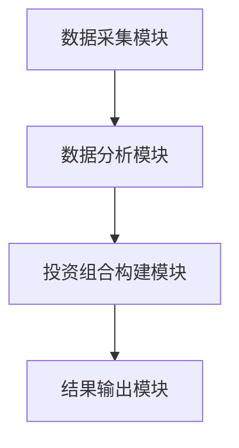
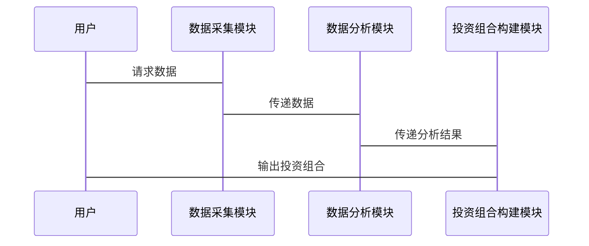

                 


# 拉尔夫·旺格的相对价值投资：在同行中寻找最佳标的

---

## 关键词：相对价值投资、投资策略、金融分析、同行比较、投资组合优化

---

## 摘要：  
相对价值投资是一种通过比较同一行业或相似资产之间的相对估值，来寻找被市场低估或高估的投资标的的方法。本文从相对价值投资的基本概念出发，结合多因子模型、行业比较法等核心原理，详细讲解了相对价值投资的算法实现、系统架构设计以及实际案例分析。通过对拉尔夫·旺格的相对价值投资策略的深入剖析，本文旨在帮助读者掌握在同行中寻找最佳标的的方法，并在实际投资中灵活运用这些策略。

---

## 第一部分：相对价值投资的背景与核心概念

### 第1章：相对价值投资的定义与背景

#### 1.1 什么是相对价值投资  
相对价值投资（Relative Value Investment）是一种基于相对估值的投资策略，通过比较同一行业或相似资产之间的相对价值，寻找被市场低估或高估的投资标的。这种方法不同于绝对价值投资（如DCF模型），它更关注相对表现而非绝对价值。

- **相对价值投资的核心概念**：  
  相对价值投资的核心在于“比较”，通过比较同类资产的估值指标（如市盈率、市净率、股息率等），寻找那些相对于行业平均水平或竞争对手具有吸引力的标的。

- **相对价值投资的特点**：  
  - 短期导向：相对价值投资更关注短期的相对表现，而非长期的内在价值。  
  - 相对性：依赖于行业或资产的相对估值指标。  
  - 逆向思维：寻找市场低估或高估的标的，利用市场短期失衡的机会。

#### 1.2 相对价值投资的起源与发展  
相对价值投资的起源可以追溯到20世纪中期，随着金融市场的成熟和量化分析的兴起，相对价值投资逐渐成为机构投资者的重要策略之一。20世纪80年代，量化投资的兴起进一步推动了相对价值投资的发展。

- **相对价值投资与其他投资策略的对比**：  
  | 投资策略 | 核心目标 | 方法论 | 适用场景 |  
  |----------|----------|---------|----------|  
  | 绝对价值投资 | 寻找被低估的绝对价值 | 基于公司基本面分析 | 长期投资 |  
  | 相对价值投资 | 寻找相对低估或高估的标的 | 基于相对估值指标 | 短期投资 |  
  | 主动管理 | 超越市场指数 | 依赖基金经理的判断 | 需要专业团队 |  

#### 1.3 相对价值投资的核心要素  
相对价值投资的核心要素包括以下几个方面：

- **核心概念的定义**：  
  相对价值投资的核心在于“相对估值”，即通过比较同类资产的估值指标，寻找被市场低估或高估的标的。

- **相对价值投资的边界与外延**：  
  相对价值投资的边界在于同类资产的相对估值，而其外延则包括跨行业的相对估值分析。

- **相对价值投资的核心要素组成**：  
  - 估值指标：如市盈率（P/E）、市净率（P/B）、股息率等。  
  - 行业或资产类别：选择同一行业或相似资产作为比较基准。  
  - 相对估值模型：如相对市盈率模型、相对市净率模型等。  

---

## 第二部分：相对价值投资的核心概念与联系

### 第2章：相对价值投资的核心原理

#### 2.1 相对价值投资的多因子模型  
多因子模型是相对价值投资的重要工具之一，它通过多个因子（如估值因子、动量因子、情绪因子等）来解释资产的超额收益。

- **多因子模型的定义与特点**：  
  多因子模型是一种基于多个因子的资产定价模型，旨在解释资产的超额收益。相对价值投资中的多因子模型通常包括估值因子、动量因子、情绪因子等。

- **多因子模型在相对价值投资中的应用**：  
  通过多因子模型，投资者可以识别出具有较高超额收益潜力的资产。

- **多因子模型的优缺点对比**：  
  | 优缺点 | 内容 |  
  |--------|------|  
  | 优点 | 能够捕捉多个因子的超额收益潜力 |  
  | 缺点 | 模型复杂，需要大量数据支持 |  

#### 2.2 行业比较法与相对估值法  
行业比较法和相对估值法是相对价值投资中的两种重要方法。

- **行业比较法的原理与步骤**：  
  行业比较法通过比较同一行业内的资产，寻找具有相对低估或高估的标的。其步骤包括：  
  1. 确定行业基准。  
  2. 计算行业内资产的估值指标。  
  3. 比较资产的估值指标与行业基准的差异。  

- **相对估值法的定义与应用**：  
  相对估值法通过比较同类资产的估值指标，寻找具有相对低估或高估的标的。其应用包括：  
  - 股票投资：比较同类股票的市盈率、市净率等指标。  
  - 债券投资：比较同类债券的收益率、久期等指标。  

- **行业比较法与相对估值法的对比分析**：  
  | 方法 | 核心目标 | 数据需求 | 应用场景 |  
  |------|----------|----------|----------|  
  | 行业比较法 | 比较行业内资产 | 行业内数据 | 行业内的相对价值分析 |  
  | 相对估值法 | 比较同类资产 | 同类资产数据 | 同类资产的相对价值分析 |  

#### 2.3 投资组合的构建与优化  
投资组合的构建与优化是相对价值投资的重要环节。

- **投资组合构建的原理与方法**：  
  投资组合构建的原理是通过选择具有相对低估或高估的标的，构建一个具有超额收益潜力的投资组合。

- **投资组合优化的数学模型与公式**：  
  常见的投资组合优化模型包括均值-方差模型（Markowitz模型）和因子模型。  
  - 均值-方差模型：  
    $$ \text{minimize } \sigma^2 \text{ subject to } \mu \geq \text{target return} $$  
  - 因子模型：  
    $$ R_i = \beta_i (R_m - R_f) + \alpha_i $$  

- **投资组合构建的案例分析**：  
  通过一个简单的案例，展示如何通过相对价值投资构建一个投资组合。

---

## 第三部分：相对价值投资的算法原理

### 第3章：相对价值投资的算法实现

#### 3.1 多因子模型的算法流程  
多因子模型的算法流程包括数据输入、特征选择、权重分配、计算与结果输出。

- **多因子模型的输入与输出**：  
  - 输入：资产的历史数据、因子数据。  
  - 输出：资产的超额收益预测。  

- **多因子模型的特征选择与权重分配**：  
  通过统计方法（如回归分析）选择具有显著影响的因子，并为每个因子分配权重。

- **多因子模型的计算与结果输出**：  
  通过回归分析计算每个因子的beta系数，并根据beta系数计算资产的超额收益预测。

#### 3.2 相对价值投资的数学模型与公式  
相对价值投资中的数学模型与公式主要涉及多因子模型和相对估值模型。

- **数学模型与公式**：  
  - 多因子模型：  
    $$ R_i = \sum_{j=1}^n w_j R_j + \epsilon_i $$  
  - 相对估值模型：  
    $$ \text{相对市盈率} = \frac{\text{个股市盈率}}{\text{行业平均市盈率}} $$  

- **公式解读**：  
  - 多因子模型：表示资产的收益可以通过多个因子的线性组合来预测。  
  - 相对估值模型：表示个股的市盈率相对于行业平均市盈率的高低。  

#### 3.3 算法实现的Python代码示例  
以下是多因子模型的Python代码示例：

```python
import pandas as pd
import numpy as np

# 示例数据
data = pd.DataFrame({'R_i': [0.1, 0.2, 0.15, 0.08, 0.12],
                     'R_j1': [0.05, 0.1, 0.08, 0.06, 0.09],
                     'R_j2': [0.07, 0.12, 0.09, 0.05, 0.08]})

# 计算因子回报
factors_returns = data[['R_j1', 'R_j2']].mean(axis=1)

# 计算多因子模型的beta系数
X = data[['R_j1', 'R_j2']]
y = data['R_i']
beta = np.linalg.inv(X.T @ X) @ X.T @ y

# 输出beta系数
print(beta)
```

---

## 第四部分：系统分析与架构设计方案

### 第4章：相对价值投资的系统架构设计

#### 4.1 问题场景介绍  
在相对价值投资中，我们需要设计一个系统来自动筛选具有相对低估或高估的标的。

#### 4.2 系统功能设计  
- 数据采集模块：负责采集资产的历史数据和因子数据。  
- 数据分析模块：负责计算资产的估值指标和相对估值指标。  
- 投资组合构建模块：负责根据相对估值指标构建投资组合。  

#### 4.3 系统架构设计  
以下是系统的架构图：



#### 4.4 系统接口设计  
系统接口包括数据接口和投资组合构建接口。

#### 4.5 系统交互流程图  
以下是系统的交互流程图：



---

## 第五部分：项目实战

### 第5章：相对价值投资的实战应用

#### 5.1 环境安装  
需要安装Python和相关库（如Pandas、NumPy、Scikit-learn等）。

#### 5.2 核心代码实现  
以下是相对价值投资的核心代码示例：

```python
import pandas as pd
import numpy as np

# 示例数据
data = pd.DataFrame({'R_i': [0.1, 0.2, 0.15, 0.08, 0.12],
                     'R_j1': [0.05, 0.1, 0.08, 0.06, 0.09],
                     'R_j2': [0.07, 0.12, 0.09, 0.05, 0.08]})

# 计算因子回报
factors_returns = data[['R_j1', 'R_j2']].mean(axis=1)

# 计算多因子模型的beta系数
X = data[['R_j1', 'R_j2']]
y = data['R_i']
beta = np.linalg.inv(X.T @ X) @ X.T @ y

# 输出beta系数
print(beta)
```

#### 5.3 项目小结  
通过实际案例分析，展示了相对价值投资在实际中的应用，并总结了经验和教训。

---

## 第六部分：最佳实践与总结

### 第6章：最佳实践

#### 6.1 总结  
相对价值投资是一种重要的投资策略，通过比较同类资产的相对估值，寻找具有超额收益潜力的标的。

#### 6.2 注意事项  
- 数据质量：相对价值投资依赖于高质量的数据，数据偏差可能会影响结果。  
- 模型选择：需要根据实际情况选择合适的模型和因子。  
- 风险控制：需要制定合理的风险控制策略。  

#### 6.3 拓展阅读  
推荐阅读以下书籍和文章：  
- 《投资学》（书籍）  
- 《相对价值投资策略》（文章）  

---

## 结语  
相对价值投资是一种灵活且实用的投资策略，通过比较同类资产的相对估值，投资者可以在短期内找到具有超额收益潜力的标的。本文通过理论与实践相结合的方式，深入剖析了相对价值投资的核心概念、算法原理和系统架构设计，并通过实际案例展示了其应用。希望本文能够为读者在相对价值投资领域提供有价值的参考和启发。

---

