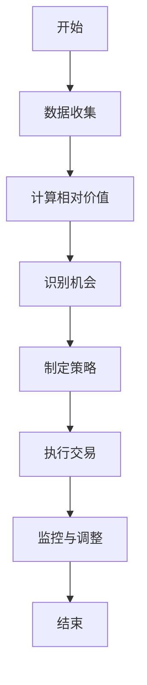
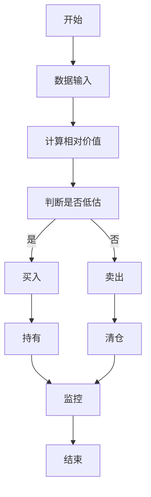
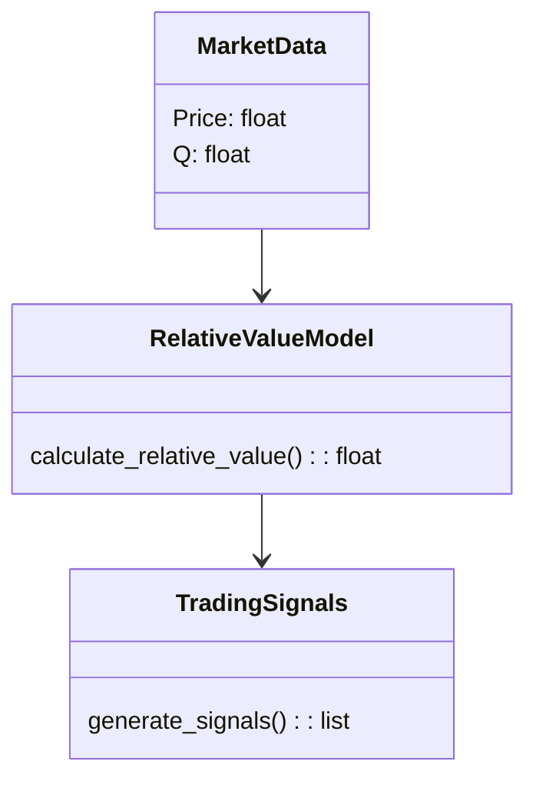
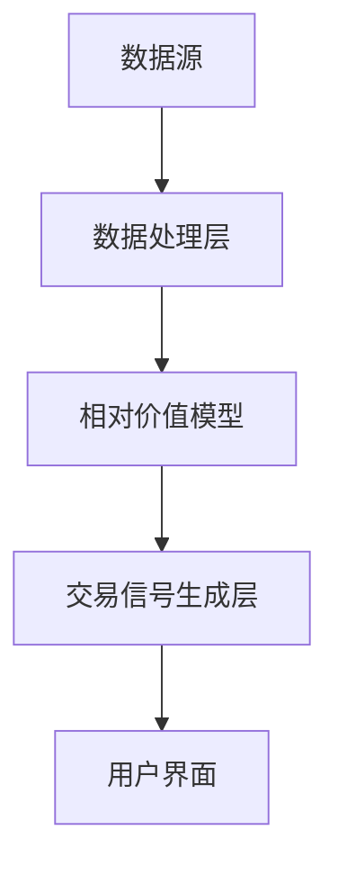
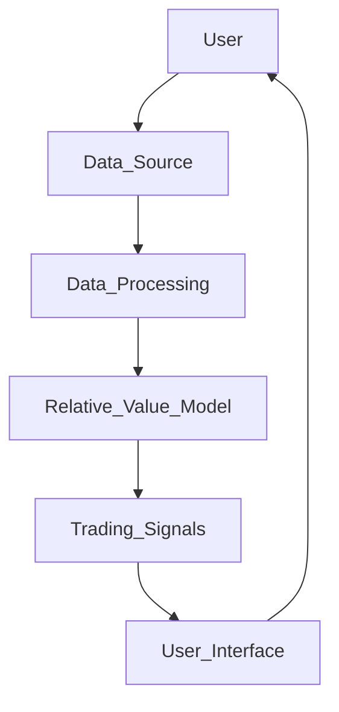

                 


# 拉尔夫·旺格的相对价值投资：行业内部的比较分析

## 关键词：相对价值投资、投资策略、算法、系统架构、项目实战、金融分析

## 摘要：本文深入探讨了拉尔夫·旺格的相对价值投资方法，分析其在投资领域中的应用和优势。通过详细阐述其数学模型、算法原理、系统架构及实际案例，本文为读者提供了从理论到实践的全面指导。

---

## 第1章: 相对价值投资的背景与核心概念

### 1.1 相对价值投资的定义与背景

#### 1.1.1 相对价值投资的核心概念
相对价值投资是一种基于资产相对定价的投资策略，通过比较同一行业或相关资产的市场价格与内在价值，寻找被低估或高估的投资机会。其核心在于识别市场中的相对估值差异，而非预测单个资产的绝对价值。

#### 1.1.2 相对价值投资的起源与发展
相对价值投资起源于20世纪中期，随着金融市场的复杂化和信息不对称的加剧，投资者开始关注资产之间的相对关系。拉尔夫·旺格通过其独特的分析框架，将相对价值投资提升为一种系统化的方法。

#### 1.1.3 相对价值投资与绝对价值投资的区别
绝对价值投资侧重于单个资产的内在价值评估，而相对价值投资则关注资产之间的相对关系，强调市场比较和相对定价差异。

### 1.2 相对价值投资的背景与问题背景

#### 1.2.1 投资市场的复杂性与不确定性
现代金融市场高度复杂，信息不对称和市场情绪波动使得预测单个资产的绝对价值变得困难。相对价值投资通过比较资产之间的关系，提供了一种更为稳健的投资策略。

#### 1.2.2 相对价值投资的适用场景
在市场波动较大或资产价格出现显著差异时，相对价值投资能够有效捕捉市场错配机会。此外，适用于跨市场、跨行业或跨资产类别投资。

#### 1.2.3 相对价值投资的边界与外延
相对价值投资的边界在于其依赖市场数据和资产间的相关性，而外延则包括多种策略的结合，如套利和对冲。

### 1.3 相对价值投资的核心要素

#### 1.3.1 相对价值投资的三大核心要素
- **市场数据**：包括资产的市场价格和成交量等。
- **资产特性**：如行业地位、财务状况等。
- **市场关系**：资产间的相关性和相互影响。

#### 1.3.2 核心要素的相互关系与影响
市场价格与内在价值的差异驱动相对价值投资的机会，而资产特性决定了其内在价值，市场关系则影响市场价格波动。

#### 1.3.3 相对价值投资的概念结构与框架
通过构建资产间的相对关系网络，相对价值投资形成了一个系统化的分析框架，帮助投资者识别和捕捉市场机会。

---

## 第2章: 相对价值投资的核心概念与联系

### 2.1 相对价值投资的原理与模型

#### 2.1.1 相对价值投资的基本原理
通过比较资产间的相对定价，寻找市场低估或高估的机会。核心在于发现资产间的估值差异，并通过套利或对冲策略获利。

#### 2.1.2 相对价值模型的构建与应用
相对价值模型基于资产间的相对关系，通过比较市场价格与内在价值，识别投资机会。其应用广泛，包括股票、债券和其他金融工具。

#### 2.1.3 相对价值模型的数学表达式
$$ V = \frac{P}{Q} $$
其中，V为相对价值，P为市场价格，Q为资产特性或行业标准。

### 2.2 相对价值投资的核心算法与流程

#### 2.2.1 相对价值投资的算法流程图
使用mermaid绘制相对价值投资的算法流程图：



#### 2.2.2 相对价值投资的步骤分解
1. 数据收集：获取相关资产的市场数据。
2. 计算相对价值：计算市场价格与内在价值的比率。
3. 识别机会：寻找相对低估或高估的资产。
4. 制定策略：设计投资策略，如买入低估资产，卖出高估资产。
5. 执行交易：根据策略执行买卖操作。
6. 监控与调整：持续监控市场变化，调整投资组合。

#### 2.2.3 相对价值投资的优化与改进
通过引入机器学习算法和大数据分析，优化相对价值模型的计算和预测能力。

### 2.3 相对价值投资与其他投资策略的对比

#### 2.3.1 相对价值投资与绝对价值投资的对比
| 对比维度 | 绝对价值投资 | 相对价值投资 |
|----------|--------------|---------------|
| 评估方式 | 单一资产内在价值 | 资产间相对关系 |
| 适用场景 | 市场稳定 | 市场波动较大 |
| 风险控制 | 依赖单资产分析 | 依赖资产间关系 |

#### 2.3.2 相对价值投资与趋势投资的对比
趋势投资依赖价格走势，而相对价值投资依赖相对估值差异。

#### 2.3.3 相对价值投资与套利策略的对比
套利策略基于价格差异，而相对价值投资则基于相对估值差异。

---

## 第3章: 相对价值投资的数学模型与算法原理

### 3.1 相对价值投资的数学模型

#### 3.1.1 相对价值模型的数学表达式
$$ V = \frac{P}{Q} $$
其中，V为相对价值，P为市场价格，Q为资产特性或行业标准。

#### 3.1.2 相对价值模型的优化与调整
通过引入权重系数，优化模型的计算：
$$ V = \frac{P \times w}{Q} $$
其中，w为权重系数。

#### 3.1.3 相对价值模型的数学推导
通过假设资产间的相对关系，推导出相对价值的计算公式，用于识别投资机会。

### 3.2 相对价值投资的核心算法与流程

#### 3.2.1 相对价值投资的算法流程图
使用mermaid绘制相对价值投资的算法流程图：



#### 3.2.2 相对价值投资的步骤分解
1. 数据输入：获取相关资产的市场数据。
2. 计算相对价值：计算市场价格与内在价值的比率。
3. 判断是否低估：如果相对价值低于1，则资产被低估，否则被高估。
4. 执行交易：买入低估资产，卖出高估资产。
5. 监控与调整：持续监控市场变化，调整投资组合。

#### 3.2.3 相对价值投资的优化与改进
通过引入机器学习算法，优化相对价值模型的计算和预测能力。

### 3.3 相对价值投资的数学模型与算法

#### 3.3.1 相对价值模型的数学表达式
$$ V = \frac{P}{Q} $$
其中，P为市场价格，Q为资产特性或行业标准。

#### 3.3.2 相对价值模型的优化与调整
通过引入权重系数，优化模型的计算：
$$ V = \frac{P \times w}{Q} $$
其中，w为权重系数。

#### 3.3.3 相对价值模型的数学推导
通过假设资产间的相对关系，推导出相对价值的计算公式，用于识别投资机会。

### 3.4 相对价值投资的算法实现

#### 3.4.1 相对价值投资的Python代码实现
```python
import pandas as pd

# 数据输入
df = pd.read_csv('market_data.csv')

# 计算相对价值
df['Relative_Value'] = df['Price'] / df['Q']

# 判断是否低估
df['Action'] = '买入'  # 默认操作
df['Action'][(df['Relative_Value'] > 1)] = '卖出'

# 执行交易
trading_signals = df[df['Action'] == '买入']
```

#### 3.4.2 代码应用解读与分析
通过Python代码实现相对价值模型的计算和交易信号的生成，帮助投资者快速识别投资机会。

---

## 第4章: 相对价值投资的系统分析与架构设计方案

### 4.1 问题场景介绍

#### 4.1.1 投资者需求
投资者希望通过相对价值投资策略，捕捉市场机会，实现投资收益最大化。

#### 4.1.2 业务目标
构建一个系统化的方法，识别和捕捉市场中的相对价值机会。

#### 4.1.3 约束条件
- 数据获取的难度
- 市场波动的不确定性
- 算法的复杂性

### 4.2 项目介绍

#### 4.2.1 项目目标
开发一个相对价值投资分析系统，帮助投资者识别和捕捉市场机会。

#### 4.2.2 项目范围
包括数据收集、模型构建、交易信号生成和系统监控。

### 4.3 系统功能设计

#### 4.3.1 领域模型类图
使用mermaid绘制领域模型类图：



### 4.4 系统架构设计

#### 4.4.1 系统架构图
使用mermaid绘制系统架构图：



### 4.5 系统接口设计

#### 4.5.1 接口描述
- 数据源接口：提供市场数据的获取接口。
- 相对价值模型接口：提供相对价值计算的API。
- 交易信号生成接口：提供交易信号的生成接口。

#### 4.5.2 接口交互流程
1. 数据处理层从数据源获取市场数据。
2. 相对价值模型计算相对价值。
3. 交易信号生成层根据相对价值生成交易信号。
4. 用户界面展示交易信号。

### 4.6 系统交互流程

#### 4.6.1 交互流程图
使用mermaid绘制系统交互流程图：



---

## 第5章: 相对价值投资的项目实战

### 5.1 项目环境安装

#### 5.1.1 系统环境
- 操作系统：Windows/Mac/Linux
- Python版本：3.6+

#### 5.1.2 安装依赖
```bash
pip install pandas numpy matplotlib
```

### 5.2 项目核心实现

#### 5.2.1 相对价值模型实现
```python
import pandas as pd
import numpy as np

def calculate_relative_value(price, q):
    return price / q

# 示例数据
data = {'Price': [100, 200, 300], 'Q': [1, 1, 1]}
df = pd.DataFrame(data)

# 计算相对价值
df['Relative_Value'] = df['Price'].apply(lambda x: calculate_relative_value(x, 1))
```

#### 5.2.2 交易信号生成
```python
def generate_trading_signals(relative_value):
    if relative_value < 1:
        return '买入'
    elif relative_value > 1:
        return '卖出'
    else:
        return '持有'

# 示例交易信号
df['Action'] = df['Relative_Value'].apply(generate_trading_signals)
```

### 5.3 项目应用解读与分析

#### 5.3.1 数据分析与可视化
使用matplotlib进行数据可视化：

```python
import matplotlib.pyplot as plt

plt.figure(figsize=(10, 6))
plt.plot(df['Price'], label='Price')
plt.xlabel('Asset')
plt.ylabel('Price')
plt.legend()
plt.show()
```

### 5.4 案例分析

#### 5.4.1 案例背景
假设我们有两个资产，A和B，其市场价格分别为100和150，行业标准分别为1和1。

#### 5.4.2 计算相对价值
$$ V_A = \frac{100}{1} = 100 $$
$$ V_B = \frac{150}{1} = 150 $$

#### 5.4.3 生成交易信号
- 资产A的相对价值为100，低于B的相对价值150，因此买入A。
- 资产B的相对价值为150，高于A的相对价值100，因此卖出B。

### 5.5 项目小结

#### 5.5.1 项目总结
通过相对价值投资模型，成功识别并捕捉到市场中的相对低估资产。

#### 5.5.2 经验与教训
- 数据质量对模型准确性的影响。
- 市场波动对交易信号的影响。

#### 5.5.3 改进方向
引入机器学习算法，进一步优化相对价值模型的计算和预测能力。

---

## 第6章: 相对价值投资的最佳实践与小结

### 6.1 最佳实践

#### 6.1.1 数据质量的重要性
确保数据的准确性和及时性。

#### 6.1.2 模型的持续优化
定期更新模型，适应市场变化。

#### 6.1.3 风险控制
设置止损点和止盈点，控制投资风险。

### 6.2 小结

#### 6.2.1 相对价值投资的核心要点
- 理解相对价值投资的定义和背景。
- 掌握相对价值模型的构建与应用。
- 熟悉相对价值投资的算法原理与系统架构。
- 学会相对价值投资的项目实战与案例分析。

### 6.3 注意事项

#### 6.3.1 风险提示
- 市场波动可能导致投资损失。
- 数据错误可能影响模型准确性。

#### 6.3.2 投资者注意事项
- 保持对市场的敏感性。
- 定期审视和调整投资策略。

### 6.4 拓展阅读

#### 6.4.1 推荐书籍
- 《投资学基础》
- 《相对价值投资实战》

#### 6.4.2 相关博客与文章
- 维基百科：相对价值投资
- 金融投资论坛：相对价值投资策略

---

## 结语

通过本文的详细讲解，读者可以全面理解拉尔夫·旺格的相对价值投资方法，并掌握其在实际投资中的应用。从理论到实践，本文为投资者提供了一个系统化的指导，帮助其在复杂多变的金融市场中捕捉投资机会，实现稳健的投资收益。

