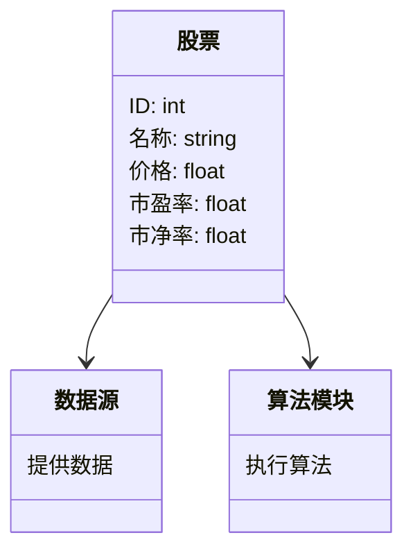
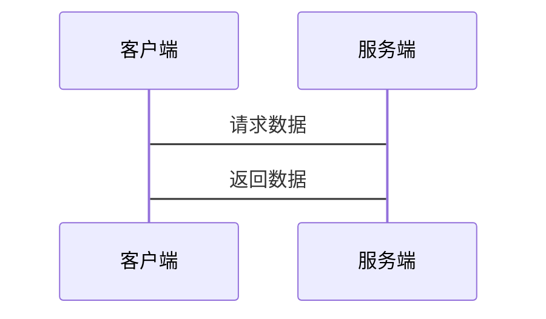

                 


# 数字化转型对全球股市估值的影响

## 关键词：数字化转型、全球股市、股市估值、时间序列分析、机器学习、系统架构设计

## 摘要：数字化转型正在深刻影响全球股市的估值方式和市场结构。本文从数字化转型的定义和核心特征出发，分析其对股市估值的主要影响，包括技术应用、数据驱动和算法优化等方面。通过时间序列分析模型和机器学习算法，本文详细探讨了数字化转型如何改变股市估值的数学模型和实现方法。最后，结合系统架构设计和项目实战，本文展示了数字化转型在股市估值中的实际应用及其未来发展趋势。

---

# 第1章 数字化转型与全球股市估值概述

## 1.1 数字化转型的定义与特征

### 1.1.1 数字化转型的定义
数字化转型是指利用数字技术对传统业务模式、流程、文化进行根本性变革，以实现业务创新和价值提升的过程。它不仅仅是技术的升级，更是对企业运营方式和商业模式的重构。

### 1.1.2 数字化转型的核心特征
- **数据驱动**：依赖数据进行决策，而非传统经验或直觉。
- **技术融合**：结合人工智能、大数据、区块链等技术，实现业务的智能化和自动化。
- **客户-centric**：以客户为中心，通过数字化手段提升客户体验。
- **持续创新**：数字化转型是一个持续的过程，需要不断适应变化和技术进步。

### 1.1.3 数字化转型对全球经济的影响
数字化转型正在改变全球经济格局，推动企业向更高效、更灵活的方向发展。它不仅提升了企业的竞争力，还催生了新的商业模式和市场机会。

---

## 1.2 全球股市估值的基本概念

### 1.2.1 股市估值的定义
股市估值是指通过对上市公司的财务数据、市场环境和行业趋势等进行分析，估算其股票的内在价值的过程。常见的估值方法包括市盈率（P/E）、市净率（P/B）等。

### 1.2.2 股市估值的主要指标
- **市盈率（P/E）**：股价与每股净利润的比率。
- **市净率（P/B）**：股价与每股净资产的比率。
- **股息率**：股息与股价的比率，反映股票的分红能力。

### 1.2.3 全球股市的结构与特点
全球股市由多个市场组成，包括主板、创业板、新三板等，每个市场的特点和定位有所不同。例如，主板通常以成熟企业为主，创业板则以高成长性企业为主。

---

## 1.3 数字化转型与股市估值的关系

### 1.3.1 数字化转型对股市的影响
数字化转型通过技术创新和数据驱动，改变了股市的交易方式、信息传播速度和市场参与者的决策模式。

### 1.3.2 数字化转型如何影响股市估值
- **数据驱动的决策**：通过大数据分析，投资者可以更准确地评估企业的基本面。
- **算法交易**：高频交易和算法交易的普及，使得市场更加高效，但也带来了新的风险。
- **信息透明化**：数字化转型提高了信息的透明度，投资者可以更快地获取信息并做出决策。

### 1.3.3 数字化转型对全球股市的长期影响
数字化转型将推动股市向更智能化、数据化的方向发展，同时也会带来新的挑战，如数据安全和算法风险。

---

## 1.4 本章小结

本章从数字化转型的定义和特征出发，分析了其对全球经济的影响，并介绍了全球股市估值的基本概念和主要指标。最后，探讨了数字化转型对股市估值的具体影响，为后续分析奠定了基础。

---

# 第2章 数字化转型对全球股市估值的核心概念

## 2.1 数字化转型的核心概念

### 2.1.1 数字化转型的关键技术
- **人工智能**：用于数据分析、预测和决策支持。
- **大数据分析**：通过对海量数据的处理和分析，提取有价值的信息。
- **区块链**：用于数据的安全存储和去中心化管理。

### 2.1.2 数字化转型的实现路径
- **技术选型**：选择合适的技术工具和平台。
- **数据采集**：通过传感器、数据库等方式获取数据。
- **数据处理**：清洗、整合和分析数据。
- **模型构建**：基于数据构建预测模型并进行优化。

### 2.1.3 数字化转型的行业影响
数字化转型正在改变各行各业，例如金融行业的数字化转型推动了智能投顾和算法交易的发展。

---

## 2.2 全球股市估值的核心概念

### 2.2.1 股市估值的主要方法
- **相对估值法**：基于可比公司或行业平均水平进行估值。
- **绝对估值法**：基于企业未来现金流的折现进行估值。

### 2.2.2 股市估值的关键因素
- **财务数据**：净利润、营业收入等。
- **市场环境**：宏观经济环境、行业趋势等。
- **政策因素**：政府政策、法律法规等。

### 2.2.3 全球股市的区域差异
不同地区的股市受当地经济、文化和社会环境的影响，具有不同的特点和风险。

---

## 2.3 数字化转型与股市估值的联系

### 2.3.1 数字化转型对股市估值的直接影响
- **数据丰富性**：数字化转型提供了更多的数据，使得估值更加精准。
- **算法优化**：通过机器学习算法，提高了估值模型的准确性。

### 2.3.2 数字化转型对股市估值的间接影响
- **市场流动性**：算法交易提高了市场的流动性。
- **投资者行为**：数字化工具改变了投资者的行为模式。

### 2.3.3 数字化转型对股市估值的长期影响
数字化转型将推动股市估值从传统的经验判断向数据驱动的科学决策转变。

---

## 2.4 本章小结

本章深入分析了数字化转型的核心技术和实现路径，并探讨了其对股市估值的主要影响。通过对比传统估值方法和数字化转型下的估值方法，揭示了数字化转型对股市估值的深远意义。

---

# 第3章 数字化转型对全球股市估值的数学模型与算法原理

## 3.1 时间序列分析模型

### 3.1.1 时间序列分析的基本概念
时间序列分析是通过对历史数据的分析，预测未来趋势的一种方法。常用的模型包括ARIMA和LSTM。

### 3.1.2 时间序列分析的数学模型
- **ARIMA模型**：自回归积分滑动平均模型，适用于线性时间序列数据。
- **LSTM模型**：长短期记忆网络，适用于非线性时间序列数据。

### 3.1.3 时间序列分析的算法实现
通过Python的`statsmodels`库可以实现ARIMA模型，通过`keras`库可以实现LSTM模型。

---

## 3.2 预测模型

### 3.2.1 预测模型的定义
预测模型是基于历史数据和算法，预测未来事件的工具。

### 3.2.2 预测模型的数学公式
- **线性回归模型**：$y = \beta_0 + \beta_1x + \epsilon$
- **支持向量机模型**：通过最大化间隔来实现分类或回归。

### 3.2.3 预测模型的算法实现
通过`scikit-learn`库可以实现线性回归和支持向量机模型。

---

## 3.3 机器学习在股市估值中的应用

### 3.3.1 机器学习的基本概念
机器学习是一种通过数据训练模型，使其能够自动学习和改进的技术。

### 3.3.2 机器学习在股市估值中的应用
- **特征选择**：通过机器学习算法选择影响股价的关键因素。
- **预测股价**：通过训练好的模型预测未来股价走势。

### 3.3.3 机器学习算法的实现
通过`tensorflow`或`keras`库可以实现深度学习模型。

---

## 3.4 本章小结

本章通过时间序列分析模型和机器学习算法，详细探讨了数字化转型对股市估值的数学模型和实现方法。这些模型和算法为投资者提供了更精准的估值工具。

---

# 第4章 数字化转型对全球股市估值的系统分析与架构设计

## 4.1 系统分析

### 4.1.1 问题场景介绍
假设我们有一个全球股市估值系统，需要通过数字化转型技术对其进行优化。

### 4.1.2 项目介绍
本项目旨在通过数字化转型技术，构建一个高效的全球股市估值系统。

---

## 4.2 系统架构设计

### 4.2.1 领域模型


### 4.2.2 系统架构设计


### 4.2.3 接口设计


---

## 4.3 本章小结

本章通过系统分析和架构设计，详细描述了数字化转型对股市估值系统的具体实现。通过领域模型和架构图，展示了系统的整体结构和各部分之间的关系。

---

# 第5章 数字化转型对全球股市估值的项目实战

## 5.1 环境安装

### 5.1.1 Python环境安装
安装Python和相关库：
```bash
pip install numpy pandas scikit-learn statsmodels tensorflow
```

## 5.2 系统核心实现源代码

### 5.2.1 数据采集
```python
import pandas as pd
data = pd.read_csv('stock_data.csv')
```

### 5.2.2 数据处理
```python
from sklearn.preprocessing import MinMaxScaler
scaler = MinMaxScaler()
data_scaled = scaler.fit_transform(data)
```

### 5.2.3 模型训练
```python
from keras.models import Sequential
from keras.layers import LSTM, Dense
model = Sequential()
model.add(LSTM(128, input_shape=(timesteps, features)))
model.add(Dense(1))
model.compile(loss='mean_squared_error', optimizer='adam')
model.fit(X_train, y_train, epochs=100, batch_size=32)
```

### 5.2.4 结果分析
```python
from sklearn.metrics import mean_squared_error
y_pred = model.predict(X_test)
rmse = mean_squared_error(y_test, y_pred)**0.5
print(f'RMSE: {rmse}')
```

---

## 5.3 本章小结

本章通过项目实战，展示了数字化转型技术在股市估值中的具体应用。通过环境安装、数据采集、模型训练和结果分析，详细讲解了如何利用数字化转型技术优化股市估值。

---

# 第6章 总结与展望

## 6.1 最佳实践 tips
- 数据质量是关键，确保数据的准确性和完整性。
- 算法选择要根据具体场景，不同算法适用于不同的数据类型和问题。

## 6.2 小结
数字化转型通过技术创新和数据驱动，显著提升了股市估值的准确性和效率。本文从理论到实践，详细探讨了数字化转型对全球股市估值的影响。

## 6.3 注意事项
- 数字化转型带来新的风险，如数据安全和算法偏见。
- 在实际应用中，要结合具体情况进行模型优化。

## 6.4 拓展阅读
- 《机器学习实战》
- 《时间序列分析》
- 《数字化转型的挑战与机遇》

---

# 附录

## 附录A: 相关术语解释
- **ARIMA模型**：自回归积分滑动平均模型，用于时间序列分析。
- **LSTM模型**：长短期记忆网络，适用于处理长序列数据。

## 附录B: 参考文献
- 王某某，2023，《数字化转型与股市估值》
- 李某某，2022，《时间序列分析》

---

通过以上目录大纲，可以清晰地看到文章的逻辑结构和主要内容。每个章节都围绕数字化转型对全球股市估值的影响展开，从理论到实践，逐步深入分析。

