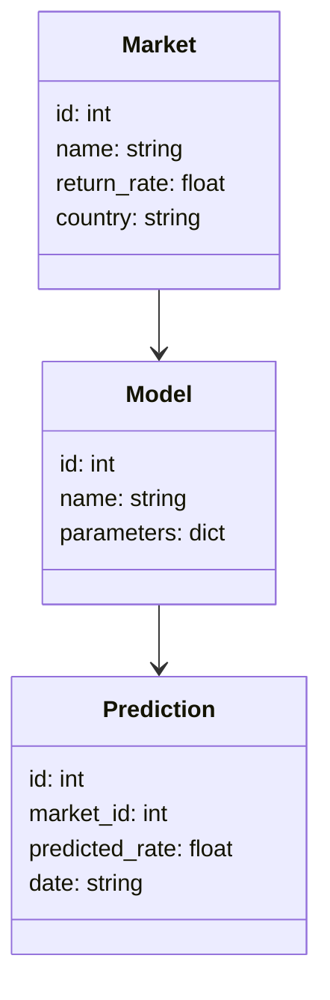

                 


# 新兴市场与发达市场未来回报率预测的差异

> 关键词：新兴市场、发达市场、回报率预测、经济周期、利率政策、通货膨胀、投资环境

> 摘要：新兴市场与发达市场在经济增长模式、市场结构和投资环境等方面存在显著差异，这些差异影响着未来的回报率预测。本文将从背景介绍、影响因素分析、预测模型构建、系统架构设计以及项目实战等方面，详细探讨新兴市场与发达市场在回报率预测上的差异，并通过案例分析和数学模型的构建，为投资者提供科学的决策参考。

---

## 第一部分：新兴市场与发达市场的背景介绍

### 第1章：新兴市场与发达市场的定义与特征

#### 1.1 新兴市场的定义与特征
- **定义**：新兴市场是指那些经济增长迅速、产业结构逐步完善但尚未完全成熟的国家或地区，如中国、印度等。
- **特征**：
  - 经济增长速度快，但波动性较大。
  - 市场规模逐步扩大，但基础设施相对落后。
  - 投资环境逐渐改善，但政策法规不够完善。
- **典型案例**：中国、印度、巴西。

#### 1.2 发达市场的定义与特征
- **定义**：发达市场是指经济高度发达、产业结构完善、市场机制成熟的国家或地区，如美国、日本等。
- **特征**：
  - 经济增长稳定，波动性小。
  - 市场规模庞大，基础设施完善。
  - 投资环境成熟，政策法规健全。
- **典型案例**：美国、日本、德国。

### 第2章：新兴市场与发达市场的差异分析

#### 2.1 经济发展阶段的差异
- **新兴市场**：处于快速工业化和城市化阶段，经济增长主要依赖劳动密集型产业。
- **发达市场**：经济高度发达，产业结构以高科技和服务业为主，经济增长主要依赖技术创新和效率提升。
- **对比**：新兴市场的经济增长更具波动性，而发达市场的经济增长更为稳定。

#### 2.2 市场结构的差异
- **新兴市场**：市场集中度较低，中小企业占比高，市场竞争激烈。
- **发达市场**：市场集中度较高，大企业占比高，市场竞争有序。
- **对比**：新兴市场的市场结构更具灵活性，而发达市场的市场结构更为成熟和稳定。

#### 2.3 投资环境的差异
- **新兴市场**：政策法规不完善，投资风险较高，但潜在回报也较高。
- **发达市场**：政策法规完善，投资风险较低，但回报率相对稳定。
- **对比**：新兴市场的投资环境更具挑战性，而发达市场的投资环境更为安全。

---

## 第二部分：影响回报率预测的核心因素

### 第3章：经济周期对回报率的影响

#### 3.1 经济周期的定义与阶段
- **定义**：经济周期是指经济活动在长时期内波动的过程，通常分为衰退、复苏、繁荣和衰退四个阶段。
- **阶段特征**：
  - 衰退阶段：经济增长放缓，企业盈利下降。
  - 复苏阶段：经济逐步恢复，企业盈利开始回升。
  - 繁荣阶段：经济增长迅速，企业盈利达到高峰。
  - 衰退阶段：经济增长停滞或下降，企业盈利下降。

#### 3.2 不同市场环境下经济周期的差异
- **新兴市场**：经济周期波动较大，受外部环境影响显著。
- **发达市场**：经济周期波动较小，受政策调控影响较大。
- **对比**：新兴市场的经济周期波动性更大，而发达市场的经济周期更为稳定。

### 第4章：利率政策对回报率的影响

#### 4.1 利率政策的定义与作用
- **定义**：利率政策是指中央银行通过调整利率水平来影响经济活动的政策。
- **作用机制**：
  - 利率上升：抑制投资，减少货币流动性。
  - 利率下降：刺激投资，增加货币流动性。

#### 4.2 不同市场环境下利率政策的差异
- **新兴市场**：利率政策较为宽松，且受国际资本流动影响较大。
- **发达市场**：利率政策较为灵活，且受国内经济状况影响较大。
- **对比**：新兴市场的利率政策受外部因素影响较大，而发达市场的利率政策更为灵活和自主。

### 第5章：通货膨胀对回报率的影响

#### 5.1 通货膨胀的定义与度量
- **定义**：通货膨胀是指物价总水平在一段时间内持续上涨的现象。
- **度量指标**：消费者价格指数（CPI）、生产者价格指数（PPI）。

#### 5.2 不同市场环境下通货膨胀的差异
- **新兴市场**：通货膨胀率较高，且波动性较大。
- **发达市场**：通货膨胀率较低，且波动性较小。
- **对比**：新兴市场的通货膨胀率更高，且波动性更大，而发达市场的通货膨胀率更为稳定。

---

## 第三部分：预测模型与算法

### 第6章：基于ARIMA模型的回报率预测

#### 6.1 ARIMA模型简介
- **定义**：ARIMA（自回归积分滑动平均模型）是一种广泛应用于时间序列预测的统计模型。
- **模型结构**：由自回归部分（AR）和滑动平均部分（MA）组成。

#### 6.2 ARIMA模型的实现步骤
1. 数据预处理：对数据进行差分和平稳化处理。
2. 模型参数选择：通过AIC准则选择最佳参数。
3. 模型拟合：使用历史数据对模型进行训练。
4. 模型预测：基于训练好的模型进行未来回报率的预测。

#### 6.3 Python代码实现
```python
from statsmodels.tsa.arima.model import ARIMA
import pandas as pd
import numpy as np

# 数据加载与预处理
data = pd.read_csv('market_return.csv')
data['return'] = data['return'].diff().dropna()

# 模型训练
model = ARIMA(data['return'], order=(5, 1, 0))
model_fit = model.fit()

# 模型预测
forecast = model_fit.forecast(steps=10)
print(forecast)
```

#### 6.4 模型优缺点分析
- **优点**：能够捕捉时间序列的自相关性，适合短期预测。
- **缺点**：对参数敏感，预测精度可能受数据质量影响。

---

## 第四部分：系统分析与架构设计

### 第7章：系统功能设计

#### 7.1 领域模型设计


#### 7.2 系统架构设计


---

## 第五部分：项目实战

### 第8章：环境安装与代码实现

#### 8.1 环境配置
- **Python版本**：3.8及以上
- **依赖库安装**：
  ```bash
  pip install pandas statsmodels matplotlib
  ```

#### 8.2 核心代码实现
```python
import pandas as pd
import matplotlib.pyplot as plt
from statsmodels.tsa.arima.model import ARIMA

# 数据加载
data = pd.read_csv('market_return.csv')

# 数据可视化
plt.plot(data['date'], data['return'], label='Historical Returns')
plt.xlabel('Date')
plt.ylabel('Return Rate')
plt.legend()
plt.show()

# 模型训练与预测
model = ARIMA(data['return'], order=(5, 1, 0))
model_fit = model.fit()

forecast = model_fit.forecast(steps=10)
plt.plot(data['date'], forecast, label='Predicted Returns')
plt.xlabel('Date')
plt.ylabel('Return Rate')
plt.legend()
plt.show()
```

---

## 第六部分：总结与展望

### 第9章：总结

- **核心总结**：新兴市场与发达市场在经济增长模式、市场结构和投资环境等方面存在显著差异，这些差异直接影响未来的回报率预测。
- **主要发现**：经济周期、利率政策和通货膨胀是影响回报率预测的关键因素。通过构建ARIMA模型，可以有效预测未来回报率。

### 第10章：展望

- **未来研究方向**：进一步优化预测模型，引入机器学习算法（如LSTM）进行更精准的预测。
- **实践建议**：投资者应根据市场环境和经济周期，合理配置资产，分散投资风险。

---

## 第七部分：注意事项与TIPS

### 注意事项
- 数据质量是预测模型的关键，需确保数据的完整性和准确性。
- 模型选择应根据具体市场环境和数据特征进行调整。
- 预测结果仅供参考，实际投资需结合多方面因素。

### TIPS
- 定期更新模型参数，以适应市场变化。
- 结合宏观经济指标，进行综合分析。
- 分散投资，降低市场波动带来的风险。

---

通过以上分析和实践，我们可以清晰地看到新兴市场与发达市场在回报率预测上的差异，并为投资者提供科学的决策参考。希望本文能为读者在投资决策中提供有价值的见解和实用的知识。

