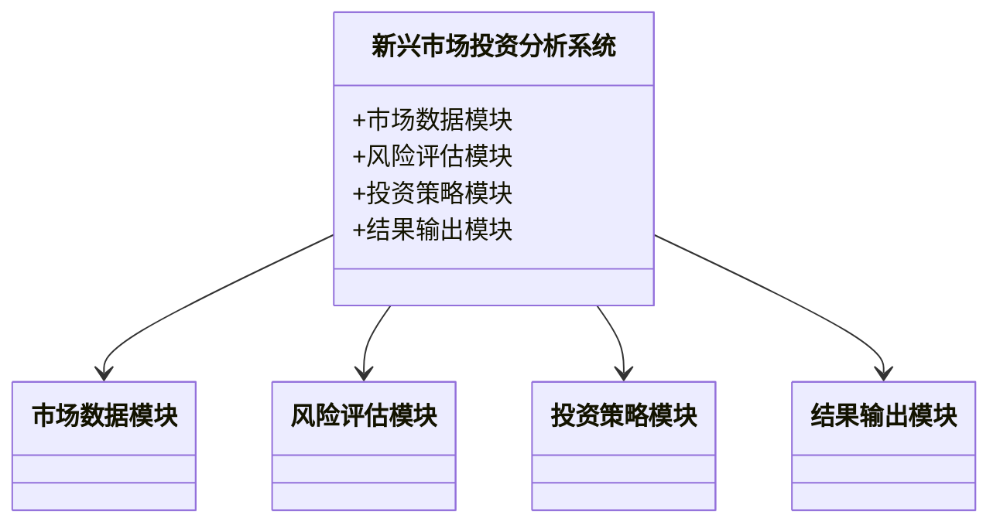
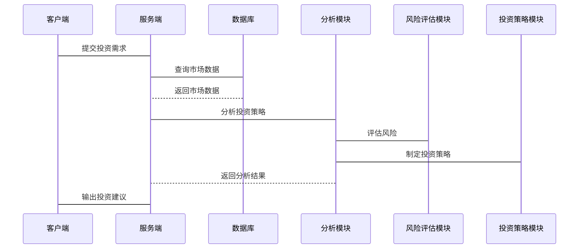

                 


# 新兴市场投资：高风险高回报的机遇与挑战

---

## 关键词：
新兴市场，投资策略，风险管理，经济增长，市场风险

---

## 摘要：
新兴市场在全球经济中扮演着越来越重要的角色，尽管伴随着高风险，但其高回报的潜力吸引了众多投资者。本文将深入分析新兴市场的定义、特点、投资机遇与挑战，探讨有效的投资策略和风险管理方法。通过案例分析和系统设计，本文为投资者提供了在新兴市场中取得成功的关键 insights。

---

# 第一部分：新兴市场概述

## 第1章：新兴市场的定义与特点

### 1.1 新兴市场的概念与背景
#### 1.1.1 新兴市场的定义
新兴市场是指那些经济快速发展、但尚未完全工业化的国家。这些市场通常具有较大的增长潜力，但也伴随着较高的不确定性和风险。

#### 1.1.2 新兴市场的特点
| 特点 | 描述 |
|------|------|
| 经济结构 | 多数处于工业化初期，依赖制造业和农业 |
| 市场规模 | 较小但增长迅速 |
| 政治环境 | 法治不完善，政策波动性较高 |
| 投资机会 | 行业多样，新兴行业如科技、服务业潜力巨大 |

#### 1.1.3 新兴市场与发达国家市场的对比
- **经济结构**：新兴市场多处于工业化初期，而发达国家市场多处于后工业化阶段。
- **市场流动性**：新兴市场流动性较低，交易成本较高。
- **政策风险**：新兴市场政策不稳定，而发达国家市场政策相对稳定。

### 1.2 新兴市场的经济与政治环境
#### 1.2.1 经济结构分析
新兴市场的经济结构通常以制造业和农业为主，但随着技术进步，服务业和科技行业正在快速发展。

#### 1.2.2 政治稳定性与政策风险
新兴市场的政治环境不稳定，政策波动性较高，这增加了投资的不确定性。

#### 1.2.3 法律与监管框架
新兴市场的法律体系不完善，监管框架不成熟，增加了投资风险。

### 1.3 新兴市场的投资机遇
#### 1.3.1 经济增长潜力
新兴市场的经济增长速度快，尤其是在亚洲和拉丁美洲地区。

#### 1.3.2 行业发展机会
新兴市场中，科技、消费、金融等行业具有较大的发展潜力。

#### 1.3.3 技术与创新驱动
新兴市场的技术进步和创新驱动了行业的快速发展，为投资者提供了新的机会。

### 1.4 新兴市场的挑战与风险
#### 1.4.1 经济波动风险
新兴市场的经济波动较大，容易受到外部环境的影响。

#### 1.4.2 政治与政策风险
新兴市场的政治不稳定和政策波动性高，增加了投资风险。

#### 1.4.3 市场流动性风险
新兴市场的市场规模较小，流动性不足，可能导致投资变现困难。

### 1.5 本章小结
新兴市场具有较高的增长潜力，但也伴随着较高的风险。投资者需要全面了解新兴市场的特点和风险，制定有效的投资策略。

---

# 第二部分：投资策略与风险管理

## 第2章：新兴市场投资策略

### 2.1 投资策略概述
#### 2.1.1 主动投资与被动投资
- **主动投资**：通过精选个股或行业进行投资，追求超额收益。
- **被动投资**：通过指数基金等方式进行投资，追求市场平均收益。

#### 2.1.2 短期投资与长期投资
- **短期投资**：利用市场波动进行短期交易，风险较高。
- **长期投资**：通过长期持有优质资产，获得复利收益。

#### 2.1.3 分散投资与集中投资
- **分散投资**：通过投资多个资产或行业降低风险。
- **集中投资**：集中投资于少数优质资产，追求高收益。

### 2.2 新兴市场的行业选择
#### 2.2.1 高增长行业分析
- **科技行业**：新兴市场中科技行业增长迅速，尤其是互联网和移动支付领域。
- **消费行业**：随着人口增长和消费升级，消费行业具有较大的发展潜力。

#### 2.2.2 行业风险评估
- **行业竞争格局**：新兴市场中某些行业竞争激烈，风险较高。
- **政策影响**：行业政策变化可能对投资产生重大影响。

#### 2.2.3 行业投资案例
- **案例1**：印度的科技公司投资案例。
- **案例2**：巴西的消费行业投资案例。

### 2.3 投资组合优化
#### 2.3.1 投资组合构建原则
- **分散化**：通过投资不同资产和行业降低风险。
- **长期视角**：关注长期增长潜力，避免短期波动干扰。

#### 2.3.2 数学模型与优化算法
- **均值-方差模型**：用于优化投资组合的风险和收益。
- **Markowitz优化**：通过数学模型找到最优投资组合。

#### 2.3.3 实证分析与案例解读
- **案例分析**：通过具体的投资组合优化案例，展示模型的应用。

### 2.4 投资策略的实施与调整
#### 2.4.1 策略实施步骤
1. **确定投资目标**：明确投资的收益目标和风险承受能力。
2. **选择投资标的**：根据市场分析选择优质资产。
3. **构建投资组合**：分散投资，优化组合。
4. **定期调整**：根据市场变化和自身目标调整投资组合。

#### 2.4.2 策略调整机制
- **定期评估**：定期检查投资组合的表现，根据市场变化进行调整。
- **动态再平衡**：根据市场波动和资产表现，动态调整资产配置。

#### 2.4.3 策略效果评估
- **收益评估**：比较实际收益与预期收益。
- **风险评估**：分析投资组合的风险是否在可接受范围内。

### 2.5 本章小结
有效的投资策略需要结合市场特点和自身目标，通过分散投资和长期视角降低风险，抓住新兴市场的高增长机会。

---

# 第三部分：风险管理与控制

## 第3章：风险管理的核心原则

### 3.1 风险管理的概念与框架
#### 3.1.1 风险的定义与分类
- **市场风险**：市场波动导致的资产价格下跌。
- **信用风险**：债券发行人违约的风险。
- **操作风险**：投资过程中操作失误导致的风险。

#### 3.1.2 风险管理的目标与流程
- **目标**：通过识别、评估和控制风险，降低投资损失。
- **流程**：风险识别、风险评估、风险控制、风险监控。

#### 3.1.3 风险管理的组织与职责
- **风险管理团队**：负责风险评估和监控。
- **投资团队**：负责投资决策和风险控制。

### 3.2 新兴市场的主要风险
#### 3.2.1 市场风险
- **经济波动**：新兴市场的经济波动较大，可能导致资产价格大幅波动。
- **汇率风险**：新兴市场货币波动大，可能影响投资收益。

#### 3.2.2 信用风险
- **企业违约风险**：新兴市场中企业信用状况不稳定，可能导致债券违约。
- **主权风险**：国家违约风险较高。

#### 3.2.3 操作风险
- **操作失误**：投资决策或交易过程中的失误可能导致损失。
- **系统故障**：交易系统或数据系统故障可能导致投资损失。

#### 3.2.4 政治风险
- **政策变化**：新兴市场的政策变化频繁，可能影响投资收益。
- **地缘政治风险**：地区冲突或国际关系变化可能影响市场。

### 3.3 风险评估与量化
#### 3.3.1 风险评估方法
- **VaR（Value at Risk）**：用于评估投资组合在一定置信水平下的潜在损失。
- **CVaR（Conditional Value at Risk）**：用于评估在VaR基础上的平均损失。

#### 3.3.2 风险量化模型
- **数学模型**：通过统计模型和概率分布分析风险。

#### 3.3.3 风险评估案例分析
- **案例分析**：通过具体案例展示风险评估的方法和结果。

### 3.4 风险控制与缓解策略
#### 3.4.1 风险分散策略
- **资产分散**：通过投资不同资产和行业降低风险。
- **地域分散**：投资不同地区的新兴市场，降低地域风险。

#### 3.4.2 风险对冲策略
- **金融衍生工具**：使用期货、期权等衍生工具对冲风险。
- **货币对冲**：通过外汇对冲降低汇率风险。

#### 3.4.3 风险监控与预警
- **实时监控**：通过实时监控系统跟踪市场和资产风险。
- **预警机制**：设定预警指标，及时发现和应对风险。

### 3.5 本章小结
有效的风险管理是新兴市场投资成功的关键。通过风险分散、对冲和监控，投资者可以有效降低投资风险，抓住市场机会。

---

# 第四部分：系统分析与架构设计

## 第4章：新兴市场投资分析系统

### 4.1 系统功能设计
#### 4.1.1 领域模型


### 4.2 系统架构设计


### 4.3 系统接口设计
- **输入接口**：接收市场数据和投资参数。
- **输出接口**：输出投资建议和风险评估结果。

### 4.4 系统交互设计


### 4.5 本章小结
通过系统化的架构设计，投资者可以更高效地进行新兴市场分析和投资决策。

---

# 第五部分：项目实战与案例分析

## 第5章：项目实战

### 5.1 环境安装
- **工具安装**：安装必要的数据分析工具和编程环境。
- **数据获取**：获取新兴市场的相关数据，包括市场指数、行业数据等。

### 5.2 系统核心实现
#### 5.2.1 投资组合优化
```python
import numpy as np
import pandas as pd
from scipy.optimize import minimize

# 数据准备
returns = pd.DataFrame(...)  # 输入资产的收益率

# 定义优化函数
def portfolio Optimization(weights, returns):
    return np.sqrt(np.dot(weights.T, returns.dot(returns.T).dot(weights)))

# 定义约束条件
constraints = {'type': 'eq', 'fun': lambda w: np.sum(w) - 1}

# 优化过程
result = minimize(portfolio_Optimization, initial_guess, args=(returns,), constraints=constraints)

# 输出结果
print(result.x)
```

#### 5.2.2 风险评估与对冲
```python
# 计算VaR
def VaR(returns, confidence_level=0.95):
    sorted_returns = np.sort(returns)
    index = int(len(sorted_returns) * (1 - confidence_level))
    return sorted_returns[index]

# 计算CVaR
def CVaR(returns, confidence_level=0.95):
    sorted_returns = np.sort(returns)
    index = int(len(sorted_returns) * (1 - confidence_level))
    tail = sorted_returns[index:]
    return np.mean(tail)
```

### 5.3 代码应用解读与分析
- **投资组合优化**：通过优化算法找到最优投资组合，降低风险。
- **风险评估**：使用VaR和CVaR模型评估投资组合的风险。

### 5.4 实际案例分析
- **案例分析**：以具体新兴市场为例，展示投资策略和风险管理的应用。

### 5.5 本章小结
通过具体案例的分析和代码实现，投资者可以更好地理解新兴市场投资的实际操作。

---

# 第六部分：总结与展望

## 第6章：总结与展望

### 6.1 本章总结
新兴市场投资具有高风险高回报的特点，投资者需要通过深入分析和有效的策略制定，抓住市场机会，降低投资风险。

### 6.2 投资建议
- **长期视角**：关注长期增长潜力，避免短期波动干扰。
- **分散投资**：通过投资多个资产和行业降低风险。
- **风险管理**：建立完善的风险评估和监控机制，及时应对市场变化。

### 6.3 注意事项
- **市场风险**：新兴市场波动较大，需谨慎选择投资标的。
- **政策风险**：密切关注政策变化，避免政策风险影响投资。
- **流动性风险**：选择流动性较高的资产，避免投资过于小众的市场。

### 6.4 拓展阅读
- 推荐阅读相关投资策略和风险管理的书籍，深入学习新兴市场投资的理论和实践。

---

# 结语

新兴市场投资是一个充满机遇与挑战的领域，通过系统的分析和科学的投资策略，投资者可以在高风险中抓住高回报的机会。希望本文的分析和案例能够为投资者提供有价值的 insights，帮助他们在新兴市场中取得成功。

--- 

> 本文版权归作者所有，未经授权不得转载。

