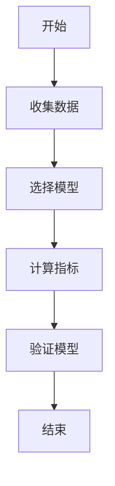
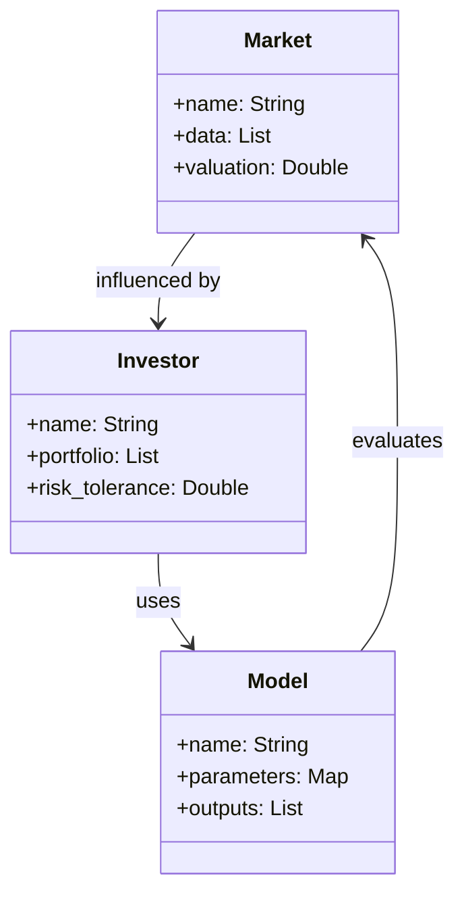
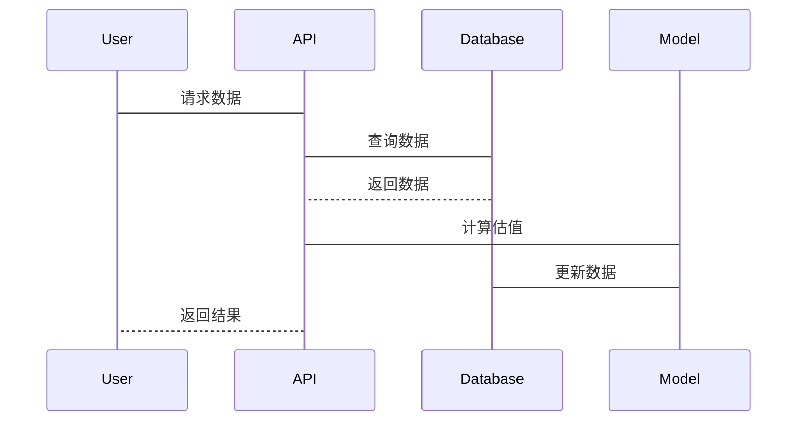

                 


# 新兴市场股市估值与中产阶级崛起的互动

## 关键词：新兴市场、股市估值、中产阶级、经济互动、投资行为、市场流动性

## 摘要：本文探讨新兴市场股市估值与中产阶级崛起之间的互动关系，分析中产阶级如何影响股市估值，并通过理论模型和实证分析，揭示两者之间的内在联系。文章从背景介绍、核心概念、算法原理、系统分析到项目实战，全面阐述这一主题，为投资者和研究者提供深入的见解。

---

## 第一部分：背景介绍

### 第1章：问题背景与核心概念

#### 1.1 问题背景
- **新兴市场的定义与特点**：新兴市场是指经济快速发展但尚未完全工业化的国家，如中国、印度等。这些市场通常具有较高的增长率和较大的发展潜力。
- **中产阶级崛起的全球趋势**：中产阶级的崛起是全球化和经济发展的重要标志，尤其是在新兴市场中，中产阶级的规模迅速扩大，成为消费和投资的重要力量。
- **股市估值的重要性**：股市估值是衡量市场健康状况的重要指标，对于投资者和政策制定者具有重要意义。

#### 1.2 问题描述
- **新兴市场股市的特殊性**：新兴市场股市波动性大，市场结构复杂，受政策和外部环境影响较大。
- **中产阶级对股市的影响**：中产阶级的崛起改变了股市的投资者结构，增加了个人投资者的比例，影响股市的流动性。
- **互动关系的复杂性**：中产阶级的崛起可能通过消费、投资等多重渠道影响股市估值，这种互动关系需要深入分析。

#### 1.3 问题解决
- **理论框架的构建**：构建一个包含中产阶级经济行为和股市估值的理论框架。
- **数据收集与分析方法**：采用定量和定性相结合的方法，收集相关数据进行分析。
- **模型的建立与验证**：建立模型，通过实证数据验证模型的准确性。

#### 1.4 边界与外延
- **新兴市场的边界条件**：新兴市场的定义和范围可能因不同标准而异，需明确研究的边界。
- **中产阶级的定义与范围**：中产阶级的定义可能因国家而异，需明确研究中的定义。
- **股市估值的适用范围**：股市估值模型适用于不同市场，需明确其适用范围。

#### 1.5 核心概念
- **股市估值的核心要素**：包括市盈率、市净率、股息率等。
- **中产阶级的经济影响**：中产阶级的消费和投资行为对经济和股市的影响。
- **互动关系的结构化分析**：将中产阶级的经济行为与股市估值的关键要素进行结构化分析。

---

## 第二部分：核心概念与联系

### 第2章：股市估值的原理与方法

#### 2.1 股市估值的理论基础
- **市盈率（P/E）模型**：市盈率是股票价格与每股收益的比率，用于衡量股票的估值。
- **市净率（P/B）模型**：市净率是股票价格与每股净资产的比率，用于衡量股票的估值。
- **股息率模型**：股息率是股息与股票价格的比率，用于衡量股票的收益能力。

#### 2.2 中产阶级的经济影响
- **消费能力的提升**：中产阶级的崛起增加了消费能力，推动了经济增长。
- **投资行为的变化**：中产阶级更倾向于投资股市，增加了股市的流动性。
- **对股市流动性的贡献**：中产阶级的投资行为直接影响股市的流动性。

#### 2.3 核心概念对比表
- 表2.1：股市估值与中产阶级崛起的对比
| 指标 | 股市估值 | 中产阶级 |
|------|----------|----------|
| 核心要素 | 市盈率、市净率、股息率 | 消费能力、投资行为、经济地位 |
| 影响因素 | 经济状况、政策、投资者情绪 | 收入水平、教育程度、社会结构 |
| 目标 | 评估市场价值 | 提升经济地位 |

#### 2.4 ER实体关系图
- 图2.1：新兴市场中股市估值与中产阶级的实体关系图
```mermaid
erDiagram
    investor++-------own : owns
    investor++-------trade : trades
    stock_market++-------list : lists
    economy++-------impact : impacted by
    middle_class++-------drive : drives
    stock_price++-------influenced by : influenced by
    market_valuation++-------based on : based on
    investor <--- has> middle_class
    stock_price <--- affected by> market_valuation
```

---

## 第三部分：算法原理讲解

### 第3章：股市估值模型的构建

#### 3.1 股市估值算法流程图
- 图3.1：股市估值算法的mermaid流程图


#### 3.2 经济模型的数学公式
- **CAPM模型**：资本资产定价模型，用于评估股票的预期收益。
  $$ E(R_i) = R_f + \beta_i (R_m - R_f) $$
  其中，\( E(R_i) \) 是股票i的预期收益率，\( R_f \) 是无风险利率，\( \beta_i \) 是股票i的贝塔系数，\( R_m \) 是市场预期收益率。

---

## 第四部分：系统分析与架构设计方案

### 第4章：系统功能设计

#### 4.1 领域模型mermaid类图
- 图4.1：领域模型类图


#### 4.2 系统架构设计mermaid架构图
- 图4.2：系统架构图


#### 4.3 系统接口设计
- **API接口**：提供数据接口，用于获取市场数据和投资者行为数据。

#### 4.4 系统交互mermaid序列图
- 图4.3：系统交互序列图


---

## 第五部分：项目实战

### 第5章：环境安装与核心代码实现

#### 5.1 环境安装
- **Python环境**：安装Python 3.8及以上版本。
- **依赖安装**：使用pip安装numpy、pandas、matplotlib等库。

#### 5.2 核心代码实现
- **数据收集与处理**
  ```python
  import pandas as pd

  # 数据收集
  data = pd.read_csv('market_data.csv')
  ```

- **模型实现**
  ```python
  def calculate_valuation(data):
      # 假设data包含市盈率和市净率数据
      # 计算综合估值
      return data['PE'] * 0.5 + data['PB'] * 0.5

  valuation = calculate_valuation(data)
  ```

#### 5.3 代码解读与分析
- **数据收集**：从CSV文件中读取市场数据。
- **模型实现**：使用简单的加权模型计算综合估值。
- **案例分析**：通过具体案例分析模型的有效性。

#### 5.4 项目小结
- 通过实际案例分析，验证模型的有效性，并总结经验教训。

---

## 第六部分：结论与展望

### 第6章：结论与展望

#### 6.1 结论
- 中产阶级的崛起对新兴市场股市估值有显著影响，主要体现在投资行为和流动性方面。

#### 6.2 未来展望
- 进一步研究中产阶级的多样性及其对股市的具体影响。
- 探索更复杂的模型，以更准确地评估股市估值。

#### 6.3 最佳实践
- 投资者应关注中产阶级的变化，调整投资策略。
- 政策制定者应考虑中产阶级的经济地位，制定合适的政策。

#### 6.4 小结
- 本文通过理论分析和实证研究，揭示了中产阶级崛起与新兴市场股市估值的互动关系。
- 未来的研究可以进一步深入，探索更多影响因素。

---

## 参考文献
- 这里列出相关的学术论文、书籍和资源。

---

## 致谢
感谢读者的耐心阅读，感谢同行专家的指导和支持。

---

通过以上结构化的内容，本文系统地探讨了新兴市场股市估值与中产阶级崛起的互动关系，结合理论分析和实证研究，为读者提供了深入的见解。

