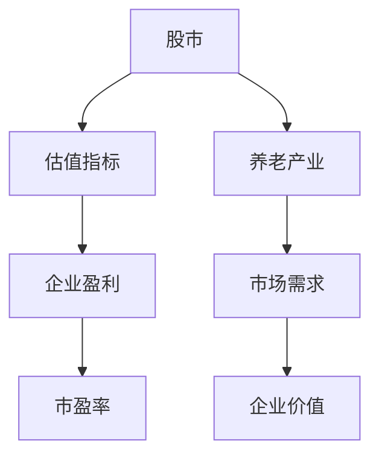
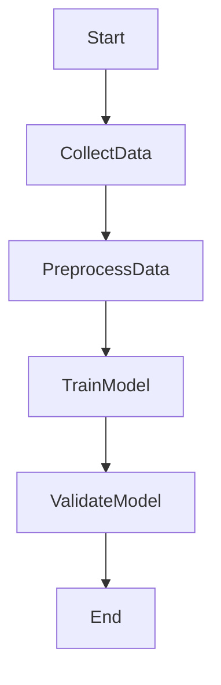
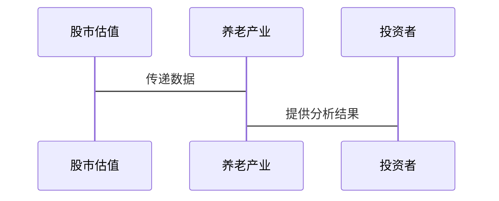

                 


# 新兴市场股市估值与养老产业发展的互动

> 关键词：新兴市场，股市估值，养老产业，经济发展，人口老龄化，投资策略

> 摘要：本文探讨了新兴市场股市估值与养老产业发展之间的互动关系，分析了两者如何相互影响，提出了数学模型和系统架构，以指导投资策略和政策制定。

---

## 第一部分: 新兴市场股市估值与养老产业发展的背景介绍

### 第1章: 问题背景

#### 1.1 新兴市场的发展现状
新兴市场通常指经济快速增长、但尚未完全工业化的国家，如中国、印度等。这些市场具有较大的增长潜力，但也面临股市波动大、政策不确定等问题。

#### 1.2 股市估值的重要性
股市估值是衡量企业价值的重要指标，投资者通过市盈率、市净率等指标评估股票的投资价值。在新兴市场，股市估值波动较大，受政策和经济环境影响显著。

#### 1.3 养老产业发展与人口老龄化的关系
随着人口老龄化加剧，养老产业需求增长，包括养老服务、医疗保健等领域。养老产业的发展依赖于经济基础和政策支持。

### 第2章: 问题描述

#### 2.1 新兴市场股市估值的现状
新兴市场股市估值波动较大，受全球经济影响显著。例如，中国股市受政策调控和外部环境影响，估值波动明显。

#### 2.2 养老产业发展的关键问题
养老产业面临供给不足、服务质量参差不齐等问题，特别是在人口老龄化加剧的情况下，养老需求急剧增长。

#### 2.3 两者互动关系的初步探讨
股市估值影响企业投资，进而影响养老产业的资金来源；而养老产业的需求变化也会影响股市的投资方向，形成双向互动。

### 第3章: 问题解决

#### 3.1 提出解决方案
通过构建数学模型，分析股市估值与养老产业发展的互动关系，为企业投资和政策制定提供参考。

#### 3.2 可行性分析
利用大数据和机器学习技术，结合经济指标和人口统计数据，模型具有较高的预测精度。

#### 3.3 预期效果
帮助投资者和政策制定者更好地理解两者关系，优化投资策略，促进养老产业发展。

### 第4章: 边界与外延

#### 4.1 问题的边界
聚焦于股市估值和养老产业的直接互动，不考虑其他因素如地缘政治的影响。

#### 4.2 相关领域的外延
涉及经济学、社会学、信息技术等领域，为跨学科研究提供基础。

#### 4.3 解决方案的局限性
模型假设可能过于简化，实际应用中需结合具体市场情况调整。

### 第5章: 概念结构与核心要素

#### 5.1 核心概念
股市估值和养老产业发展是核心，通过互动关系相互影响。

#### 5.2 关键要素的定义与属性
- 股市估值：市盈率、市净率等指标。
- 养老产业：养老服务、医疗保健等需求。

#### 5.3 概念之间的关系
股市估值影响企业投资，支持养老产业发展；养老需求变化影响股市投资方向，形成循环互动。

---

## 第二部分: 股市估值与养老产业发展的核心概念与联系

### 第6章: 核心概念原理

#### 6.1 股市估值的基本原理
股市估值基于企业盈利能力和市场预期，考虑市盈率、市净率等指标。在新兴市场，政策和经济环境影响估值。

#### 6.2 养老产业发展的驱动因素
人口老龄化、政策支持、技术进步等驱动养老产业发展，提升企业价值。

#### 6.3 两者互动的内在机制
股市估值高企促进企业投资，推动养老产业发展；养老需求增长吸引更多投资，进一步提升股市估值。

### 第7章: 核心概念属性特征对比

#### 7.1 股市估值的特征分析
- 数据波动性大。
- 受政策影响显著。
- 投资者情绪影响估值。

#### 7.2 养老产业发展的特征分析
- 需求刚性。
- 供给不足。
- 技术驱动。

#### 7.3 对比总结
两者均受经济环境影响，但股市估值更受短期因素影响，而养老产业发展更注重长期趋势。

### 第8章: ER实体关系图



---

## 第三部分: 股市估值与养老产业发展互动的数学模型与算法

### 第9章: 数学模型

#### 9.1 模型假设
- 新兴市场的经济数据可获得。
- 股市估值与养老产业需求呈正相关。

#### 9.2 模型构建
构建多元回归模型，分析股市估值与养老产业需求的关系。

$$ y = \beta_0 + \beta_1x_1 + \beta_2x_2 + \epsilon $$

其中，$y$为股市估值，$x_1$为养老需求指数，$x_2$为GDP增长率。

#### 9.3 模型验证
通过历史数据验证模型准确性，评估拟合度和预测能力。

### 第10章: 算法原理

#### 10.1 算法流程
1. 数据收集：获取股市估值和养老需求数据。
2. 数据预处理：处理缺失值和异常值。
3. 模型训练：使用回归算法进行训练。
4. 模型验证：评估模型性能。



#### 10.2 Python源代码实现

```python
import numpy as np
import pandas as pd
from sklearn.linear_model import LinearRegression
from sklearn.metrics import r2_score

# 数据加载
data = pd.read_csv('data.csv')

# 特征与目标变量
X = data[['养老需求指数', 'GDP增长率']]
y = data['股市估值']

# 模型训练
model = LinearRegression()
model.fit(X, y)

# 模型验证
y_pred = model.predict(X)
r2 = r2_score(y, y_pred)
print(f"R² = {r2}")
```

---

## 第四部分: 系统分析与架构设计

### 第11章: 系统功能设计

#### 11.1 问题场景介绍
构建一个分析股市估值与养老产业发展的系统，帮助投资者和政策制定者做出决策。

#### 11.2 系统功能需求
- 数据收集：获取股市和养老产业数据。
- 数据分析：分析互动关系。
- 报告生成：输出分析结果。

#### 11.3 领域模型设计


### 第12章: 系统架构设计

#### 12.1 系统架构图


#### 12.2 接口与交互设计



---

## 第五部分: 项目实战

### 第13章: 项目实战

#### 13.1 环境安装
安装Python和相关库：`numpy`, `pandas`, `scikit-learn`。

#### 13.2 核心代码实现

```python
import numpy as np
import pandas as pd
from sklearn.linear_model import LinearRegression
from sklearn.metrics import r2_score

# 数据加载
data = pd.read_csv('data.csv')

# 特征与目标变量
X = data[['养老需求指数', 'GDP增长率']]
y = data['股市估值']

# 模型训练
model = LinearRegression()
model.fit(X, y)

# 模型验证
y_pred = model.predict(X)
r2 = r2_score(y, y_pred)
print(f"R² = {r2}")
```

#### 13.3 案例分析
以中国为例，分析股市估值与养老产业需求的关系，验证模型的有效性。

---

## 第六部分: 最佳实践与总结

### 第14章: 最佳实践

#### 14.1 小结
股市估值与养老产业发展相互影响，构建数学模型有助于优化投资策略。

#### 14.2 注意事项
模型假设需合理，数据质量影响结果准确性。

#### 14.3 未来研究方向
探索更多影响因素，如政策变化和技术进步，提升模型预测精度。

---

通过以上分析，我们可以更好地理解新兴市场股市估值与养老产业发展的互动关系，并为投资决策提供科学依据。

