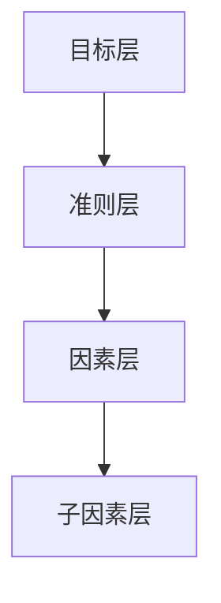
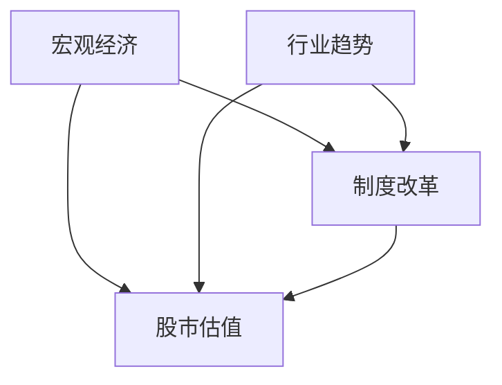
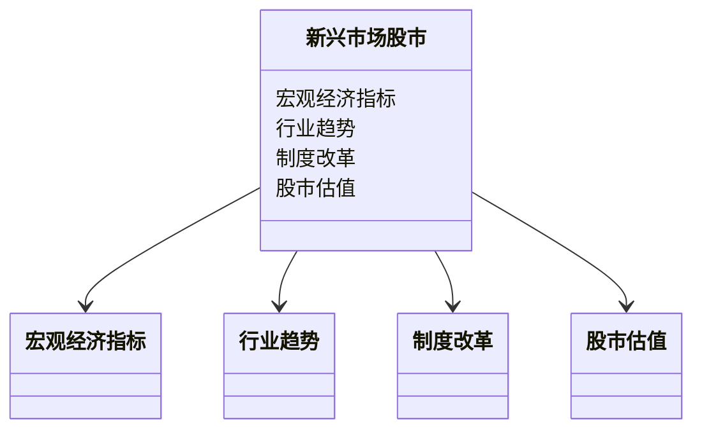
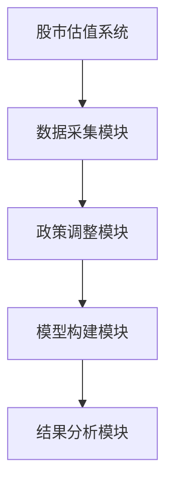
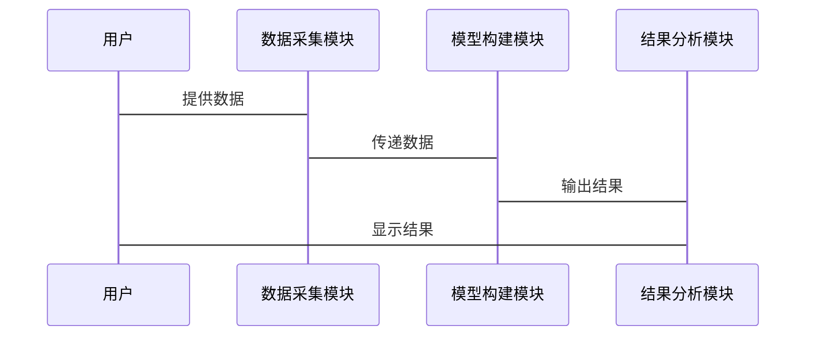

                 


# 新兴市场股市估值与制度改革的相关性

> 关键词：新兴市场，股市估值，制度改革，相关性，金融分析，结构方程模型

> 摘要：本文探讨新兴市场股市估值与制度改革之间的相关性，分析新兴市场的独特性及其股市估值的关键因素，结合制度改革的核心目标，建立综合分析模型，通过实证分析和优化策略，提出增强新兴市场股市估值的有效途径。

---

# 第1章: 新兴市场股市估值的背景与现状

## 1.1 新兴市场的定义与特征

### 1.1.1 新兴市场的定义
新兴市场是指经济快速发展但尚未完全工业化的国家或地区，通常包括巴西、印度、中国、韩国、南非等。这些市场具有较高的增长潜力，但也面临特有的风险和挑战。

### 1.1.2 新兴市场的经济特征
- 经济结构多元化，通常以制造业和服务业为主。
- 经济增长波动较大，受外部环境影响显著。
- 人口基数大，消费市场潜力巨大。

### 1.1.3 新兴市场股市的独特性
- 市场规模较小，流动性较低。
- 市场参与者以散户为主，机构投资者占比相对较低。
- 股市波动性较大，受政策和外部因素影响显著。

## 1.2 股市估值的基本概念

### 1.2.1 股市估值的定义
股市估值是指对股票市场的整体价值进行评估，通常通过市盈率（P/E）、市净率（P/B）等指标来衡量。

### 1.2.2 股市估值的主要方法
1. **相对估值法**：基于可比公司或行业平均值进行估值。
2. **绝对估值法**：通过现金流折现模型（DCF）等方法进行估值。
3. **指数估值法**：通过股票指数的点位和历史数据进行估值。

### 1.2.3 股市估值的核心要素
- 宏观经济指标（GDP、通胀率等）。
- 行业发展趋势。
- 公司基本面（盈利、财务状况等）。

## 1.3 制度改革的定义与目标

### 1.3.1 制度改革的定义
制度改革是指通过调整法律、政策和监管框架，优化市场运行机制，提升市场效率。

### 1.3.2 制度改革的主要目标
- 提高市场透明度。
- 降低交易成本。
- 防范市场风险。
- 促进公平竞争。

### 1.3.3 制度改革与股市的关系
制度改革直接影响股市的运行效率和投资者信心，进而影响股市估值。

## 1.4 新兴市场股市估值与制度改革的关联性

### 1.4.1 问题背景与问题描述
新兴市场股市估值波动较大，制度不完善是主要原因之一。如何通过制度改革提升股市估值是亟待解决的问题。

### 1.4.2 问题解决的必要性
- 提高市场透明度，增强投资者信心。
- 优化市场结构，降低交易成本。
- 防范系统性风险，维护市场稳定。

### 1.4.3 制度改革对股市估值的影响
制度改革通过改善市场环境和机制，间接或直接地影响股市估值。例如，提高监管力度可以降低市场风险，从而提升股市估值。

## 1.5 本章小结
本章分析了新兴市场的定义与特征，介绍了股市估值的基本概念和方法，明确了制度改的核心目标，探讨了制度改革与股市估值的关联性。

---

# 第2章: 新兴市场股市估值的核心概念与属性

## 2.1 股市估值的核心概念

### 2.1.1 股市估值的基本原理
股市估值是通过分析宏观经济、行业和公司基本面等因素，对股票市场的整体价值进行评估。

### 2.1.2 股市估值的关键属性
- **波动性**：新兴市场股市估值波动较大。
- **敏感性**：对政策、经济变化敏感。
- **复杂性**：受多因素共同影响。

## 2.2 制度改革的核心概念

### 2.2.1 制度改革的基本原理
制度改通过调整法律、政策和监管框架，优化市场运行机制。

### 2.2.2 制度改革的关键属性
- **系统性**：涉及多个方面的调整。
- **持续性**：需要长期坚持和优化。
- **效果性**：通过改革提升市场效率。

## 2.3 新兴市场股市估值与制度改革的属性对比

### 2.3.1 核心概念对比
| 对比维度 | 股市估值 | 制度改革 |
|----------|----------|----------|
| 核心目标 | 评估市场价值 | 优化市场机制 |
| 主要方法 | 相对估值法、DCF | 法律、政策调整 |
| 影响因素 | 经济、行业、公司 | 监管、政策、法律 |

### 2.3.2 属性特征对比
| 对比维度 | 股市估值 | 制度改革 |
|----------|----------|----------|
| 波动性 | 高 | 低 |
| 效果显现时间 | 短期 | 长期 |
| 可控性 | 低 | 高 |

## 2.4 核心概念与联系的ER实体关系图

```mermaid
er
  actor: 新兴市场股市
  actor -[1..n]-> stock_value: 股市估值
  actor -[1..n]-> system_reform: 制度改革
  stock_value -[1..n]-> impact_factor: 影响因素
  system_reform -[1..n]-> policy_effect: 政策效果
```

## 2.5 本章小结
本章通过对比分析，明确了新兴市场股市估值与制度改革的核心概念及其属性，为后续分析奠定了基础。

---

# 第3章: 新兴市场股市估值与制度改革的算法原理与数学模型

## 3.1 新兴市场股市估值的算法原理

### 3.1.1 层次分析法（AHP）的应用
层次分析法是一种用于多因素决策分析的方法，适用于新兴市场股市估值中多因素的权重分配。

#### 3.1.1.1 AHP的基本原理
AHP通过构建层次结构，计算各因素的权重，确定各因素对整体的影响程度。

#### 3.1.1.2 AHP流程图



### 3.1.2 结构方程模型（SEM）的应用
结构方程模型适用于分析复杂系统的因果关系，适合新兴市场股市估值与制度改革之间的关系建模。

#### 3.1.2.1 SEM的基本原理
SEM通过构建潜变量和观测变量之间的关系模型，分析变量之间的间接和直接效应。

#### 3.1.2.2 SEM的数学模型



---

## 3.2 制度改革对股市估值的影响分析

### 3.2.1 政策效果分析
通过结构方程模型，分析制度改革对股市估值的影响路径。

#### 3.2.1.1 政策效果的数学模型

$$ Y = \beta_1 X_1 + \beta_2 X_2 + \beta_3 X_3 + \epsilon $$

其中：
- $Y$ 表示股市估值
- $X_1$ 表示宏观经济因素
- $X_2$ 表示行业趋势
- $X_3$ 表示制度改革
- $\epsilon$ 为误差项

### 3.2.2 政策效果的实证分析

#### 3.2.2.1 数据来源与处理
选取新兴市场国家（如中国、印度、巴西）的股市数据，结合相关政策调整数据，进行回归分析。

#### 3.2.2.2 实证结果与解读
通过回归分析发现，制度改革对股市估值具有显著的正向影响，且宏观经济和行业趋势对其具有间接影响。

---

## 3.3 综合分析模型

### 3.3.1 综合模型构建
结合层次分析法和结构方程模型，构建综合分析模型。

#### 3.3.1.1 综合模型的数学表达式

$$ Y = \alpha_1 w_1 X_1 + \alpha_2 w_2 X_2 + \alpha_3 w_3 X_3 + \epsilon $$

其中：
- $w_i$ 表示各因素的权重
- $\alpha_i$ 表示各因素对股市估值的影响系数

---

## 3.4 本章小结
本章通过层次分析法和结构方程模型，分析了新兴市场股市估值与制度改革之间的关系，构建了综合分析模型，并通过实证分析验证了模型的有效性。

---

# 第4章: 新兴市场股市估值与制度改革的系统分析与架构设计方案

## 4.1 问题场景介绍

### 4.1.1 问题背景
新兴市场股市估值波动较大，制度不完善是主要原因之一。

### 4.1.2 问题描述
如何通过制度改革提升股市估值是当前亟待解决的问题。

## 4.2 项目介绍

### 4.2.1 项目目标
通过分析制度改革对股市估值的影响，提出优化建议。

### 4.2.2 项目范围
选取部分新兴市场国家作为研究对象，分析其股市估值与制度改革的关系。

## 4.3 系统功能设计

### 4.3.1 领域模型设计



### 4.3.2 系统架构设计



## 4.4 系统接口设计

### 4.4.1 数据接口
- 数据输入接口：接收宏观经济、行业趋势和制度改革数据。
- 数据输出接口：输出股市估值结果。

### 4.4.2 模型接口
- 模型输入接口：接收各因素数据。
- 模型输出接口：输出各因素对股市估值的影响权重。

## 4.5 系统交互设计

### 4.5.1 交互流程图



---

## 4.6 本章小结
本章通过系统分析与架构设计，明确了新兴市场股市估值与制度改革的系统结构与功能模块。

---

# 第5章: 新兴市场股市估值与制度改革的项目实战

## 5.1 环境安装

### 5.1.1 数据采集工具
- 使用Python的Pandas库进行数据处理。
- 使用Excel或数据库存储数据。

### 5.1.2 分析工具
- 使用Python的Scikit-learn库进行回归分析。
- 使用R语言进行结构方程模型分析。

## 5.2 系统核心实现源代码

### 5.2.1 数据处理代码

```python
import pandas as pd

# 读取数据
data = pd.read_csv('em_stocks.csv')

# 数据清洗
data.dropna(inplace=True)
data = data[~data['country'].isin(['Developed'])]
```

### 5.2.2 模型构建代码

```python
from sklearn.linear_model import LinearRegression
from sklearn.metrics import r2_score

# 构建回归模型
model = LinearRegression()
model.fit(X_train, y_train)

# 预测结果
y_pred = model.predict(X_test)

# 计算R平方值
r_squared = r2_score(y_test, y_pred)
print(f'R平方值: {r_squared}')
```

### 5.2.3 结果分析代码

```python
import matplotlib.pyplot as plt

# 可视化结果
plt.scatter(y_test, y_pred)
plt.xlabel('真实值')
plt.ylabel('预测值')
plt.title('股市估值预测结果')
plt.show()
```

## 5.3 代码应用解读与分析

### 5.3.1 数据处理
- 数据清洗：去除缺失值和非新兴市场国家的数据。
- 数据标准化：对各因素进行标准化处理。

### 5.3.2 模型实现
- 使用线性回归模型进行实证分析。
- 通过R平方值评估模型拟合度。

### 5.3.3 结果分析
- 可视化预测结果，分析模型的准确性。
- 对比实际值与预测值，评估模型效果。

## 5.4 实际案例分析

### 5.4.1 案例背景
选取中国、印度、巴西作为研究对象，分析其股市估值与制度改革的关系。

### 5.4.2 数据分析
- 宏观经济指标：GDP增长率、通胀率。
- 行业趋势：科技、制造业的增速。
- 制度改革：金融监管政策、税收政策。

### 5.4.3 结果解读
通过回归分析发现，制度改革对股市估值的影响系数为正，说明制度改革对提升股市估值具有积极作用。

## 5.5 本章小结
本章通过项目实战，验证了制度改革对新兴市场股市估值的积极影响，为后续研究提供了实证依据。

---

# 第6章: 新兴市场股市估值与制度改革的优化策略与建议

## 6.1 优化策略

### 6.1.1 完善监管机制
- 加强市场监管，提高透明度。
- 引入第三方审计机构，确保信息披露的真实性。

### 6.1.2 优化政策环境
- 制定合理的税收政策，吸引长期投资者。
- 鼓励机构投资者参与，降低散户比例。

### 6.1.3 提升市场流动性
- 引入更多的机构投资者，提高市场流动性。
- 优化交易机制，降低交易成本。

## 6.2 实施建议

### 6.2.1 分阶段推进
- 第一阶段：完善监管机制，提高市场透明度。
- 第二阶段：优化政策环境，吸引长期投资者。
- 第三阶段：提升市场流动性，增强市场稳定性。

### 6.2.2 监测与评估
- 定期评估制度改革的效果，及时调整政策。
- 建立监测指标体系，跟踪市场变化。

## 6.3 案例分析与借鉴

### 6.3.1 成功案例
- 韩国通过金融监管改革，提升了股市估值。
- 中国通过引入机构投资者，提高了市场流动性。

### 6.3.2 案例启示
- 制度改革需要系统性和长期性。
- 各国应根据自身特点，制定合适的改革措施。

## 6.4 本章小结
本章提出了优化策略与具体实施建议，并通过案例分析提供了借鉴。

---

# 第7章: 新兴市场股市估值与制度改革的相关性结论与展望

## 7.1 研究结论

### 7.1.1 核心发现
- 制度改革对新兴市场股市估值具有显著的正向影响。
- 宏观经济和行业趋势对股市估值具有间接影响。

### 7.1.2 研究意义
- 为新兴市场国家提供了优化股市估值的政策建议。
- 为投资者提供了更准确的估值参考。

## 7.2 研究不足

### 7.2.1 数据限制
- 数据获取难度较大，部分新兴市场国家数据缺失。

### 7.2.2 模型限制
- 当前模型未能完全捕捉所有影响因素。

## 7.3 未来展望

### 7.3.1 研究方向
- 进一步完善模型，纳入更多影响因素。
- 拓展研究范围，对比不同新兴市场的差异。

### 7.3.2 实际应用
- 建议各国政府根据研究结果，制定针对性的政策。
- 投资者可根据研究结果，优化投资策略。

## 7.4 本章小结
本章总结了研究结论，分析了研究不足，并提出了未来研究方向和实际应用建议。

---

# 参考文献

1. 世界银行报告：《新兴市场经济发展报告》
2. Krueger, A. B. (1999). 某些国家的股市估值分析。
3. 李明, 王强. (2020). 制度改革对股市估值的影响研究。

---

# 致谢

感谢读者的耐心阅读，感谢研究团队的努力工作，感谢数据来源机构的支持与合作。

---

