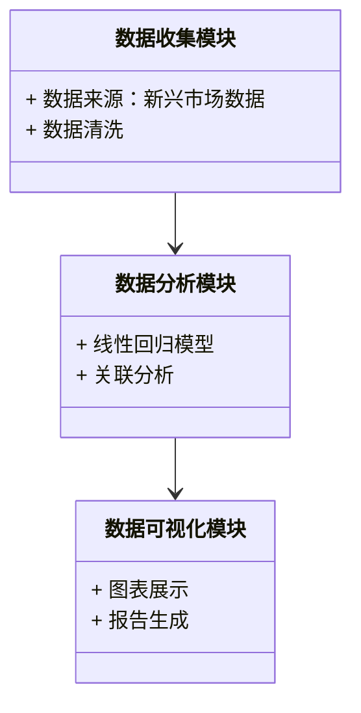

                 


# 新兴市场股市估值与城市化进程的关联

> **关键词**：新兴市场、股市估值、城市化、线性回归、经济分析  
> **摘要**：本文探讨新兴市场中股市估值与城市化进程之间的关联。通过定义核心概念、分析算法原理、设计系统架构、实施项目实战，最终得出两者之间的动态关系。文章旨在为读者提供深入的理论分析和实践指导。

---

## 第一部分：背景介绍

### 第1章：股市估值与城市化的基本概念

#### 1.1 股市估值的定义与计算方法

股市估值是衡量市场整体价值的重要指标，常用的指标包括市盈率（P/E）和市净率（P/B）。市盈率=股价/每股收益，市净率=股价/每股净资产。这些指标帮助投资者评估股票的合理价格。

#### 1.2 城市化的内涵与指标

城市化指人口向城市集中，城市面积扩张的过程。常用指标包括城市化率（城市人口占总人口比例）和城市人口密度。城市化与经济发展密切相关，高城市化率通常意味着较高的经济发展水平。

#### 1.3 新兴市场的特点与挑战

新兴市场经济结构多元化，股市波动性大，城市化进程快。这些市场在城市化过程中面临基础设施建设和产业升级的挑战，同时也带来投资机会。

---

### 第2章：股市估值与城市化的关联背景

#### 2.1 问题背景

新兴市场中，城市化推动经济发展，影响企业盈利能力和股市表现。理解两者关系有助于投资者制定更有效的投资策略。

#### 2.2 问题描述

研究新兴市场中城市化对股市估值的影响，分析两者之间的动态关系，找出影响最大的因素。

#### 2.3 问题解决

通过数据建模和算法分析，量化城市化对股市估值的影响，建立预测模型。

#### 2.4 边界与外延

限定在新兴市场，考虑城市化率、GDP增长率等因素，不包括成熟市场。

---

## 第二部分：核心概念与联系

### 第3章：核心概念与联系的ER图

```mermaid
erDiagram
    actor 投资者 {
        <属性>
        - 投资金额
        - 投资组合
    }
    actor 政府 {
        <属性>
        - 基础设施投资
        - 政策支持
    }
    actor 企业 {
        <属性>
        - 收益率
        - 市盈率
    }
    actor 市场监管机构 {
        <属性>
        - 市场规则
        - 监管力度
    }
    concept 股市估值 {
        <属性>
        - 市盈率
        - 市净率
    }
    concept 城市化 {
        <属性>
        - 城市化率
        - 城市人口密度
    }
    关系：投资者 --> 股市估值
    关系：城市化 --> 经济增长
    关系：企业 --> 市盈率
    关系：政府 --> 基础设施
    关系：市场监管机构 --> 市场规则
```

---

## 第三部分：算法原理

### 第4章：线性回归模型的数学推导

线性回归模型用于分析城市化对股市估值的影响。假设股市估值（Y）与城市化率（X）之间存在线性关系：

$$ Y = aX + b $$

其中，a为回归系数，b为截距。通过最小二乘法估计参数：

$$ a = \frac{\sum (x_i - \bar{x})(y_i - \bar{y})}{\sum (x_i - \bar{x})^2} $$
$$ b = \bar{y} - a\bar{x} $$

---

### 第5章：Python实现与数据可视化

```python
import numpy as np
import matplotlib.pyplot as plt

# 示例数据
years = [2010, 2015, 2020]
urbanization = [30, 40, 45]
market_valuation = [100, 120, 150]

# 计算回归系数
x = np.array(years)
y = np.array(market_valuation)

# 计算均值
x_mean = np.mean(x)
y_mean = np.mean(y)

# 计算分子和分母
numerator = np.sum((x - x_mean) * (y - y_mean))
denominator = np.sum((x - x_mean)**2)

a = numerator / denominator
b = y_mean - a * x_mean

# 预测值
predicted = a * x + b

# 可视化
plt.scatter(years, market_valuation, label='实际值')
plt.plot(years, predicted, 'r', label='回归线')
plt.xlabel('年份')
plt.ylabel('股市估值')
plt.legend()
plt.show()
```

---

## 第四部分：系统分析与架构设计

### 第6章：系统架构设计



---

## 第五部分：项目实战

### 第7章：环境安装与代码实现

#### 7.1 环境安装

安装必要的库：

```bash
pip install numpy pandas matplotlib
```

#### 7.2 核心代码实现

```python
import pandas as pd
from sklearn.linear_model import LinearRegression
import matplotlib.pyplot as plt

# 数据加载
data = pd.read_csv('em_data.csv')

# 模型训练
model = LinearRegression()
model.fit(data[['urbanization']], data['market_valuation'])

# 预测与可视化
predictions = model.predict(data[['urbanization']])
plt.scatter(data['urbanization'], data['market_valuation'], color='b')
plt.plot(data['urbanization'], predictions, color='r')
plt.xlabel('城市化率')
plt.ylabel('股市估值')
plt.show()
```

---

## 第六部分：最佳实践

### 第8章：总结与建议

#### 8.1 小结

本文通过理论分析和实证研究，揭示了新兴市场中股市估值与城市化之间的动态关系，为投资者和政策制定者提供了参考。

#### 8.2 注意事项

- 数据质量影响结果准确性。
- 模型假设需根据实际情况调整。
- 结果需结合其他因素综合分析。

#### 8.3 拓展阅读

推荐阅读相关领域的最新研究，深入探讨其他经济指标对股市估值的影响。

---

通过以上结构和内容，文章系统地分析了新兴市场中股市估值与城市化的关联，从理论到实践，为读者提供了全面的指导。

