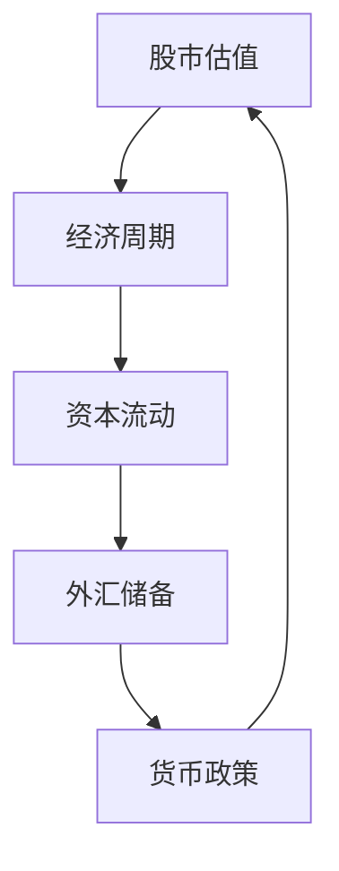
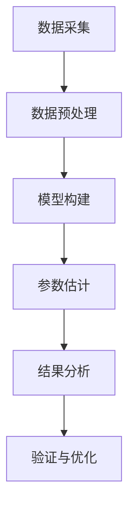
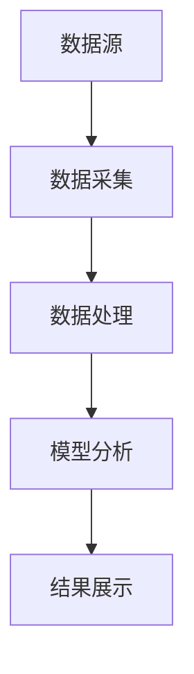

                 


# 新兴市场股市估值与外汇储备的关联

> 关键词：新兴市场、股市估值、外汇储备、经济周期、资本流动、货币政策

> 摘要：本文深入探讨新兴市场股市估值与外汇储备之间的复杂关系。通过分析经济周期、资本流动、货币政策等多方面因素，结合理论模型和实证分析，揭示两者之间的互动机制。文章从核心概念、算法原理、系统架构等多维度展开，结合实际案例，为读者提供全面的理解和分析框架。

---

## 第一部分: 背景介绍与核心概念

### 第1章: 背景与问题描述

#### 1.1 新兴市场股市估值与外汇储备的关联性概述
##### 1.1.1 新兴市场的定义与特征
新兴市场是指那些经济发展水平介于发达国家和发展中国家之间的国家，通常具有较高的经济增长潜力，但也伴随着较高的经济和金融风险。这些市场包括中国、印度、巴西等国家。

##### 1.1.2 股市估值的基本概念
股市估值是通过对上市公司基本面的分析，评估其股票的合理价格范围。常用的指标包括市盈率（P/E）、市净率（P/B）和股息率等。

##### 1.1.3 外汇储备的定义与作用
外汇储备是指一国政府持有的外汇资产，用于稳定本国货币汇率、偿还外债和应对国际支付危机。

#### 1.2 问题背景与研究意义
##### 1.2.1 新兴市场经济发展现状
新兴市场国家在经济增长的同时，也面临着资本流动不稳定的问题，这直接影响股市估值和外汇储备的变化。

##### 1.2.2 股市估值与外汇储备波动的现实问题
近年来，新兴市场股市波动加剧，外汇储备的稳定性也受到挑战，两者之间的关联性日益显著。

##### 1.2.3 研究的理论与实践意义
从理论上，理解股市估值与外汇储备的关系有助于完善金融理论；从实践上，有助于政策制定者更好地应对金融风险。

#### 1.3 研究目标与边界
##### 1.3.1 核心问题的界定
本文旨在分析新兴市场股市估值与外汇储备之间的互动关系，探讨影响两者的主要因素。

##### 1.3.2 研究的范围与限制
研究范围限定于新兴市场国家，重点关注经济周期、资本流动和货币政策对股市估值和外汇储备的影响。

##### 1.3.3 相关概念的外延与内涵
明确股市估值和外汇储备的定义，避免研究中的歧义。

### 第2章: 核心概念与关联性分析

#### 2.1 股市估值的核心要素
##### 2.1.1 市盈率与市净率
市盈率（P/E）= 股价 / 每股收益；市净率（P/B）= 股价 / 每股净资产。

##### 2.1.2 股东权益与企业盈利
企业盈利能力直接影响股市估值，股东权益是衡量企业价值的重要指标。

##### 2.1.3 市场情绪与投资者预期
市场情绪和投资者预期是股市估值的重要影响因素，尤其是短期波动。

#### 2.2 外汇储备的构成与影响
##### 2.2.1 外汇储备的组成结构
主要包括美元、欧元、日元等主要货币资产。

##### 2.2.2 外汇储备对货币流动性的影响
外汇储备是国家调节货币供应的重要工具，影响本国货币的流动性。

##### 2.2.3 外汇储备与国家经济安全的关系
外汇储备是维护国家经济安全的重要保障，尤其是在应对国际支付危机时。

#### 2.3 股市估值与外汇储备的关联性
##### 2.3.1 经济周期对两者的影响
经济周期波动直接影响股市估值和外汇储备的变化。

##### 2.3.2 资本流动与股市估值的波动
资本流入增加通常会推高股市估值，但可能引发外汇储备的变化。

##### 2.3.3 外汇储备对股市估值的调节作用
外汇储备的增减会影响市场流动性，进而影响股市估值。

---

## 第二部分: 核心概念与联系

### 第3章: 核心概念的原理与特征

#### 3.1 股市估值的原理
##### 3.1.1 股票定价模型
股票价格由其内在价值决定，内在价值基于企业的盈利能力和成长潜力。

##### 3.1.2 市场价值与内在价值的差异
市场价值受投资者情绪影响，内在价值反映企业的真实价值。

##### 3.1.3 影响股市估值的主要因素
包括宏观经济环境、企业盈利、市场情绪等。

#### 3.2 外汇储备的管理与运作
##### 3.2.1 外汇储备的管理目标
保持货币稳定性，维护国际支付能力。

##### 3.2.2 外汇储备的操作策略
根据市场变化调整外汇储备结构，分散风险。

##### 3.2.3 外汇储备的风险控制
通过多元化和动态调整降低风险。

#### 3.3 股市估值与外汇储备的联系
##### 3.3.1 经济政策的传导机制
货币政策和财政政策直接影响股市估值和外汇储备的变化。

##### 3.3.2 资本流动的双向影响
资本流入增加股市估值，但可能减少外汇储备；反之亦然。

##### 3.3.3 外汇储备对股市的调节功能
外汇储备的变化影响市场流动性，进而影响股市估值。

### 第4章: 核心概念的对比与关系图

#### 4.1 股市估值与外汇储备的属性对比
| 属性       | 股市估值 | 外汇储备 |
|------------|----------|----------|
| 变动因素   | 市场情绪、企业盈利 | 汇率波动、资本流动 |
| 影响范围   | 股票价格、投资者信心 | 货币政策、国际支付 |
| 管理主体   | 投资者、企业 | 中央银行、政府 |

#### 4.2 股市估值与外汇储备的关系图


---

## 第三部分: 算法原理与实证分析

### 第5章: 算法原理

#### 5.1 算法选择与原理
##### 5.1.1 变量选择
- 自变量：股市估值指标（市盈率、市净率）
- 因变量：外汇储备规模

##### 5.1.2 模型选择
使用向量自回归模型（VAR模型）分析两者之间的互动关系。

#### 5.2 算法流程


#### 5.3 算法实现
##### 5.3.1 Python代码实现
```python
import numpy as np
import pandas as pd
from statsmodels.tsa.vector_ar_model import VAR

# 示例数据
data = pd.DataFrame({
    'stock_valuation': [10, 12, 15, 14, 13],
    'forex_reserve': [100, 105, 110, 108, 107]
})

model = VAR(data)
results = model.fit()
print(results.summary())
```

##### 5.3.2 算法解读
通过VAR模型，可以分析股市估值和外汇储备之间的动态关系，揭示两者之间的相互影响。

---

## 第四部分: 系统分析与架构设计

### 第6章: 系统分析与架构

#### 6.1 系统功能设计
##### 6.1.1 数据采集模块
从金融数据库获取股市估值和外汇储备数据。

##### 6.1.2 数据处理模块
清洗数据，处理缺失值和异常值。

##### 6.1.3 模型分析模块
应用VAR模型进行分析，生成结果报告。

#### 6.2 系统架构设计


#### 6.3 接口设计与交互
##### 6.3.1 API接口
提供RESTful API，供其他系统调用。

##### 6.3.2 交互流程
用户输入查询参数，系统返回分析结果。

---

## 第五部分: 项目实战与案例分析

### 第7章: 项目实战

#### 7.1 环境安装
安装Python、Pandas、NumPy、StatsModels等库。

#### 7.2 核心代码实现
```python
import pandas as pd
from statsmodels.tsa.vector_ar_model import VAR

# 数据加载
data = pd.read_csv('data.csv')

# 模型构建
model = VAR(data)
results = model.fit()

# 结果分析
print(results.irf.forecast(5))
```

#### 7.3 案例分析
以巴西为例，分析其股市估值与外汇储备的关联性。

---

## 第六部分: 最佳实践与小结

### 第8章: 最佳实践

#### 8.1 小结
本文通过理论分析和实证研究，揭示了新兴市场股市估值与外汇储备之间的互动关系。

#### 8.2 注意事项
在实际操作中，需注意数据的完整性和模型的适用性。

#### 8.3 拓展阅读
建议读者进一步阅读相关文献，深入理解金融市场的复杂性。

---

通过以上结构，文章系统地分析了新兴市场股市估值与外汇储备的关联性，结合理论与实践，为读者提供了全面的理解和分析框架。

