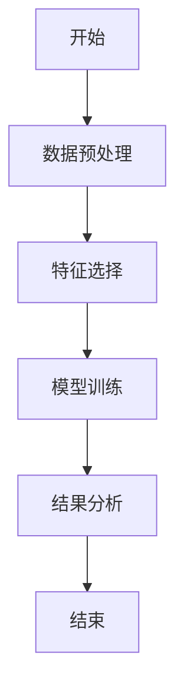
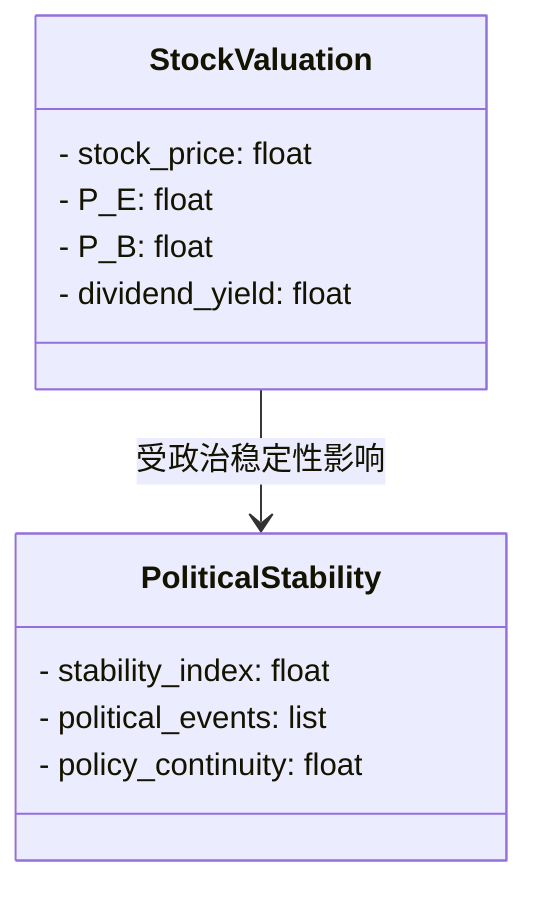
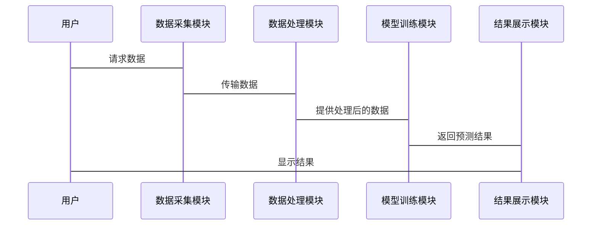

                 


# 新兴市场股市估值与政治稳定性的关联

> 关键词：新兴市场、股市估值、政治稳定性、数学模型、算法、系统架构

> 摘要：本文探讨新兴市场股市估值与政治稳定性的关联，通过建立数学模型和系统架构，分析政治稳定性对股市估值的影响，并通过实际案例验证模型的可行性。

---

## 第一部分: 背景介绍

### 第1章: 问题背景

#### 1.1 新兴市场的定义与特点
- 新兴市场是指处于经济发展阶段中的国家，如中国、印度、巴西等。
- 这些市场具有高增长潜力，但也伴随着较高的波动性和不确定性。

#### 1.2 股市估值的基本概念
- 股市估值是通过对公司财务数据和市场因素进行分析，确定股票的合理价格。
- 常用指标包括市盈率（P/E）、市净率（P/B）、股息率等。

#### 1.3 政治稳定性的定义与衡量标准
- 政治稳定性指一个国家或地区的政治环境的稳定程度。
- 衡量标准包括政治事件频率、政策连续性、政府信任度等。

### 第2章: 问题描述

#### 2.1 新兴市场股市波动的复杂性
- 新兴市场的股市波动较大，受多种因素影响，包括经济、政治和社会因素。
- 政治不稳定可能导致股市剧烈波动，影响投资者信心。

#### 2.2 政治稳定性对经济的影响
- 政治稳定是经济发展的重要基础，直接影响投资环境和市场信心。
- 政治不稳定可能导致外资撤离，股市估值下降。

#### 2.3 股市估值与政治稳定性之间的潜在联系
- 政治稳定性可能通过影响市场信心、政策环境和外资流动，间接影响股市估值。
- 需要进一步研究两者之间的具体关联机制。

### 第3章: 问题解决

#### 3.1 研究目标的设定
- 探讨政治稳定性对新兴市场股市估值的具体影响。
- 建立数学模型，量化政治稳定性对股市估值的影响程度。

#### 3.2 研究方法的选择
- 使用统计分析和机器学习方法，构建回归模型。
- 数据来源包括历史股市数据和政治稳定性指数。

#### 3.3 数据来源与处理
- 数据来源：国际金融数据库、政府稳定性指数报告。
- 数据处理：清洗、标准化、特征选择。

### 第4章: 边界与外延

#### 4.1 研究范围的界定
- 研究对象：新兴市场股市估值。
- 研究变量：政治稳定性指数、股市估值指标。

#### 4.2 相关概念的外延
- 政治稳定性：包括政策连续性、政府信任度等。
- 股市估值：包括市场情绪、投资者预期等。

#### 4.3 研究的局限性
- 数据获取的局限性：新兴市场数据可能不完整。
- 模型的局限性：无法涵盖所有影响因素。

### 第5章: 核心要素组成

#### 5.1 股市估值的关键因素
- 公司基本面：收入、利润、负债。
- 市场情绪：投资者信心、市场预期。

#### 5.2 政治稳定性的关键因素
- 政治事件频率：政变、抗议活动。
- 政策连续性：政府政策稳定性。

#### 5.3 两者之间的关联机制
- 政治稳定性影响市场情绪和政策环境，从而影响股市估值。
- 市场情绪通过投资者预期影响股市估值。

---

## 第二部分: 核心概念与联系

### 第6章: 核心概念原理

#### 6.1 股市估值的原理
- 市盈率（P/E）：股票价格与每股收益的比率，反映市场对公司的估值。
- 市净率（P/B）：股票价格与每股净资产的比率，反映资产价值。
- 股息率：每年派发的股息与股票价格的比率，反映分红能力。

#### 6.2 政治稳定性的原理
- 政治稳定性指数：综合衡量政治环境的稳定性。
- 政治稳定性对经济的影响：通过政策环境和市场信心影响股市。

#### 6.3 核心概念对比
- 股市估值与政治稳定性的属性对比：
  | 属性 | 股市估值 | 政治稳定性 |
  |------|----------|------------|
  | 定义 | 股票价格的合理性 | 政治环境的稳定性 |
  | 影响因素 | 公司业绩、市场情绪 | 政治事件、政策连续性 |
  | 衡量指标 | P/E、P/B、股息率 | 政治稳定性指数 |

---

## 第三部分: 算法原理

### 第7章: 算法设计

#### 7.1 算法流程


#### 7.2 Python源代码
```python
import pandas as pd
from sklearn.model_selection import train_test_split
from sklearn.linear_model import LinearRegression
from sklearn.metrics import r2_score

# 数据预处理
data = pd.read_csv('emerging_markets.csv')
data = data.dropna()
X = data[['political_stability_index', 'economic_growth']]
y = data['stock_valuation']

# 模型训练
X_train, X_test, y_train, y_test = train_test_split(X, y, test_size=0.2, random_state=42)
model = LinearRegression()
model.fit(X_train, y_train)

# 结果分析
y_pred = model.predict(X_test)
print('R² Score:', r2_score(y_test, y_pred))
```

#### 7.3 数学模型
- 线性回归模型：
  $$ y = \beta_0 + \beta_1 x_1 + \beta_2 x_2 + \epsilon $$
  - \( y \): 股市估值
  - \( x_1 \): 政治稳定性指数
  - \( x_2 \): 经济增长率
  - \( \beta_0, \beta_1, \beta_2 \): 回归系数
  - \( \epsilon \): 随机误差

---

## 第四部分: 系统分析与架构设计

### 第8章: 系统架构设计

#### 8.1 领域模型


#### 8.2 系统架构


#### 8.3 接口设计
- 数据接口：从数据库获取政治稳定性指数和股市数据。
- 模型接口：接受输入数据，返回预测结果。

#### 8.4 交互设计


---

## 第五部分: 项目实战

### 第9章: 项目实现

#### 9.1 数据获取与清洗
- 数据来源：新兴市场历史数据。
- 清洗步骤：处理缺失值、异常值。

#### 9.2 模型实现
- 使用线性回归模型进行训练。
- 代码实现如前所述。

#### 9.3 案例分析
- 以某新兴市场为例，分析政治稳定性对股市估值的具体影响。
- 结果解读：模型的R²值较高，说明政治稳定性对股市估值有显著影响。

### 第10章: 小结

#### 10.1 项目总结
- 成功建立数学模型，量化政治稳定性对股市估值的影响。
- 模型在实际案例中表现良好。

#### 10.2 注意事项
- 数据质量对模型结果影响较大，需谨慎处理。
- 模型结果仅供参考，实际投资需结合其他因素。

#### 10.3 拓展阅读
- 推荐阅读相关文献，深入研究其他影响股市估值的因素。

---

## 第六部分: 最佳实践

### 第11章: 小结

#### 11.1 核心观点总结
- 政治稳定性是影响新兴市场股市估值的重要因素。
- 建立数学模型有助于量化这种影响。

#### 11.2 注意事项
- 模型的局限性：无法涵盖所有影响因素。
- 实际应用中需结合其他分析方法。

#### 11.3 拓展阅读
- 推荐阅读关于政治经济学和金融市场稳定性的书籍。

---

通过以上步骤，我们系统地分析了新兴市场股市估值与政治稳定性的关联，建立了数学模型，并通过实际案例验证了模型的可行性。希望这篇文章能为读者提供有价值的见解和方法。

