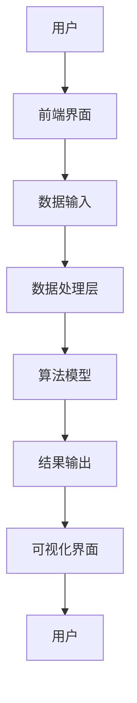

                 


# 新兴市场股市估值与数字化转型的互动

> 关键词：新兴市场、股市估值、数字化转型、大数据分析、人工智能、金融创新

> 摘要：本文探讨新兴市场股市估值与数字化转型的互动关系，分析数字化技术如何改变股市估值的方式，以及新兴市场的独特性如何影响这一过程。通过理论分析与实际案例结合，揭示数字化转型对股市估值的深远影响，并为投资者和市场参与者提供实践指导。

---

# 第1章: 新兴市场股市估值的基本概念

## 1.1 新兴市场的定义与特征

### 1.1.1 新兴市场的经济结构特点

新兴市场通常指那些经济发展迅速、但尚未完全工业化的国家或地区。这些市场具有以下特点：

- **经济增长潜力大**：新兴市场通常处于快速发展阶段， GDP 增速较高。
- **产业结构多元化**：从制造业到服务业，新兴市场产业结构较为多元化。
- **政策环境灵活**：新兴市场通常有较强的政策调整能力，能够快速响应市场变化。

### 1.1.2 新兴市场股市的独特性

新兴市场股市具有以下独特性：

- **市场规模差异大**：新兴市场股市规模通常小于发达市场，但增长潜力更大。
- **市场参与者结构复杂**：新兴市场中个人投资者比例较高，机构投资者占比相对较低。
- **市场波动性较高**：由于信息不对称和市场参与者的多样性，新兴市场股市波动性通常较大。

### 1.1.3 新兴市场与发达市场的对比分析

| 特性 | 新兴市场 | 发达市场 |
|------|----------|----------|
| 市场规模 | 较小，但增长快 | 较大，增长稳定 |
| 投资者结构 | 个人投资者占比高 | 机构投资者占比高 |
| 波动性 | 较高 | 较低 |
| 信息透明度 | 信息不完全透明 | 信息透明度较高 |
| 政策环境 | 灵活，变化快 | 稳定，政策透明 |

---

## 1.2 数字化转型的定义与内涵

### 1.2.1 数字化转型的核心概念

数字化转型是指利用数字技术（如人工智能、大数据、云计算等）对业务模式、流程、文化等进行全面改造，以适应新的市场环境和技术要求。其核心目标是提升效率、降低成本、创造新价值。

### 1.2.2 数字化转型的关键特征

- **数据驱动**：数字化转型依赖于数据的收集、分析和应用。
- **技术创新**：采用新技术（如 AI、区块链）推动业务创新。
- **业务模式重构**：通过数字化手段重构业务流程和商业模式。

### 1.2.3 数字化转型对各行业的影响

| 行业 | 影响 |
|------|------|
| 金融 | 提高交易效率，降低风险 |
| 零售 | 个性化推荐，提升客户体验 |
| 制造业 | 智能生产，供应链优化 |

---

## 1.3 本章小结

本章介绍了新兴市场和数字化转型的基本概念，并通过对比分析，揭示了新兴市场股市的独特性和数字化转型对各行业的影响。这为后续章节的分析奠定了基础。

---

# 第2章: 数字化转型对股市估值的影响

## 2.1 数据驱动的估值方法

### 2.1.1 数据驱动估值的核心原理

数据驱动估值通过收集和分析大量数据，利用统计学和机器学习算法，对股票价值进行预测和评估。其核心原理包括：

- **数据收集**：从多种来源（如财务报表、新闻、社交媒体）收集数据。
- **数据清洗**：对数据进行预处理，去除噪声。
- **数据分析**：使用回归分析、聚类分析等方法对数据进行建模。
- **估值预测**：基于模型输出股票的估值结果。

### 2.1.2 大数据分析在估值中的应用

大数据分析通过处理海量数据，发现传统方法难以察觉的规律和趋势。例如：

- **情绪分析**：通过分析社交媒体数据，预测市场情绪对股价的影响。
- **趋势预测**：利用时间序列分析，预测股票价格的未来走势。

### 2.1.3 人工智能在股市估值中的作用

人工智能（AI）通过深度学习模型（如 LSTM）进行股票预测。例如：

- **LSTM 模型**：用于捕捉时间序列数据中的长期依赖关系。
- **神经网络**：用于分类和回归任务，帮助识别股票的内在价值。

---

## 2.2 技术创新对估值模型的改变

### 2.2.1 传统估值模型的局限性

传统估值模型（如市盈率、市净率）依赖于财务数据，难以捕捉市场情绪和非财务因素的影响。

### 2.2.2 数字化转型带来的新估值方法

数字化转型引入了新的估值方法，如：

- **大数据估值**：基于非结构化数据（如新闻、社交媒体）进行估值。
- **实时估值**：利用实时数据和算法，快速调整估值结果。

### 2.2.3 技术创新对估值效率的提升

技术创新（如云计算、边缘计算）提高了数据处理和分析的效率，使估值过程更加实时和精准。

---

## 2.3 数字化转型对市场参与者的改变

### 2.3.1 投资者行为的变化

数字化转型使得投资者能够通过移动应用和在线平台实时获取信息和进行交易，投资者行为更加理性化和数据驱动。

### 2.3.2 机构投资者的数字化转型

机构投资者通过数字化工具（如算法交易、量化投资）提升投资效率和收益。

### 2.3.3 市场监管的数字化转型

监管部门利用大数据技术进行市场监管，提高监管效率和透明度。

---

## 2.4 本章小结

本章分析了数字化转型对股市估值的影响，重点介绍了数据驱动估值方法、技术创新对估值模型的改变以及市场参与者的数字化转型。数字化技术的应用显著提升了股市估值的效率和准确性。

---

# 第3章: 新兴市场股市估值的独特性

## 3.1 新兴市场的经济与政策环境

### 3.1.1 新兴市场的经济结构与股市特点

新兴市场经济结构多元化，通常处于快速发展阶段，股市规模较小但增长潜力大。

### 3.1.2 新兴市场与发达市场的对比分析

通过对比分析，可以发现新兴市场在政策环境、市场参与者结构等方面与发达市场存在显著差异。

---

## 3.2 新兴市场股市的参与者分析

### 3.2.1 投资者的构成与行为

新兴市场中个人投资者占比高，投资者行为受市场情绪影响较大。

### 3.2.2 机构投资者的角色

机构投资者在新兴市场中逐渐增多，但占比仍低于发达市场。

### 3.2.3 市场监管的特点

新兴市场监管机构通常较为灵活，能够快速响应市场变化。

---

## 3.3 新兴市场股市的风险与机会

### 3.3.1 市场波动性分析

新兴市场股市波动性较高，风险较大。

### 3.3.2 风险管理的数字化转型

通过数字化技术（如算法交易、实时监控）降低市场风险。

### 3.3.3 投资机会的发现与评估

数字化转型为投资者提供了更多机会，如通过大数据分析发现新兴市场的投资亮点。

---

## 3.4 本章小结

本章分析了新兴市场股市估值的独特性，包括经济结构、政策环境、市场参与者等方面的特点。数字化转型在新兴市场中的应用潜力巨大，能够有效提升估值效率和准确性。

---

# 第4章: 数字化转型与股市估值的互动机制

## 4.1 数据驱动的互动模式

### 4.1.1 数据在估值中的作用

数据是数字化转型的核心，通过数据的收集和分析，可以更准确地评估股票价值。

### 4.1.2 数字化转型如何改变数据的使用方式

数字化技术改变了数据的采集、存储和分析方式，使得数据能够更高效地支持估值决策。

### 4.1.3 数据驱动的互动对估值的影响

数据驱动的互动模式使得估值过程更加动态化和个性化。

---

## 4.2 技术创新对估值模型的改变

### 4.2.1 技术创新的核心作用

技术创新（如 AI、大数据）推动了估值模型的创新和优化。

### 4.2.2 技术创新对估值效率的提升

技术创新提高了数据处理速度和分析能力，使得估值过程更加高效。

---

## 4.3 本章小结

本章分析了数字化转型与股市估值的互动机制，重点探讨了数据驱动和技术创新对估值模型的影响。数字化转型通过改变数据的使用方式和技术创新，显著提升了估值的准确性和效率。

---

# 第5章: 新兴市场股市估值与数字化转型的互动模式

## 5.1 数据驱动的定价模式

### 5.1.1 数据驱动定价的核心原理

通过大数据分析，基于市场参与者行为和市场情绪进行股票定价。

### 5.1.2 数据驱动定价的优势

- **精准性**：基于大量数据，能够更准确地预测股票价格。
- **实时性**：能够实时调整定价策略。

---

## 5.2 实时估值与市场互动

### 5.2.1 实时估值的核心技术

实时估值依赖于高速数据处理和算法交易，能够在 microseconds 级别完成估值调整。

### 5.2.2 实时估值对市场互动的影响

实时估值使得市场参与者能够快速响应市场变化，提高了市场的流动性和效率。

---

## 5.3 智能投顾与个性化估值

### 5.3.1 智能投顾的核心功能

智能投顾通过算法推荐投资组合，提供个性化的估值服务。

### 5.3.2 智能投顾对投资者的影响

智能投顾降低了投资门槛，提高了投资效率，使投资者能够更好地管理资产。

---

## 5.4 本章小结

本章分析了新兴市场股市估值与数字化转型的互动模式，重点探讨了数据驱动定价、实时估值和智能投顾等互动方式。这些互动模式通过技术创新和数据驱动，显著提升了股市估值的效率和准确性。

---

# 第6章: 数字化转型对新兴市场股市估值的深远影响

## 6.1 数字化转型对市场效率的提升

### 6.1.1 交易效率的提升

数字化转型通过自动化交易和电子交易平台，显著提升了交易效率。

### 6.1.2 信息传播速度的加快

数字化技术使得信息能够快速传播，提高了市场的透明度。

---

## 6.2 数字化转型对市场风险的改变

### 6.2.1 风险的多样化

数字化转型带来了新的风险，如技术风险和数据安全风险。

### 6.2.2 风险管理的数字化转型

通过数字化技术，市场参与者能够更好地识别和管理风险。

---

## 6.3 数字化转型对投资行为的改变

### 6.3.1 投资者行为的理性化

数字化转型使得投资者能够基于数据和算法进行决策，投资行为更加理性化。

### 6.3.2 投资策略的多样化

数字化技术使得投资者能够采用更多样化的投资策略，如算法交易和量化投资。

---

## 6.4 本章小结

本章分析了数字化转型对新兴市场股市估值的深远影响，包括对市场效率、风险和投资行为的改变。数字化转型通过技术创新和数据驱动，显著提升了股市估值的效率和准确性，同时也带来了新的挑战和机遇。

---

# 第7章: 新兴市场股市估值与数字化转型的互动框架

## 7.1 互动框架的构建

### 7.1.1 数据收集与分析

通过大数据技术收集和分析市场数据，为估值提供支持。

### 7.1.2 估值模型的设计与优化

基于数据和算法，设计和优化估值模型，提高估值的准确性。

### 7.1.3 互动机制的实现

通过实时数据和算法交易，实现市场参与者与估值模型的动态互动。

---

## 7.2 互动框架的实现步骤

### 7.2.1 数据预处理

对收集到的市场数据进行清洗和转换，确保数据质量。

### 7.2.2 模型训练

基于预处理后的数据，训练机器学习模型，如 LSTM 神经网络。

### 7.2.3 模型部署

将训练好的模型部署到实时交易平台，实现动态估值。

---

## 7.3 互动框架的优化与扩展

### 7.3.1 模型优化

通过调参和模型改进，提高估值模型的准确性和效率。

### 7.3.2 框架扩展

在现有框架的基础上，引入更多数据源和分析方法，进一步提升估值能力。

---

## 7.4 本章小结

本章构建了新兴市场股市估值与数字化转型的互动框架，并详细介绍了框架的实现步骤和优化方法。通过这一框架，市场参与者能够更好地理解和应用数字化转型对股市估值的影响。

---

# 第8章: 实际案例分析

## 8.1 案例背景介绍

### 8.1.1 案例选择

选择一个新兴市场（如中国、印度）的股市作为案例，分析其数字化转型对估值的影响。

---

## 8.2 案例分析

### 8.2.1 数据收集与分析

收集相关股票的财务数据、市场数据和新闻数据，进行分析和建模。

### 8.2.2 估值模型的应用

基于模型预测股票价格，并与实际价格进行对比，验证模型的准确性。

---

## 8.3 案例小结

通过案例分析，验证了数字化转型对股市估值的积极作用，并总结了案例中的经验和教训。

---

# 第9章: 数字化转型与股市估值的未来展望

## 9.1 未来发展趋势

### 9.1.1 技术创新的持续推动

人工智能和大数据技术的进一步发展将推动股市估值的数字化转型。

### 9.1.2 市场参与者行为的进一步改变

市场参与者将更加依赖数据和算法进行决策，投资行为将更加理性化。

---

## 9.2 对投资者的启示

### 9.2.1 投资策略的调整

投资者应积极拥抱数字化转型，采用更多样化的投资策略。

### 9.2.2 数字化能力的提升

投资者需要提升自身的数字化能力，更好地应对市场变化。

---

## 9.3 对市场的展望

### 9.3.1 市场效率的进一步提升

数字化转型将推动市场效率的进一步提升，降低交易成本。

### 9.3.2 市场风险的多样化

数字化转型也将带来新的市场风险，需要市场参与者共同应对。

---

## 9.4 本章小结

本章展望了数字化转型与股市估值的未来发展趋势，并对投资者和市场参与者提出了相应的建议和展望。

---

# 第10章: 结论与建议

## 10.1 研究结论

### 10.1.1 数字化转型对股市估值的积极影响

数字化转型通过数据驱动和技术创新，显著提升了股市估值的效率和准确性。

### 10.1.2 新兴市场股市估值的独特性

新兴市场股市估值具有独特性，需要结合市场特点和数字化技术进行分析。

---

## 10.2 实践建议

### 10.2.1 投资者建议

- 积极采用数字化工具，提升投资效率。
- 加强对新兴市场的研究，抓住数字化转型带来的机遇。

### 10.2.2 市场参与者建议

- 加强数字化能力建设，推动业务模式创新。
- 加强与技术服务商的合作，引入先进数字化技术。

---

## 10.3 本章小结

本章总结了研究的主要结论，并提出了对投资者和市场参与者的实践建议。数字化转型将继续推动股市估值的变革，市场参与者需要积极应对这一趋势。

---

# 附录

## 附录1: 数据来源与处理方法

### 1.1 数据来源

- 财务数据：公司财报、财务报表。
- 市场数据：股票价格、交易量。
- 新闻数据：社交媒体、新闻网站。

### 1.2 数据处理方法

- 数据清洗：去除缺失值、异常值。
- 数据转换：标准化、归一化。
- 数据存储：使用数据库或大数据平台存储。

---

## 附录2: 数学公式与算法代码

### 2.1 线性回归模型

$$ y = \beta_0 + \beta_1x + \epsilon $$

### 2.2 LSTM 神经网络代码

```python
import keras
from keras.layers import LSTM, Dense
from keras.models import Sequential

# 构建 LSTM 模型
model = Sequential()
model.add(LSTM(units=64, input_shape=(timesteps, features)))
model.add(Dense(1))
model.compile(loss='mean_squared_error', optimizer='adam')
```

---

## 附录3: 系统架构图

### 3.1 系统架构图（使用 Mermaid）



---

# 结语

数字化转型正在深刻改变股市估值的方式，新兴市场作为重要的市场组成部分，其估值与数字化转型的互动关系值得深入研究。通过本文的分析，读者可以更好地理解数字化转型对股市估值的影响，并在实际投资和市场参与中灵活应用这些知识。未来，随着技术的不断发展，数字化转型与股市估值的互动关系将更加紧密，为市场参与者带来更多的机遇和挑战。

