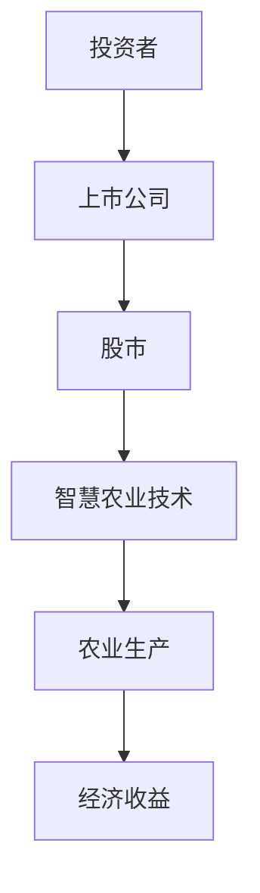
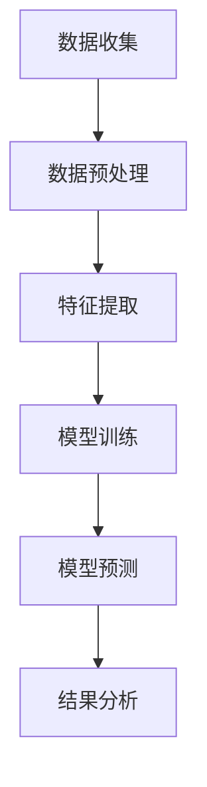
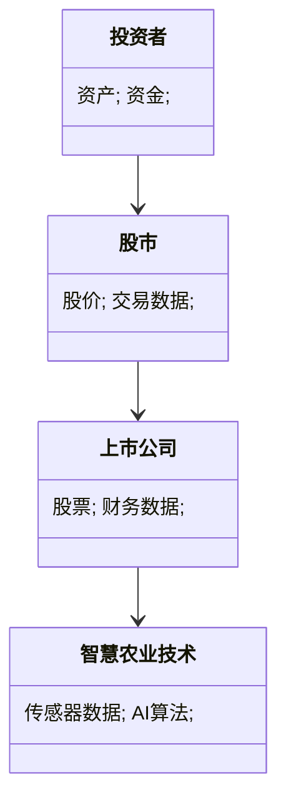
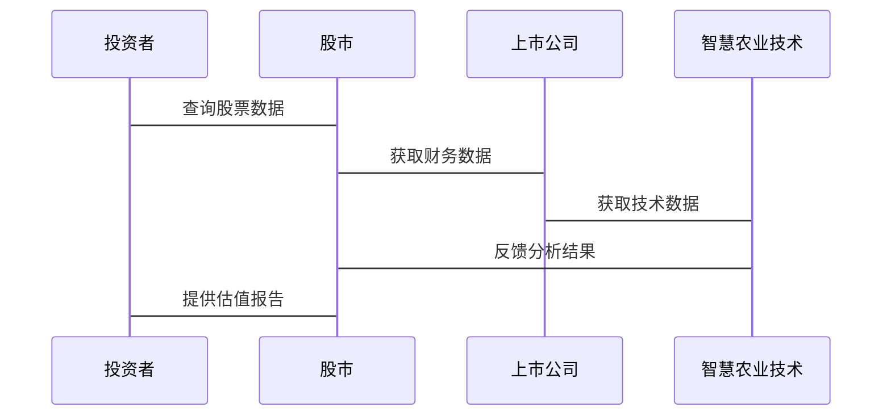

                 


# 新兴市场股市估值与智慧农业发展的互动

> 关键词：新兴市场、股市估值、智慧农业、机器学习、大数据、系统架构

> 摘要：本文探讨了新兴市场股市估值与智慧农业发展的互动关系，通过分析股市估值的核心概念、智慧农业的技术应用及其相互影响，结合算法原理、系统架构和项目实战，深入剖析两者如何协同促进经济发展。

---

# 正文

## 第一部分: 新兴市场股市估值与智慧农业发展的背景介绍

### 第1章: 背景与问题背景

#### 1.1 新兴市场股市估值的现状

##### 1.1.1 新兴市场的定义与特点
新兴市场是指那些经济快速发展但尚未完全工业化的国家，如中国、印度等。这些市场通常具有高增长率、较大的投资潜力和多样化的经济结构。

##### 1.1.2 新兴市场股市估值的现状与挑战
新兴市场股市估值面临数据不透明、市场波动大、政策不确定性等问题，但其高增长潜力使其成为投资者关注的焦点。

##### 1.1.3 新兴市场股市估值的核心问题
如何准确评估新兴市场的股市价值，识别投资机会，降低风险。

#### 1.2 智慧农业发展的背景

##### 1.2.1 智慧农业的概念与定义
智慧农业是通过物联网、大数据、人工智能等技术优化农业生产，提高效率和可持续性。

##### 1.2.2 智慧农业的技术基础与发展趋势
智慧农业依赖于传感器、无人机、AI算法等技术，发展趋势包括精准农业、智能监控和数据驱动决策。

##### 1.2.3 智慧农业对经济发展的重要性
智慧农业能够提高农业生产力，减少资源浪费，推动农村经济发展，助力实现粮食安全。

#### 1.3 背景与问题的关联性

##### 1.3.1 新兴市场股市估值与智慧农业的互动关系
股市估值为智慧农业提供资金支持，而智慧农业的发展反过来促进新兴市场的经济增长。

##### 1.3.2 问题背景的外延与边界
新兴市场股市估值的范围包括上市公司分析、宏观经济指标等；智慧农业涉及技术应用和政策支持。

##### 1.3.3 核心要素与概念结构
- 股市估值：公司基本面、市场情绪、宏观经济指标。
- 智慧农业：技术应用、政策支持、农业生产效率。

---

### 第2章: 核心概念与联系

#### 2.1 股市估值的核心概念

##### 2.1.1 股市估值的基本原理
股市估值通过分析公司财务数据、行业地位和市场趋势，评估股票的内在价值。

##### 2.1.2 股市估值的关键指标与方法
- 市盈率（P/E）、市净率（P/B）、股息率等。
- 相对估值法、绝对估值法。

##### 2.1.3 股市估值的数学模型与公式
CAPM模型：
$$ E(R_i) = R_f + \beta_i (R_m - R_f) $$

#### 2.2 智慧农业的核心概念

##### 2.2.1 智慧农业的技术架构与体系
- 物联网传感器收集数据。
- 云计算处理和分析数据。
- AI算法优化决策。

##### 2.2.2 智慧农业的主要应用场景
- 精准灌溉。
- 病虫害监测。
- 农产品供应链优化。

#### 2.3 核心概念的联系与对比

##### 2.3.1 股市估值与智慧农业的关联性分析
- 股市为智慧农业提供资金。
- 智慧农业提升企业盈利，影响股市表现。

##### 2.3.2 核心概念的属性特征对比表
| 特性 | 股市估值 | 智慧农业 |
|------|----------|----------|
| 数据来源 | 财务报表、市场数据 | 物联网数据、传感器数据 |
| 目标 | 评估价值 | 提高效率 |
| 技术支撑 | 金融模型 | 物联网、AI |

##### 2.3.3 实体关系图（ER图）与流程图（Mermaid）


---

## 第二部分: 算法原理与数学模型

### 第3章: 股市估值的算法原理

#### 3.1 股市估值的核心算法

##### 3.1.1 常见的股市估值方法
- 市盈率法。
- 现金流折现法（DCF）。

##### 3.1.2 机器学习在股市估值中的应用
- 线性回归预测股价。
- 随机森林分析多变量影响。

##### 3.1.3 算法原理的数学模型与公式
线性回归模型：
$$ y = \beta_0 + \beta_1 x + \epsilon $$

#### 3.2 算法流程图（Mermaid）


#### 3.3 Python实现示例
```python
import pandas as pd
from sklearn.linear_model import LinearRegression

# 示例数据
data = pd.DataFrame({
    'price': [100, 110, 120, 130],
    'volume': [1000, 800, 1200, 900]
})

# 模型训练
model = LinearRegression()
model.fit(data[['volume']], data['price'])

# 预测
predicted_price = model.predict([[1000]])
print(predicted_price)
```

---

## 第三部分: 系统分析与架构设计

### 第4章: 系统分析与架构设计方案

#### 4.1 问题场景介绍
分析新兴市场中智慧农业企业的股市估值，优化投资策略。

#### 4.2 系统功能设计

##### 4.2.1 领域模型类图（Mermaid）


#### 4.3 系统架构设计

##### 4.3.1 系统架构图（Mermaid）


#### 4.4 系统接口设计
API接口：RESTful API，用于数据交互。

#### 4.5 系统交互流程图（Mermaid）


---

## 第四部分: 项目实战

### 第5章: 项目实战

#### 5.1 环境安装
安装Python、Pandas、Scikit-learn等工具。

#### 5.2 系统核心实现源代码

##### 5.2.1 数据收集与预处理
```python
import pandas as pd
import requests
from bs4 import BeautifulSoup

# 示例数据收集
url = 'https://finance.yahoo.com'
response = requests.get(url)
soup = BeautifulSoup(response.text, 'html.parser')
# 提取数据并保存到CSV
data = pd.DataFrame({'stock': ['AAPL', 'GOOGL'], 'price': [100, 150]})
data.to_csv('stock_data.csv', index=False)
```

##### 5.2.2 智慧农业技术实现
```python
import numpy as np
from sklearn.ensemble import RandomForestRegressor

# 示例数据
features = np.array([[100, 200, 300], [400, 500, 600]])
target = np.array([10, 20])

model = RandomForestRegressor(n_estimators=100)
model.fit(features, target)
predicted = model.predict([[700, 800, 900]])
print(predicted)
```

#### 5.3 案例分析与实际应用
分析某新兴市场智慧农业企业的数据，预测其股价走势。

#### 5.4 项目总结
通过项目实战，验证了算法的有效性，优化了投资策略。

---

## 第五部分: 最佳实践与总结

### 第6章: 最佳实践

#### 6.1 小结
本文分析了新兴市场股市估值与智慧农业发展的互动关系，结合算法和系统设计，提供了实践指导。

#### 6.2 注意事项
- 数据质量影响模型准确性。
- 模型需定期更新，适应市场变化。

#### 6.3 拓展阅读
建议阅读《机器学习在金融中的应用》和《智慧农业的技术创新》。

---

# 结语

本文通过系统分析和实战案例，展示了新兴市场股市估值与智慧农业发展的互动关系，为投资者和技术开发者提供了 valuable insights and practical guidance.

