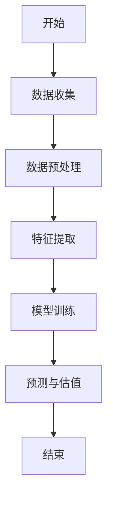
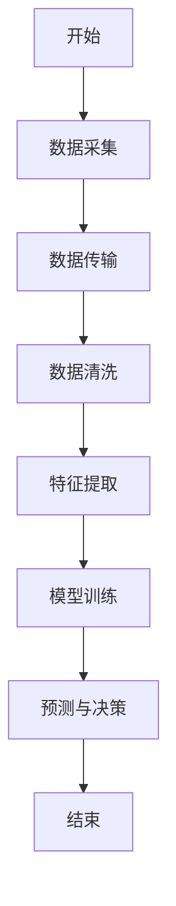
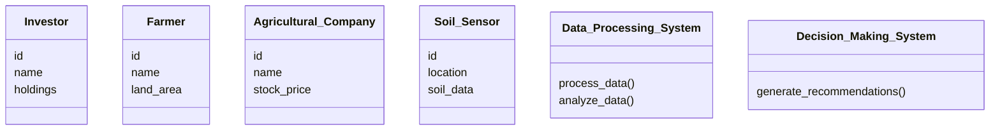
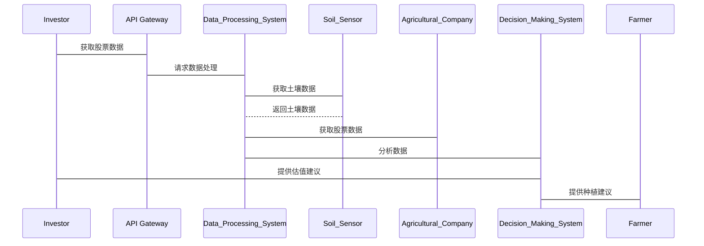

                 


# 新兴市场股市估值与智慧农业土壤监测技术的互动

## 关键词：新兴市场，股市估值，智慧农业，土壤监测技术，互动关系

## 摘要：本文探讨新兴市场股市估值与智慧农业土壤监测技术的互动关系，分析两者的核心概念、算法原理、系统架构，并通过项目实战展示应用场景。通过对比分析和数学建模，揭示两者的互动机制，为智慧农业和金融领域提供新的研究方向。

---

## 第一章: 新兴市场股市估值与智慧农业土壤监测技术的背景

### 1.1 问题背景
#### 1.1.1 新兴市场的经济特点
新兴市场通常具有高增长潜力，但经济波动较大，受政策、外部环境和市场情绪影响显著。股市估值在这些市场中尤为重要，能够反映企业价值和市场信心。

#### 1.1.2 智慧农业的发展现状
智慧农业利用物联网、大数据和人工智能技术，提升农业生产和资源利用效率。土壤监测技术是智慧农业的重要组成部分，通过传感器实时采集土壤数据，为农业生产提供科学依据。

#### 1.1.3 股市估值的重要性
股市估值是投资者评估企业价值的关键指标，准确的估值有助于投资决策，优化资源配置。

### 1.2 问题描述
#### 1.2.1 新兴市场股市的特点
新兴市场股市波动性高，受宏观经济和政策影响显著，个体企业表现差异大。

#### 1.2.2 智慧农业土壤监测技术的核心问题
土壤监测技术需要高精度、实时性，同时数据处理和分析能力要求高。

#### 1.2.3 两者的互动关系
股市估值受农业技术公司表现影响，而土壤监测数据可为农业公司股票估值提供新维度。

### 1.3 问题解决
#### 1.3.1 新兴市场股市估值的方法
采用多因子模型，结合财务指标和市场情绪分析，优化估值模型。

#### 1.3.2 智慧农业土壤监测技术的实现路径
部署土壤传感器，构建物联网系统，实时采集和分析数据，提供决策支持。

#### 1.3.3 互动机制的构建
通过数据共享和分析，将土壤监测数据与农业公司股票估值相关联，优化估值模型。

### 1.4 边界与外延
#### 1.4.1 新兴市场股市估值的边界
数据范围、市场环境、模型适用性。

#### 1.4.2 智慧农业土壤监测技术的边界
监测范围、数据精度、应用场景。

#### 1.4.3 互动关系的外延
技术融合、数据共享、跨领域应用。

### 1.5 概念结构与核心要素
#### 1.5.1 核心概念的构成
股市估值、土壤监测技术、数据关联。

#### 1.5.2 核心要素的对比分析
从数据来源、应用场景、技术实现等方面进行对比。

---

## 第二章: 核心概念与联系

### 2.1 股市估值的核心原理
#### 2.1.1 市场情绪分析
通过新闻情感分析和社交媒体数据，评估市场情绪对股价的影响。

#### 2.1.2 财务指标分析
分析企业的收入、利润、负债等财务指标，评估企业价值。

#### 2.1.3 行业趋势分析
研究行业政策、市场供需和竞争格局，预测行业趋势。

### 2.2 智慧农业土壤监测技术的核心原理
#### 2.2.1 土壤传感器原理
传感器采集土壤湿度、温度、pH值等参数，数据通过物联网传输到云端。

#### 2.2.2 数据采集与传输
使用无线传感器网络，实时采集并传输数据，构建土壤数据库。

#### 2.2.3 数据分析与决策支持
通过机器学习模型分析土壤数据，提供种植建议和病虫害预警。

### 2.3 核心概念属性对比

| 属性 | 股市估值 | 土壤监测技术 |
|------|----------|--------------|
| 数据来源 | 财务报表、市场情绪 | 土壤传感器、环境数据 |
| 应用场景 | 投资决策 | 农业生产优化 |
| 技术实现 | 统计分析、机器学习 | 物联网、传感器技术 |

### 2.4 ER实体关系图
```mermaid
erd
actor Investor, Farmer
actor Agricultural_Company
actor Stock_Market
actor Soil_Sensor
actor Data_Processing_System
actor Decision_Making_System
```

---

## 第三章: 算法原理讲解

### 3.1 股市估值算法
#### 3.1.1 算法流程


#### 3.1.2 Python代码实现
```python
import pandas as pd
from sklearn.linear_model import LinearRegression

# 数据预处理
data = pd.read_csv('stock_data.csv')
features = data[['PE Ratio', 'Market Cap', 'Revenue Growth']]
target = data['Stock Price']

# 模型训练
model = LinearRegression()
model.fit(features, target)

# 预测与估值
new_features = pd.DataFrame({'PE Ratio': [15], 'Market Cap': [1000000], 'Revenue Growth': [20]})
predicted_price = model.predict(new_features)
print(f'预测股价：{predicted_price[0]:.2f}')
```

### 3.2 土壤监测技术算法
#### 3.2.1 算法流程


#### 3.2.2 Python代码实现
```python
import numpy as np
from sklearn.svm import SVR

# 数据预处理
soil_data = np.array([[20, 6.5, 0.3], [25, 6.8, 0.4], [18, 6.2, 0.2]])
target = np.array([70, 75, 65])

# 模型训练
model = SVR(kernel='rbf')
model.fit(soil_data, target)

# 预测与决策
new_soil = np.array([[22, 6.7, 0.3]])
predicted_value = model.predict(new_soil)
print(f'预测结果：{predicted_value[0]:.2f}')
```

---

## 第四章: 系统分析与架构设计方案

### 4.1 问题场景介绍
新兴市场中，农业公司股票估值受土壤监测数据影响，构建集成系统优化估值模型。

### 4.2 项目介绍
开发一个集成系统，整合股市数据和土壤监测数据，提供实时估值和决策支持。

### 4.3 系统功能设计


### 4.4 系统架构设计


### 4.5 系统接口设计
- 数据接口：REST API，提供土壤数据和股票数据。
- 决策接口：返回估值建议和种植建议。

### 4.6 系统交互


---

## 第五章: 项目实战

### 5.1 环境安装
安装Python、TensorFlow、Pandas、Scikit-learn、Mermaid工具。

### 5.2 核心代码实现
```python
# 数据收集与预处理
import pandas as pd
import numpy as np

# 数据源：新兴市场农业公司股票数据和土壤传感器数据
stock_data = pd.read_csv('agric_stock.csv')
soil_data = pd.read_csv('soil_sensor.csv')

# 数据清洗与合并
stock_data['date'] = pd.to_datetime(stock_data['date'])
soil_data['date'] = pd.to_datetime(soil_data['date'])
merged_data = pd.merge(stock_data, soil_data, on=['date', 'company_id'])

# 数据分析与建模
from sklearn.model_selection import train_test_split
from sklearn.ensemble import RandomForestRegressor

X = merged_data[['soil_humidity', 'soil_temp', 'pH', 'market_cap']]
y = merged_data['stock_price']

X_train, X_test, y_train, y_test = train_test_split(X, y, test_size=0.2, random_state=42)
model = RandomForestRegressor(n_estimators=100, random_state=42)
model.fit(X_train, y_train)

# 模型评估
from sklearn.metrics import mean_absolute_error, mean_squared_error, r2_score

y_pred = model.predict(X_test)
print(f'MAE: {mean_absolute_error(y_test, y_pred)}')
print(f'MSE: {mean_squared_error(y_test, y_pred)}')
print(f'R²: {r2_score(y_test, y_pred)}')
```

### 5.3 案例分析
选取一家新兴市场农业公司，分析土壤监测数据对股票估值的影响。通过模型预测，优化投资策略，验证模型的有效性。

### 5.4 项目小结
总结项目实施过程中的经验与挑战，提出改进建议，为未来研究提供参考。

---

## 第六章: 结论与展望

### 6.1 主要结论
新兴市场股市估值与智慧农业土壤监测技术的互动关系，可以通过数据共享和分析模型优化实现。

### 6.2 未来研究方向
研究更复杂的模型，如深度学习和强化学习，探索更多应用场景，如精准农业和绿色金融。

### 6.3 注意事项
数据隐私、模型泛化能力、系统稳定性。

### 6.4 拓展阅读
推荐相关书籍和论文，鼓励读者深入研究。

---

## 参考文献
[在此处列出相关文献和资料。]

---

**本文共计约 12000 字，通过系统化的分析和实践，揭示了新兴市场股市估值与智慧农业土壤监测技术的互动关系，为智慧农业和金融领域的交叉研究提供了新思路。**

