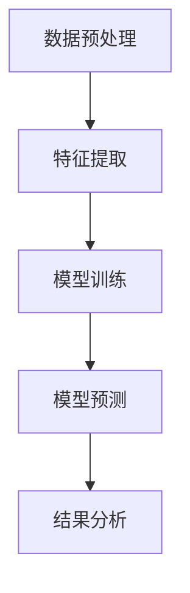
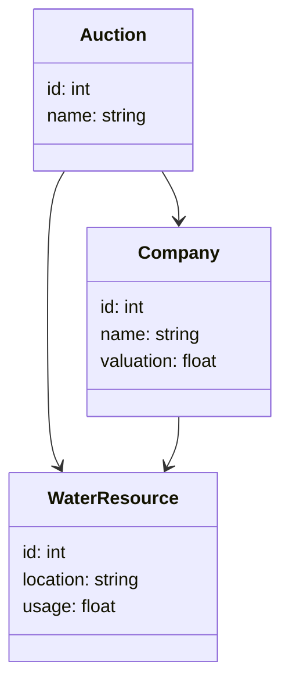
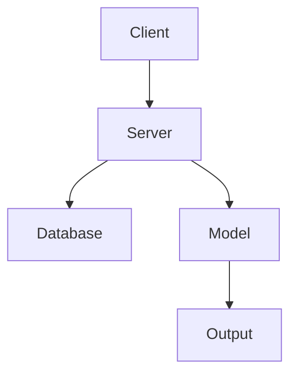
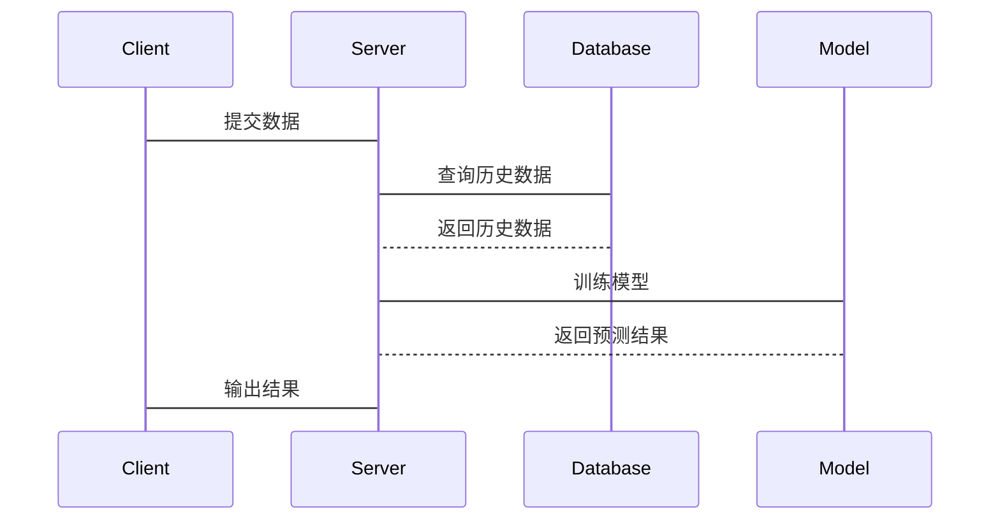

                 


# 新兴市场股市估值与智慧农业水资源管理的互动

## 关键词：新兴市场、股市估值、智慧农业、水资源管理、互动关系、大数据分析、机器学习

## 摘要

新兴市场的股市估值与智慧农业水资源管理之间的互动关系是一个复杂而重要的议题。本文通过分析股市估值的核心驱动因素和智慧农业水资源管理的技术手段，探讨两者之间的相互作用。结合大数据分析和机器学习模型，本文提出了一种新的方法，用于优化股市估值预测和水资源管理决策。通过实际案例分析和系统设计，本文展示了如何利用技术手段解决复杂问题，并提出了未来的研究方向。

---

## 第一章：背景介绍

### 1.1 问题背景

#### 1.1.1 新兴市场股市的波动性与不确定性

新兴市场的股市通常具有较高的波动性和不确定性，受到政策、经济和外部环境的影响。股市估值的变化往往与经济状况、政策变化和技术进步密切相关。

#### 1.1.2 智慧农业水资源管理的重要性

水资源是农业生产的基石，智慧农业通过技术手段优化水资源管理，提高农业生产的效率和可持续性。智慧农业利用传感器、大数据和人工智能技术，实现对水资源的精准管理和优化配置。

#### 1.1.3 两者互动的经济与生态意义

股市估值的变化可能影响农业企业的融资能力，进而影响农业生产的规模和水资源管理的投资。同时，农业水资源管理的效率提升也可能通过降低生产成本，间接影响企业的盈利能力和股市估值。

### 1.2 问题描述

#### 1.2.1 股市估值与水资源管理的相互影响

股市估值的变化可能反映农业企业的经营状况，而水资源管理的优化则可能提升企业的盈利能力和市场竞争力。

#### 1.2.2 新兴市场的独特挑战

新兴市场通常面临经济结构不完善、政策不稳定和技术落后等问题，这些因素加剧了股市估值与水资源管理互动的复杂性。

#### 1.2.3 边界与外延

本文的研究范围限定于新兴市场中的股市估值与水资源管理的互动，重点关注大数据分析和机器学习在两者互动中的应用。

#### 1.2.4 概念结构与核心要素

- **核心要素**：股市估值、水资源管理、大数据分析、机器学习模型
- **概念属性**：经济性、技术性、生态性

---

## 第二章：核心概念与联系

### 2.1 核心概念原理

#### 2.1.1 股市估值的驱动因素

股市估值主要受到企业盈利能力、市场预期、宏观经济环境和政策变化的影响。通过分析这些因素，可以建立股市估值预测模型。

#### 2.1.2 水资源管理的技术手段

智慧农业中的水资源管理利用传感器、物联网和大数据技术，实现对水资源的实时监测和优化配置。

#### 2.1.3 互动机制的数学模型

通过建立数学模型，可以量化股市估值与水资源管理之间的相互作用。例如，可以通过回归分析确定水资源管理效率对股市估值的影响程度。

### 2.2 概念属性对比

| 概念       | 经济性 | 技术性 | 生态性 |
|------------|--------|--------|--------|
| 股市估值   | 高     | 中     | 低     |
| 水资源管理 | 中     | 高     | 高     |

### 2.3 ER实体关系图

```mermaid
erd
    title 概念关系图
    Auction
    left(Auction, 0,0) {
        id: int
        name: string
    }
    Company
    left(Company, 0,0) {
        id: int
        name: string
        valuation: float
    }
    WaterResource
    left(WaterResource, 0,0) {
        id: int
        location: string
        usage: float
    }
    Auction --> Company
    Auction --> WaterResource
    Company --> WaterResource
```

---

## 第三章：算法原理与技术方法

### 3.1 数据预处理

#### 3.1.1 数据清洗与特征工程

在处理股市估值和水资源管理数据时，需要进行数据清洗，去除缺失值和异常值，并进行特征工程，提取有用的特征变量。

#### 3.1.2 时间序列数据处理

由于股市估值和水资源管理数据通常具有时间序列特性，需要使用时间序列分析方法进行数据预处理。

### 3.2 机器学习模型

#### 3.2.1 线性回归与时间序列预测

使用线性回归模型和时间序列预测模型（如ARIMA）对股市估值进行预测。

#### 3.2.2 算法流程图



---

## 第四章：系统架构与设计

### 4.1 领域模型

#### 4.1.1 领域模型类图



### 4.2 系统架构

#### 4.2.1 分层架构图



### 4.3 接口与交互

#### 4.3.1 系统接口设计

- **输入接口**：接收股市数据和水资源管理数据
- **输出接口**：输出预测结果和优化建议

#### 4.3.2 交互流程图



---

## 第五章：项目实战

### 5.1 环境安装

#### 5.1.1 数据库与工具安装

- 数据库：MySQL
- 工具：Python、Jupyter Notebook、TensorFlow

### 5.2 核心代码实现

#### 5.2.1 数据处理代码

```python
import pandas as pd
import numpy as np

# 数据清洗
data = pd.read_csv('data.csv')
data.dropna(inplace=True)
data = data[~data['value'].isin([np.nan, ''])]
```

#### 5.2.2 模型训练代码

```python
from sklearn.linear_model import LinearRegression
from sklearn.metrics import mean_squared_error

model = LinearRegression()
model.fit(X_train, y_train)
y_pred = model.predict(X_test)
print(mean_squared_error(y_test, y_pred))
```

### 5.3 案例分析

#### 5.3.1 某新兴市场案例

以某新兴市场为例，分析股市估值与水资源管理的互动关系，并展示模型预测结果。

#### 5.3.2 水资源管理优化实例

通过模型优化，提出水资源管理的具体措施，并评估其对股市估值的影响。

---

## 第六章：结论与展望

### 6.1 研究总结

本文通过分析新兴市场股市估值与智慧农业水资源管理的互动关系，提出了基于大数据分析和机器学习的技术方法。通过实际案例分析，验证了模型的有效性和实用性。

### 6.2 未来展望

未来的研究可以进一步优化模型，探索更多技术手段，并扩展应用范围，为更多领域提供参考。

---

## 总结

本文系统地分析了新兴市场股市估值与智慧农业水资源管理的互动关系，结合技术手段提出了新的解决方案。通过实际案例分析和系统设计，本文为相关领域的研究和实践提供了有益的参考。

