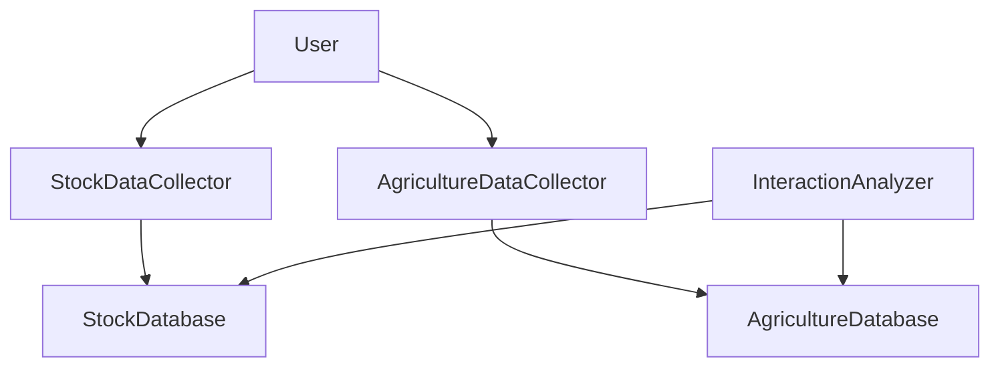

                 


# 新兴市场股市估值与智慧农业病虫害防控系统的互动

> 关键词：新兴市场，股市估值，智慧农业，病虫害防控，系统互动

> 摘要：本文探讨了新兴市场股市估值与智慧农业病虫害防控系统之间的互动关系。通过分析股市估值的核心算法与病虫害防控系统的原理，结合实际案例，揭示两者在数据共享、经济影响和技术应用方面的互动机制。文章从背景介绍、核心概念、算法原理、系统架构到项目实战，全面解析了这一互动的实现路径和实际应用。

---

## 第1章: 背景介绍与核心概念

### 1.1 新兴市场股市估值与智慧农业的互动背景

#### 1.1.1 新兴市场的定义与特点
新兴市场通常指那些经济增长迅速、市场机制逐步完善的国家或地区，如中国、印度等。这些市场具有高增长潜力，但也伴随着高风险。

#### 1.1.2 股市估值的基本概念与方法
股市估值是通过对公司基本面的分析，评估其股票的内在价值。常用的方法包括市盈率（P/E）、市净率（P/B）等。

#### 1.1.3 智慧农业与病虫害防控的背景介绍
智慧农业利用物联网、大数据和人工智能等技术，优化农业生产过程。病虫害防控系统通过实时监测和数据分析，帮助农民减少损失。

### 1.2 问题描述与研究意义
#### 1.2.1 股市估值与农业病虫害防控的关联性
农业病虫害的爆发可能影响农产品价格，进而影响股市估值。

#### 1.2.2 新兴市场中的特殊性与挑战
新兴市场股市波动大，农业技术落后，病虫害防控难度高。

#### 1.2.3 研究的理论与实践意义
研究两者互动关系，有助于优化农业投资决策，促进农业技术升级。

---

## 第2章: 核心概念与概念结构

### 2.1 核心概念的定义与属性

#### 2.1.1 股市估值的核心要素
- 公司财务数据（收入、利润）
- 市场情绪（投资者信心）
- 宏观经济指标（GDP、利率）

#### 2.1.2 病虫害防控系统的组成与功能
- 数据采集（传感器、图像识别）
- 数据分析（机器学习、统计模型）
- 防控决策（喷洒农药、调整种植策略）

#### 2.1.3 互动机制的定义与特征
- 数据共享：股市估值数据与农业数据的互通
- 技术融合：人工智能在两领域的共同应用
- 经济反馈：农业风险影响股市波动

### 2.2 概念结构与核心要素

#### 2.2.1 股市估值的数学模型
$$ P = \frac{E}{P/E} $$
其中，P为股票价格，E为公司盈余，P/E为市盈率。

#### 2.2.2 病虫害防控系统的逻辑框架
- 数据采集：温度、湿度、光照等环境数据
- 数据分析：识别病虫害类型和严重程度
- 防控决策：制定最佳防控策略

#### 2.2.3 互动机制的系统架构
- 数据共享模块：连接股市与农业数据
- 风险预警模块：基于股市波动预测农业风险
- 技术融合模块：共享人工智能算法

### 2.3 核心概念的ER实体关系图

```mermaid
er
actor: 投资者
actor: 农户
actor: 政府机构
class: 股市数据
class: 病虫害数据
class: 互动机制
```

---

## 第3章: 股市估值的算法原理

### 3.1 时间序列分析

#### 3.1.1 ARIMA模型的原理与应用
ARIMA（自回归积分滑动平均模型）用于预测时间序列数据。模型分为三个部分：自回归（AR）、差分（I）、滑动平均（MA）。

#### 3.1.2 LSTM网络在股市预测中的应用
LSTM（长短期记忆网络）通过记忆单元捕捉长期依赖关系，适合处理时间序列数据。

#### 3.1.3 股市数据的特征提取与预处理
- 数据清洗：处理缺失值、异常值
- 数据标准化：归一化处理
- 特征选择：选择影响股价的关键指标

### 3.2 股市估值的数学模型

#### 3.2.1 常见估值方法的数学公式
- 市盈率（P/E）：$$ P/E = \frac{P}{E} $$
- 市净率（P/B）：$$ P/B = \frac{P}{B} $$
- 股息率：$$ Dividend Yield = \frac{D}{P} $$

#### 3.2.2 股票价格预测的数学模型
$$ P_{t} = aP_{t-1} + bE_{t-1} + c $$

---

## 第4章: 病虫害防控系统的算法原理

### 4.1 机器学习在病虫害识别中的应用

#### 4.1.1 基于卷积神经网络的图像识别
CNN（卷积神经网络）用于识别病虫害的图像特征。

#### 4.1.2 支持向量机在分类中的应用
SVM（支持向量机）用于分类病虫害类型。

#### 4.1.3 病虫害数据的特征提取与标注
- 形状特征：病斑大小、颜色
- 环境特征：温度、湿度

### 4.2 病虫害防控的数学模型

#### 4.2.1 病虫害传播的数学模型
$$ S_{t} = S_{t-1} + \beta S_{t-1}I_{t-1} $$
其中，S为易感人群，I为感染者。

#### 4.2.2 病虫害风险评估的指标体系
- 病虫害指数（DI）
- 环境风险因子（ERF）

---

## 第5章: 系统分析与架构设计

### 5.1 问题场景介绍

#### 5.1.1 新兴市场股市与农业的互动场景
- 农业风险影响股市估值
- 股市波动影响农业投资

### 5.2 系统功能设计

#### 5.2.1 股市数据采集模块
- 数据来源：股票价格、交易量
- 数据处理：清洗、存储

#### 5.2.2 病虫害数据采集模块
- 数据来源：传感器、图像识别
- 数据处理：清洗、存储

#### 5.2.3 互动机制分析模块
- 数据共享：连接股市与农业数据
- 风险预警：基于数据关联性预测风险

### 5.3 系统架构设计

#### 5.3.1 系统架构图


---

## 第6章: 项目实战与案例分析

### 6.1 环境安装与配置

#### 6.1.1 环境要求
- Python 3.8+
- 机器学习库（TensorFlow、Scikit-learn）
- 数据库（MySQL、MongoDB）

#### 6.1.2 安装依赖
```bash
pip install numpy pandas scikit-learn tensorflow pymongo
```

### 6.2 系统核心实现

#### 6.2.1 股市数据采集代码
```python
import pandas as pd
import requests

url = "https://api.example.com/stock"
data = pd.read_json(requests.get(url).text)
print(data.head())
```

#### 6.2.2 病虫害数据采集代码
```python
import cv2

def detect_disease(image_path):
    img = cv2.imread(image_path)
    # 图像处理代码
    return result
```

### 6.3 案例分析与详细解读

#### 6.3.1 案例背景
- 新兴市场：印度
- 农业作物：小麦
- 病虫害类型：锈病

#### 6.3.2 数据分析与结果展示
- 股市数据：小麦价格上涨
- 病虫害数据：锈病面积增加
- 互动机制：锈病爆发导致小麦价格上涨，进而影响股市估值

### 6.4 项目小结

---

## 第7章: 总结与展望

### 7.1 研究总结
本文探讨了新兴市场股市估值与智慧农业病虫害防控系统的互动关系，提出了数据共享和算法融合的实现路径。

### 7.2 展望与建议
未来研究可以进一步优化算法，拓展应用场景，推动农业智能化和金融数字化的深度融合。

---

## 附录

### 附录A: 相关工具与库

- Python库：TensorFlow、Scikit-learn
- 数据库：MySQL、MongoDB

### 附录B: 参考文献

- 时间序列分析相关文献
- 机器学习在农业中的应用文献
- 病虫害防控系统相关文献

---

通过本文的详细分析和案例解读，读者可以深入了解新兴市场股市估值与智慧农业病虫害防控系统之间的互动机制，并掌握其实现方法和技术要点。

