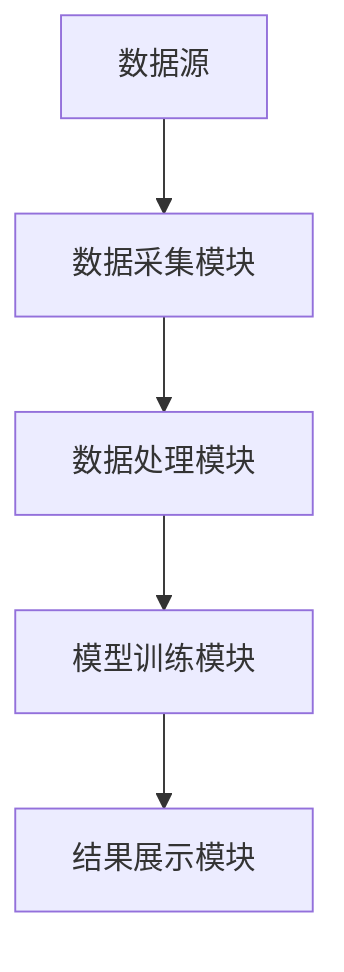
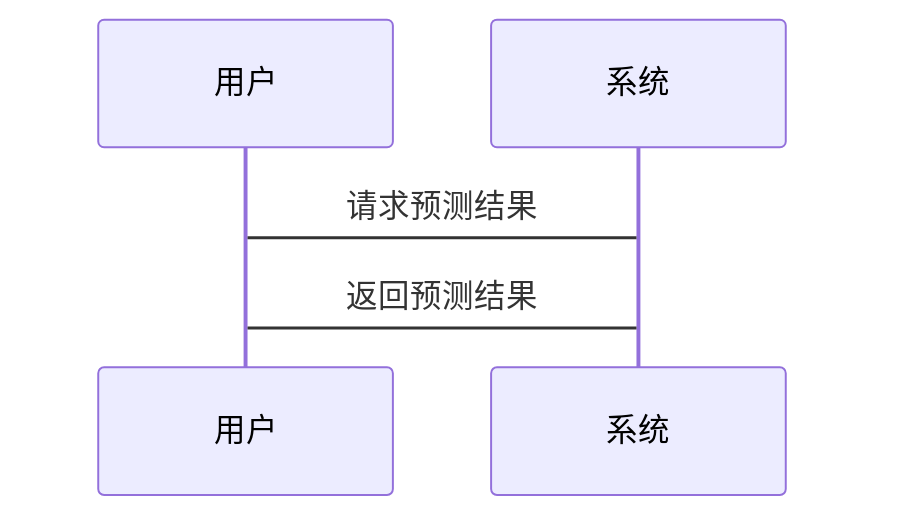

                 


# 新兴市场股市估值与智慧农业病虫害预测的互动

> 关键词：新兴市场、股市估值、智慧农业、病虫害预测、互动机制、机器学习、系统架构

> 摘要：本文探讨新兴市场股市估值与智慧农业病虫害预测的互动关系，分析两者的核心技术、互动机制、算法原理及系统架构。通过结合时间序列分析、机器学习和物联网技术，提出一种跨领域的数据融合方法，提升股市预测和病虫害预警的准确性。

---

## 第1章: 背景介绍与核心概念

### 1.1 问题背景

#### 1.1.1 新兴市场股市估值的现状与挑战
新兴市场的股市波动性高，受多种因素影响，如政策、经济和市场情绪。传统估值方法（如市盈率、市净率）在新兴市场中可能不够准确，因为市场参与者的行为和信息不对称较为显著。此外，新兴市场的数据质量和完整性可能较低，影响估值模型的准确性。

#### 1.1.2 智慧农业病虫害预测的现状与挑战
智慧农业通过物联网设备、无人机和AI技术实时监测农田数据，预测病虫害的发生。然而，数据的实时性和准确性仍面临挑战，尤其是在资源有限的新兴市场。此外，病虫害预测模型的泛化性和可解释性也是关键问题。

#### 1.1.3 两者的互动关系与研究意义
尽管股市估值和病虫害预测看似无关，但两者都依赖于数据驱动的预测模型。新兴市场中，农业数据可能影响股市情绪，而股市波动也可能反映农业生产的稳定性。研究两者的互动关系，有助于利用跨领域的数据提升预测精度。

### 1.2 核心概念与定义

#### 1.2.1 股市估值的核心概念
- **市盈率（P/E）**：衡量股票价格与每股收益的比率。
- **市净率（P/B）**：衡量股票价格与每股净资产的比率。
- **股息率**：衡量股票分红能力。

#### 1.2.2 智慧农业病虫害预测的核心概念
- **物联网（IoT）**：用于实时监测农田环境数据。
- **图像识别**：通过无人机拍摄的图像识别病虫害迹象。
- **预测模型**：基于历史数据预测病虫害的发生时间和严重程度。

#### 1.2.3 两者的互动机制与边界
- **数据共享**：农业数据为股市提供新的市场信号。
- **模型融合**：利用机器学习模型将两者数据结合，提升预测能力。
- **边界**：数据隐私和安全问题，需确保数据共享的合法性。

---

## 第2章: 股市估值的核心技术与方法

### 2.1 传统股市估值方法

#### 2.1.1 市盈率法
公式：$$ P/E = \frac{\text{股价}}{\text{每股收益}} $$
市盈率反映了市场对公司的盈利能力的预期，高市盈率可能意味着高风险。

#### 2.1.2 市净率法
公式：$$ P/B = \frac{\text{股价}}{\text{每股净资产}} $$
市净率适用于评估资产密集型企业的价值。

#### 2.1.3 股息率
公式：$$ \text{股息率} = \frac{\text{每股股息}}{\text{股价}} $$
高股息率通常被视为稳定的收益来源。

### 2.2 现代技术驱动的股市估值方法

#### 2.2.1 基于机器学习的估值模型
使用历史数据训练模型，预测股票价格。例如，使用LSTM进行时间序列预测。

#### 2.2.2 基于大数据的市场情绪分析
通过社交媒体和新闻数据，分析市场情绪对股价的影响。

#### 2.2.3 时间序列分析
ARIMA模型常用于时间序列预测，公式：$$ ARIMA(p, d, q) $$

### 2.3 传统与现代方法的对比分析
现代方法利用大数据和AI，提高了预测的准确性，但需要处理数据质量和计算复杂性。

---

## 第3章: 智慧农业病虫害预测的核心技术与方法

### 3.1 传统病虫害预测方法

#### 3.1.1 基于经验的预测方法
依赖专家经验，具有局限性。

#### 3.1.2 基于统计学的传统预测模型
使用线性回归等方法，预测能力有限。

### 3.2 现代技术驱动的病虫害预测方法

#### 3.2.1 基于物联网的实时监测
通过传感器收集环境数据，实时监控农田状况。

#### 3.2.2 基于深度学习的图像识别
使用卷积神经网络（CNN）识别病虫害迹象。

#### 3.2.3 基于自然语言处理的文献挖掘
分析学术论文，提取病虫害预测的关键因素。

### 3.3 传统与现代方法的对比分析
现代方法提高了预测的准确性和及时性，但需要处理数据量大和计算资源需求高的问题。

---

## 第4章: 股市估值与智慧农业病虫害预测的互动机制

### 4.1 数据共享与模型融合

#### 4.1.1 数据共享的可行性与挑战
数据隐私和安全性是主要挑战，需建立数据共享标准。

#### 4.1.2 模型融合的策略与方法
使用集成学习，如随机森林，融合两者数据，提高预测精度。

### 4.2 互动中的算法选择与优化

#### 4.2.1 时间序列分析在互动中的应用
ARIMA模型用于预测股市波动和病虫害发生时间。

#### 4.2.2 机器学习模型的优化与调参
使用网格搜索优化模型参数，提升预测准确率。

### 4.3 互动机制的数学模型与公式

#### 4.3.1 时间序列模型（ARIMA）
公式：$$ ARIMA(p, d, q) $$

#### 4.3.2 随机森林在互动预测中的应用
随机森林模型通过特征重要性分析，识别关键影响因素。

#### 4.3.3 贝叶斯网络在互动中的应用
贝叶斯网络用于建模变量之间的条件概率关系。

---

## 第5章: 系统架构设计与实现

### 5.1 系统架构设计

#### 5.1.1 功能设计
- 数据采集模块：收集股市和农业数据。
- 数据处理模块：清洗和预处理数据。
- 模型训练模块：训练预测模型。
- 结果展示模块：可视化预测结果。

#### 5.1.2 系统架构图



#### 5.1.3 系统接口设计
- API接口：提供数据查询和预测结果的接口。
- 数据格式：使用JSON格式传输数据。

#### 5.1.4 系统交互图



### 5.2 项目实战

#### 5.2.1 环境安装
- 安装Python、TensorFlow、Scikit-learn等库。

#### 5.2.2 核心代码实现

```python
import numpy as np
from sklearn.ensemble import RandomForestRegressor
from sklearn.metrics import mean_squared_error

# 数据预处理
def preprocess(data):
    # 假设data包含股市和农业数据
    return data.dropna()

# 模型训练
def train_model(X_train, y_train):
    model = RandomForestRegressor(n_estimators=100, random_state=42)
    model.fit(X_train, y_train)
    return model

# 预测与评估
def evaluate_model(model, X_test, y_test):
    y_pred = model.predict(X_test)
    mse = mean_squared_error(y_test, y_pred)
    print(f"MSE: {mse}")
    return y_pred

# 主函数
def main():
    # 加载数据
    data = pd.read_csv("data.csv")
    data = preprocess(data)
    X_train, X_test, y_train, y_test = train_test_split(data.drop(columns=['target']), data['target'])
    model = train_model(X_train, y_train)
    evaluate_model(model, X_test, y_test)

if __name__ == "__main__":
    main()
```

#### 5.2.3 案例分析
以某新兴市场为例，分析农业数据如何影响股市估值，展示模型的预测结果和误差分析。

---

## 第6章: 总结与展望

### 6.1 核心结论
- 数据共享和模型融合是实现互动的关键。
- 时间序列分析和机器学习模型在跨领域应用中表现优异。

### 6.2 未来展望
- 更广泛的数据共享机制。
- 更先进的算法优化。
- 更多领域的跨学科应用。

### 6.3 最佳实践 tips
- 数据隐私保护至关重要。
- 模型需要定期更新和调优。
- 多领域合作是未来趋势。

---

# 附录: 参考文献与工具

- 参考文献：列出相关文献和资料。
- 工具清单：列出使用的工具和库。

---

通过以上结构，文章详细探讨了新兴市场股市估值与智慧农业病虫害预测的互动关系，结合算法和系统架构，为跨领域研究提供了新的思路。

