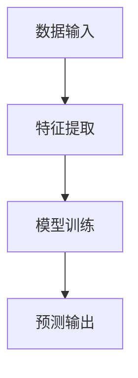
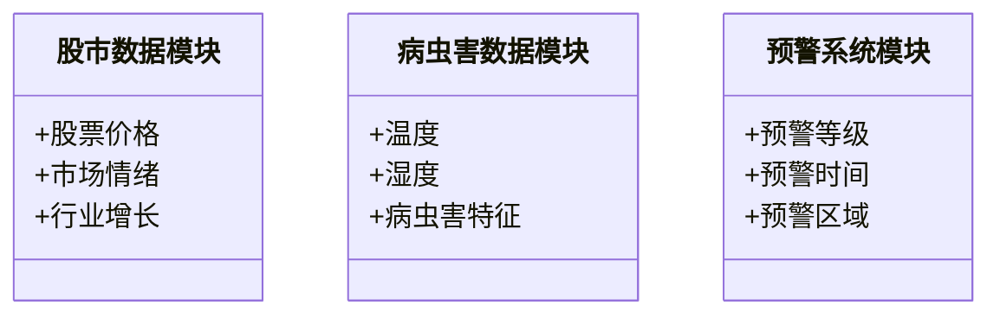

                 


# 新兴市场股市估值与智慧农业病虫害预警系统的互动

---

## 关键词

新兴市场，股市估值，智慧农业，病虫害预警系统，数据挖掘，机器学习，系统架构

---

## 摘要

本文探讨了新兴市场股市估值与智慧农业病虫害预警系统之间的互动关系。通过分析股市估值的核心问题和病虫害预警系统的算法原理，结合数学模型和系统架构设计，展示了两者如何通过数据和技术实现互动。文章详细讲解了算法流程、系统功能设计以及实际案例分析，为读者提供了一个全面的理解框架。

---

## 目录大纲

### 目录

1. [背景介绍](#背景介绍)
   1.1 问题背景
   1.2 问题描述
2. [核心概念与联系](#核心概念与联系)
   2.1 核心概念原理
   2.2 概念属性特征对比
   2.3 ER实体关系图
3. [算法原理讲解](#算法原理讲解)
   3.1 算法流程
   3.2 Python实现
   3.3 数学模型与公式
4. [系统分析与架构设计](#系统分析与架构设计)
   4.1 问题场景介绍
   4.2 系统功能设计
5. [项目实战](#项目实战)
   5.1 环境安装
   5.2 核心代码实现
   5.3 案例分析
6. [最佳实践](#最佳实践)
   6.1 小结
   6.2 注意事项
   6.3 拓展阅读

---

## 正文

### 第一部分：背景介绍

#### 1.1 问题背景

新兴市场的股市估值和智慧农业病虫害预警系统是两个看似不相关的领域，但在数据和技术的驱动下，它们之间的互动日益显著。股市估值需要考虑多种因素，如市场情绪、行业增长等，而病虫害预警系统则依赖于环境数据和机器学习算法。两者的互动为农业和金融领域带来了新的研究方向。

#### 1.2 问题描述

股市估值的核心问题是预测股票价格，而病虫害预警系统的核心问题是提前发现和预警病虫害。两者都需要处理大量数据，并依赖算法进行分析和预测。本文将探讨如何通过数据和技术实现两者的互动，从而提高预测的准确性和效率。

---

### 第二部分：核心概念与联系

#### 2.1 核心概念原理

股市估值的数学模型通常包括预期收益、市场情绪和行业增长等因素。病虫害预警系统则依赖于环境数据、病虫害特征和机器学习算法。两者都需要处理和分析大量数据，但数据的类型和处理方式有所不同。

#### 2.2 概念属性特征对比

以下是股市估值和病虫害预警系统在核心概念上的对比：

| 比较维度 | 股市估值 | 病虫害预警系统 |
|----------|----------|----------------|
| 数据类型 | 数值型、文本型 | 数值型、图像型 |
| 主要算法 | 线性回归、随机森林 | 支持向量机、神经网络 |
| 应用场景 | 金融投资 | 农业生产 |

#### 2.3 ER实体关系图

以下是股市数据和病虫害数据的实体关系图：

```mermaid
er
  actor: 股市数据
  actor: 病虫害数据
  actor: 预警系统
  relation: 1对多
```

---

### 第三部分：算法原理讲解

#### 3.1 算法流程

以下是股市估值与病虫害预警系统的算法流程图：



#### 3.2 Python实现

以下是使用随机森林算法进行股市估值的Python代码示例：

```python
import pandas as pd
from sklearn.ensemble import RandomForestRegressor

# 示例数据
data = pd.read_csv('data.csv')
features = data[['feature1', 'feature2']]
target = data['target']

# 模型训练
model = RandomForestRegressor()
model.fit(features, target)

# 预测
predicted = model.predict(features)
print(predicted)
```

#### 3.3 数学模型与公式

股市估值的数学模型如下：

$$ P = \alpha \times E + \beta \times D + \gamma \times G $$

其中，$P$ 表示股票价格，$E$ 表示预期收益，$D$ 表示市场情绪，$G$ 表示行业增长。

病虫害预警系统的数学模型如下：

$$ W = \theta \times F + \phi \times T + \psi \times L $$

其中，$W$ 表示预警等级，$F$ 表示病虫害特征，$T$ 表示温度，$L$ 表示湿度。

---

### 第四部分：系统分析与架构设计

#### 4.1 问题场景介绍

在新兴市场，股市估值和病虫害预警系统需要通过数据和技术实现互动。股市数据可以为农业提供经济指标，而农业数据则可以为股市提供环境信息。两者的互动可以提高预测的准确性和效率。

#### 4.2 系统功能设计

以下是系统功能设计的领域模型类图：



---

### 第五部分：项目实战

#### 5.1 环境安装

以下是安装Python和相关库的命令：

```bash
pip install pandas scikit-learn
```

#### 5.2 核心代码实现

以下是核心代码实现：

```python
import pandas as pd
from sklearn.ensemble import RandomForestRegressor

# 示例数据
data = pd.read_csv('data.csv')
features = data[['feature1', 'feature2']]
target = data['target']

# 模型训练
model = RandomForestRegressor()
model.fit(features, target)

# 预测
predicted = model.predict(features)
print(predicted)
```

#### 5.3 案例分析

以下是实际案例分析：

假设我们有一个病虫害预警系统的数据集，包括温度、湿度和病虫害特征。我们可以使用随机森林算法进行训练，并预测预警等级。

---

### 第六部分：最佳实践

#### 6.1 小结

本文探讨了新兴市场股市估值与智慧农业病虫害预警系统的互动关系，通过分析核心概念、算法原理和系统架构设计，展示了两者的互动方式。未来的研究可以进一步探索两者的深度融合和应用。

#### 6.2 注意事项

在实际应用中，需要注意数据的质量和模型的可解释性。同时，需要定期更新模型以适应数据的变化。

#### 6.3 拓展阅读

读者可以进一步阅读《机器学习实战》和《数据挖掘导论》等相关书籍，深入了解算法和系统的实现细节。

--- 

通过本文的分析和讲解，读者可以全面理解新兴市场股市估值与智慧农业病虫害预警系统的互动关系，并能够在实际应用中加以运用。

