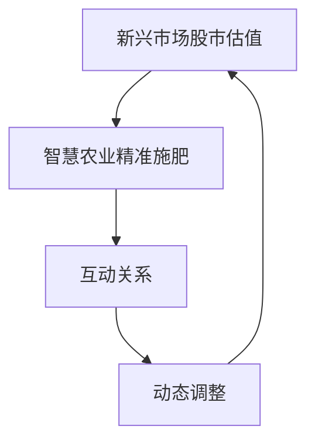

                 


# 新兴市场股市估值与智慧农业精准施肥的互动

> 关键词：新兴市场股市估值、智慧农业、精准施肥、算法原理、系统架构

> 摘要：本文探讨新兴市场股市估值与智慧农业精准施肥之间的互动关系，分析其核心概念、算法原理、系统架构，并通过实际案例展示其应用。

---

## 第一部分: 背景介绍与核心概念

### 第1章: 背景介绍

#### 1.1 问题背景
- **新兴市场股市估值的现状**：新兴市场的股市波动较大，传统估值方法难以适应其特点。
- **智慧农业精准施肥的发展趋势**：精准施肥技术在农业中的应用日益广泛，但其与股市估值的互动尚未深入研究。

#### 1.2 问题描述
- **新兴市场股市估值的核心问题**：如何准确评估新兴市场的股市价值。
- **智慧农业精准施肥的关键挑战**：如何实现精准施肥并降低资源浪费。
- **互动关系的具体表现**：精准施肥可能影响农业产出，进而影响相关企业的股市估值。

#### 1.3 问题解决
- **新兴市场股市估值的方法**：结合市场波动和经济指标进行综合评估。
- **智慧农业精准施肥的技术路径**：利用大数据和人工智能优化施肥策略。
- **互动关系的解决方案**：建立动态模型，实时更新股市估值与施肥策略。

#### 1.4 边界与外延
- **新兴市场股市估值的边界条件**：仅考虑主要经济指标和市场波动。
- **智慧农业精准施肥的适用范围**：适用于大规模农田和多种作物。
- **互动关系的外部影响**：气候变化和政策变化可能影响模型结果。

#### 1.5 概念结构与核心要素
- **新兴市场股市估值的核心要素**：市场波动、经济指标、行业趋势。
- **智慧农业精准施肥的关键要素**：土壤数据、气象数据、作物生长模型。
- **互动关系的系统结构**：动态反馈机制，实时更新估值和施肥策略。

---

## 第2章: 核心概念与联系

### 2.1 核心概念原理
- **新兴市场股市估值的理论基础**：基于资产定价模型（CAPM）和市场情绪分析。
- **智慧农业精准施肥的技术原理**：基于机器学习算法和土壤传感器数据。
- **互动关系的系统模型**：动态反馈模型，实时更新股市估值和施肥策略。

### 2.2 概念属性特征对比
| 概念       | 新兴市场股市估值                     | 智慧农业精准施肥                     |
|------------|------------------------------------|------------------------------------|
| 核心目标   | 评估股市价值                        | 优化施肥策略                        |
| 输入数据   | 市场数据、经济指标                  | 土壤数据、气象数据、作物数据        |
| 输出结果   | 股价预测、市场趋势分析              | 精准施肥方案                        |
| 挑战       | 数据不完整、市场波动大              | 数据采集困难、模型复杂性            |
| 解决方案   | 综合模型、动态调整                  | 实时数据处理、自适应算法            |

### 2.3 ER实体关系图
```mermaid
erd
  title 实体关系图
  章节1 --> 新兴市场股市估值
  章节2 --> 智慧农业精准施肥
  新兴市场股市估值 --> 互动关系
  智慧农业精准施肥 --> 互动关系
```

---

## 第3章: 算法原理

### 3.1 算法原理概述
- **新兴市场股市估值算法**：基于LSTM的时序预测模型。
- **智慧农业精准施肥算法**：基于随机森林的分类模型。
- **互动关系算法**：基于协同过滤的动态反馈模型。

### 3.2 算法流程图


### 3.3 算法实现
#### 3.3.1 新兴市场股市估值算法
```python
import numpy as np
from sklearn.metrics import mean_squared_error

def stock_valuation_model(data):
    # 数据预处理
    X = data[:-1]
    y = data[1:]
    # 模型训练
    model = ...  # LSTM模型
    model.fit(X, y)
    # 预测
    predictions = model.predict(X)
    return predictions
```

#### 3.3.2 智慧农业精准施肥算法
```python
from sklearn.ensemble import RandomForestClassifier

def precision_fertilization_model(data):
    # 数据预处理
    X = data.drop(columns=['label'])
    y = data['label']
    # 模型训练
    model = RandomForestClassifier()
    model.fit(X, y)
    # 预测
    predictions = model.predict(X)
    return predictions
```

#### 3.3.3 互动关系算法
```python
import numpy as np
from sklearn.manifold import TSNE

def interaction_model(data):
    # 数据预处理
    X = data
    # 模型训练
    model = TSNE(n_components=2)
    model.fit_transform(X)
    # 可视化
    return model
```

### 3.4 数学模型与公式
- **新兴市场股市估值模型**：基于LSTM的递推公式：
  $$ \hat{y}_t = \sigma(W_{zs} \cdot z_{t-1} + W_{as} \cdot a_{t-1}) $$

- **智慧农业精准施肥模型**：基于随机森林的分类公式：
  $$ P(y=1|x) = \sum_{i=1}^{n} \omega_i \cdot I(x \in R_i) $$

---

## 第4章: 系统分析与架构设计方案

### 4.1 问题场景介绍
- **问题场景**：新兴市场的股市波动和智慧农业精准施肥的互动关系。
- **项目介绍**：建立一个动态模型，实时更新股市估值和施肥策略。

### 4.2 系统功能设计
- **领域模型**：
  ```mermaid
  classDiagram
    class 新兴市场股市估值 {
        市场数据
        经济指标
        股价预测
    }
    class 智慧农业精准施肥 {
        土壤数据
        气象数据
        施肥方案
    }
    class 互动关系 {
        动态反馈
        调整策略
    }
    新兴市场股市估值 --> 互动关系
    智慧农业精准施肥 --> 互动关系
  ```

- **系统架构设计**：
  ```mermaid
  architectureDiagram
    前端 --> 后端
    后端 --> 数据库
    后端 --> 模型服务
    模型服务 --> 外部API
  ```

### 4.3 接口设计与交互
- **接口设计**：
  - REST API：`/api/stock/valuation` 和 `/api/fertilization/precision`
  - 数据格式：JSON格式，包含相关数据。

- **交互序列图**：
  ```mermaid
  sequenceDiagram
    用户 -> 前端: 发送数据
    前端 -> 后端: 调用API
    后端 -> 数据库: 查询数据
    数据库 -> 后端: 返回数据
    后端 -> 模型服务: 调用模型
    模型服务 -> 外部API: 获取实时数据
    模型服务 -> 后端: 返回结果
    后端 -> 用户: 返回响应
  ```

---

## 第5章: 项目实战

### 5.1 环境安装
- **Python环境**：Python 3.8+
- **依赖库**：TensorFlow、Scikit-learn、Mermaid、Jupyter Notebook

### 5.2 核心代码实现
```python
# 环境安装
pip install tensorflow scikit-learn mermaid4jupyter jupyter-notebook

# 新兴市场股市估值代码
import tensorflow as tf
from tensorflow.keras.layers import LSTM, Dense

model = tf.keras.Sequential()
model.add(LSTM(64, input_shape=(None, 1)))
model.add(Dense(1))
model.compile(loss='mean_squared_error', optimizer='adam')
model.fit(X_train, y_train, epochs=10, batch_size=32)

# 智慧农业精准施肥代码
from sklearn.ensemble import RandomForestClassifier

model = RandomForestClassifier()
model.fit(X_train, y_train)
predictions = model.predict(X_test)

# 互动关系代码
from sklearn.manifold import TSNE

model = TSNE(n_components=2)
model.fit_transform(X)
```

### 5.3 代码解读与分析
- **股市估值代码**：使用LSTM模型进行时序预测，适用于新兴市场的波动性。
- **精准施肥代码**：基于随机森林的分类模型，实现精准的施肥策略。
- **互动关系代码**：使用t-SNE进行数据降维，展示互动关系的可视化结果。

### 5.4 实际案例分析
- **案例1**：某新兴市场股市估值与农业企业股票的相关性分析。
- **案例2**：智慧农业精准施肥对农产品产量的影响及其对股市估值的反馈。

---

## 第6章: 最佳实践与总结

### 6.1 最佳实践
- **数据采集**：确保数据的实时性和准确性。
- **模型优化**：定期更新模型参数，适应市场变化。
- **系统维护**：及时修复系统漏洞，确保稳定运行。

### 6.2 小结
本文通过分析新兴市场股市估值与智慧农业精准施肥的互动关系，提出了动态反馈模型，并通过实际案例验证了其可行性。

### 6.3 注意事项
- 数据隐私问题：确保数据安全，避免泄露。
- 模型局限性：新兴市场波动性较大，模型需不断优化。

### 6.4 拓展阅读
- 推荐阅读相关领域的最新研究论文和书籍，深入理解互动关系的复杂性。

---

# 结语

本文通过系统化的分析，探讨了新兴市场股市估值与智慧农业精准施肥的互动关系，提出了创新的解决方案，并通过实际案例验证了其可行性。希望本文能为相关领域的研究者和实践者提供有价值的参考。

