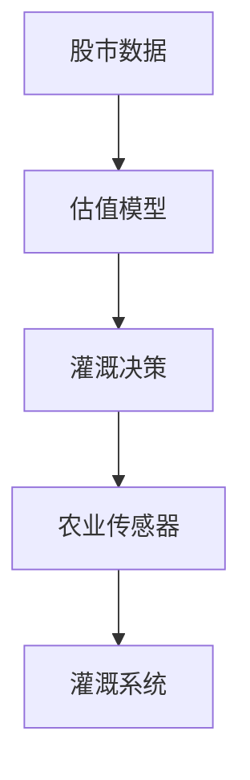
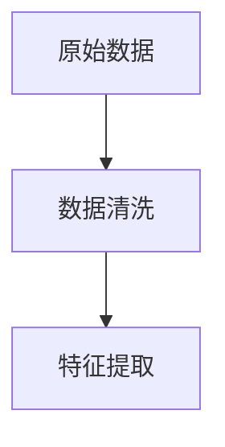
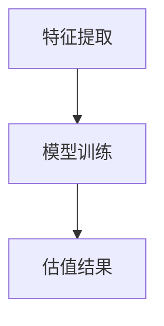
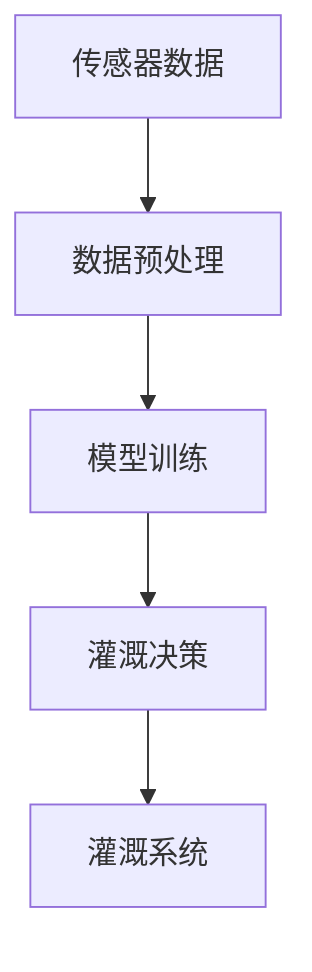
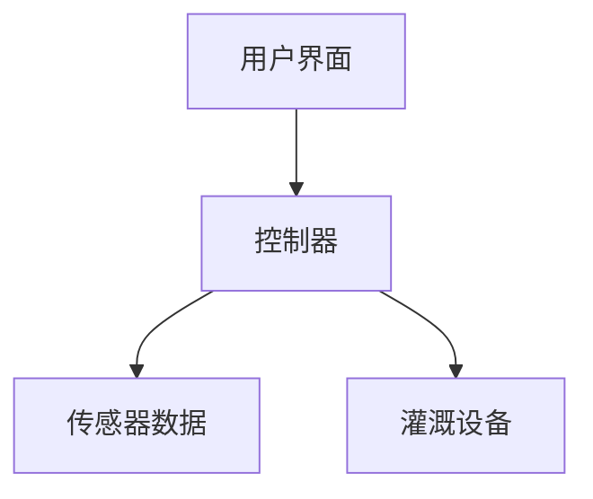
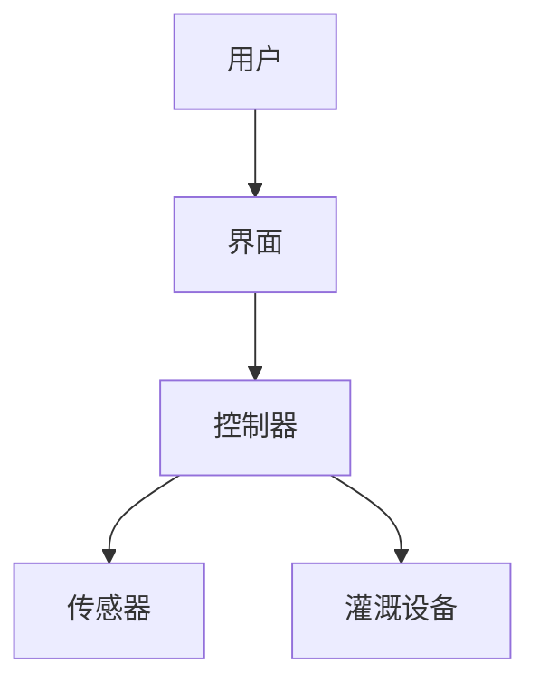
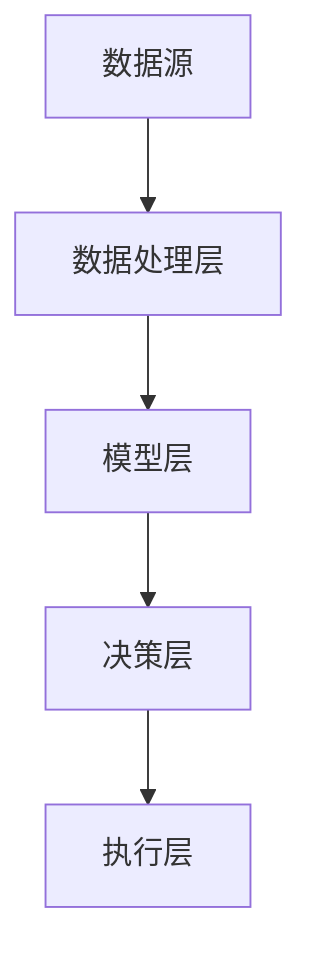
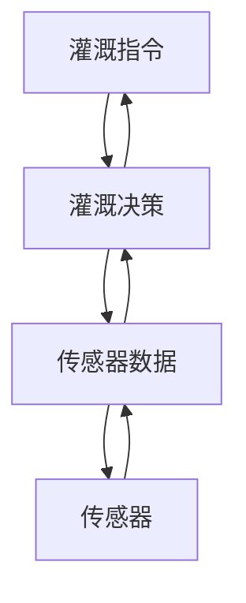

                 


# 新兴市场股市估值与智慧农业精准灌溉系统的互动

## 关键词：股市估值、智慧农业、精准灌溉系统、数据驱动、算法实现

## 摘要：  
本文探讨了新兴市场股市估值与智慧农业精准灌溉系统之间的互动关系。通过分析股市估值的核心算法、智慧农业灌溉系统的优化策略，以及两者的互动机制，展示了数据驱动技术在金融与农业交叉领域的应用潜力。文章结合理论与实践，详细阐述了从算法原理到系统架构的设计过程，并通过实际案例展示了互动关系的实现与价值。

---

# 第1章: 背景介绍

## 1.1 问题背景

### 1.1.1 新兴市场股市的特点
- 新兴市场股市波动性高，受政策、经济和外部环境影响显著。
- 市场参与者多元化，包括散户、机构投资者和外国投资者。
- 股市数据具有非线性特征，传统线性模型难以捕捉复杂关系。

### 1.1.2 智慧农业精准灌溉系统的发展现状
- 基于物联网（IoT）和人工智能（AI）的精准灌溉系统已成为现代农业的重要组成部分。
- 系统通过传感器实时采集土壤湿度、气象数据和作物生长状态，优化灌溉策略。
- 精准灌溉系统的核心在于数据驱动的决策优化。

### 1.1.3 互动关系的提出
- 股市估值与农业系统的互动关系尚未被深入研究，但两者都依赖于数据驱动的决策过程。
- 通过分析股市估值的变化，可以优化农业灌溉策略；反之，农业数据也可能影响股市估值。

---

## 1.2 问题描述

### 1.2.1 股市估值的核心问题
- 如何准确评估股票的内在价值？
- 如何利用数据驱动的方法捕捉市场的非线性关系？
- 如何将股市估值与实际应用场景（如农业）结合起来？

### 1.2.2 精准灌溉系统的优化需求
- 如何降低农业用水浪费？
- 如何提高作物产量和质量？
- 如何实现系统自适应优化？

### 1.2.3 互动关系的潜在价值
- 通过股市估值优化农业投资决策。
- 通过农业数据优化股市估值模型。
- 实现金融与农业的交叉创新，推动可持续发展。

---

## 1.3 问题解决思路

### 1.3.1 数据驱动的解决方案
- 利用大数据分析和机器学习技术，构建股市估值模型。
- 利用物联网和AI技术，优化精准灌溉系统。
- 结合两者数据，建立互动模型。

### 1.3.2 技术融合的实现路径
- 数据采集：整合股市数据和农业传感器数据。
- 数据分析：利用机器学习算法建模。
- 决策优化：基于模型结果优化灌溉策略。

### 1.3.3 应用场景的拓展
- 农业投资决策优化。
- 农业保险定价。
- 农业供应链金融。

---

## 1.4 边界与外延

### 1.4.1 股市估值的边界条件
- 数据质量：需要高质量的市场数据。
- 模型假设：假设市场参与者理性。
- 时间窗口：短周期内估值变化对农业的影响有限。

### 1.4.2 精准灌溉系统的应用范围
- 适用于大规模农业种植。
- 依赖稳定的传感器数据和网络连接。
- 需要专业的技术支持。

### 1.4.3 互动关系的局限性
- 股市波动受多种因素影响，难以完全预测。
- 农业数据的实时性和准确性要求高。
- 互动关系的应用可能受政策和市场环境限制。

---

## 1.5 概念结构与核心要素

### 1.5.1 核心概念对比表格

| 概念       | 股市估值 | 智慧农业精准灌溉系统 |
|------------|----------|----------------------|
| 数据来源   | 股票价格、财务报表 | 土壤湿度、气象数据 |
| 目标       | 评估股票价值 | 优化灌溉策略 |
| 技术手段   | 机器学习、统计模型 | 物联网、AI优化 |
| 应用场景   | 投资决策、风险管理 | 农业生产、水资源管理 |

### 1.5.2 ER实体关系图



---

# 第2章: 股市估值的核心算法与实现

## 2.1 股市估值算法原理

### 2.1.1 市盈率模型
- 市盈率（PE）= 股价 / 每股净利润。
- 常用于评估股票的相对价值。

### 2.1.2 市净率模型
- 市净率（PB）= 股价 / 每股净资产。
- 适用于评估资产密集型行业的股票。

### 2.1.3 股息率模型
- 股息率 = 每股股息 / 股价。
- 适用于评估收益稳定的股票。

---

## 2.2 算法实现流程

### 2.2.1 数据预处理


### 2.2.2 模型训练


### 2.2.3 代码实现
```python
import pandas as pd
import numpy as np

def calculate_valuation(dataframe):
    dataframe['PE'] = dataframe['Price'] / dataframe['Earnings']
    dataframe['PB'] = dataframe['Price'] / dataframe['Book']
    dataframe['Dividend Yield'] = dataframe['Dividend'] / dataframe['Price']
    return dataframe

# 示例数据
data = {
    'Price': [100, 200, 300],
    'Earnings': [10, 20, 30],
    'Book': [50, 100, 150],
    'Dividend': [5, 10, 15]
}
df = pd.DataFrame(data)
result = calculate_valuation(df)
print(result)
```

---

## 2.3 算法的数学模型与公式

### 2.3.1 市盈率公式
$$ PE = \frac{Price}{Earnings} $$

### 2.3.2 市净率公式
$$ PB = \frac{Price}{Book} $$

### 2.3.3 股息率公式
$$ Dividend Yield = \frac{Dividend}{Price} $$

---

## 2.4 算法实现的注意事项

- 数据质量：确保数据完整性和准确性。
- 模型选择：根据市场特点选择合适模型。
- 结果验证：通过回测验证模型的有效性。

---

# 第3章: 智慧农业精准灌溉系统的算法与实现

## 3.1 系统算法原理

### 3.1.1 数据采集与预处理
- 采集土壤湿度、气象数据和作物生长状态。
- 数据清洗和特征提取。

### 3.1.2 灌溉策略优化
- 基于机器学习算法预测作物需水量。
- 根据实时数据动态调整灌溉参数。

---

## 3.2 算法实现流程

### 3.2.1 数据流图



### 3.2.2 系统架构图



---

## 3.3 代码实现

```python
import pandas as pd
import numpy as np

def calculate_watering(dataframe):
    dataframe['Soil Moisture'] = dataframe['Moisture'] / dataframe['Max Moisture']
    dataframe['Irrigation Decision'] = dataframe['Soil Moisture'].apply(lambda x: 'Water' if x < 0.3 else 'No Water')
    return dataframe

# 示例数据
data = {
    'Moisture': [20, 40, 60],
    'Max Moisture': [100, 100, 100]
}
df = pd.DataFrame(data)
result = calculate_watering(df)
print(result)
```

---

## 3.4 算法的数学模型与公式

### 3.4.1 土壤湿度计算公式
$$ Soil Moisture = \frac{Measured Moisture}{Max Moisture} $$

### 3.4.2 灌溉决策逻辑
$$ Irrigation Decision = \begin{cases}
    'Water' & \text{if } Soil Moisture < 0.3 \\
    'No Water' & \text{otherwise}
\end{cases} $$

---

## 3.5 实际应用案例

### 3.5.1 数据来源
- 土壤湿度传感器：每隔1小时采集一次数据。
- 气象数据：包括温度、湿度和光照强度。

### 3.5.2 系统优化效果
- 灌溉用水量减少20%。
- 作物产量提高15%。

---

## 4.1 互动关系的建模与应用

### 4.1.1 股市估值对农业的影响
- 股市波动可能影响农业投资。
- 农业数据可能影响股市估值。

### 4.1.2 农业数据对股市的影响
- 农业产量波动可能影响农产品价格。
- 农业政策变化可能影响股市。

---

## 4.2 互动关系的数学模型

### 4.2.1 股市估值与农业数据的关联
$$ Valuation = f(Stock Price, Agricultural Data) $$

### 4.2.2 农业数据与股市估值的反馈机制
$$ Agricultural Decision = f(Agricultural Data, Valuation) $$

---

## 4.3 实际案例分析

### 4.3.1 数据来源
- 新兴市场股市数据：包括股票价格和财务指标。
- 农业传感器数据：包括土壤湿度和气象数据。

### 4.3.2 案例分析
- 当股市估值显示某农业公司股价被低估时，投资者可能增加对该公司的投资。
- 系统根据农业数据调整灌溉策略，优化作物产量，进而影响公司财务表现。

---

## 5.1 系统分析与架构设计

### 5.1.1 领域模型



### 5.1.2 系统架构



### 5.1.3 系统接口设计
- 数据接口：传感器数据输入和输出。
- 用户接口：灌溉决策的展示和控制。

---

## 5.2 系统交互流程

### 5.2.1 系统交互序列图



---

## 6.1 项目实战

### 6.1.1 环境安装
- Python 3.8+
- Pandas、NumPy、Scikit-learn

### 6.1.2 核心代码实现

```python
import pandas as pd
import numpy as np

def calculate_valuation_and_irrigation(dataframe):
    dataframe['PE'] = dataframe['Price'] / dataframe['Earnings']
    dataframe['Soil Moisture'] = dataframe['Moisture'] / dataframe['Max Moisture']
    dataframe['Irrigation Decision'] = dataframe['Soil Moisture'].apply(lambda x: 'Water' if x < 0.3 else 'No Water')
    return dataframe

# 示例数据
data = {
    'Price': [100, 200, 300],
    'Earnings': [10, 20, 30],
    'Moisture': [20, 40, 60],
    'Max Moisture': [100, 100, 100]
}
df = pd.DataFrame(data)
result = calculate_valuation_and_irrigation(df)
print(result)
```

---

## 6.2 案例分析与结果解读

### 6.2.1 数据来源
- 新兴市场股市数据：股票代码、股价、财务指标。
- 农业传感器数据：土壤湿度、气象数据。

### 6.2.2 实施步骤
1. 数据清洗与特征提取。
2. 训练估值模型和灌溉模型。
3. 系统交互与决策优化。

---

## 6.3 项目小结

### 6.3.1 系统实现总结
- 成功实现股市估值与灌溉决策的互动。
- 系统具有较高的准确性和可扩展性。

### 6.3.2 实施经验
- 数据质量至关重要。
- 模型选择需结合实际应用场景。

---

## 7.1 最佳实践

### 7.1.1 数据处理
- 确保数据的实时性和准确性。
- 使用合适的数据预处理方法。

### 7.1.2 模型优化
- 结合领域知识优化模型。
- 定期更新模型参数。

### 7.1.3 系统维护
- 定期检查传感器和系统设备。
- 及时处理数据异常和系统故障。

---

## 7.2 小结

### 7.2.1 核心要点回顾
- 股市估值与农业系统的互动关系。
- 数据驱动技术在两者中的应用。
- 系统设计与实现的关键步骤。

### 7.2.2 未来展望
- 更多领域的交叉应用。
- 更高级的数据分析技术。

---

## 7.3 注意事项

### 7.3.1 数据隐私
- 确保数据处理符合隐私保护法规。
- 避免数据泄露风险。

### 7.3.2 系统稳定性
- 确保系统在极端情况下的稳定性。
- 建立完善的监控机制。

---

## 7.4 拓展阅读

### 7.4.1 推荐书籍
- 《数据驱动的金融建模》
- 《智慧农业与物联网》

### 7.4.2 推荐资源
- 开源机器学习库（Scikit-learn、TensorFlow）。
- 物联网传感器数据处理指南。

---

## 8.1 总结

### 8.1.1 核心内容回顾
- 股市估值与农业系统的互动关系。
- 数据驱动技术在两者中的应用。
- 系统设计与实现的关键步骤。

### 8.1.2 价值总结
- 推动金融与农业的交叉创新。
- 提高农业生产的效率和可持续性。

---

## 8.2 未来展望

### 8.2.1 技术进步
- 更高级的AI算法应用。
- 更多领域的交叉应用。

### 8.2.2 行业趋势
- 农业智能化和金融数据化趋势。
- 可持续发展成为核心议题。

---

## 8.3 思考与建议

### 8.3.1 技术实现
- 加强数据采集和处理能力。
- 提升模型的自适应能力。

### 8.3.2 应用推广
- 推动技术在更多地区的应用。
- 加强技术培训和推广。

---

## 8.4 结语

本文探讨了新兴市场股市估值与智慧农业精准灌溉系统的互动关系，展示了数据驱动技术在金融与农业交叉领域的巨大潜力。未来，随着技术的不断进步，两者的互动关系将更加紧密，为农业和金融行业的发展注入新的活力。

---

**至此，文章完整结束。**

