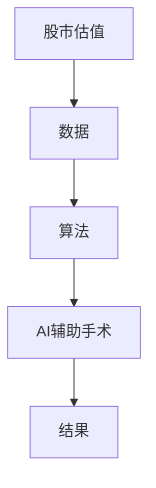
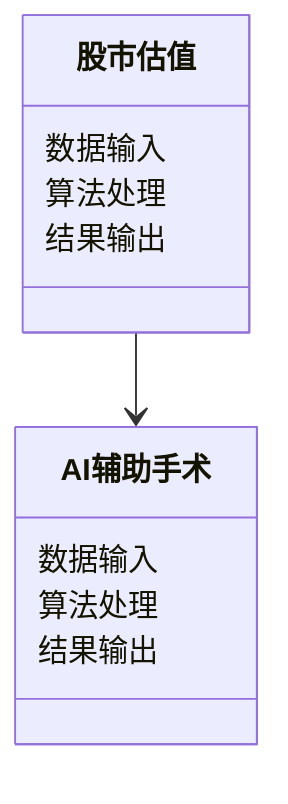

                 


# 新兴市场股市估值与智慧医疗AI辅助手术的互动

## 关键词：新兴市场、股市估值、智慧医疗、AI辅助手术、技术互动

## 摘要：  
本文探讨新兴市场股市估值与智慧医疗AI辅助手术之间的互动关系，分析其背景、核心概念、算法原理、系统架构及项目实战。通过详细分析，揭示两者在数据共享、技术融合及应用场景中的协同效应，为读者提供深度的技术见解。

---

## 第一部分：背景介绍

### 第1章：新兴市场股市估值的背景与现状

#### 1.1 新兴市场的定义与特点
- **1.1.1 新兴市场的定义**：新兴市场指经济快速增长但尚未达到发达水平的国家，如中国、印度等。
- **1.1.2 新兴市场的经济特点**：人口众多、经济增长快、市场潜力大。
- **1.1.3 新兴市场股市的独特性**：波动性高、市场参与者多元化。

#### 1.2 股市估值的基本概念
- **1.2.1 股市估值的定义**：通过分析公司基本面、市场情绪等因素，评估股票价格。
- **1.2.2 股市估值的主要方法**：市盈率、市净率、现金流折现法等。
- **1.2.3 股市估值的影响因素**：宏观经济、行业趋势、公司业绩等。

#### 1.3 智慧医疗AI辅助手术的背景
- **1.3.1 智慧医疗的定义**：利用AI、大数据等技术提升医疗服务效率。
- **1.3.2 AI在医疗领域的应用现状**：辅助诊断、药物研发、手术规划等。
- **1.3.3 AI辅助手术的核心技术**：计算机视觉、自然语言处理、机器人技术。

---

### 第2章：新兴市场股市估值与智慧医疗AI辅助手术的互动关系

#### 2.1 互动关系的定义
- **2.1.1 互动关系的内涵**：两者通过数据共享和技术融合相互影响。
- **2.1.2 互动关系的外延**：从技术到应用的全方位互动。
- **2.1.3 互动关系的核心要素**：数据、算法、应用场景。

#### 2.2 互动关系的背景分析
- **2.2.1 新兴市场股市的波动性**：经济不确定性导致股市波动。
- **2.2.2 智慧医疗技术的发展趋势**：AI技术在医疗中的广泛应用。
- **2.2.3 互动关系的驱动因素**：技术创新、政策支持、市场需求。

#### 2.3 互动关系的现状与挑战
- **2.3.1 现有互动模式的分析**：数据孤岛、技术壁垒等问题。
- **2.3.2 互动关系中的主要问题**：数据隐私、技术标准不统一。
- **2.3.3 互动关系的未来展望**：技术融合、数据共享、协同创新。

---

## 第二部分：核心概念与联系

### 第3章：股市估值与智慧医疗AI辅助手术的核心概念与联系

#### 3.1 核心概念的定义与属性对比
- **3.1.1 股市估值的核心概念**：通过技术分析和基本面分析评估股票价值。
- **3.1.2 AI辅助手术的核心概念**：利用AI技术提高手术精准度和安全性。
- **3.1.3 核心概念的对比分析**：数据驱动、技术融合、应用场景差异。

#### 3.2 实体关系图


---

## 第三部分：算法原理

### 第4章：股市估值的算法原理

#### 4.1 算法原理
- **4.1.1 时间序列分析**：ARIMA模型用于预测股市走势。
- **4.1.2 机器学习模型**：随机森林、神经网络用于分类和回归。

#### 4.2 算法实现
```python
from statsmodels.tsa.arima.model import ARIMA

# 示例代码：使用ARIMA模型预测股市走势
data = [100, 105, 110, 115, 120]  # 示例数据
model = ARIMA(data, order=(1, 1, 1))
model_fit = model.fit()

# 预测未来值
next_value = model_fit.forecast(steps=1)
print(next_value)
```

### 第5章：AI辅助手术的算法原理

#### 5.1 算法原理
- **5.1.1 计算机视觉**：使用卷积神经网络（CNN）识别医学影像。
- **5.1.2 自然语言处理**：分析医疗文献，提取有用信息。

#### 5.2 算法实现
```python
import tensorflow as tf
from tensorflow.keras import layers

# 示例代码：使用CNN进行医学影像分类
model = tf.keras.Sequential([
    layers.Conv2D(32, (3,3), activation='relu', input_shape=(224, 224, 3)),
    layers.MaxPooling2D((2,2)),
    layers.Conv2D(64, (3,3), activation='relu'),
    layers.MaxPooling2D((2,2)),
    layers.Flatten(),
    layers.Dense(64, activation='relu'),
    layers.Dense(2, activation='sigmoid')
])
model.compile(optimizer='adam', loss='binary_crossentropy', metrics=['accuracy'])
model.summary()
```

---

## 第四部分：系统分析与架构设计

### 第6章：系统分析与架构设计方案

#### 6.1 问题场景介绍
- **问题场景**：新兴市场股市波动与医疗AI应用的协同优化。

#### 6.2 领域模型


#### 6.3 系统架构设计


---

## 第五部分：项目实战

### 第7章：项目实战

#### 7.1 环境安装
- **安装Python和相关库**：numpy、pandas、tensorflow等。

#### 7.2 核心实现
- **股市估值模型**：使用ARIMA模型进行预测。
- **AI辅助手术模型**：使用CNN进行影像分类。

#### 7.3 实际案例分析
- **案例1**：新兴市场股市波动对AI医疗应用的影响。
- **案例2**：AI技术在医疗手术中的具体应用。

---

## 第六部分：最佳实践

### 第8章：总结与展望

#### 8.1 总结
- 股市估值与AI辅助手术的互动关系在数据共享和技术融合中体现。
- 通过算法优化和系统设计，可以实现协同效应。

#### 8.2 展望
- 技术融合将推动股市估值和AI医疗的进一步发展。
- 数据共享和隐私保护将是未来的重要课题。

---

通过以上结构，本文详细分析了新兴市场股市估值与智慧医疗AI辅助手术的互动关系，从背景、算法、系统设计到项目实战，为读者提供了全面的技术见解。

