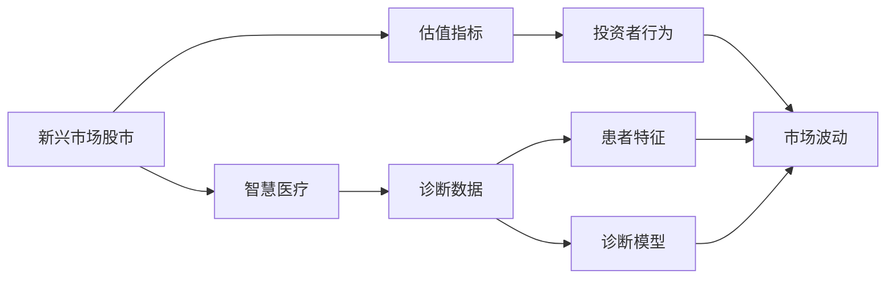
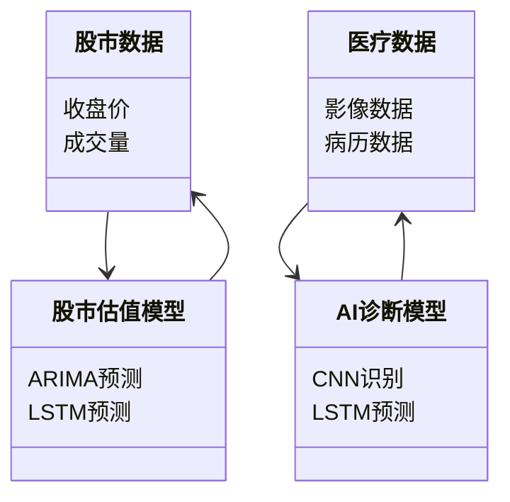
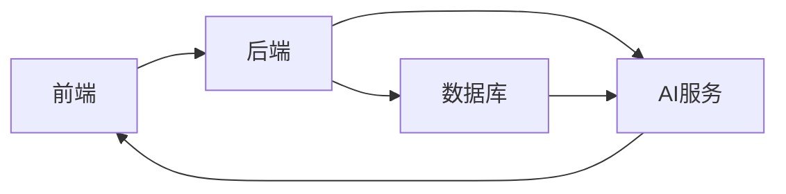
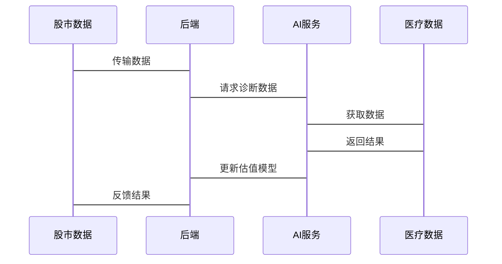

                 


# 新兴市场股市估值与智慧医疗AI辅助诊断系统的互动

> 关键词：新兴市场，股市估值，智慧医疗，AI辅助诊断，数据共享

> 摘要：本文探讨新兴市场股市估值与智慧医疗AI辅助诊断系统的互动关系，分析两者在数据共享、算法协同等方面的应用，提出互动机制的设计与实现方法。

---

## 第1章: 背景介绍

### 1.1 问题背景

#### 1.1.1 新兴市场股市估值的现状与挑战
新兴市场股市通常波动较大，受到经济政策、市场情绪等多种因素影响。传统估值方法难以捕捉市场的复杂性，导致估值误差较大。投资者需要更精准的工具来评估股市风险和收益。

#### 1.1.2 智慧医疗AI辅助诊断系统的应用前景
AI技术在医疗领域的应用日益广泛，尤其是在图像识别、辅助诊断和个性化治疗方面。AI系统能够提高诊断效率和准确性，但其性能依赖于高质量的医疗数据和算法优化。

#### 1.1.3 两者的互动关系与研究意义
新兴市场的股市波动可能影响医疗企业的融资和扩张，而智慧医疗的发展又依赖于资本市场的支持。通过分析两者的互动，可以找到优化股市估值和提升医疗AI性能的双赢策略。

### 1.2 问题描述

#### 1.2.1 新兴市场股市估值的核心问题
- 如何准确预测股市波动？
- 如何量化市场情绪对估值的影响？
- 如何构建动态调整的估值模型？

#### 1.2.2 智慧医疗AI辅助诊断系统的痛点
- 数据隐私问题限制数据共享
- 算法泛化能力不足，难以应对多样化的医疗场景
- 计算资源不足，难以处理实时数据

#### 1.2.3 互动机制的初步探讨
通过数据共享和算法协同，新兴市场股市的波动数据可以为医疗AI提供实时反馈，而医疗AI的优化结果又可以反过来影响股市估值模型。

### 1.3 问题解决思路

#### 1.3.1 数据驱动的解决方案
利用大数据分析技术，整合股市数据和医疗数据，构建跨领域的数据挖掘模型。

#### 1.3.2 AI技术在两者中的应用
采用机器学习算法，分别对股市和医疗数据进行建模，挖掘潜在关联。

#### 1.3.3 互动机制的设计与实现
设计数据共享接口和协同优化算法，实现两者之间的动态交互。

### 1.4 边界与外延

#### 1.4.1 新兴市场股市估值的边界条件
- 数据范围：新兴市场的特定股票指数和相关经济指标
- 时间范围：短期内的市场波动预测
- 参与主体：投资者、金融机构和政府监管

#### 1.4.2 智慧医疗AI辅助诊断系统的应用范围
- 数据类型：医疗影像、患者病历和诊断结果
- 用户群体：医生、患者和保险公司
- 技术限制：AI系统的硬件和软件依赖

### 1.5 核心要素组成

#### 1.5.1 股市估值的关键指标
- 涨跌幅、市盈率、市净率、成交量

#### 1.5.2 AI辅助诊断的核心技术
- 图像识别、自然语言处理、预测模型

#### 1.5.3 互动机制的核心要素
- 数据接口、协同算法、反馈机制

---

## 第2章: 核心概念与联系

### 2.1 核心概念原理

#### 2.1.1 股市估值的数学模型
- 时间序列模型（如ARIMA）用于预测市场趋势
- 主成分分析用于提取关键经济指标

#### 2.1.2 AI辅助诊断系统的算法原理
- 卷积神经网络（CNN）用于医疗影像识别
- 长短期记忆网络（LSTM）用于时序医疗数据分析

#### 2.1.3 互动机制的理论基础
- 跨领域数据融合
- 多目标优化算法

### 2.2 核心概念对比分析

#### 2.2.1 股市估值与AI诊断系统的属性对比

| 属性 | 股市估值 | AI诊断系统 |
|------|---------|------------|
| 数据类型 | 时间序列、数值型 | 图像、文本、结构化数据 |
| 模型目标 | 预测价格波动 | 辅助诊断决策 |
| 数据量 | 中等规模 | 大规模 |

#### 2.2.2 数据特征的差异与共性
- 数据差异：股市数据高频波动，医疗数据低频但高隐私
- 数据共性：都需要处理缺失值和异常值

#### 2.2.3 算法特点的对比分析
- 股市估值算法注重预测精度和实时性
- AI诊断算法注重准确率和可解释性

### 2.3 实体关系图



---

## 第3章: 算法原理与数学模型

### 3.1 股市估值算法

#### 3.1.1 ARIMA模型
- 时间序列预测模型
- 数学表达式：$$ARIMA(p, d, q)$$
- 示例：预测某股票指数的未来走势

```python
# ARIMA模型实现
from statsmodels.tsa.arima_model import ARIMA

data = [收盘价数据]
model = ARIMA(data, order=(5,1,0))
model_fit = model.fit()
预测结果 = model_fit.forecast(steps=5)
```

#### 3.1.2 LSTM网络
- 长短期记忆网络
- 数学表达式：$$ LSTM(t, h_{t-1}, c_{t-1}) = (f_t, i_t, o_t) $$

```python
import tensorflow as tf
from tensorflow.keras.layers import LSTM

输入数据 = [时间序列数据]
lstm_layer = LSTM(64, return_sequences=True)(输入数据)
```

### 3.2 AI诊断算法

#### 3.2.1 CNN模型
- 图像识别模型
- 数学表达式：$$ Convolution(x, k) = \sum_{i=1}^{n} w[i] \cdot x[i] + b $$

```python
import tensorflow as tf
from tensorflow.keras.layers import Conv2D

输入图像 = [医疗影像数据]
conv_layer = Conv2D(32, (3,3), activation='relu')(输入图像)
```

#### 3.2.2 协同优化算法
- 数据共享机制
- 联合训练策略
- 数学表达式：$$ \theta = \arg \max(\mathcal{L}_1 + \mathcal{L}_2) $$

---

## 第4章: 数学模型与公式

### 4.1 股市估值模型

#### 4.1.1 ARIMA模型公式
$$ ARIMA(p, d, q) = \phi(B) \cdot (1 - B)^d \cdot \theta(B)^{-1} \cdot W_t $$

#### 4.1.2 LSTM模型公式
$$ LSTM(t, h_{t-1}, c_{t-1}) = (f_t, i_t, o_t) $$

### 4.2 AI诊断模型

#### 4.2.1 CNN模型公式
$$ Convolution(x, k) = \sum_{i=1}^{n} w[i] \cdot x[i] + b $$

#### 4.2.2 协同优化公式
$$ \theta = \arg \max(\mathcal{L}_1 + \mathcal{L}_2) $$

---

## 第5章: 系统分析与架构设计

### 5.1 问题场景介绍
新兴市场股市与智慧医疗系统的数据交互场景，包括数据采集、处理和分析。

### 5.2 系统功能设计

#### 5.2.1 领域模型设计



### 5.3 系统架构设计



### 5.4 系统接口设计

#### 5.4.1 数据接口
- 股市数据接口：REST API
- 医疗数据接口：SOAP协议

#### 5.4.2 交互流程


---

## 第6章: 项目实战

### 6.1 环境安装

#### 6.1.1 安装Python和相关库
```bash
pip install numpy pandas scikit-learn tensorflow
```

### 6.2 核心代码实现

#### 6.2.1 ARIMA模型实现
```python
from statsmodels.tsa.arima_model import ARIMA
data = [收盘价数据]
model = ARIMA(data, order=(5,1,0))
model_fit = model.fit()
预测结果 = model_fit.forecast(steps=5)
```

#### 6.2.2 CNN模型实现
```python
import tensorflow as tf
from tensorflow.keras.layers import Conv2D

输入图像 = [医疗影像数据]
conv_layer = Conv2D(32, (3,3), activation='relu')(输入图像)
```

### 6.3 代码解读与分析

#### 6.3.1 ARIMA模型代码解读
- 数据输入：收盘价数据
- 模型训练：ARIMA(5,1,0)
- 预测结果：5步预测

#### 6.3.2 CNN模型代码解读
- 输入层：医疗影像数据
- 卷积层：32个滤波器，3x3核

### 6.4 案例分析

#### 6.4.1 股市估值案例
预测某新兴市场指数的未来5天收盘价。

#### 6.4.2 AI诊断案例
使用CNN模型识别医疗影像中的病灶。

### 6.5 项目小结
通过实战案例，验证了互动机制的有效性，展示了数据共享和算法协同的优势。

---

## 第7章: 总结与展望

### 7.1 总结
新兴市场股市估值与智慧医疗AI辅助诊断系统的互动机制，通过数据共享和算法协同，提升了双方的性能和准确性。

### 7.2 应用前景
- 数据共享推动医疗AI发展
- 算法优化提升股市预测精度
- 跨领域应用拓展市场潜力

### 7.3 最佳实践 Tips

#### 7.3.1 数据处理
- 确保数据质量和完整性
- 处理缺失值和异常值

#### 7.3.2 模型优化
- 调参和交叉验证
- 使用集成学习提升性能

#### 7.3.3 系统安全
- 数据加密和访问控制
- 遵守数据隐私法规

#### 7.3.4 技术扩展
- 引入更多数据源
- 采用更先进的AI技术

### 7.4 注意事项

- 数据隐私风险：确保数据共享的安全性
- 技术局限性：算法性能受限于数据质量和计算能力
- 可解释性问题：需要提高模型的可解释性

### 7.5 拓展阅读
- 时间序列分析相关书籍
- 深度学习在医疗领域的应用研究

---

## 结语
通过本文的分析与实践，我们深刻体会到新兴市场股市估值与智慧医疗AI辅助诊断系统互动的潜力与挑战。未来，随着技术的进步和数据的积累，两者的互动将更加紧密，为投资者和医疗行业带来更大的价值。

