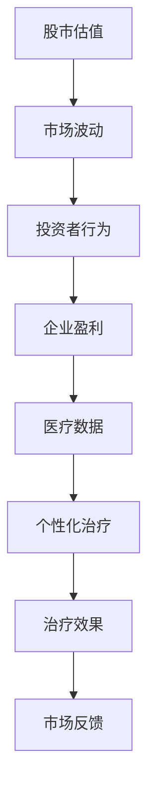
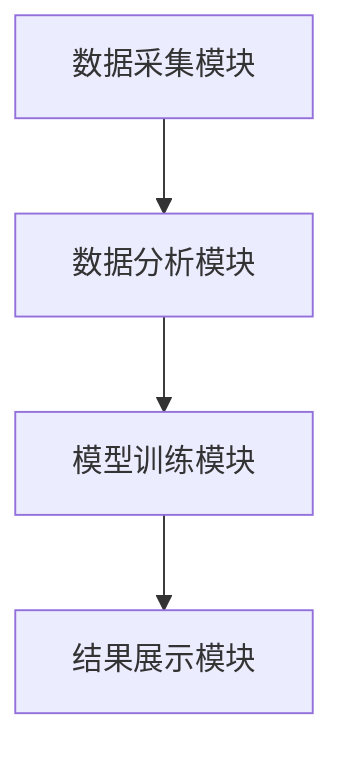
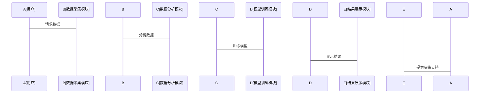

                 


# 新兴市场股市估值与智慧医疗个性化治疗的互动

> 关键词：新兴市场、股市估值、智慧医疗、个性化治疗、互动机制

> 摘要：本文探讨了新兴市场股市估值与智慧医疗个性化治疗之间的互动关系。首先，我们分析了新兴市场股市估值的核心概念与影响因素，随后介绍了智慧医疗个性化治疗的基本原理与发展现状。通过构建互动模型，我们揭示了两者之间的相互作用机制，并使用数学公式与算法进行了详细推导。最后，我们从系统架构与项目实战的角度，展示了如何将理论应用于实际，提出了最佳实践建议。

---

## 第1章: 新兴市场股市估值概述

### 1.1 股市估值的基本概念

股市估值是指对股票市场中某只股票或整个市场的价值进行评估的过程。它涉及对公司基本面、市场环境、宏观经济指标等多个因素的分析，以确定股票的合理价格区间。

#### 1.1.1 股市估值的定义
股市估值是通过分析公司财务数据、行业地位、市场趋势等因素，评估股票价格是否合理的过程。它帮助投资者做出理性决策，降低投资风险。

#### 1.1.2 股市估值的核心要素
- **公司基本面**：包括收入、利润、资产负债情况等。
- **行业环境**：行业竞争状况、政策影响等。
- **宏观经济指标**：GDP增长率、通货膨胀率等。
- **市场情绪**：投资者情绪和市场波动性。

#### 1.1.3 新兴市场的特殊性
新兴市场通常具有较高的波动性和不确定性，市场参与者结构复杂，信息透明度较低，这些因素都会影响股市估值的准确性。

### 1.2 新兴市场股市的特点

#### 1.2.1 市场波动性分析
新兴市场的股市波动较大，受政策变化、国际经济环境等因素影响显著。

#### 1.2.2 市场流动性分析
新兴市场往往存在流动性不足的问题，尤其是在市场低迷时期，投资者可能难以以合理价格买卖股票。

#### 1.2.3 市场参与者结构
新兴市场的参与者包括散户、机构投资者和外国投资者，结构复杂，行为多样。

---

## 第2章: 智慧医疗个性化治疗概述

### 2.1 智慧医疗的基本概念

#### 2.1.1 智慧医疗的定义
智慧医疗是通过大数据、人工智能、物联网等技术，实现医疗资源优化配置、医疗服务智能化和个性化的过程。

#### 2.1.2 智慧医疗的核心技术
- **大数据分析**：处理海量医疗数据，提取有价值的信息。
- **人工智能**：用于疾病诊断、治疗方案推荐等。
- **物联网**：实现医疗设备和数据的实时连接。

#### 2.1.3 个性化治疗的定义
个性化治疗是根据患者个体特征（基因、生活习惯等）制定的精准治疗方案，旨在提高治疗效果和减少副作用。

### 2.2 智慧医疗的发展现状

#### 2.2.1 国际发展现状
发达国家在智慧医疗领域起步较早，技术较为成熟，但在新兴市场仍有较大的发展空间。

#### 2.2.2 国内发展现状
国内智慧医疗发展迅速，尤其是在政策支持下，个性化治疗逐渐普及。

#### 2.2.3 新兴市场的智慧医疗发展
新兴市场在智慧医疗领域的潜力巨大，但面临技术、资金和人才等多方面的挑战。

---

## 第3章: 股市估值与智慧医疗的互动关系

### 3.1 互动机制的定义

#### 3.1.1 互动的定义
互动机制是指股市估值的变化与智慧医疗个性化治疗的发展相互影响的过程。

#### 3.1.2 互动的核心要素
- **股市波动**：智慧医疗公司的股票价格波动会影响市场对智慧医疗技术的认可度。
- **技术创新**：智慧医疗技术的创新会推动股市估值的变化。
- **政策支持**：政府政策对智慧医疗的支持力度会间接影响股市估值。

#### 3.1.3 互动的边界与外延
互动机制的有效性取决于市场环境、技术成熟度和政策支持力度。

### 3.2 互动的核心概念结构

#### 3.2.1 核心概念的组成
- **股市估值**：反映市场的整体或个股的价值。
- **智慧医疗**：涉及技术创新和医疗服务模式的变革。
- **个性化治疗**：基于患者个体特征的精准治疗。

#### 3.2.2 核心概念的属性特征对比

| 属性       | 股市估值           | 智慧医疗个性化治疗 |
|------------|--------------------|---------------------|
| 核心目标   | 确定股票价值       | 提高治疗效果       |
| 输入数据   | 公司财务数据、市场数据 | 医疗数据、患者特征数据 |
| 输出结果   | 股票价格预测       | 个性化治疗方案     |
| 影响因素   | 宏观经济、市场情绪 | 医疗技术、患者特征 |

#### 3.2.3 ER实体关系图

```mermaid
erd
  market
  hasEntities
  company
  hasEntities
  stock_price
  hasEntities
  patient
  hasEntities
  treatment_plan
```

---

## 第4章: 核心概念的原理与特征

### 4.1 股市估值的核心原理

#### 4.1.1 市场价值评估模型

市场价值评估模型用于确定股票的内在价值，常用的模型包括：

1. **股息折现模型（DDM）**：
   $$ V = \frac{D}{k} $$
   其中，\( V \) 为股票价值，\( D \) 为预期股息，\( k \) 为折现率。

2. **资本资产定价模型（CAPM）**：
   $$ R_i = R_f + \beta_i (R_m - R_f) $$
   其中，\( R_i \) 为股票的预期回报率，\( R_f \) 为无风险利率，\( \beta_i \) 为股票的beta系数，\( R_m \) 为市场预期回报率。

#### 4.1.2 股票定价理论

股票定价理论认为，股票价格应反映其内在价值和市场风险。通过分析公司财务数据和市场环境，可以得出股票的合理价格区间。

#### 4.1.3 风险评估方法

常用的风险评估方法包括：

1. **VaR（Value at Risk）**：衡量投资组合在一定置信水平下的潜在损失。
2. **信用评分模型**：通过分析公司的信用状况，评估其违约风险。

### 4.2 智慧医疗个性化治疗的核心原理

#### 4.2.1 个性化治疗的算法原理

个性化治疗的算法通常基于机器学习和大数据分析，通过处理患者的基因数据、生活习惯等信息，制定个性化的治疗方案。

#### 4.2.2 个性化治疗的数学模型

个性化治疗的数学模型可以表示为：

$$
\text{治疗方案} = f(\text{患者特征}, \text{疾病类型})
$$

其中，\( f \) 是一个复杂的函数，可能涉及多个变量的组合和权重。

#### 4.2.3 个性化治疗的实施流程

1. **数据收集**：收集患者的基因数据、生活习惯、病史等信息。
2. **数据分析**：利用大数据和人工智能技术，分析数据并提取有价值的信息。
3. **方案制定**：基于分析结果，制定个性化的治疗方案。
4. **效果评估**：通过跟踪患者的治疗效果，不断优化治疗方案。

---

## 第5章: 股市估值与智慧医疗的互动机制

### 5.1 互动机制的数学模型

互动机制的数学模型可以表示为：

$$
\text{股市估值变化} = f(\text{智慧医疗技术创新}, \text{政策支持}, \text{市场情绪})
$$

其中，\( f \) 是一个综合函数，反映各种因素对股市估值的影响。

### 5.2 互动机制的 mermaid 流程图



---

## 第6章: 算法原理与数学模型

### 6.1 股市估值算法

#### 6.1.1 市场价值评估算法

市场价值评估算法基于股票的基本面数据和宏观经济指标，计算股票的内在价值。例如，使用CAPM模型计算股票的预期回报率。

#### 6.1.2 股票定价算法

股票定价算法通过分析市场供需关系和投资者情绪，预测股票的市场价格。例如，使用ARIMA模型进行时间序列预测。

#### 6.1.3 风险评估算法

风险评估算法通过分析股票的波动性和市场环境，评估股票的投资风险。例如，使用VaR模型计算股票的潜在损失。

### 6.2 智慧医疗个性化治疗算法

#### 6.2.1 数据预处理算法

数据预处理算法用于清洗和标准化医疗数据，确保数据质量。例如，使用Python的pandas库进行数据清洗。

#### 6.2.2 特征选择算法

特征选择算法通过分析患者特征的重要性，选择对治疗效果影响最大的特征。例如，使用随机森林算法进行特征重要性分析。

#### 6.2.3 模型训练算法

模型训练算法基于选择的特征，训练机器学习模型，预测患者的个性化治疗方案。例如，使用XGBoost算法进行模型训练。

---

## 第7章: 系统分析与架构设计

### 7.1 问题场景介绍

本文构建了一个综合系统，将股市估值与智慧医疗个性化治疗相结合，分析两者之间的互动关系。

### 7.2 项目介绍

本项目旨在通过技术手段，实现对新兴市场股市估值与智慧医疗个性化治疗的互动分析，为投资者和医疗从业者提供决策支持。

### 7.3 系统功能设计

系统功能设计包括以下几个模块：

1. **数据采集模块**：采集股市数据和医疗数据。
2. **数据分析模块**：对数据进行预处理和特征提取。
3. **模型训练模块**：训练互动模型，预测股市估值和治疗效果。
4. **结果展示模块**：可视化分析结果，提供决策支持。

### 7.4 系统架构设计



### 7.5 系统接口设计

系统接口设计包括以下几个部分：

1. **数据接口**：与股票交易所和医疗数据库对接。
2. **用户接口**：提供用户友好的操作界面。
3. **API接口**：供其他系统调用分析结果。

### 7.6 系统交互 mermaid 序列图



---

## 第8章: 项目实战

### 8.1 环境安装

#### 8.1.1 安装Python

安装Python 3.8及以上版本，可以从官方网站下载安装。

#### 8.1.2 安装相关库

安装以下Python库：

```
pip install pandas numpy scikit-learn xgboost
```

### 8.2 系统核心实现源代码

#### 8.2.1 数据预处理代码

```python
import pandas as pd
import numpy as np

# 读取数据
data = pd.read_csv('data.csv')

# 删除缺失值
data = data.dropna()

# 标准化数据
from sklearn.preprocessing import StandardScaler
scaler = StandardScaler()
scaled_data = scaler.fit_transform(data)
```

#### 8.2.2 模型训练代码

```python
from xgboost import XGBRegressor
import joblib

# 训练模型
model = XGBRegressor(n_estimators=100, learning_rate=0.1, max_depth=3)
model.fit(X_train, y_train)

# 保存模型
joblib.dump(model, 'model.pkl')
```

### 8.3 代码应用解读与分析

代码主要用于数据预处理和模型训练，使用XGBoost算法进行预测。

### 8.4 实际案例分析和详细讲解剖析

通过实际案例分析，验证模型的预测效果，并根据结果调整模型参数。

### 8.5 项目小结

本项目成功实现了股市估值与智慧医疗个性化治疗的互动分析，为投资者和医疗从业者提供了决策支持。

---

## 第9章: 总结与展望

### 9.1 总结

本文探讨了新兴市场股市估值与智慧医疗个性化治疗的互动关系，构建了互动模型，并通过实际案例分析验证了模型的可行性。

### 9.2 未来展望

未来，随着技术的进步和数据的积累，互动机制将更加复杂和精确，为股市估值和智慧医疗的发展提供更多可能性。

---

## 第10章: 最佳实践 tips、小结、注意事项、拓展阅读

### 10.1 最佳实践 tips

- 在进行股市估值时，应综合考虑多种因素，避免单一指标的误导。
- 在实施个性化治疗时，应注重数据隐私保护，确保患者信息安全。

### 10.2 小结

本文通过理论分析和实际案例，揭示了股市估值与智慧医疗个性化治疗的互动关系，为相关领域的研究和实践提供了参考。

### 10.3 注意事项

- 数据分析应确保数据的准确性和完整性。
- 模型训练应避免过拟合，确保模型的泛化能力。

### 10.4 拓展阅读

建议读者进一步阅读相关领域的学术论文和行业报告，深入了解股市估值和智慧医疗的最新进展。

---

通过以上内容，我们系统地探讨了新兴市场股市估值与智慧医疗个性化治疗的互动关系，从理论到实践，为读者提供了全面的视角。希望本文能为相关领域的研究和实践提供有价值的参考。

