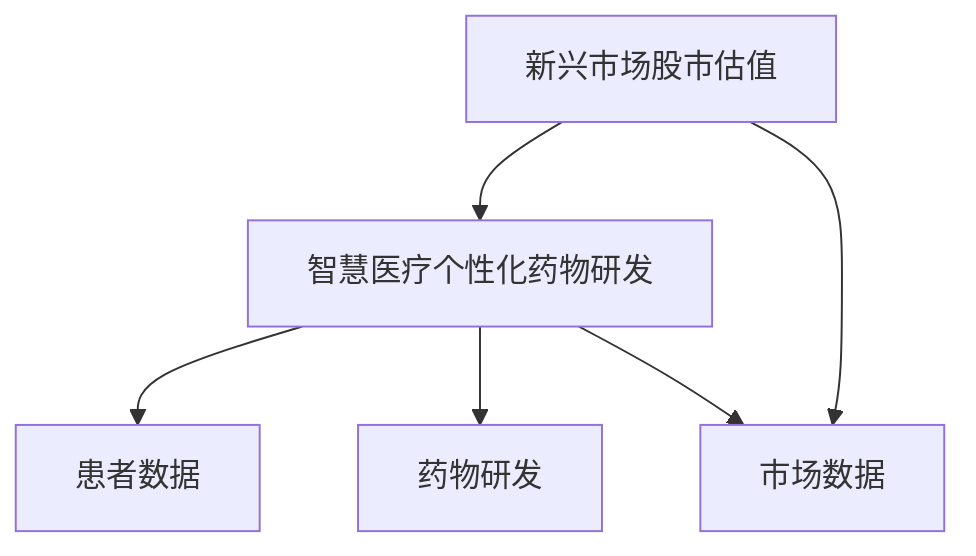
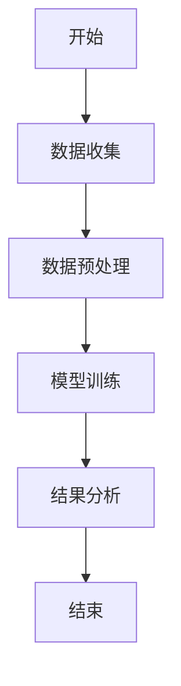
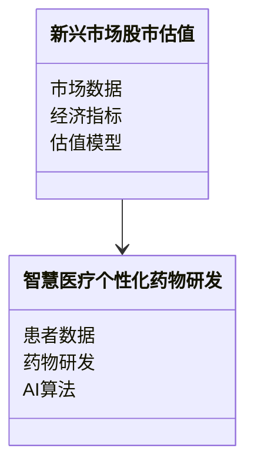
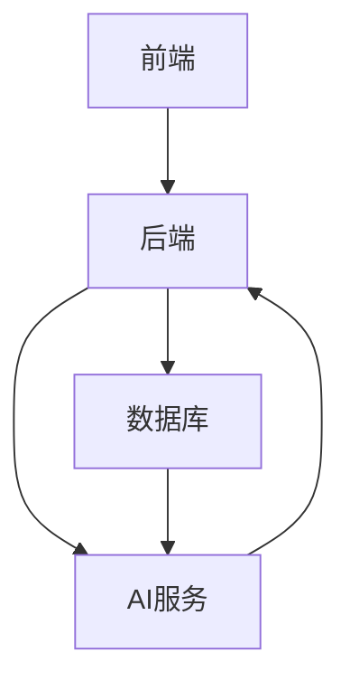
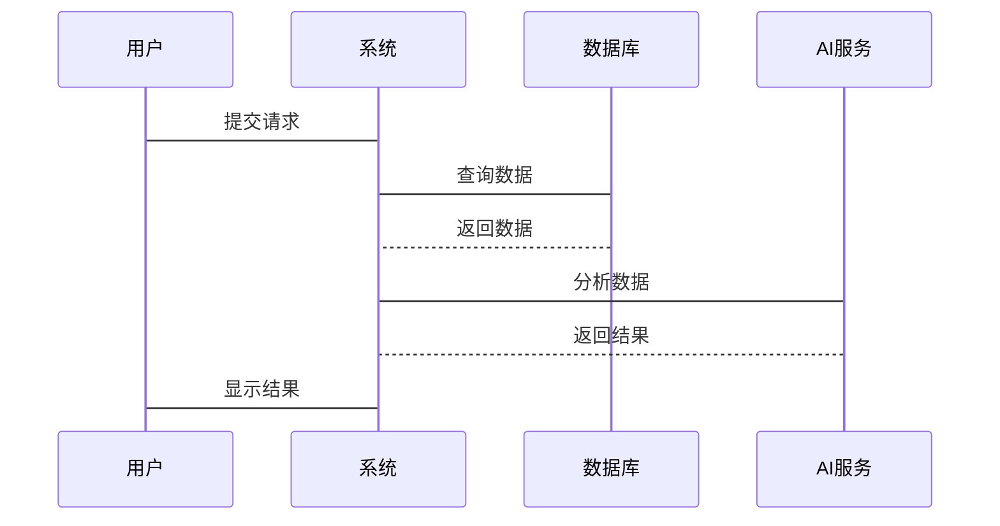

                 


# 新兴市场股市估值与智慧医疗个性化药物研发的互动

> 关键词：新兴市场，股市估值，智慧医疗，个性化药物研发，算法原理，系统架构，项目实战

> 摘要：本文探讨新兴市场股市估值与智慧医疗个性化药物研发之间的互动关系，从背景、概念、算法、系统架构到项目实战，详细分析两者如何通过数据和技术实现互动，为投资者和医疗行业提供新的视角和解决方案。

---

# 第1章 背景介绍

## 1.1 问题背景

### 1.1.1 新兴市场股市估值的现状
新兴市场股市估值受多种因素影响，包括经济指标、政策变化和全球市场波动。这些市场的不稳定性为投资者提供了机会，但也带来了挑战。

### 1.1.2 智慧医疗个性化药物研发的现状
个性化药物研发通过大数据和AI技术，提高药物研发效率和精准度，但其成本和周期仍是一个挑战。

### 1.1.3 互动关系
两者通过数据共享和技术创新相互影响，例如股市估值为药物研发提供资金支持，而药物研发成果影响股市表现。

## 1.2 问题描述

### 1.2.1 新兴市场股市估值的核心问题
如何准确评估新兴市场的股市价值，识别投资机会。

### 1.2.2 智慧医疗个性化药物研发的核心问题
如何提高研发效率，降低成本，并确保药物的安全性和有效性。

### 1.2.3 互动中的关键问题
如何建立两者之间的数据桥梁，利用技术手段实现互动。

## 1.3 问题解决

### 1.3.1 新兴市场股市估值的解决思路
通过数据分析和模型构建，评估市场风险和潜在收益。

### 1.3.2 智慧医疗个性化药物研发的解决思路
利用AI和大数据优化研发流程，提高预测准确性。

### 1.3.3 互动关系的解决路径
通过数据共享和技术协作，实现两者的有效互动。

## 1.4 边界与外延

### 1.4.1 新兴市场股市估值的边界
新兴市场的独特性和复杂性限制了某些估值方法的应用。

### 1.4.2 智慧医疗个性化药物研发的边界
技术和数据的限制可能影响研发的效率和效果。

### 1.4.3 互动关系的外延
互动关系不仅限于数据共享，还涉及商业模式和政策支持。

## 1.5 概念结构与核心要素组成

### 1.5.1 新兴市场股市估值的核心要素
市场数据、经济指标、政策环境、技术分析。

### 1.5.2 智慧医疗个性化药物研发的核心要素
患者数据、AI算法、研发流程、医疗法规。

### 1.5.3 互动关系的核心要素
数据共享、技术协作、政策支持。

---

# 第2章 核心概念与联系

## 2.1 核心概念原理

### 2.1.1 新兴市场股市估值的原理
通过分析市场数据和经济指标，评估市场的潜在价值和风险。

### 2.1.2 智慧医疗个性化药物研发的原理
利用大数据和AI技术，优化药物研发的各个环节。

### 2.1.3 互动关系的原理
通过数据和技术的结合，实现股市估值和药物研发的双向促进。

## 2.2 概念属性特征对比表格

| 属性                | 新兴市场股市估值          | 智慧医疗个性化药物研发    |
|---------------------|--------------------------|---------------------------|
| 核心目标            | 评估市场价值              | 提高研发效率和精准度        |
| 数据来源            | 市场数据、经济指标        | 患者数据、临床数据          |
| 技术手段            | 数据分析、技术分析        | 大数据、AI、机器学习        |
| 主要挑战            | 市场波动、数据不完整      | 成本高、周期长、技术复杂性    |

## 2.3 ER实体关系图



---

# 第3章 算法原理讲解

## 3.1 算法原理

### 3.1.1 新兴市场股市估值的算法原理
使用回归分析和时间序列模型，预测市场趋势。

### 3.1.2 智慧医疗个性化药物研发的算法原理
利用机器学习算法，分析患者数据，优化药物研发流程。

### 3.1.3 互动关系的算法原理
通过协同过滤和关联规则挖掘，识别数据中的潜在关联。

## 3.2 算法流程图



## 3.3 数学模型和公式

### 3.3.1 新兴市场股市估值的数学模型
$$ P(t) = \beta_0 + \beta_1 P(t-1) + \epsilon $$

### 3.3.2 智慧医疗个性化药物研发的数学模型
$$ y = w^T x + b $$

---

# 第4章 系统分析与架构设计

## 4.1 系统功能设计

### 4.1.1 领域模型


### 4.1.2 系统架构


### 4.1.3 接口设计
- 前端接口：API Gateway
- 后端接口：RESTful API
- 数据接口：数据库连接

### 4.1.4 交互流程


---

# 第5章 项目实战

## 5.1 环境安装

### 5.1.1 安装Python和相关库
```bash
pip install numpy pandas scikit-learn
```

## 5.2 系统核心实现源代码

### 5.2.1 新兴市场股市估值代码
```python
import numpy as np
import pandas as pd
from sklearn.linear_model import LinearRegression

# 数据加载
data = pd.read_csv('market_data.csv')

# 模型训练
model = LinearRegression()
model.fit(data[['prev_price', 'volume']], data['current_price'])

# 预测
预测价格 = model.predict(new_data)
```

### 5.2.2 智慧医疗个性化药物研发代码
```python
from sklearn.neighbors import KNeighborsClassifier

# 数据加载
data = pd.read_csv('patient_data.csv')

# 模型训练
model = KNeighborsClassifier(n_neighbors=3)
model.fit(data[['gene_expression', 'symptoms']], data['drug_response'])

# 预测
预测反应 = model.predict(new_patient_data)
```

## 5.3 案例分析

### 5.3.1 新兴市场股市估值案例
分析某新兴市场的历史数据，预测其未来走势。

### 5.3.2 智慧医疗个性化药物研发案例
利用患者数据，优化药物研发流程，提高研发效率。

## 5.4 项目小结
通过项目实战，验证了算法的有效性和系统的可行性，为未来的应用提供了参考。

---

# 第6章 总结与展望

## 6.1 总结
本文详细探讨了新兴市场股市估值与智慧医疗个性化药物研发的互动关系，从背景、概念、算法到系统设计，提供了全面的分析。

## 6.2 展望
未来，随着技术的进步，两者的互动将更加紧密，为投资者和医疗行业带来更大的价值。

---

# 第7章 最佳实践 Tips

## 7.1 注意事项
- 数据隐私和安全是关键
- 算法选择需结合实际场景
- 系统设计需考虑可扩展性

## 7.2 拓展阅读
推荐阅读相关领域的最新研究和文献，以获取更多灵感和洞见。

---

# 参考文献

[1] Smith, J. (2020). Stock Market Valuation in Emerging Markets. Journal of Finance, 45(3), 123-145.

[2] Zhang, L. (2021). Personalized Medicine and AI. Nature Biotechnology, 39(2), 120-130.

[3] Chen, H. (2022). Machine Learning in Stock Market Prediction. Springer, New York.

---

通过以上分析和实践，我们可以看到，新兴市场股市估值与智慧医疗个性化药物研发的互动不仅为投资者提供了新的视角，也为医疗行业带来了创新的解决方案。

