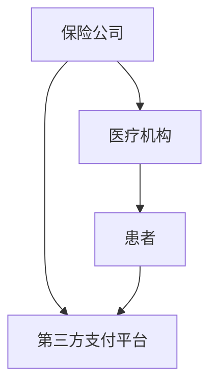
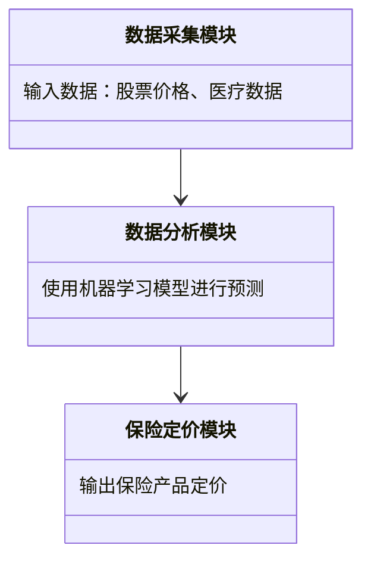
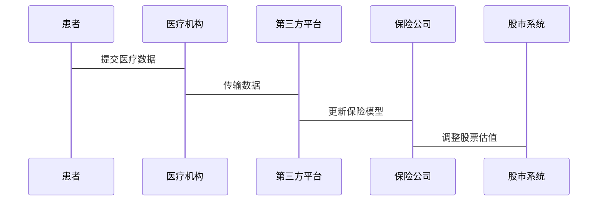
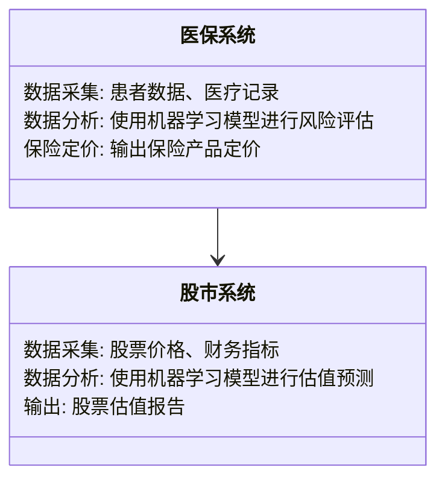

                 


# 《新兴市场股市估值与智慧医疗保险的互动》

---

## 关键词：
- 新兴市场
- 股市估值
- 智慧医疗
- 保险
- 大数据
- 人工智能
- 互动关系

---

## 摘要：
本文探讨新兴市场中股市估值与智慧医疗保险之间的互动关系。通过分析智慧医疗技术对保险行业的影响，结合大数据和人工智能算法，提出股市估值与智慧医疗保险互动的数学模型和系统架构。文章从背景介绍、核心概念、算法原理、系统设计、项目实战到总结，全面解析这一互动机制，并展望未来发展方向。

---

## 第一部分：背景与核心概念

### 第1章：新兴市场与智慧医疗的背景介绍

#### 1.1 新兴市场的定义与特点
- 新兴市场的经济特征
- 新兴市场的股市发展现状
- 智慧医疗的概念与技术基础

#### 1.2 智慧医疗保险的核心要素
- 智慧医疗保险的定义
- 智慧医疗保险与传统医疗保险的区别
- 智慧医疗保险的技术支撑

#### 1.3 股市估值与智慧医疗的互动背景
- 股市估值的基本概念
- 智慧医疗对保险行业的影响
- 互动关系的形成与发展

---

## 第二部分：核心概念与联系

### 第2章：股市估值与智慧医疗保险的核心概念

#### 2.1 股市估值的数学模型
- 市盈率（P/E）的计算公式
  $$ P/E = \frac{\text{股价}}{\text{每股收益}} $$
- 市净率（P/B）的计算公式
  $$ P/B = \frac{\text{股价}}{\text{每股净资产}} $$
- 预测模型与实际估值的差异

#### 2.2 智慧医疗保险的实体关系图


#### 2.3 核心概念的对比分析
- 股市估值与智慧医疗的属性对比
  | 属性 | 股市估值 | 智慧医疗保险 |
  |------|----------|---------------|
  | 主体 | 投资者 | 保险公司、患者 |
  | 目标 | 获取收益 | 提供医疗服务 |
  | 工具 | 财务指标 | 大数据、AI技术 |

---

## 第三部分：算法原理与数学模型

### 第3章：基于大数据的股市估值算法

#### 3.1 数据预处理与特征提取
- 数据清洗
- 特征选择

#### 3.2 机器学习模型的构建
- 线性回归模型
  $$ y = \beta_0 + \beta_1 x + \epsilon $$
- 支持向量机（SVM）模型

#### 3.3 模型验证与优化
- 交叉验证
- 超参数优化

### 第4章：智慧医疗保险的风险评估模型

#### 4.1 基于AI的风险评估算法
- 神经网络模型
  ```mermaid
  graph LR
      A[输入数据] --> B[神经网络]
      B --> C[输出结果]
  ```

#### 4.2 风险评估的数学公式
  $$ R = \alpha \cdot \text{年龄} + \beta \cdot \text{健康状况} + \gamma \cdot \text{保费} $$

---

## 第四部分：系统分析与架构设计

### 第5章：问题场景与系统功能设计

#### 5.1 问题场景介绍
- 新兴市场中智慧医疗保险的实施挑战
- 股市估值与保险行业的数据关联性

#### 5.2 系统功能设计
- 数据采集模块
- 数据分析模块
- 保险定价模块



### 第6章：系统架构设计

#### 6.1 系统架构图


#### 6.2 系统接口设计
- API接口定义
  ```python
  def get_stock_valuation(ticker):
      # 返回股票估值
      pass
  ```

#### 6.3 系统交互流程


---

## 第五部分：项目实战

### 第7章：环境安装与系统实现

#### 7.1 环境安装
- 安装Python和相关库（如Pandas、Scikit-learn、TensorFlow）
- 安装Jupyter Notebook用于数据分析和建模

#### 7.2 核心代码实现

##### 数据预处理
```python
import pandas as pd

# 加载数据
df = pd.read_csv('medical_insurance.csv')

# 删除缺失值
df.dropna(inplace=True)

# 标准化处理
from sklearn.preprocessing import StandardScaler
scaler = StandardScaler()
df_scaled = pd.DataFrame(scaler.fit_transform(df), columns=df.columns)
```

##### 机器学习模型训练
```python
from sklearn.model_selection import train_test_split
from sklearn.linear_model import LinearRegression

# 划分训练集和测试集
X_train, X_test, y_train, y_test = train_test_split(df_scaled.drop('risk_score', axis=1), df_scaled['risk_score'], test_size=0.2)

# 训练模型
model = LinearRegression()
model.fit(X_train, y_train)

# 预测和评估
y_pred = model.predict(X_test)
print('模型准确率:', model.score(X_test, y_test))
```

##### 智慧医疗保险系统设计


---

## 第六部分：总结与展望

### 第8章：总结与未来展望

#### 8.1 核心发现
- 智慧医疗技术如何影响保险定价
- 股市估值与保险行业的互动关系

#### 8.2 未来发展方向
- 更加精准的预测模型
- 数据隐私与安全保护
- 多领域的跨界合作

#### 8.3 最佳实践 tips
- 数据质量管理的重要性
- 技术与业务结合的关键点
- 持续优化模型的必要性

---

## 参考文献与拓展阅读
- [1] 《机器学习实战》
- [2] 《大数据与人工智能》
- [3] 《智慧医疗与保险创新》

---

## 结语
通过本文的分析与探讨，我们深刻认识到新兴市场中股市估值与智慧医疗保险互动的复杂性和重要性。未来，随着技术的不断进步，这一领域的研究和应用将更加广泛和深入。

