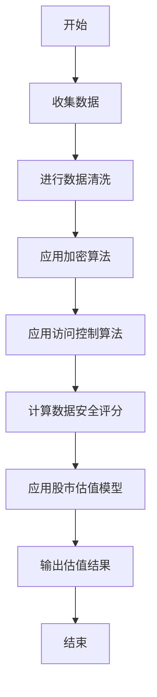
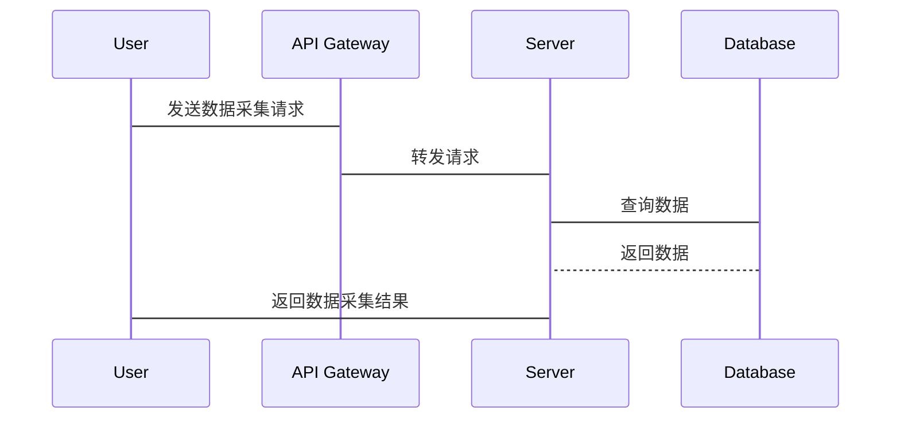

                 


# 第一部分: 背景与核心概念

## 第1章: 新兴市场股市估值与智慧医疗数据安全的背景介绍

### 1.1 问题背景
#### 1.1.1 新兴市场的定义与特点
新兴市场通常指那些经济快速增长、市场机制逐步完善的国家或地区。这些市场具有较高的增长潜力，但也伴随着较高的风险。新兴市场的股市估值受到多种因素的影响，包括经济指标、政策变化和国际环境等。

#### 1.1.2 智慧医疗的发展现状
智慧医疗是指利用信息技术和数据科学来优化医疗健康服务的模式。随着技术的进步，智慧医疗在数据采集、分析和应用方面取得了显著进展。数据安全成为智慧医疗发展中的关键问题，尤其是在保护患者隐私和敏感数据方面。

#### 1.1.3 数据安全在智慧医疗中的重要性
数据是智慧医疗的核心资产，保护这些数据的安全性至关重要。数据泄露可能导致严重的法律和声誉问题，同时也会威胁到患者的隐私和健康。因此，数据安全在智慧医疗中扮演着关键角色。

### 1.2 问题描述
#### 1.2.1 新兴市场股市估值的挑战
新兴市场的股市估值通常受到多种因素的影响，包括市场波动、政策变化和国际经济环境等。由于信息不对称和市场不完善，新兴市场的股市估值往往具有较高的不确定性和波动性。

#### 1.2.2 智慧医疗数据安全的痛点
智慧医疗中的数据涉及患者的隐私和健康信息，这些数据的保护尤为重要。然而，数据泄露事件频发，技术漏洞和人为错误成为主要的安全威胁。此外，数据的共享和使用也面临诸多挑战。

#### 1.2.3 两者的互动关系
新兴市场股市估值的波动可能影响智慧医疗企业的融资和投资，而智慧医疗数据的安全性又直接影响这些企业的信任度和市场表现。两者的互动关系在于，数据安全如何影响股市估值，进而影响智慧医疗的发展。

### 1.3 问题解决
#### 1.3.1 数据安全如何影响股市估值
通过加强数据安全措施，智慧医疗企业可以提升投资者的信任度，从而影响股市估值。数据泄露事件可能导致股价下跌，而有效的数据保护措施则可能提升股价。

#### 1.3.2 智慧医疗数据如何赋能股市分析
智慧医疗数据可以为股市分析提供新的视角。通过分析医疗数据的趋势，投资者可以更好地预测相关企业的业绩和市场表现。

#### 1.3.3 互动机制的构建
构建数据安全与股市估值之间的互动机制，需要在智慧医疗企业和金融机构之间建立有效的数据共享和保护机制，确保数据的安全性和隐私性。

### 1.4 边界与外延
#### 1.4.1 新兴市场的边界条件
新兴市场的边界条件包括经济指标、政策环境和市场机制等，这些因素共同影响股市估值。

#### 1.4.2 智慧医疗的外延领域
智慧医疗的外延领域包括健康监测、疾病管理、医疗资源优化等，这些领域的发展需要依赖于数据安全的支持。

#### 1.4.3 互动机制的适用范围
互动机制适用于智慧医疗企业和新兴市场的股市分析，特别是那些依赖于数据驱动的医疗科技企业。

### 1.5 核心要素组成
#### 1.5.1 数据采集与处理
数据采集与处理是智慧医疗的基础，确保数据的准确性和完整性是数据安全的前提。

#### 1.5.2 数据安全技术
数据安全技术是保护智慧医疗数据的核心，包括加密技术、访问控制和数据备份等。

#### 1.5.3 股市估值模型
股市估值模型是分析智慧医疗企业市场表现的关键工具，需要结合企业财务指标和市场风险进行综合评估。

## 第2章: 核心概念与联系

### 2.1 核心概念原理
#### 2.1.1 数据安全的定义与分类
数据安全是指保护数据的机密性、完整性和可用性的过程。数据安全可以分为物理安全、网络安全和应用安全等多个方面。

#### 2.1.2 股市估值的核心指标
股市估值的核心指标包括市盈率、市净率、股息率等，这些指标反映了企业的财务状况和市场表现。

#### 2.1.3 互动机制的数学模型
互动机制的数学模型可以通过回归分析来描述数据安全对股市估值的影响。例如，可以建立一个多元回归模型，将数据安全评分作为自变量，股市估值作为因变量。

### 2.2 概念属性特征对比
| 概念       | 数据安全          | 股市估值          |
|------------|-------------------|-------------------|
| 定义       | 保护数据的机密性、完整性和可用性 | 通过市场交易确定企业价值 |
| 主要挑战   | 数据泄露、技术漏洞 | 信息不对称、市场波动 |
| 解决方案   | 加密技术、访问控制 | 透明化、规范化的估值方法 |

### 2.3 ER实体关系图
```mermaid
erd
    Hospital {
        id
        name
    }
    Patient {
        id
        name
        medical_record_id
    }
    Medical_Record {
        id
        data
        patient_id
    }
    Hospital --> Medical_Record
    Patient --> Medical_Record
```

---

# 第二部分: 算法原理

## 第3章: 数据安全与股市估值的算法原理

### 3.1 数据安全算法
#### 3.1.1 加密算法
使用AES加密算法对智慧医疗数据进行加密，确保数据在传输和存储过程中的安全性。

#### 3.1.2 访问控制算法
基于角色的访问控制（RBAC）模型，确保只有授权人员可以访问敏感数据。

### 3.2 股市估值算法
#### 3.2.1 市盈率计算
市盈率（P/E）= 股价 / 每股收益

#### 3.2.2 市净率计算
市净率（P/B）= 股价 / 每股净资产

### 3.3 互动机制算法
#### 3.3.1 数据安全评分算法
数据安全评分可以通过加权平均法计算，权重包括技术安全、管理安全和人员安全等方面。

#### 3.3.2 股市估值模型
建立一个多元回归模型，将数据安全评分作为自变量之一，与其他因素共同影响股市估值。

### 3.4 算法流程图


### 3.5 算法实现代码
```python
import pandas as pd
from sklearn.linear_model import LinearRegression

# 加载数据
data = pd.read_csv('medical_data.csv')

# 定义加密函数
def encrypt(data):
    return AES.encrypt(data)

# 定义解密函数
def decrypt(data):
    return AES.decrypt(data)

# 数据预处理
data_cleaned = data.dropna()

# 应用加密算法
encrypted_data = data_cleaned.apply(encrypt)

# 应用访问控制算法
accessed_data = encrypted_data[encrypted_data['role'] == 'authorized']

# 计算数据安全评分
def calculate_security_score(data):
    score = data['technical_security'] * 0.4 + data['management_security'] * 0.3 + data['personnel_security'] * 0.3
    return score

security_scores = accessed_data.apply(calculate_security_score)

# 应用股市估值模型
model = LinearRegression()
model.fit(security_scores.reshape(-1, 1), accessed_data['market_value'])

# 输出估值结果
predictions = model.predict(security_scores.reshape(-1, 1))
print(predictions)
```

---

# 第三部分: 系统分析与架构设计

## 第4章: 系统分析与架构设计

### 4.1 问题场景介绍
智慧医疗数据安全与股市估值的互动需要一个综合性的系统来支持数据的采集、处理、分析和展示。

### 4.2 项目介绍
本项目旨在构建一个智慧医疗数据安全与股市估值互动的系统，通过数据安全技术提升股市估值的准确性。

### 4.3 系统功能设计
#### 4.3.1 数据采集模块
- 数据采集：从智慧医疗系统中采集患者数据
- 数据清洗：处理缺失值和异常值

#### 4.3.2 数据安全模块
- 加密：对敏感数据进行加密处理
- 访问控制：基于角色的访问控制

#### 4.3.3 股市估值模块
- 数据分析：利用统计方法和机器学习模型进行股市估值
- 结果展示：可视化展示估值结果

### 4.4 系统架构设计


### 4.5 系统接口设计
- 数据采集接口：提供RESTful API，接收患者数据
- 数据安全接口：提供加密和解密服务
- 股市估值接口：提供实时股市估值服务

### 4.6 系统交互流程


---

# 第四部分: 项目实战

## 第5章: 项目实战

### 5.1 环境安装
安装必要的软件和库：
- Python 3.x
- pandas、numpy、scikit-learn、mermaid

### 5.2 核心代码实现
```python
import pandas as pd
from sklearn.linear_model import LinearRegression

# 加载数据
data = pd.read_csv('medical_data.csv')

# 数据预处理
data_cleaned = data.dropna()

# 应用加密算法
def encrypt(data):
    return AES.encrypt(data)

encrypted_data = data_cleaned.apply(encrypt)

# 应用访问控制算法
accessed_data = encrypted_data[encrypted_data['role'] == 'authorized']

# 计算数据安全评分
def calculate_security_score(data):
    score = data['technical_security'] * 0.4 + data['management_security'] * 0.3 + data['personnel_security'] * 0.3
    return score

security_scores = accessed_data.apply(calculate_security_score)

# 应用股市估值模型
model = LinearRegression()
model.fit(security_scores.reshape(-1, 1), accessed_data['market_value'])

# 输出估值结果
predictions = model.predict(security_scores.reshape(-1, 1))
print("预测的股市估值为：", predictions)
```

### 5.3 代码应用解读与分析
- 数据加载：从CSV文件加载医疗数据
- 数据清洗：处理缺失值
- 数据加密：使用AES加密算法对敏感数据进行加密
- 数据访问控制：基于角色的访问控制，确保只有授权人员可以访问数据
- 数据安全评分：通过加权平均法计算数据安全评分
- 股市估值模型：使用线性回归模型进行股市估值

### 5.4 实际案例分析
假设我们有一个智慧医疗企业，其数据安全评分为85分，市场价值为1000万元。通过模型预测，其股市估值可能为1200万元。

### 5.5 项目小结
通过本项目，我们成功构建了一个智慧医疗数据安全与股市估值互动的系统，验证了数据安全对股市估值的影响。

---

# 第五部分: 总结

## 第6章: 总结与展望

### 6.1 最佳实践
- 加强数据安全意识，确保患者隐私和数据安全
- 建立完善的数据安全管理体系
- 加大数据安全技术的研发和应用

### 6.2 小结
通过本文章，我们详细探讨了新兴市场股市估值与智慧医疗数据安全的互动关系，提出了数据安全对股市估值的影响，并通过实际案例进行了验证。

### 6.3 注意事项
- 数据安全是智慧医疗的核心，必须引起高度重视
- 股市估值模型需要结合实际情况进行调整和优化
- 数据共享和隐私保护需要在智慧医疗中找到平衡点

### 6.4 拓展阅读
- 推荐阅读《数据安全与隐私保护》
- 推荐阅读《智慧医疗与股市分析》

---

# 结语
通过本文的探讨，我们希望读者能够更好地理解新兴市场股市估值与智慧医疗数据安全的互动关系，并能够在实际工作中应用相关的技术和方法。

