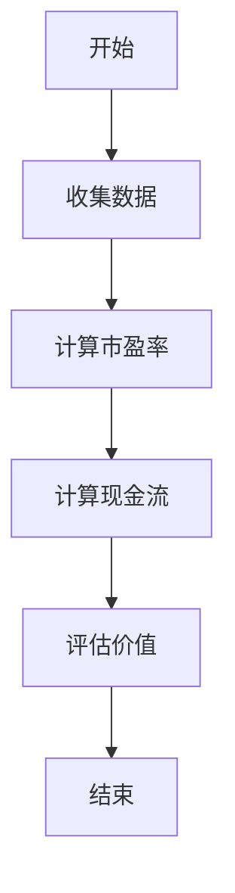
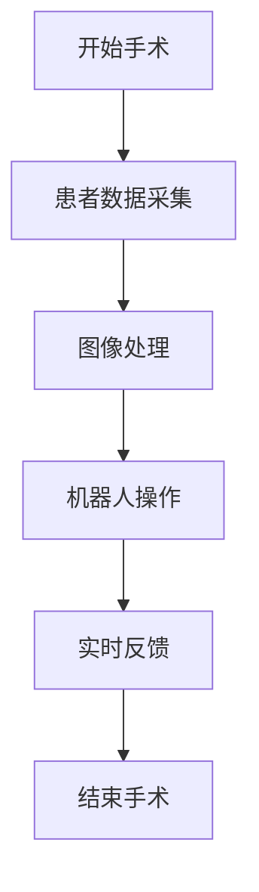
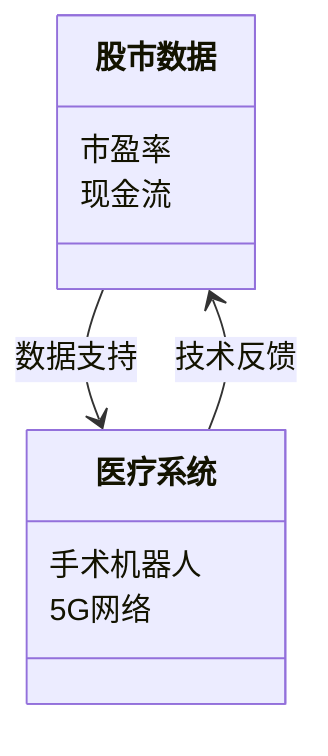

                 


# 新兴市场股市估值与智慧医疗远程手术的互动

## 关键词

- 新兴市场股市估值
- 智慧医疗
- 远程手术
- 算法原理
- 系统架构

## 摘要

本文探讨了新兴市场股市估值与智慧医疗远程手术之间的互动关系。通过分析股市估值的核心算法和智慧医疗远程手术的技术基础，展示了两者在数据驱动决策和技术创新方面的相互影响。文章从背景介绍、核心概念、算法原理、系统架构到项目实战，全面阐述了两者的互动机制，并通过案例分析展示了实际应用中的潜在价值。

## 目录大纲

1. 背景介绍
2. 核心概念与联系
3. 算法原理
4. 系统分析与架构设计
5. 项目实战
6. 总结与展望

## 第一部分：背景介绍

### 第1章：新兴市场股市估值概述

#### 1.1 股市估值的基本概念

- **1.1.1 股市估值的定义与作用**
  股市估值是通过分析公司财务数据、市场环境等因素，评估其股票的内在价值，为投资者提供决策依据。

- **1.1.2 新兴市场的特点与挑战**
  新兴市场通常具有高增长潜力，但波动性大、信息不透明，增加了股市估值的复杂性。

- **1.1.3 股市估值的重要性与应用场景**
  股市估值在投资决策、资产配置等方面发挥重要作用，特别是在风险管理和投资机会评估中。

#### 1.2 智慧医疗远程手术的背景

- **1.2.1 智慧医疗的发展历程**
  智慧医疗整合了信息技术与医疗服务，提升了医疗效率和质量，特别是在远程医疗领域取得了显著进展。

- **1.2.2 远程手术的技术基础与优势**
  远程手术依赖于高速网络、机器人技术和虚拟现实，突破了地理限制，实现了高质量医疗服务的远程提供。

- **1.2.3 远程手术在医疗资源分配中的作用**
  远程手术有助于均衡医疗资源，特别是在医疗资源匮乏的地区，能够有效提升医疗服务的可及性。

## 第二部分：核心概念与联系

### 第2章：股市估值的核心原理

#### 2.1 股市估值的主要模型

- **2.1.1 市盈率模型**
  市盈率=股价/每股收益，用于评估股票的相对价值。

- **2.1.2 现金流折现模型**
  将未来现金流折现为当前价值，评估企业的真实价值。

- **2.1.3 其他估值方法对比**
  对比相对估值法和绝对估值法的优缺点，适用于不同市场环境。

### 第3章：智慧医疗远程手术的技术基础

#### 3.1 远程手术的关键技术

- **3.1.1 高精度医疗机器人**
  用于精确操作，确保远程手术的准确性。

- **3.1.2 5G通信技术的应用**
  提供低延迟、高速的数据传输，保障手术实时性。

- **3.1.3 虚拟现实（VR）与增强现实（AR）**
  提供沉浸式操作体验，辅助医生进行精准手术。

### 第4章：核心概念的联系

#### 4.1 股市估值与远程手术的互动

- **4.1.1 数据驱动的决策支持**
  股市数据影响医疗企业的投资，而远程手术的技术进步又依赖股市资本的支持。

- **4.1.2 技术创新的经济影响**
  高科技医疗技术的发展推动股市估值的变化，反之，股市估值为技术创新提供资金支持。

## 第三部分：算法原理

### 第5章：股市估值算法解析

#### 5.1 常见估值算法

- **5.1.1 市盈率法**
  使用公式：$$P/E = \frac{\text{股价}}{\text{每股收益}}$$

- **5.1.2 现金流折现法**
  计算未来现金流的现值，公式为：$$V = \sum_{t=1}^{n} \frac{CF_t}{(1+r)^t}$$

- **5.1.3 股权自由现金流模型**
  通过股权现金流评估企业价值，公式：$$FCFF = EBIT(1 - t) + D(1 - t) - (资本支出 + 增加的净运营资本)$$

#### 5.2 算法流程图

使用 Mermaid 绘制算法流程图：



### 第6章：远程手术算法解析

#### 6.1 远程手术中的算法应用

- **6.1.1 图像处理算法**
  使用图像分割、边缘检测等技术，处理医学影像，辅助诊断。

- **6.1.2 机器人控制算法**
  通过路径规划和运动控制算法，实现机器人精准操作。

- **6.1.3 实时反馈机制**
  利用传感器数据，实时调整手术方案，确保手术顺利进行。

#### 6.2 算法流程图

使用 Mermaid 绘制算法流程图：



## 第四部分：系统分析与架构设计

### 第7章：系统功能设计

#### 7.1 领域模型设计

使用 Mermaid 绘制类图：



#### 7.2 系统架构设计

使用 Mermaid 绘制架构图：


## 第五部分：项目实战

### 第8章：环境安装与代码实现

#### 8.1 环境配置

- 操作系统：Ubuntu 20.04
- 开发工具：PyCharm
- 依赖库：numpy, pandas, matplotlib

#### 8.2 核心代码实现

```python
import numpy as np
import pandas as pd

# 示例：计算市盈率
def calculate_pe_ratio(stock_price, earnings_per_share):
    return stock_price / earnings_per_share

# 示例：现金流折现
def discounted_cash_flow(cash_flows, discount_rate):
    return sum(cash_flow / (1 + discount_rate) ** t for t, cash_flow in enumerate(cash_flows))

# 示例：图像处理（边缘检测）
import cv2
def detect_edges(image):
    return cv2.Canny(image, 100, 200)
```

## 第六部分：总结与展望

### 第9章：总结

- 本文探讨了新兴市场股市估值与智慧医疗远程手术的互动关系，分析了各自的原理和算法，展示了两者在技术和经济层面的相互影响。

### 第10章：展望

- 未来，随着人工智能和大数据技术的进一步发展，股市估值和远程手术的互动将更加紧密，推动医疗行业和金融市场的创新。

---

通过以上结构，文章系统地介绍了新兴市场股市估值与智慧医疗远程手术的互动关系，结合理论分析和实际案例，为读者提供了全面而深入的见解。

