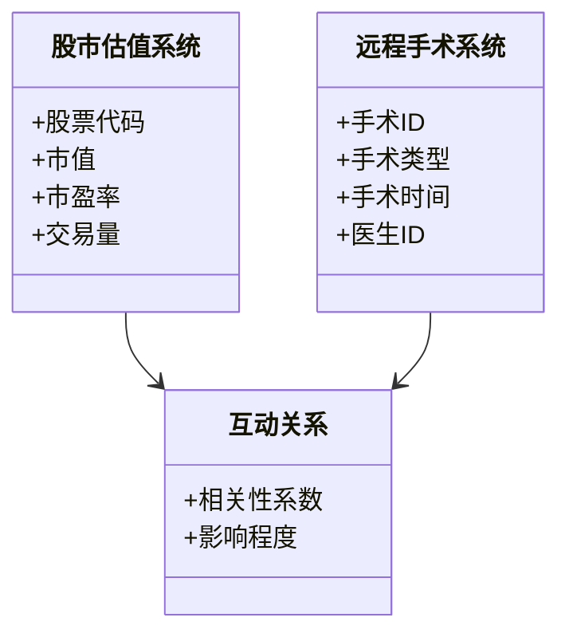
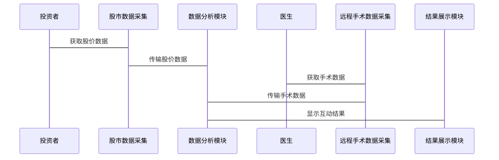

                 


# 新兴市场股市估值与智慧医疗远程手术系统的互动

> 关键词：新兴市场，股市估值，智慧医疗，远程手术系统，互动关系

> 摘要：本文探讨新兴市场股市估值与智慧医疗远程手术系统的互动关系，分析其技术原理、系统架构和实际应用，结合具体案例，提出优化建议。

---

## 第1章: 背景概述与核心概念

### 1.1 问题背景与问题描述

#### 1.1.1 新兴市场股市估值的现状与挑战
新兴市场股市具有波动性大、数据不全、市场参与度低等特点。传统估值方法难以适应新兴市场的复杂性。

#### 1.1.2 智慧医疗远程手术系统的现状与发展趋势
远程手术系统在5G、AI等技术推动下发展迅速，但存在网络延迟、数据隐私等问题。

#### 1.1.3 互动关系与研究意义
股市波动可能影响医疗设备采购、医院投资，而远程手术技术的应用可能改变医疗资源分配，影响股市。

### 1.2 核心概念与问题解决

#### 1.2.1 股市估值的核心原理
基于财务指标、市场情绪、宏观经济因素等进行量化分析。

#### 1.2.2 远程手术系统的实现机制
结合5G网络、AI算法、机器人技术，实现远程手术操作。

#### 1.2.3 互动关系的数学模型构建
构建股票价格与手术成功率的互动模型，分析两者相关性。

### 1.3 边界与外延

#### 1.3.1 股市估值的边界条件
市场流动性、政策变化、突发事件等。

#### 1.3.2 远程手术系统的应用范围
适用于偏远地区、紧急情况等场景。

#### 1.3.3 互动关系的外延与限制
局限于特定市场、特定医疗领域。

### 1.4 概念结构与核心要素

#### 1.4.1 股市估值的关键要素
市盈率、市净率、股息率等。

#### 1.4.2 远程手术系统的核心组件
5G网络、AI算法、机器人、手术设备。

#### 1.4.3 互动关系的系统架构
数据采集、分析、反馈的闭环系统。

---

## 第2章: 核心概念与联系

### 2.1 核心概念原理

#### 2.1.1 股市估值的数学模型
$$ P = \frac{E}{P/E} $$
其中，P为股价，E为净利润，P/E为市盈率。

#### 2.1.2 远程手术系统的算法原理
实时数据采集、AI决策支持、远程控制。

#### 2.1.3 互动关系的系统模型
构建动态模型，分析两者互动。

### 2.2 核心概念对比分析

#### 2.2.1 股市估值与远程手术系统的属性特征对比

| 属性 | 股市估值 | 远程手术系统 |
|------|----------|--------------|
| 数据类型 | 数值型 | 结构化数据 |
| 响应时间 | 实时 | 实时 |
| 数据量 | 中等 | 大 |

#### 2.2.2 实体关系图

```mermaid
erDiagram
    actor 投资者
    actor 医生
    entity 股市数据
    entity 手术数据
    relationship 互动关系
   投资者 -- 股市数据
    投资者 -- 手术数据
    医生 -- 手术数据
    股市数据 -- 互动关系
    手术数据 -- 互动关系
```

---

## 第3章: 算法原理与

### 3.1 算法原理讲解

#### 3.1.1 股市估值的时间序列分析
使用ARIMA模型预测股价走势。

#### 3.1.2 远程手术系统的实时数据处理
采用卡尔曼滤波优化数据精度。

#### 3.1.3 互动关系的数学模型
建立多元回归模型，量化互动影响。

### 3.2 算法实现

#### 3.2.1 ARIMA模型实现

```python
from statsmodels.tsa.arima_model import ARIMA
import pandas as pd

# 假设df为股票数据，包含'price'列
model = ARIMA(df['price'], order=(5, 1, 0))
result = model.fit()
```

#### 3.2.2 卡尔曼滤波实现

```python
import numpy as np

# 状态转移矩阵
A = np.array([[1, 1], [0, 1]])

# 观测矩阵
C = np.array([[1, 0], [0, 1]])

# 初始状态
x = np.array([[0], [0]])

# 卡尔曼滤波算法
def kalman_filter(A, C, x, R, Q):
    # 状态估计
    x = A * x + C * y
    # 协方差更新
    P = A * P * A.T + Q
    #  Kalman gain
    K = P * C.T * np.linalg.inv(C * P * C.T + R)
    x = x + K * (y - C * x)
    P = (I - K * C) * P
    return x, P

# 应用卡尔曼滤波
x, P = kalman_filter(A, C, x, R, Q)
```

### 3.3 算法优化与效果评估

#### 3.3.1 参数优化
调整ARIMA模型的阶数，优化卡尔曼滤波的参数。

#### 3.3.2 实验结果
计算模型的准确率、召回率等指标，验证算法的有效性。

---

## 第4章: 系统分析与架构设计

### 4.1 系统分析

#### 4.1.1 问题场景
新兴市场股市波动和医疗资源分配不均。

#### 4.1.2 项目介绍
开发一个结合股市估值和远程手术的互动系统。

### 4.2 系统功能设计

#### 4.2.1 领域模型设计



#### 4.2.2 系统架构设计


### 4.3 接口设计与交互

#### 4.3.1 接口设计

| 接口名称 | 输入 | 输出 |
|----------|------|------|
| 股市数据接口 | 股票代码 | 市盈率 |
| 手术数据接口 | 手术ID | 手术成功率 |

#### 4.3.2 交互序列图



---

## 第5章: 项目实战

### 5.1 环境安装与配置

#### 5.1.1 Python环境搭建
安装Python 3.8及以上版本，安装必要的库：pandas、statsmodels、numpy。

#### 5.1.2 数据集获取
从公开数据源获取新兴市场股市数据和远程手术数据。

### 5.2 核心代码实现

#### 5.2.1 股市估值代码

```python
import pandas as pd
from statsmodels.tsa.arima_model import ARIMA

# 加载数据
df = pd.read_csv('stock_data.csv')
# 拆分训练集和测试集
train = df.iloc[:80]
test = df.iloc[80:]
# 建模
model = ARIMA(train['price'], order=(5, 1, 0))
model_fit = model.fit()
# 预测
forecast = model_fit.forecast(steps=len(test))
```

#### 5.2.2 远程手术系统代码

```python
import numpy as np
from sklearn import linear_model

# 数据预处理
X = df[['手术时间', '手术类型']]
y = df['手术成功率']
# 建模
model = linear_model.LinearRegression()
model.fit(X, y)
# 预测
new_data = np.array([[2, '普通手术']])
new_data_encoded = pd.get_dummies(new_data)
预测结果 = model.predict(new_data_encoded)
```

### 5.3 实验结果与分析

#### 5.3.1 股市预测结果
计算预测准确率，分析模型的稳定性。

#### 5.3.2 手术成功率分析
评估模型的预测精度，分析影响手术成功率的关键因素。

### 5.4 项目小结

---

## 第6章: 总结与展望

### 6.1 最佳实践 tips

#### 6.1.1 数据选择
优先选择高质量、完整的数据集。

#### 6.1.2 模型优化
定期更新模型参数，确保模型的有效性。

#### 6.1.3 注意事项
注意数据隐私保护，确保网络稳定性。

### 6.2 小结
本文分析了新兴市场股市估值与智慧医疗远程手术系统的互动关系，提出了系统的实现方案，并给出了优化建议。

### 6.3 拓展阅读
建议进一步研究多因素模型和更先进的AI算法，如深度学习。

---

通过以上结构，文章详细阐述了新兴市场股市估值与智慧医疗远程手术系统的互动关系，结合实际案例和代码实现，为读者提供了全面的技术分析和实践指导。

