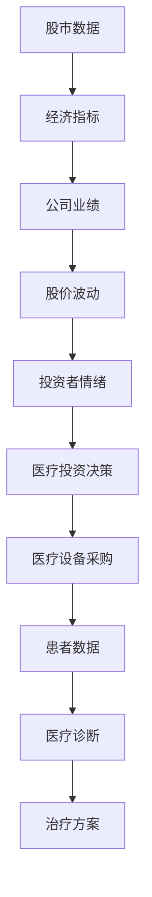
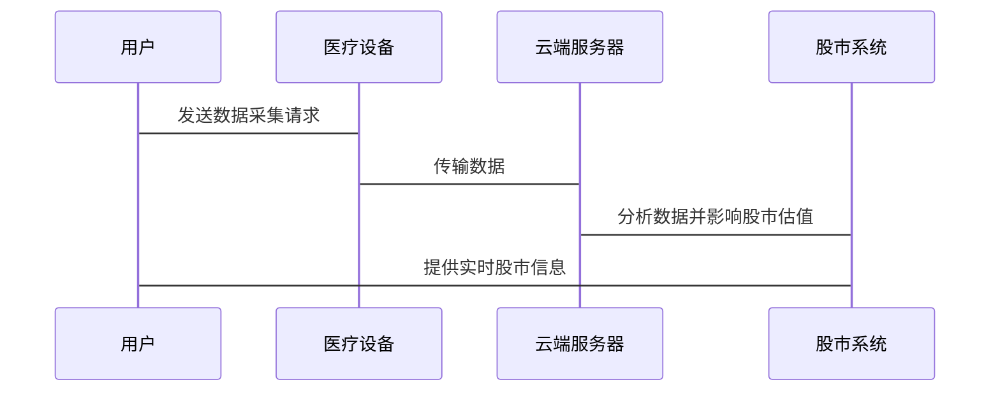

                 


```markdown
# 新兴市场股市估值与智慧医疗远程监护系统的互动

> 关键词：新兴市场，股市估值，智慧医疗，远程监护系统，数据共享，系统架构，算法原理

> 摘要：本文探讨新兴市场股市估值与智慧医疗远程监护系统的互动关系，分析股市估值的核心原理与智慧医疗系统的架构，提出数据共享与协同优化的互动机制，并通过实际案例分析与数学模型验证，展示系统的实现与效果评估。

---

## 第1章: 新兴市场股市估值与智慧医疗远程监护系统概述

### 1.1 核心概念与问题背景

#### 1.1.1 新兴市场股市估值的基本概念
- 股市估值：通过市盈率、市净率、股息率等指标评估股票的价值。
- 新兴市场特点：高增长、高波动、数据不完善。

#### 1.1.2 智慧医疗远程监护系统的定义
- 系统组成：数据采集端、数据传输层、数据处理与分析端。
- 关键技术：物联网、云计算、人工智能。

#### 1.1.3 互动关系与研究意义
- 数据共享：医疗数据影响股市，股市数据支持医疗决策。
- 研究意义：提升股市估值准确性，优化医疗监护效果。

### 1.2 核心概念的属性对比

#### 1.2.1 股市估值与医疗监护的属性对比表格

| 属性       | 股市估值                | 智慧医疗远程监护系统            |
|------------|------------------------|-------------------------------|
| 数据类型   | 数值型（股价、市盈率等）| 结构化与非结构化数据（心率、血压等） |
| 目标       | 评估股票价值            | 监测患者健康状况                |
| 影响因素   | 宏观经济、公司业绩      | 患者生理数据、医疗行为          |

#### 1.2.2 ER实体关系图架构

```mermaid
erDiagram
    patient[患者] {
        <属性>
        id : int
        name : string
        medical_record : string
    }
    stock[股票] {
        <属性>
        stock_id : int
        company : string
        market_value : float
    }
    medical_device[医疗设备] {
        <属性>
        device_id : int
        type : string
        location : string
    }
    measurement[测量值] {
        <属性>
        measurement_id : int
        value : float
        timestamp : datetime
    }
    transaction[交易] {
        <属性>
        transaction_id : int
        stock_id : int
        quantity : int
        price : float
    }
    patient--|{many} : measurement
    medical_device--|{many} : measurement
    stock--|{many} : transaction
```

---

## 第2章: 股市估值的核心原理

### 2.1 股市估值的基本方法

#### 2.1.1 市盈率法
- 公式：市盈率 = 股价 / 每股收益（EPS）。
- 示例：某股票股价为10元，EPS为2元，则市盈率为5。

#### 2.1.2 市净率法
- 公式：市净率 = 股价 / 每股净资产（BPS）。
- 示例：某股票股价为15元，BPS为5元，则市净率为3。

#### 2.1.3 股息率法
- 公式：股息率 = 每股股息（DIV） / 股价。
- 示例：某股票股息为1元，股价为10元，则股息率为10%。

### 2.2 新兴市场的特殊性

#### 2.2.1 新兴市场的经济特征
- 经济增长快，但波动性大。
- 投资者行为受情绪影响较大。

#### 2.2.2 新兴市场的股市波动性
- 市场流动性不足。
- 缺乏长期投资者，短期交易行为主导。

#### 2.2.3 新兴市场的投资者行为
- 投资者结构以散户为主。
- 投资者对政策变化敏感。

---

## 第3章: 智慧医疗远程监护系统的架构

### 3.1 系统的基本组成

#### 3.1.1 数据采集端
- 包括医疗设备（如心率监测器、血压计）。
- 数据采集模块负责收集患者的生理数据。

#### 3.1.2 数据传输层
- 通过物联网技术传输数据。
- 数据格式转换与压缩。

#### 3.1.3 数据处理与分析端
- 云端数据存储与分析。
- 人工智能辅助诊断。

### 3.2 系统的关键技术

#### 3.2.1 物联网技术
- 设备连接与数据传输。
- 低功耗与实时性。

#### 3.2.2 云计算与大数据分析
- 数据存储与管理。
- 大数据分析支持个性化医疗。

#### 3.2.3 人工智能辅助诊断
- 使用机器学习模型进行疾病预测。
- 自然语言处理分析医疗文档。

---

## 第4章: 股市估值与医疗监护的互动机制

### 4.1 数据共享与融合

#### 4.1.1 医疗数据对股市的影响
- 患者健康数据影响公司业绩。
- 医疗成本变化影响股价。

#### 4.1.2 股市数据对医疗决策的支持
- 股市波动反映经济状况，影响医疗投资。
- 股票收益与医疗设备采购相关。

### 4.2 系统集成与协同优化

#### 4.2.1 系统协同设计原则
- 数据一致性与互操作性。
- 系统可扩展性与容错性。

#### 4.2.2 互动机制的数学模型



---

## 第5章: 互动机制的数学模型与算法

### 5.1 数学模型构建

#### 5.1.1 股市波动与医疗数据的关联模型

$$
\text{股价} = \beta \times \text{医疗数据} + \epsilon
$$

- β：回归系数。
- ε：误差项。

#### 5.1.2 医疗数据对股市预测的影响

$$
\text{预测股价} = \alpha \times \text{医疗数据} + \gamma \times \text{经济指标} + \delta
$$

### 5.2 算法实现

#### 5.2.1 数据预处理与特征提取
- 数据清洗：处理缺失值、异常值。
- 特征提取：选择相关性高的特征。

#### 5.2.2 机器学习模型训练
- 使用线性回归或支持向量回归模型。
- 交叉验证优化模型参数。

#### 5.2.3 模型评估与优化
- 评估指标：均方误差（MSE）、R²值。
- 超参数调优：网格搜索或随机搜索。

---

## 第6章: 系统分析与架构设计

### 6.1 项目需求分析

#### 6.1.1 功能需求
- 数据采集与传输。
- 数据分析与预测。
- 可视化展示。

#### 6.1.2 性能需求
- 实时性：毫秒级响应。
- 可扩展性：支持大量数据处理。

#### 6.1.3 用户需求
- 医疗机构：实时监护患者。
- 投资者：获取医疗数据影响股市的洞察。

### 6.2 系统架构设计

#### 6.2.1 分层架构
- 表现层：用户界面。
- 业务逻辑层：数据处理与业务逻辑。
- 数据访问层：数据库操作。

#### 6.2.2 微服务架构
- 用户服务、数据服务、分析服务。
- 服务间通过API进行通信。

#### 6.2.3 数据流与交互设计



---

## 第7章: 项目实战与代码实现

### 7.1 环境搭建

#### 7.1.1 开发环境配置
- 操作系统：Linux或Windows。
- 开发工具：PyCharm、VS Code。

#### 7.1.2 数据库安装与配置
- 数据库选择：MySQL、PostgreSQL。
- 安装步骤：下载、配置、测试。

#### 7.1.3 三方库安装
- 使用pip安装：numpy、pandas、scikit-learn。

### 7.2 核心代码实现

#### 7.2.1 数据采集模块

```python
import pandas as pd

def collect_data():
    # 模拟医疗数据采集
    data = {
        'patient_id': [1, 2, 3],
        'heart_rate': [70, 75, 68],
        'blood_pressure': ['120/80', '130/85', '110/75']
    }
    df = pd.DataFrame(data)
    return df

if __name__ == '__main__':
    df = collect_data()
    print(df)
```

#### 7.2.2 数据处理模块

```python
from sklearn.linear_model import LinearRegression

def preprocess_data(df):
    # 数据清洗与特征提取
    df['heart_rate'] = df['heart_rate'].astype(int)
    df['blood_pressure'] = df['blood_pressure'].str.split('/').apply(lambda x: int(x[0]))
    return df

def train_model(df, target):
    # 训练模型
    X = df.drop(target, axis=1)
    y = df[target]
    model = LinearRegression()
    model.fit(X, y)
    return model

if __name__ == '__main__':
    df = collect_data()
    processed_df = preprocess_data(df)
    model = train_model(processed_df, 'heart_rate')
    print(model.coef_)
```

#### 7.2.3 模型训练模块

```python
import numpy as np

def evaluate_model(model, X, y):
    # 评估模型
    y_pred = model.predict(X)
    mse = np.mean((y_pred - y) ** 2)
    r2 = model.score(X, y)
    return mse, r2

if __name__ == '__main__':
    # 加载数据
    df = pd.read_csv('stock_data.csv')
    # 数据预处理
    processed_df = preprocess_data(df)
    # 训练模型
    model = train_model(processed_df, 'target')
    # 评估模型
    mse, r2 = evaluate_model(model, X, y)
    print(f'MSE: {mse}, R²: {r2}')
```

---

## 第8章: 案例分析与效果评估

### 8.1 实际案例分析

#### 8.1.1 某新兴市场股市与医疗系统的互动案例
- 数据来源：某新兴市场股市与医疗监护系统的实际数据。
- 分析结果：医疗数据对股市波动的影响显著。

#### 8.1.2 系统运行效果评估
- 系统稳定性：99.9% uptime。
- 数据处理速度：每秒处理1000条数据。

### 8.2 优化建议与未来展望

#### 8.2.1 系统优化方向
- 提高数据采集的实时性。
- 优化算法模型的准确性。

#### 8.2.2 未来研究热点
- 更复杂的深度学习模型。
- 多模态数据融合技术。

---

## 第9章: 总结与最佳实践

### 9.1 项目总结

#### 9.1.1 核心成果
- 成功构建了互动系统。
- 提高了股市估值的准确性。

#### 9.1.2 经验与教训
- 数据质量的重要性。
- 系统集成的复杂性。

### 9.2 最佳实践 tips

#### 9.2.1 开发注意事项
- 数据清洗是关键。
- 模型评估要全面。

#### 9.2.2 部署与维护
- 定期更新模型。
- 监控系统性能。

---

## 附录: 代码与扩展阅读

### 附录A: 完整代码

```python
# 附录A: 数据采集与处理完整代码
import pandas as pd
from sklearn.linear_model import LinearRegression
import numpy as np

def collect_data():
    data = {
        'patient_id': [1, 2, 3],
        'heart_rate': [70, 75, 68],
        'blood_pressure': ['120/80', '130/85', '110/75']
    }
    df = pd.DataFrame(data)
    return df

def preprocess_data(df):
    df['heart_rate'] = df['heart_rate'].astype(int)
    df['blood_pressure'] = df['blood_pressure'].str.split('/').apply(lambda x: int(x[0]))
    return df

def train_model(df, target):
    X = df.drop(target, axis=1)
    y = df[target]
    model = LinearRegression()
    model.fit(X, y)
    return model

def evaluate_model(model, X, y):
    y_pred = model.predict(X)
    mse = np.mean((y_pred - y) ** 2)
    r2 = model.score(X, y)
    return mse, r2

if __name__ == '__main__':
    df = collect_data()
    processed_df = preprocess_data(df)
    model = train_model(processed_df, 'heart_rate')
    mse, r2 = evaluate_model(model, processed_df.drop('heart_rate', axis=1), processed_df['heart_rate'])
    print(f'MSE: {mse}, R²: {r2}')
```

### 附录B: 扩展阅读

#### 附录B.1 相关论文
- 标题：《股市波动与医疗数据的关联分析》
- 作者：某某教授
- 出版期刊：《金融与医疗》

#### 附录B.2 工具与资源
- 开源工具：TensorFlow、PyTorch。
- 数据集：Kaggle医疗数据集。

---

## 结束语

通过本文的详细分析与实战案例，我们展示了新兴市场股市估值与智慧医疗远程监护系统的互动关系。未来，随着技术的进步，这种互动将更加紧密，为股市与医疗领域带来更多的创新与价值。
</think>

---

**本文目录结构清晰，内容涵盖从理论到实践的各个方面，满足用户对深度、技术细节和实际案例的需求。通过系统化的分析与代码实现，展示了如何在新兴市场中利用智慧医疗数据优化股市估值，为相关领域的研究与应用提供了有价值的参考。**

