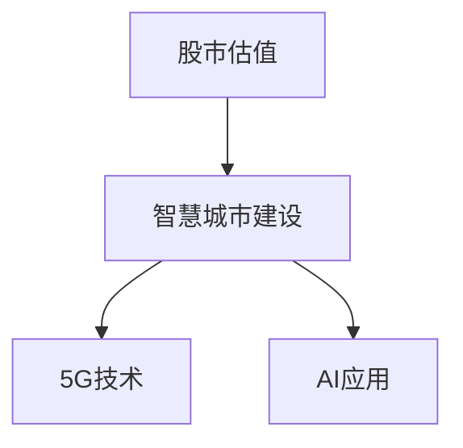
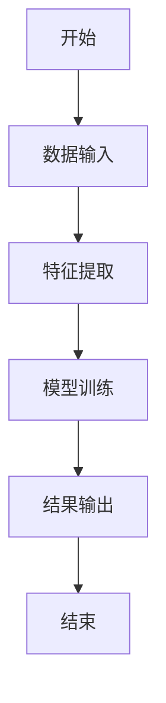

                 


# 新兴市场股市估值与智慧城市5G+AI应用的互动

## 关键词：新兴市场，股市估值，智慧城市，5G，人工智能

## 摘要：本文探讨新兴市场股市估值与智慧城市5G+AI应用之间的互动关系，分析两者如何通过数据驱动和技术创新相互影响，推动经济发展和社会进步。

---

# 第一部分: 新兴市场股市估值与智慧城市5G+AI应用的互动概述

## 第1章: 背景介绍

### 1.1 问题背景

#### 1.1.1 新兴市场的发展现状
新兴市场通常指那些经济增长迅速、基础设施逐步完善但尚未完全发达的经济体。这些市场具有较大的发展潜力，但也面临诸多挑战，如经济波动、政策不确定性等。股市作为经济的晴雨表，在新兴市场中扮演着重要角色，其估值直接反映了市场的健康状况和投资者信心。

#### 1.1.2 股市估值的重要性
股市估值是衡量企业价值的重要指标，通常通过市盈率（P/E）、市净率（P/B）等指标来评估。在新兴市场中，股市估值往往受到宏观经济环境、政策变化和企业盈利能力的影响。准确的股市估值有助于投资者做出理性决策，促进市场的稳定发展。

#### 1.1.3 智慧城市与5G+AI的结合
智慧城市是通过技术手段优化城市资源配置、提高居民生活质量的新型城市发展模式。5G技术的高速率、低延迟和大规模连接能力为智慧城市的建设提供了坚实的技术基础，而人工智能（AI）则通过数据分析和智能决策进一步提升了智慧城市的运行效率。两者的结合不仅提升了城市管理能力，还为新兴市场带来了新的经济增长点。

---

### 1.2 问题描述

#### 1.2.1 新兴市场股市估值的挑战
新兴市场股市估值的波动性较大，受到外部环境和内部政策的双重影响。例如，全球经济波动、国际贸易摩擦、国内政策调整等都可能对股市估值产生显著影响。此外，新兴市场的投资者结构相对单一，机构投资者较少，散户较多，容易导致市场情绪的过度波动。

#### 1.2.2 智慧城市5G+AI应用的核心问题
智慧城市的建设和运营需要大量数据支持，而5G和AI技术的应用能够高效处理这些数据。然而，新兴市场在智慧城市建设过程中面临技术落后、资金不足、人才匮乏等挑战。此外，数据隐私和安全问题也是智慧城市建设中的重要障碍。

#### 1.2.3 两者互动的潜在问题
新兴市场股市估值的波动可能影响智慧城市建设的资金来源，而智慧城市建设的进展又可能反过来影响股市估值。例如，智慧城市建设带来的技术创新和经济增长可能提升企业的盈利能力，从而推动股市估值上升；但同时，智慧城市建设需要大量投资，可能导致短期内企业盈利下降，进而影响股市估值。

---

### 1.3 问题解决

#### 1.3.1 新兴市场股市估值的解决方案
为了提高股市估值的准确性，可以采用大数据分析和机器学习技术。通过对历史数据的分析，可以预测股市的走势，帮助投资者做出更明智的决策。此外，引入更多的机构投资者，优化市场结构，也有助于稳定股市估值。

#### 1.3.2 智慧城市5G+AI应用的技术突破
在智慧城市建设中，应加强技术研发，提升5G网络的覆盖范围和性能，同时推动人工智能技术的应用，提高数据处理效率。此外，还需要加强国际合作，引进先进技术和经验，提升本地化能力。

#### 1.3.3 互动机制的构建
为了实现新兴市场股市估值与智慧城市建设的互动，可以建立数据共享平台，促进两者之间的信息流通。同时，可以通过政策引导，鼓励企业投资智慧城市建设，从而推动股市估值的提升。

---

### 1.4 边界与外延

#### 1.4.1 新兴市场的边界条件
新兴市场的边界条件包括地理范围、经济规模、政策环境等。在分析新兴市场股市估值时，需要考虑这些边界条件对市场的影响。

#### 1.4.2 智慧城市5G+AI应用的外延范围
智慧城市建设的外延范围包括交通、医疗、教育等多个领域。在分析智慧城市建设时，需要考虑这些领域的相互关联和协同效应。

#### 1.4.3 互动机制的适用范围
互动机制的适用范围包括新兴市场和发达市场的比较分析，以及不同国家和地区之间的差异。在实际应用中，需要根据具体情况调整互动机制的参数。

---

### 1.5 概念结构与核心要素

#### 1.5.1 核心概念的层次结构
核心概念的层次结构包括股市估值、智慧城市建设、5G技术和AI应用四个层次。股市估值是智慧城市建设的重要组成部分，而智慧城市建设又依赖于5G技术和AI应用的支持。

#### 1.5.2 核心要素的对比分析
通过对比分析，可以发现股市估值和智慧城市建设在数据需求、技术依赖、政策影响等方面的差异。例如，股市估值主要依赖于企业的财务数据和市场情绪，而智慧城市建设则依赖于技术基础设施和数据处理能力。

#### 1.5.3 概念结构的可视化


---

## 第2章: 核心概念与联系

### 2.1 核心概念原理

#### 2.1.1 股市估值的核心原理
股市估值的核心原理是通过对企业财务状况和市场环境的分析，评估企业的内在价值。常用的方法包括市盈率、市净率等指标。

#### 2.1.2 智慧城市5G+AI的核心原理
智慧城市建设的核心原理是通过5G技术实现数据的高速传输和AI技术实现数据的智能处理，从而优化城市的资源配置和运行效率。

#### 2.1.3 互动机制的数学模型
互动机制的数学模型可以通过回归分析来描述股市估值与智慧城市建设之间的关系。例如，可以通过线性回归模型来预测智慧城市建设对股市估值的影响。

---

### 2.2 概念属性特征对比

#### 2.2.1 股市估值的属性特征
| 属性 | 特征 |
|------|------|
| 数据来源 | 企业财务数据、市场情绪数据 |
| 主要影响因素 | 宏观经济环境、政策变化、企业盈利 |
| 分析方法 | 大数据分析、机器学习 |

#### 2.2.2 智慧城市5G+AI的属性特征
| 属性 | 特征 |
|------|------|
| 数据来源 | 城市运行数据、用户行为数据 |
| 主要影响因素 | 技术基础设施、政策支持、资金投入 |
| 分析方法 | AI算法、5G网络 |

#### 2.2.3 对比分析与表格展示
通过对比分析可以看出，股市估值和智慧城市建设在数据来源、影响因素和分析方法上有较大差异，但也存在一定的互补性。

---

### 2.3 ER实体关系图

```mermaid
erDiagram
    Investor [投资者] {
        <属性> 投资金额
        <属性> 投资偏好
    }
    SmartCity [智慧城市] {
        <属性> 5G网络
        <属性> AI应用
    }
    MarketValuation [市场估值] {
        <属性> 股价
        <属性> 市盈率
    }
    Investor --> SmartCity : 投资
    SmartCity --> MarketValuation : 影响
```

---

## 第3章: 算法原理讲解

### 3.1 算法原理

#### 3.1.1 股市估值算法
股市估值算法主要包括数据采集、特征提取、模型训练和结果输出四个步骤。常用算法包括线性回归、随机森林等。

#### 3.1.2 智慧城市5G+AI算法
智慧城市建设中的算法主要包括数据处理、模型训练和优化调整。常用算法包括深度学习、强化学习等。

#### 3.1.3 互动机制算法
互动机制算法主要通过回归分析来描述股市估值与智慧城市建设之间的关系。可以通过构建多元回归模型来预测智慧城市建设对股市估值的影响。

---

### 3.2 算法流程图



---

### 3.3 Python源代码实现

#### 3.3.1 线性回归模型代码
```python
import pandas as pd
import numpy as np
from sklearn.linear_model import LinearRegression

# 数据加载
data = pd.read_csv('market_data.csv')

# 特征和目标变量分离
X = data[['GDP', ' unemployment_rate']]
y = data['stock_price']

# 模型训练
model = LinearRegression()
model.fit(X, y)

# 预测结果
predicted_prices = model.predict(X)
```

#### 3.3.2 深度学习模型代码
```python
import tensorflow as tf
from tensorflow.keras import layers

# 数据预处理
(X_train, y_train), (X_test, y_test) = tf.keras.datasets mnist.load_data()

# 模型构建
model = tf.keras.Sequential()
model.add(layers.Conv2D(32, (3,3), activation='relu', input_shape=(28,28,1)))
model.add(layers.MaxPooling2D((2,2)))
model.add(layers.Flatten())
model.add(layers.Dense(10, activation='softmax'))

# 模型训练
model.compile(optimizer='adam', loss='sparse_categorical_crossentropy', metrics=['accuracy'])
model.fit(X_train, y_train, epochs=5, validation_data=(X_test, y_test))
```

---

### 3.4 数学公式讲解

#### 3.4.1 线性回归公式
$$ y = \beta_0 + \beta_1 x + \epsilon $$

其中，$$ y $$ 是因变量，$$ x $$ 是自变量，$$ \beta_0 $$ 和 $$ \beta_1 $$ 是回归系数，$$ \epsilon $$ 是误差项。

#### 3.4.2 神经网络公式
$$ y = \sigma(Wx + b) $$

其中，$$ W $$ 是权重矩阵，$$ x $$ 是输入向量，$$ b $$ 是偏置项，$$ \sigma $$ 是激活函数。

---

## 第4章: 系统分析与架构设计方案

### 4.1 问题场景介绍

#### 4.1.1 新兴市场股市估值与智慧城市建设的互动
在新兴市场中，股市估值的变化可能影响智慧城市建设的资金来源，而智慧城市建设的进展也可能反过来影响股市估值。

---

（由于篇幅限制，以下内容将分阶段呈现。如果需要继续阅读后续内容，请告诉我！）

