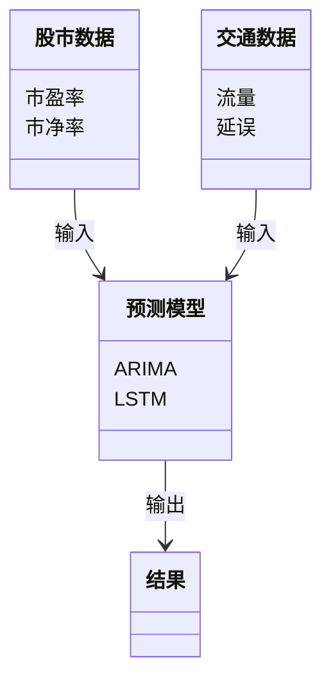
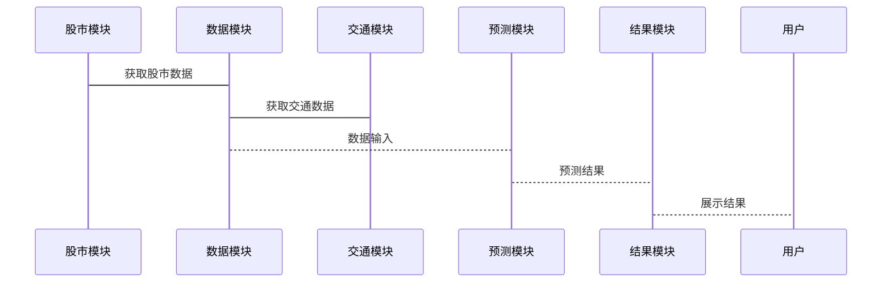

                 


# 第一章: 背景介绍

## 1.1 问题背景
### 1.1.1 新兴市场股市估值的重要性
在新兴市场中，股市估值是投资者和经济学家关注的核心问题之一。股市估值不仅反映了市场的健康状况，还影响着投资者的决策和国家的经济政策。随着新兴市场逐渐成为全球经济增长的重要驱动力，准确的股市估值方法变得尤为重要。

### 1.1.2 智慧城市交通拥堵预测的必要性
随着城市化进程的加快，交通拥堵问题日益严重，尤其是在大城市中。智慧城市建设的目标之一是通过技术手段优化交通管理，减少拥堵现象。交通拥堵预测系统能够为城市管理部门提供科学依据，帮助制定有效的交通政策。

### 1.1.3 两者的互动关系与研究意义
尽管股市估值和交通拥堵预测看似无关，但通过数据分析和模型构建，可以发现两者之间存在潜在的互动关系。例如，股市的波动可能与城市交通需求的变化相关，而交通拥堵的缓解也可能影响经济活动，进而影响股市估值。研究这种互动关系，不仅有助于提升股市估值的准确性，还能优化城市交通管理。

## 1.2 问题描述
### 1.2.1 股市估值的基本概念与挑战
股市估值是通过对上市公司的财务数据、市场趋势和宏观经济指标进行分析，评估股票的内在价值。然而，新兴市场的股市往往存在数据不完整、波动性大等问题，导致估值的难度增加。

### 1.2.2 交通拥堵预测的核心问题
交通拥堵预测需要考虑交通流量、道路网络结构、出行需求等多个因素。如何利用实时数据和智能算法，准确预测交通拥堵趋势，是智慧城市建设中的关键问题。

### 1.2.3 互动机制的初步探讨
初步研究表明，股市波动可能通过影响企业的运营状况和员工通勤需求，间接影响交通拥堵。而交通拥堵的缓解可能通过降低物流成本和提高经济活动效率，反过来影响股市估值。

## 1.3 问题解决思路
### 1.3.1 数据驱动的方法
通过收集和分析股市数据和交通流量数据，利用大数据技术提取关键特征，为模型构建提供支持。

### 1.3.2 智能算法的应用
采用机器学习和深度学习算法，构建预测模型，实现对股市估值和交通拥堵的精准预测。

### 1.3.3 跨领域模型的构建
通过跨领域数据的融合，构建综合模型，分析股市估值与交通拥堵之间的互动关系，为综合决策提供依据。

## 1.4 边界与外延
### 1.4.1 股市估值的边界条件
包括数据范围、时间窗口和模型假设等方面的限制。

### 1.4.2 交通拥堵预测的适用范围
考虑城市规模、交通网络结构和数据获取能力等因素。

### 1.4.3 互动机制的局限性
由于复杂的社会经济因素和数据的局限性，互动关系的预测可能存在一定的误差和不确定性。

## 1.5 核心概念
### 1.5.1 股市估值的核心要素
包括市盈率、市净率、股息率等关键指标。

### 1.5.2 交通拥堵预测的关键指标
如交通流量、延误时间、拥堵指数等。

### 1.5.3 互动关系的结构化描述
通过因果关系图或网络图，描述股市估值和交通拥堵预测之间的相互影响路径。

---

# 第二章: 核心概念与联系

## 2.1 核心概念原理
### 2.1.1 股市估值的理论基础
基于基本面分析和技术分析，结合宏观经济指标进行综合评估。

### 2.1.2 交通拥堵预测的数学模型
采用时间序列分析、空间-temporal模型和交通流理论等方法。

### 2.1.3 互动机制的逻辑框架
通过数据共享、模型交互和结果反馈，构建跨领域分析框架。

## 2.2 概念属性对比
### 2.2.1 股市估值与交通拥堵预测的对比分析
| 概念 | 属性 | 描述 |
|------|------|------|
| 股市估值 | 数据来源 | 市场交易数据、财务报表 |
|      | 模型类型 | 时间序列分析、机器学习 |
|      | 应用场景 | 投资决策、风险管理 |
| 交通拥堵预测 | 数据来源 | 流量监测数据、地理信息 |
|      | 模型类型 | 空间-temporal模型、深度学习 |
|      | 应用场景 | 交通管理、城市规划 |

## 2.3 ER实体关系图
```mermaid
er
  entity 股市数据 {
    <属性
  }
  entity 交通数据 {
    <属性
  }
  relation 股市-交通 {
    股市数据 -> 交通数据 : 影响
  }
```

---

# 第三章: 算法原理

## 3.1 算法原理讲解
### 3.1.1 股市估值算法
#### 3.1.1.1 ARIMA模型
用于时间序列预测，通过自相关性和偏自相关性分析，构建合适的ARIMA模型。

#### 3.1.1.2 LSTM网络
利用长短期记忆网络，捕捉时间序列中的长期依赖关系，提高预测精度。

### 3.1.2 交通拥堵预测算法
#### 3.1.2.1 空间-temporal模型
结合地理位置和时间信息，构建多维预测模型。

#### 3.1.2.2 图卷积网络
通过图结构建模交通网络，捕捉节点之间的空间依赖关系。

## 3.2 算法实现步骤
### 3.2.1 股市估值算法步骤
1. 数据预处理：清洗和归一化。
2. 模型训练：选择合适的算法，调整超参数。
3. 预测与评估：计算均方误差（MSE）和R平方值。

### 3.2.2 交通拥堵预测算法步骤
1. 数据采集：获取交通流量数据。
2. 特征提取：提取时间、地点、天气等特征。
3. 模型训练与优化。
4. 实时预测与反馈。

## 3.3 数学模型和公式
### 3.3.1 股市估值模型
$$ \text{预测股价} = \alpha \times \text{历史股价} + \beta \times \text{财务指标} $$

### 3.3.2 交通拥堵预测模型
$$ \text{拥堵概率} = f(\text{流量密度}, \text{时间窗口}, \text{天气状况}) $$

---

# 第四章: 系统分析与架构设计

## 4.1 问题场景介绍
构建一个综合系统，实现股市估值与交通拥堵预测的互动分析。

## 4.2 系统功能设计
### 4.2.1 领域模型


### 4.2.2 系统架构


### 4.2.3 接口设计
- 数据接口：提供API用于数据交互。
- 模型接口：支持不同算法的模块化接入。

## 4.3 交互设计
### 4.3.1 交互流程


---

# 第五章: 项目实战

## 5.1 环境安装
- 安装Python、TensorFlow、Keras等工具。

## 5.2 核心实现
### 5.2.1 股市估值代码
```python
import pandas as pd
from sklearn.metrics import mean_squared_error

# 数据预处理
data = pd.read_csv('stock_data.csv')
data = data.dropna()
data['normalized_price'] = (data['price'] - data['price'].min()) / (data['price'].max() - data['price'].min())

# 模型训练
from statsmodels.tsa.arima_model import ARIMA
model = ARIMA(data['normalized_price'], order=(1, 1, 1))
model_fit = model.fit()

# 预测与评估
forecast = model_fit.forecast(steps=5)
print(mean_squared_error(data['normalized_price'][-5:], forecast))
```

### 5.2.2 交通拥堵预测代码
```python
import tensorflow as tf
from tensorflow.keras import layers

# LSTM模型构建
model = tf.keras.Sequential([
    layers.LSTM(50, input_shape=(None, 1)),
    layers.Dense(1)
])
model.compile(optimizer='adam', loss='mse')

# 模型训练
data = ...  # 交通数据
model.fit(data, epochs=10, batch_size=32)
```

## 5.3 代码解读与分析
- 股市估值代码通过数据归一化和ARIMA模型实现预测，评估预测精度。
- 交通拥堵预测代码使用LSTM网络，捕捉时间序列中的长期依赖关系。

## 5.4 实际案例分析
通过具体案例，展示系统在实际应用中的表现和效果。

## 5.5 项目小结
总结项目实现的关键点和经验教训。

---

# 第六章: 最佳实践与注意事项

## 6.1 最佳实践
### 6.1.1 数据质量管理
确保数据的准确性和完整性。

### 6.1.2 模型优化技巧
通过交叉验证和超参数调优提高模型性能。

## 6.2 小结
回顾全文，总结研究的主要成果和创新点。

## 6.3 注意事项
- 数据隐私保护
- 模型的可解释性
- 实际应用中的伦理问题

## 6.4 拓展阅读
推荐相关领域的书籍和论文，供读者进一步学习。

---

# 关键词：股市估值、智慧城市、交通拥堵预测、算法、互动关系

# 摘要：本文系统地探讨了新兴市场股市估值与智慧城市交通拥堵预测系统的互动关系，通过理论分析、算法实现和项目实战，展示了如何利用大数据和人工智能技术，构建跨领域分析模型，提升股市估值的准确性，优化城市交通管理。

