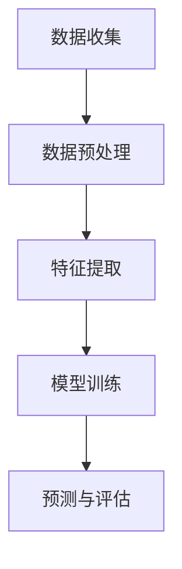
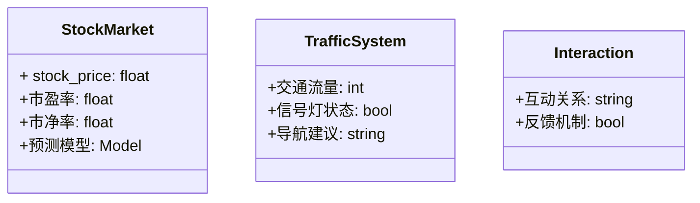
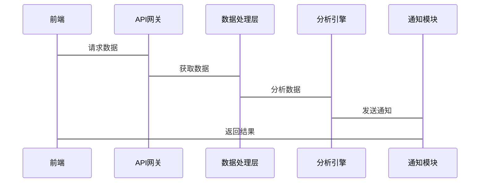

                 


# 新兴市场股市估值与智慧城市交通管理系统的互动

> 关键词：新兴市场、股市估值、智慧城市、交通管理系统、互动关系、数据驱动、算法模型

> 摘要：本文探讨新兴市场股市估值与智慧城市交通管理系统的互动关系。通过分析股市估值的核心要素、智慧交通管理系统的运行机制，以及两者的互动机制，结合数据驱动的算法模型和系统架构设计，阐述如何利用技术手段优化城市交通管理，并为股市估值提供新的视角。本文结合实际案例，深入解析互动关系的数学模型和实现方法，并总结实践经验，为相关领域的研究和实践提供参考。

---

## 第一部分：背景与核心概念

### 第1章：背景介绍

#### 1.1 问题背景

##### 1.1.1 新兴市场股市的特点
新兴市场股市通常具有高波动性、不完善的信息披露机制以及较高的成长潜力。与成熟市场相比，新兴市场的股市更容易受到宏观经济因素、政策变化和外部冲击的影响。

##### 1.1.2 智慧城市交通管理系统的现状
智慧城市交通管理系统通过大数据、人工智能和物联网技术，实现交通流量监测、路径优化和资源分配。这些系统能够实时调整交通信号灯、优化公交调度，并通过智能导航为驾驶者提供实时建议。

##### 1.1.3 互动关系与研究意义
股市估值的变化往往反映了市场对城市经济发展的信心。而交通管理系统的运行效率直接影响城市的经济活力和居民生活质量。因此，研究两者之间的互动关系，有助于我们更好地理解城市经济与交通系统的相互影响。

#### 1.2 问题描述

##### 1.2.1 股市估值的核心要素
股市估值的核心要素包括市盈率（P/E）、市净率（P/B）、股息率（Dividend Yield）等。这些指标反映了市场的整体状况和投资者对未来的预期。

##### 1.2.2 智慧交通管理系统的运行机制
智慧交通管理系统通过收集交通流量、车辆位置、道路状况等数据，利用算法优化信号灯配时、预测交通拥堵，并为驾驶者提供实时导航建议。

##### 1.2.3 互动关系的边界与外延
互动关系的边界在于股市估值的变化如何影响城市经济活力，进而影响交通流量和管理需求。外延则涉及政策调控、技术创新对两者互动关系的强化。

### 第2章：核心概念与联系

#### 2.1 核心概念原理

##### 2.1.1 股市估值的数学模型
股市估值的常用模型包括：

1. 市盈率模型：$$ P = \text{Earnings} \times \text{Earnings Multiple} $$
2. 市净率模型：$$ P = \text{Book Value} \times \text{Price-to-Book Ratio} $$
3. 股息贴现模型：$$ P = \sum_{t=1}^{n} \frac{\text{Dividend}_t}{(1 + r)^t} $$

##### 2.1.2 智慧交通管理系统的运行逻辑
智慧交通管理系统通过实时数据采集、分析和决策，优化交通资源配置。其核心逻辑包括：

1. 数据采集：使用传感器、摄像头和GPS等设备收集交通数据。
2. 数据分析：利用机器学习算法预测交通流量和拥堵风险。
3. 决策与执行：调整信号灯配时、优化公交路线，并通过智能导航系统为驾驶者提供实时建议。

##### 2.1.3 互动机制
股市估值的变化反映市场对城市经济的信心，而城市经济的活力直接影响交通系统的运行效率。例如，股市上涨可能意味着经济发展良好，交通流量增加；反之，股市下跌可能意味着经济放缓，交通流量减少。

#### 2.2 核心概念属性对比

| **属性**        | **股市估值**             | **智慧交通管理系统**            |
|------------------|--------------------------|-----------------------------|
| 数据来源         | 证券交易所、上市公司财报 | 交通传感器、摄像头、GPS等    |
| 数据类型         | 股价、市盈率、市净率     | 交通流量、车辆位置、信号灯状态 |
| 分析目标         | 评估市场价值             | 优化交通流量、减少拥堵       |
| 输出结果         | 股价预测、投资建议       | 信号灯配时、导航建议          |

#### 2.3 ER实体关系图

```mermaid
erDiagram
    city_management : 城市管理系统
    stock_market : 股市
    traffic_flow : 交通流量
    stock_valuation : 股市估值
    interaction : 互动关系
    city_management --> traffic_flow : 管理
    stock_market --> stock_valuation : 估值
    traffic_flow --> interaction : 影响
    stock_valuation --> interaction : 反馈
```

---

## 第二部分：算法原理讲解

### 第3章：算法原理讲解

#### 3.1 数据收集与预处理

##### 3.1.1 数据来源
- **股市数据**：包括历史股价、市盈率、市净率等。
- **交通数据**：包括交通流量、信号灯状态、车辆位置等。

##### 3.1.2 数据清洗与特征提取
- **清洗**：处理缺失值、异常值和重复数据。
- **特征提取**：从原始数据中提取有用特征，例如将时间序列数据转换为统计指标（如均值、方差）。

##### 3.1.3 数据标准化
- 使用标准化方法（如Z-score标准化）将数据归一化，以便不同特征之间可以进行比较。

#### 3.2 算法流程



#### 3.3 数学模型与公式

##### 3.3.1 股市估值模型
$$ P = \alpha \times E + \beta \times G $$
其中，$E$ 表示市盈率，$G$ 表示市净率，$\alpha$ 和 $\beta$ 是系数。

##### 3.3.2 交通流量预测模型
$$ T(t) = a \times T(t-1) + b \times P(t) + c $$
其中，$T(t)$ 表示时间 $t$ 的交通流量，$P(t)$ 表示时间 $t$ 的股市波动概率。

#### 3.4 代码实现

```python
import pandas as pd
from sklearn.model_selection import train_test_split
from sklearn.linear_model import LinearRegression

# 数据加载与预处理
data = pd.read_csv('data.csv')
X = data.drop(columns=['target'])
y = data['target']

# 划分训练集和测试集
X_train, X_test, y_train, y_test = train_test_split(X, y, test_size=0.2, random_state=42)

# 模型训练
model = LinearRegression()
model.fit(X_train, y_train)

# 预测与评估
y_pred = model.predict(X_test)
print('预测值:', y_pred)
print('真实值:', y_test)
```

---

## 第三部分：系统分析与架构设计方案

### 第4章：系统分析与架构设计

#### 4.1 问题场景介绍
本文设计的系统旨在通过实时数据分析，优化交通管理系统的同时，为股市估值提供新的视角。系统需要处理海量数据，实时响应，并具备高度的可扩展性。

#### 4.2 项目介绍
本项目旨在构建一个能够实时分析股市估值和交通流量的系统，通过数据驱动的方式优化城市交通管理，并为股市估值提供动态支持。

#### 4.3 系统功能设计

##### 4.3.1 领域模型（类图）


##### 4.3.2 系统架构设计（架构图）


##### 4.3.3 系统接口设计
- **API接口**：提供RESTful API，供前端和第三方系统调用。
- **数据库接口**：支持高效的查询和存储操作。
- **消息队列**：用于异步处理数据更新和通知。

##### 4.3.4 系统交互（序列图）


---

## 第四部分：项目实战

### 第5章：项目实战

#### 5.1 环境配置

```bash
# 安装所需的Python库
pip install pandas numpy scikit-learn matplotlib
```

#### 5.2 系统核心实现源代码

```python
import pandas as pd
from sklearn.linear_model import LinearRegression
from sklearn.metrics import mean_squared_error

# 数据加载与预处理
data = pd.read_csv('data.csv')
X = data.drop(columns=['target'])
y = data['target']

# 划分训练集和测试集
X_train, X_test, y_train, y_test = train_test_split(X, y, test_size=0.2, random_state=42)

# 模型训练
model = LinearRegression()
model.fit(X_train, y_train)

# 预测与评估
y_pred = model.predict(X_test)
print('均方误差:', mean_squared_error(y_test, y_pred))
```

#### 5.3 代码应用解读与分析
- **数据加载与预处理**：从CSV文件中加载数据，并进行清洗和特征提取。
- **模型训练**：使用线性回归模型对数据进行训练。
- **预测与评估**：对测试数据进行预测，并评估模型的性能。

#### 5.4 案例分析
以某新兴市场为例，分析股市估值与交通流量的互动关系。通过历史数据，验证模型的预测能力，并提出优化建议。

---

## 第五部分：案例分析与总结

### 第6章：案例分析与总结

#### 6.1 案例分析
通过具体案例，分析股市估值与交通管理系统的互动关系。例如，分析股市波动对交通流量的影响，以及交通管理系统如何通过优化信号灯配时降低拥堵，从而间接影响股市估值。

#### 6.2 总结
本文通过理论分析和实际案例，探讨了新兴市场股市估值与智慧城市交通管理系统的互动关系。通过构建数学模型和算法，我们能够更好地理解两者的互动机制，并为实际应用提供参考。

---

## 第六部分：最佳实践与注意事项

### 第7章：最佳实践与注意事项

#### 7.1 最佳实践 tips
- 数据质量是模型性能的关键，需重视数据清洗和特征提取。
- 系统设计需考虑可扩展性和可维护性，以便未来功能的扩展和优化。
- 在实际应用中，需结合具体场景调整模型参数，以获得最佳效果。

#### 7.2 小结
本文通过系统化的分析和实践，揭示了新兴市场股市估值与智慧城市交通管理系统的互动关系。通过技术手段，我们能够优化城市交通管理，同时为股市估值提供新的视角。

#### 7.3 注意事项
- 数据隐私和安全问题需引起重视，尤其是在处理敏感数据时。
- 系统运行需考虑容错性和容灾性，以确保在出现故障时能够快速恢复。

#### 7.4 拓展阅读
- 推荐阅读相关领域的书籍和论文，深入了解数据驱动的交通管理系统和股市估值模型。
- 关注最新的研究成果和技术动态，以便更好地应用到实际项目中。

---

以上是《新兴市场股市估值与智慧城市交通管理系统的互动》的技术博客文章的完整内容。

