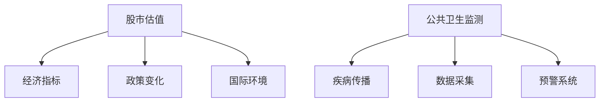
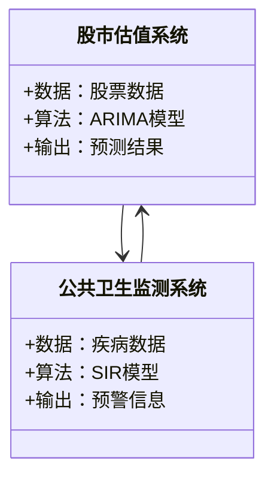
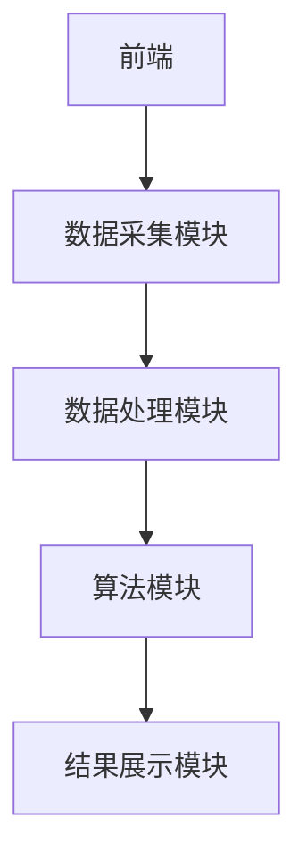
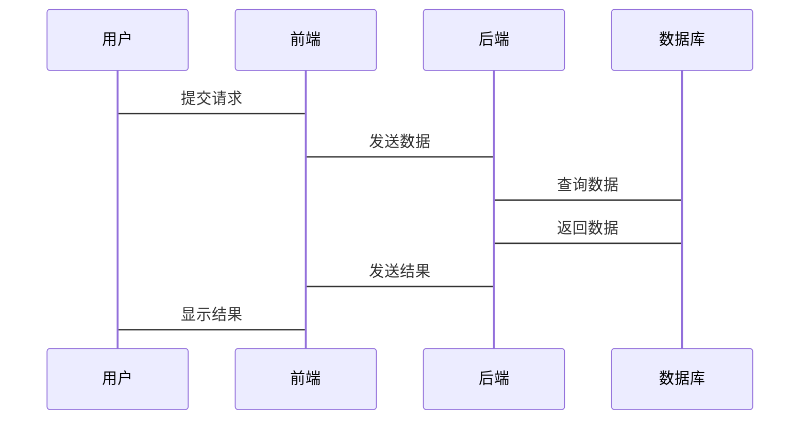

                 


# 新兴市场股市估值与智慧城市公共卫生监测系统的互动

> 关键词：新兴市场、股市估值、智慧城市、公共卫生监测系统、时间序列分析、SIR模型、系统架构设计

> 摘要：本文探讨新兴市场股市估值与智慧城市公共卫生监测系统的互动关系，分析其背后的技术原理和系统架构，通过时间序列分析和SIR模型，结合实际案例，展示如何利用算法预测股市波动和公共卫生事件，设计系统架构，并提供项目实战指导。

---

## 第1章: 新兴市场股市估值与智慧城市公共卫生监测系统概述

### 1.1 问题背景与描述
#### 1.1.1 新兴市场股市估值的现状与挑战
新兴市场股市估值受经济波动、政策变化和国际环境影响较大，具有高度不确定性。投资者需通过有效的监测和分析工具来捕捉市场动态。

#### 1.1.2 智慧城市公共卫生监测系统的建设需求
随着城市化进程加快，公共卫生事件频发，建设高效的监测系统是保障公共安全的关键。

#### 1.1.3 两者的互动关系与研究意义
股市估值与公共卫生事件存在间接关联，例如疫情爆发可能引发股市下跌，而股市波动也可能反映公共卫生事件的风险。

### 1.2 核心概念与边界
#### 1.2.1 股市估值的核心要素
- 市盈率（P/E ratio）
- 市净率（P/B ratio）
- 股价收益率（ROE）

#### 1.2.2 智慧城市公共卫生监测系统的功能模块
- 数据采集
- 数据分析
- 预警系统

#### 1.2.3 互动关系的边界与外延
- 股市波动可能反映公共卫生事件的潜在风险
- 公共卫生事件可能影响股市估值

### 1.3 概念结构与核心要素
#### 1.3.1 概念结构图


---

## 第2章: 股市估值与公共卫生监测的核心原理

### 2.1 股市估值的算法原理
#### 2.1.1 时间序列分析
时间序列分析是预测股市波动的核心方法之一，常用的模型包括ARIMA和LSTM。

#### 2.1.2 股价预测模型
使用ARIMA模型进行预测，公式如下：
$$ ARIMA(p, d, q) $$

#### 2.1.3 风险评估指标
- 波动率
- Value at Risk (VaR)

### 2.2 公共卫生监测系统的数据处理
#### 2.2.1 数据采集与清洗
- 数据来源：医院、疾控中心、社交媒体
- 数据清洗：去除噪声数据，填补缺失值

#### 2.2.2 疾病传播模型
SIR模型用于模拟疾病传播：
$$ \frac{dS}{dt} = -\beta SI $$
$$ \frac{dI}{dt} = \beta SI - \gamma I $$
$$ \frac{dR}{dt} = \gamma I $$

#### 2.2.3 预警机制设计
- 阈值设定
- 实时监控

### 2.3 核心概念对比分析
#### 2.3.1 概念属性特征对比表
| 概念 | 属性 | 特征 |
|------|-------|------|
| 股市估值 | 数据类型 | 数值型 |
| 公共卫生监测 | 数据类型 | 分类型、数值型 |

#### 2.3.2 ER实体关系图
```mermaid
erd
    客户 [m:1] -[拥有]-> 股票 [m:1]
    股票 -[属于]-> 市场
    公共卫生事件 -[影响]-> 股市波动
```

---

## 第3章: 股市估值与公共卫生监测的算法实现

### 3.1 时间序列分析算法
#### 3.1.1 ARIMA模型
ARIMA模型用于预测股市波动：
$$ ARIMA(p, d, q) $$

#### 3.1.2 LSTM网络
LSTM用于长期依赖关系的捕捉，代码示例：
```python
import tensorflow as tf
from tensorflow.keras.layers import LSTM, Dense

model = tf.keras.Sequential([
    LSTM(64, input_shape=(timesteps, features)),
    Dense(1)
])
model.compile(optimizer='adam', loss='mean_squared_error')
```

#### 3.1.3 算法实现步骤
1. 数据预处理
2. 模型训练
3. 预测与评估

### 3.2 公共卫生事件预测模型
#### 3.2.1 SIR模型
SIR模型代码示例：
```python
import numpy as np

def sir_model(S0, I0, R0, beta, gamma, days):
    S = [S0]
    I = [I0]
    R = [R0]
    for _ in range(days):
        s = S[-1]
        i = I[-1]
        r = R[-1]
        dS = -beta * s * i
        dI = beta * s * i - gamma * i
        dR = gamma * i
        S.append(s + dS)
        I.append(i + dI)
        R.append(r + dR)
    return S, I, R
```

#### 3.2.2 预测算法流程
1. 数据输入
2. 模型训练
3. 预测与预警

#### 3.2.3 模型优化与调参
- 参数调整
- 超参数优化

---

## 第4章: 系统分析与架构设计

### 4.1 问题场景介绍
- 新兴市场股市波动加剧
- 公共卫生事件频发

### 4.2 系统功能设计
#### 4.2.1 领域模型类图


### 4.3 系统架构设计
#### 4.3.1 系统架构图


#### 4.3.2 系统交互流程


---

## 第5章: 项目实战

### 5.1 环境安装
- Python 3.8+
- TensorFlow 2.0+
- Pandas 1.0+

### 5.2 核心代码实现
#### 5.2.1 股市估值预测代码
```python
import pandas as pd
from sklearn.preprocessing import MinMaxScaler
from tensorflow.keras.models import Sequential
from tensorflow.keras.layers import LSTM, Dense

# 数据加载与预处理
data = pd.read_csv('stock_data.csv')
scaler = MinMaxScaler()
data_scaled = scaler.fit_transform(data)

# 模型训练
model = Sequential()
model.add(LSTM(64, input_shape=(timesteps, features)))
model.add(Dense(1))
model.compile(optimizer='adam', loss='mean_squared_error')

# 预测与评估
predicted = model.predict(test_data)
```

#### 5.2.2 公共卫生事件预测代码
```python
from scipy.integrate import odeint

def sir_model(y, t, beta, gamma):
    S, I, R = y
    dSdt = -beta * S * I
    dIdt = beta * S * I - gamma * I
    dRdt = gamma * I
    return [dSdt, dIdt, dRdt]

# 参数设置
beta = 0.5
gamma = 0.2
y0 = [999, 1, 0]
t = np.linspace(0, 100, 101)

# 模型求解
solution = odeint(sir_model, y0, t, args=(beta, gamma))
```

### 5.3 案例分析
- 使用真实数据验证模型效果
- 分析公共卫生事件对股市的影响

---

## 第6章: 总结与展望

### 6.1 小结
本文通过算法和系统设计，展示了股市估值与公共卫生监测系统的互动关系。

### 6.2 注意事项
- 数据质量影响模型效果
- 模型需要定期更新

### 6.3 拓展阅读
- 时间序列分析的高级模型
- SIR模型的优化与应用

---

通过本文的分析与实践，读者可以深入理解新兴市场股市估值与智慧城市公共卫生监测系统的互动关系，并掌握相关算法和系统设计方法。

