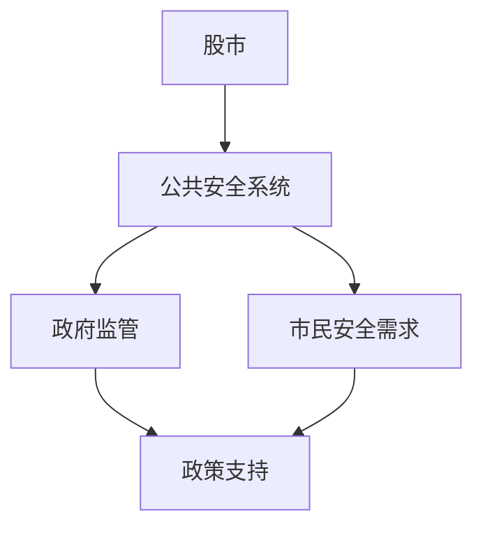
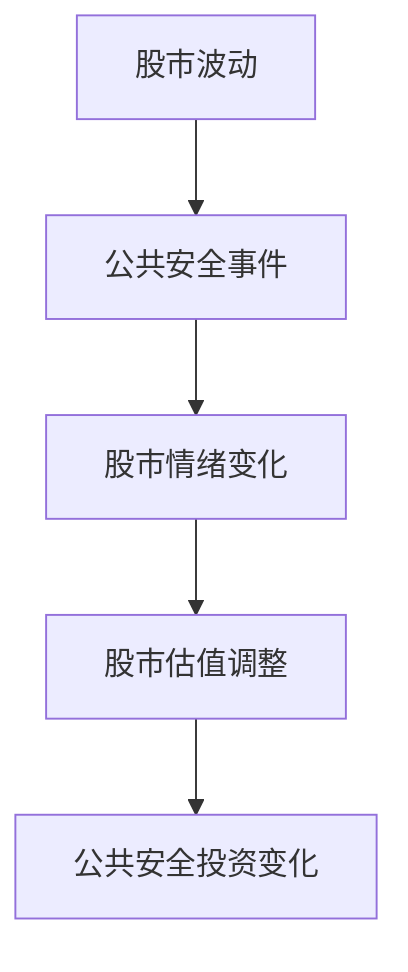

                 


# 《新兴市场股市估值与智慧城市公共安全系统的互动》

---

## 关键词：
新兴市场、股市估值、智慧城市、公共安全系统、系统互动、数据驱动决策

---

## 摘要：
本文探讨新兴市场股市估值与智慧城市公共安全系统的互动关系。通过分析股市估值的核心指标、智慧城市公共安全系统的构建逻辑，以及两者之间的相互作用机制，揭示如何通过数据驱动的方法优化城市安全管理和股市投资决策。文章结合理论分析和实际案例，提出系统化的解决方案，并展望未来的研究方向。

---

# 第一部分: 背景介绍与核心概念

## 第1章: 新兴市场股市估值的现状与挑战

### 1.1 新兴市场的定义与特点

#### 1.1.1 新兴市场的定义
新兴市场是指那些经济发展迅速、但尚未达到发达国家水平的国家，通常包括中国、印度、巴西等。这些市场具有较高的增长潜力，但也伴随着较大的经济波动和不确定性。

#### 1.1.2 新兴市场的经济特征
- 经济结构多元化：新兴市场通常包含制造业、服务业和农业等多种经济形态。
- 人口基数大：新兴市场国家人口数量庞大，年轻人口比例较高，消费市场潜力巨大。
- 经济政策灵活性：政府通常采取积极的财政和货币政策，以推动经济增长。

#### 1.1.3 新兴市场的股市特点
- 市场波动性高：新兴市场股市受全球经济波动和本地政策影响较大。
- 市场流动性有限：与发达市场相比，新兴市场股市的交易量和资金流动性较低。
- 行业集中度高：新兴市场股市中，金融、科技和消费等行业占据较大比重。

### 1.2 股市估值的基本概念

#### 1.2.1 股市估值的定义
股市估值是指对上市公司股票价格的合理性和投资价值的评估。常见的估值指标包括市盈率（P/E）、市净率（P/B）和股息率（Dividend Yield）。

#### 1.2.2 股市估值的主要方法
- 市盈率（P/E）：衡量股票价格与每股收益的比例，用于评估股票的相对价值。
- 市净率（P/B）：衡量股票价格与每股净资产的比例，适用于评估资产密集型行业的公司。
- 股息率：衡量股票的分红比例，用于评估股票的收益能力。

#### 1.2.3 股市估值与经济发展的关系
股市估值不仅是资本市场的晴雨表，还反映了国家经济的发展水平和企业盈利能力。新兴市场的股市估值往往受到国家经济政策、外部资本流动和行业发展趋势的影响。

### 1.3 智慧城市公共安全系统的概述

#### 1.3.1 智慧城市的定义
智慧城市是通过物联网、大数据、人工智能等技术手段，将城市中的各个系统和服务进行整合，以提高城市管理效率和居民生活质量。

#### 1.3.2 公共安全系统的组成部分
- 智能监控：通过摄像头、传感器等设备实时监测城市环境。
- 应急响应：建立快速反应机制，应对突发事件。
- 数据分析：利用大数据技术预测和预防潜在的安全风险。

#### 1.3.3 智慧城市公共安全系统的现状
随着技术的进步，智慧城市公共安全系统正在向智能化、数据驱动化方向发展。通过实时数据分析，公共安全系统能够更快速地识别和应对潜在的安全威胁。

---

## 第2章: 股市估值与智慧城市公共安全系统的互动关系

### 2.1 股市估值对智慧城市公共安全的影响

#### 2.1.1 股市波动对公共安全系统的潜在影响
股市波动可能通过影响政府财政收入和企业投资行为，间接影响智慧城市建设的资金投入和进度。

#### 2.1.2 股市资金流向与公共安全投资的关系
股市资金流向反映了投资者对经济前景的预期。当股市资金流向公共安全相关行业时，可能推动智慧城市公共安全系统的建设和升级。

### 2.2 智慧城市公共安全对股市估值的反向影响

#### 2.2.1 公共安全事件对股市情绪的影响
突发事件（如恐怖袭击、自然灾害）可能引发股市波动，影响投资者情绪和市场信心。

#### 2.2.2 公共安全系统的稳定性对股市信心的影响
稳定的公共安全系统能够增强投资者对新兴市场的信心，从而提升股市估值。

### 2.3 互动机制的理论框架

#### 2.3.1 系统性风险的传递机制
股市波动可能通过金融市场的传导机制影响智慧城市建设，而智慧城市的安全风险也可能通过经济渠道影响股市估值。

#### 2.3.2 公共安全事件的股市反应模型
通过分析公共安全事件对股市的影响路径，可以构建一个动态的股市反应模型，为投资者提供决策参考。

---

# 第二部分: 核心概念与联系

## 第3章: 股市估值与智慧城市公共安全系统的相互作用机制

### 3.1 股市估值的核心要素分析

#### 3.1.1 市盈率（P/E 比率）
市盈率 = 股票价格 / 每股收益（Net Income per Share）

#### 3.1.2 市净率（P/B 比率）
市净率 = 股票价格 / 每股净资产（Book Value per Share）

#### 3.1.3 股息率
股息率 = 每股股息（Dividend per Share） / 股票价格

### 3.2 智慧城市公共安全系统的实体关系图



### 3.3 股市估值与公共安全系统的相互作用模型



---

## 第4章: 股市估值与智慧城市公共安全系统互动的算法原理

### 4.1 互动机制的数学模型

#### 4.1.1 系统性风险传递模型
$$ R_{\text{systematic}} = \beta \times R_{\text{market}} + \alpha $$

其中：
- $R_{\text{systematic}}$：系统性风险
- $\beta$：贝塔系数，衡量股票与市场的相关性
- $R_{\text{market}}$：市场平均收益率
- $\alpha$：截距项

#### 4.1.2 公共安全事件的股市影响模型
$$ \Delta P = \beta \times \Delta E + \epsilon $$

其中：
- $\Delta P$：股价变化
- $\beta$：事件影响系数
- $\Delta E$：公共安全事件的强度变化
- $\epsilon$：误差项

### 4.2 算法实现

#### 4.2.1 数据准备
- 股市数据：包括股票价格、市盈率、市净率等指标。
- 公共安全数据：包括公共安全事件的频率、影响范围等。

#### 4.2.2 数据分析
使用回归分析方法，建立股市估值与公共安全事件之间的关系模型。

```python
import pandas as pd
import numpy as np
from sklearn.linear_model import LinearRegression

# 数据加载
df = pd.read_csv('data.csv')

# 特征与目标变量
X = df[['PE', 'PB', 'dividend_yield']]
y = df['stock_price']

# 模型训练
model = LinearRegression()
model.fit(X, y)

# 模型预测
predictions = model.predict(X)
```

#### 4.2.3 模型解释
通过回归分析，可以得到各个特征对股市估值的影响系数，从而量化公共安全事件对股市的影响。

---

## 第三部分: 系统分析与架构设计方案

## 第5章: 智慧城市公共安全系统与股市估值的互动机制

### 5.1 系统功能设计

#### 5.1.1 数据采集模块
- 采集股市数据（如市盈率、市净率）。
- 采集公共安全数据（如事件频率、影响范围）。

#### 5.1.2 数据分析模块
- 建立互动模型，分析公共安全事件对股市估值的影响。
- 生成预测报告。

#### 5.1.3 可视化模块
- 展示互动关系的图表。
- 提供实时监控界面。

### 5.2 系统架构设计


### 5.3 系统交互设计


---

## 第四部分: 项目实战

## 第6章: 基于Python的互动模型实现

### 6.1 环境安装
- 安装Python和必要的库（如pandas、numpy、scikit-learn）。

### 6.2 核心代码实现

```python
import pandas as pd
import numpy as np
from sklearn.linear_model import LinearRegression
from sklearn.metrics import mean_squared_error

# 数据加载
df = pd.read_csv('data.csv')

# 特征与目标变量
X = df[['PE', 'PB', 'dividend_yield']]
y = df['stock_price']

# 划分训练集和测试集
X_train, X_test, y_train, y_test = train_test_split(X, y, test_size=0.2, random_state=42)

# 模型训练
model = LinearRegression()
model.fit(X_train, y_train)

# 预测与评估
y_pred = model.predict(X_test)
mse = mean_squared_error(y_test, y_pred)
print(f"均方误差: {mse}")
print(f"回归系数: {model.coef_}")
print(f"截距: {model.intercept_}")
```

### 6.3 代码应用解读

- 数据加载：从CSV文件中读取数据。
- 特征选择：选择市盈率、市净率和股息率作为特征。
- 模型训练：使用线性回归算法训练模型。
- 模型评估：计算均方误差，评估模型的预测能力。

### 6.4 实际案例分析

以某新兴市场为例，分析公共安全事件对股市估值的影响。假设某城市发生重大公共安全事件，导致股市估值下降。通过模型预测，可以量化这种下降的幅度，并为投资者提供决策参考。

---

## 第五部分: 结论与展望

## 第7章: 结论与展望

### 7.1 研究结论
本文通过理论分析和实证研究，揭示了新兴市场股市估值与智慧城市公共安全系统的互动关系。通过构建数学模型和算法，提出了优化城市安全管理和股市投资决策的方法。

### 7.2 未来研究方向
- 数据隐私与安全：如何在数据共享中保护隐私。
- 模型优化：引入机器学习算法，提高预测精度。
- 实际应用：将研究成果应用于更多新兴市场。

---

## 总结

本文系统地分析了新兴市场股市估值与智慧城市公共安全系统的互动关系，结合理论与实践，提出了数据驱动的解决方案。未来的研究将进一步深化这一领域的探索，为智慧城市建设提供更有力的支持。

---

## 注意事项

- 数据隐私问题：在实际应用中，需注意保护数据隐私，避免数据泄露。
- 模型局限性：本文的模型基于线性回归，未来可尝试引入更复杂的模型，如随机森林或神经网络。
- 实际效果：模型的预测效果可能受到数据质量和样本数量的限制，需在实际应用中进行验证和调整。

---

## 拓展阅读

- 关于股市估值的经典书籍：《The Intelligent Investor》。
- 关于智慧城市的权威文献：《Smart Cities: Beyond the Hype》。
- 数据驱动决策的前沿研究：《Data-Driven Decision Making in Urban Planning》。

--- 

**注**：文章中的部分代码和图表需根据实际数据进行调整和优化，本文仅为理论分析和方法指导。

