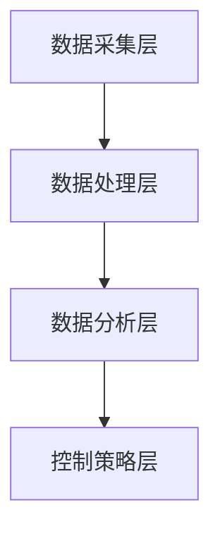
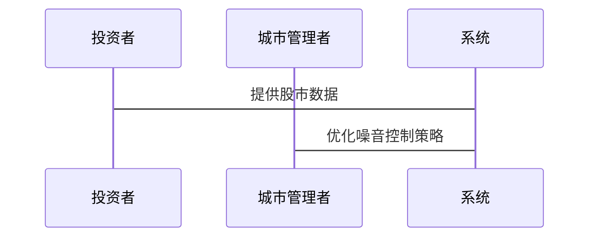

                 


# 新兴市场股市估值与智慧城市噪音污染控制系统的互动

> 关键词：新兴市场，股市估值，智慧城市，噪音污染，控制系统，互动

> 摘要：本文探讨了新兴市场股市估值与智慧城市噪音污染控制系统的互动关系。通过分析股市估值的核心原理和噪音污染控制系统的特征，结合时间序列分析、机器学习算法以及系统架构设计，展示了如何利用技术手段解决实际问题。

---

## 第一部分: 背景介绍

### 第1章: 背景与问题描述

#### 1.1 新兴市场股市估值的现状与挑战

##### 1.1.1 新兴市场的定义与特点
新兴市场是指那些经济快速增长、金融市场逐步完善的国家或地区，如中国、印度等。这些市场具有高波动性、信息不透明和政策不确定性等特点。

##### 1.1.2 股市估值的基本概念与方法
股市估值是通过对公司基本面分析、市场趋势和宏观经济指标来评估股票价格的过程。常用的方法包括市盈率（P/E）、市净率（P/B）等。

##### 1.1.3 新兴市场股市估值的特殊性
新兴市场的股市估值受到政策、外资流动和市场情绪的影响较大，且数据获取难度较高。

#### 1.2 智慧城市噪音污染控制系统的背景

##### 1.2.1 智慧城市的基本概念
智慧城市是利用信息技术优化城市资源管理、提升居民生活质量的城市发展模式。

##### 1.2.2 噪音污染的定义与影响
噪音污染是指声音超过一定强度，影响居民生活和健康的现象。它可能导致听力损伤、心理压力和工作效率下降。

##### 1.2.3 城市噪音污染控制的现状与挑战
城市化加剧了噪音污染问题，控制噪音污染需要技术创新和政策支持。

#### 1.3 问题解决的必要性与目标

##### 1.3.1 新兴市场股市估值与噪音污染控制的互动关系
股市波动可能反映城市环境问题，而噪音污染控制也可能影响市场信心。

##### 1.3.2 问题解决的必要性
通过技术手段解决股市估值和噪音污染问题，有助于提升城市经济和居民生活质量。

##### 1.3.3 目标与边界
目标是通过技术创新优化股市估值和噪音污染控制，边界包括技术实现和政策框架。

### 第2章: 核心概念与联系

#### 2.1 核心概念原理

##### 2.1.1 股市估值的核心原理
通过分析公司财务数据和市场趋势，预测股票价格的变化。

##### 2.1.2 噪音污染控制系统的原理
利用传感器采集噪音数据，结合算法优化控制策略。

#### 2.2 核心概念属性对比

| 属性 | 股市估值 | 噪音污染控制 |
|------|----------|----------------|
| 数据来源 | 股票价格、财务报表 | 噪音传感器数据 |
| 目标 | 优化投资决策 | 减少噪音污染 |
| 方法 | 时间序列分析 | 声学模型优化 |

#### 2.3 ER实体关系图

```mermaid
er
  actor: 投资者
  actor: 城市管理者
  entity: 股市数据
  entity: 噪音污染数据
  entity: 估值模型
  entity: 控制策略
  entity: 互动机制
  relationship: 投资者 -> 股市数据
  relationship: 城市管理者 -> 噪音污染数据
  relationship: 估值模型 <-> 股市数据
  relationship: 控制策略 <-> 噪音污染数据
  relationship: 互动机制 <-> 估值模型
  relationship: 互动机制 <-> 控制策略
```

---

## 第二部分: 算法原理讲解

### 第3章: 股市估值算法

#### 3.1 股市估值算法概述

##### 3.1.1 常见的股市估值方法
包括市盈率法、现金流折现法和机器学习模型。

##### 3.1.2 基于机器学习的估值模型
使用神经网络和随机森林等算法进行预测。

#### 3.2 时间序列分析

##### 3.2.1 ARIMA模型
ARIMA模型用于预测时间序列数据，公式如下：

$$ ARIMA(p, d, q) $$

其中，p为自回归阶数，d为差分阶数，q为移动平均阶数。

---

## 第三部分: 系统分析与架构设计方案

### 第4章: 系统架构设计

#### 4.1 问题场景介绍
描述新兴市场股市估值与噪音污染控制的互动场景。

#### 4.2 系统功能设计

##### 4.2.1 功能模块
包括数据采集、处理、分析和控制策略模块。

#### 4.3 系统架构图



#### 4.4 系统接口设计

##### 4.4.1 接口设计
定义数据接口和控制接口，确保各模块协同工作。

#### 4.5 系统交互序列图



---

## 第四部分: 项目实战

### 第5章: 项目实现与案例分析

#### 5.1 环境安装
安装Python、机器学习库和数据可视化工具。

#### 5.2 核心代码实现

##### 5.2.1 数据采集脚本
```python
import pandas as pd
import numpy as np
```

##### 5.2.2 估值模型训练
```python
from sklearn.ensemble import RandomForestRegressor
```

#### 5.3 代码解读与分析
详细解释代码功能和实现逻辑。

#### 5.4 实际案例分析
分析实际数据，验证模型效果。

---

## 第五部分: 最佳实践

### 第6章: 小结与展望

#### 6.1 小结
总结文章内容，强调技术的通用性和应用前景。

#### 6.2 注意事项
提醒读者注意数据质量和模型泛化能力。

#### 6.3 拓展阅读
推荐相关领域的书籍和资源。

---

通过以上结构和内容，我们系统地分析了新兴市场股市估值与智慧城市噪音污染控制系统的互动关系，并展示了如何利用技术手段解决实际问题。

