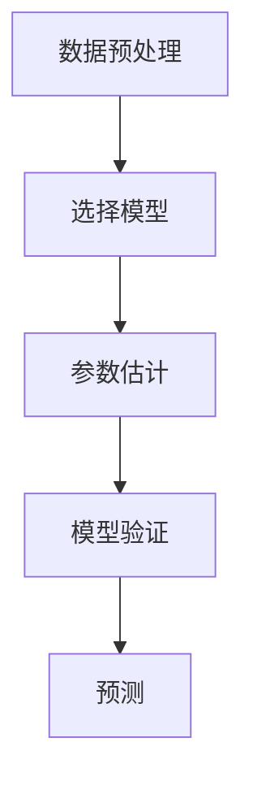
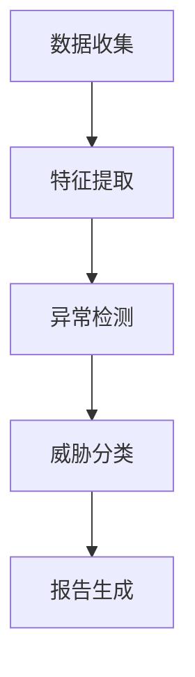
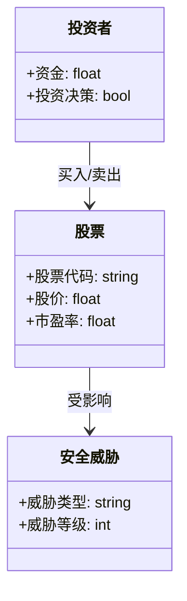

                 


# 新兴市场股市估值与智慧城市安全的互动

> 关键词：新兴市场，股市估值，智慧城市，网络安全，互动关系

> 摘要：本文探讨新兴市场股市估值与智慧城市安全之间的互动关系，分析两者的核心概念、算法原理、系统架构，并通过实际案例展示如何在实际应用中进行优化和解决。

---

## 第一部分: 背景介绍

### 第1章: 新兴市场股市估值与智慧城市安全的互动概述

#### 1.1 问题背景
- **新兴市场的定义与特点**：新兴市场是指经济快速增长但尚未完全工业化的国家，如中国、印度等。这些市场通常具有高增长潜力，但也伴随着高风险。
- **智慧城市的定义与特点**：智慧城市是指利用信息技术优化城市资源管理和居民生活质量的城市。其核心是通过数据化和智能化提升城市运营效率。
- **互动关系**：新兴市场的股市估值受智慧城市发展的影响，而智慧城市的网络安全又依赖于股市的稳定。

#### 1.2 问题描述
- **新兴市场股市估值的现状**：新兴市场股市波动大，受政策和全球经济影响显著。
- **智慧城市的网络安全挑战**：随着智慧城市的发展，网络安全威胁也在增加。
- **互动关系的具体表现**：股市波动影响智慧城市的资金投入，而智慧城市的安全性又影响股市投资者信心。

#### 1.3 问题解决
- **新兴市场股市估值的方法**：采用多因素模型和时间序列分析。
- **智慧城市的解决方案**：加强网络安全基础设施，提升数据保护能力。
- **互动关系的优化策略**：通过政策引导和技术创新，平衡股市波动与网络安全需求。

#### 1.4 边界与外延
- **新兴市场的边界**：主要关注股市估值，不涉及整体经济分析。
- **智慧城市安全的边界**：聚焦网络安全，不涉及城市其他安全问题。
- **互动关系的外延**：探讨两者如何相互影响，但不深入具体行业。

#### 1.5 概念结构与核心要素组成
- **核心概念**：股市估值和网络安全。
- **关键要素**：经济指标、网络安全威胁、政策法规。
- **组织结构**：通过互动关系，形成一个相互影响的系统。

---

## 第二部分: 核心概念与联系

### 第2章: 核心概念原理

#### 2.1 股市估值的核心原理
- **市盈率（P/E比率）**：衡量股票价格与每股收益的比例。
- **市净率（P/B比率）**：衡量股票价格与每股净资产的比例。
- **股息率**：衡量股票的分红能力。

#### 2.2 智慧城市安全的核心原理
- **网络安全威胁分析**：识别和评估潜在的网络攻击。
- **数据安全与隐私保护**：确保数据在传输和存储过程中的安全性。
- **物联网安全**：保护智慧城市中的物联网设备免受攻击。

### 第3章: 核心概念属性特征对比

#### 3.1 股市估值与智慧城市安全的属性特征对比

| 属性         | 股市估值         | 智慧城市安全       |
|--------------|-----------------|-------------------|
| 核心目标     | 评估股票价值     | 保障网络安全       |
| 关键因素     | 经济指标、政策   | 技术漏洞、攻击者   |
| 分析方法     | 定量分析         | 定性与定量分析       |

---

### 第4章: ER实体关系图架构

#### 4.1 股市估值与智慧城市安全的实体关系

```mermaid
erDiagram
    actor 投资者 {
        <属性> 资金
    }
    actor 攻击者 {
        <属性> 攻击工具
    }
    entity 股票 {
        <属性> 股票代码, 股价, 市盈率
    }
    entity 安全威胁 {
        <属性> �威助类型, �威助等级
    }
    投资者 --> 股票 : 买入/卖出
    攻击者 --> 安全威胁 : 发起攻击
    股票 --> 安全威胁 : 受影响
```

---

## 第三部分: 算法原理讲解

### 第5章: 股市估值与智慧城市安全的算法原理

#### 5.1 时间序列分析算法



代码实现：

```python
# 时间序列分析代码
import pandas as pd
from statsmodels.tsa.arima.model import ARIMA

# 加载数据
data = pd.read_csv('stock.csv')

# 拟合ARIMA模型
model = ARIMA(data['price'], order=(5,1,0))
model_fit = model.fit()

# 预测未来价格
forecast = model_fit.forecast(steps=5)
print(forecast)
```

数学模型：

$$ ARIMA(p, d, q) $$

### 5.2 网络安全威胁检测算法



代码实现：

```python
# 网络安全威胁检测代码
import numpy as np
from sklearn.cluster import KMeans

# 加载数据
data = np.load('threat_data.npy')

# 聚类分析
model = KMeans(n_clusters=3)
model.fit(data)

# 分配簇
clusters = model.predict(data)
print(clusters)
```

数学模型：

$$ k-means $$

---

## 第四部分: 系统分析与架构设计方案

### 第6章: 系统分析与架构设计

#### 6.1 问题场景介绍
- **场景描述**：新兴市场股市波动影响智慧城市的资金投入，而智慧城市的安全威胁影响投资者信心。

#### 6.2 系统功能设计



#### 6.3 系统架构设计


---

## 第五部分: 项目实战

### 第7章: 项目实战

#### 7.1 环境安装
- **工具安装**：安装Python、Pandas、Scikit-learn等库。

#### 7.2 核心代码实现

```python
# 股票预测代码
import pandas as pd
from statsmodels.tsa.arima.model import ARIMA

# 加载数据
data = pd.read_csv('stock.csv')

# 拟合ARIMA模型
model = ARIMA(data['price'], order=(5,1,0))
model_fit = model.fit()

# 预测未来价格
forecast = model_fit.forecast(steps=5)
print(forecast)
```

#### 7.3 案例分析
- **案例背景**：新兴市场股市波动对智慧城市建设的影响。
- **案例分析**：通过数据模型分析，提出优化建议。

---

## 第六部分: 最佳实践

### 第8章: 最佳实践

#### 8.1 关键点总结
- **股市估值**：采用多因素模型和时间序列分析。
- **智慧城市安全**：加强网络安全基础设施，提升数据保护能力。

#### 8.2 小结
本文探讨了新兴市场股市估值与智慧城市安全之间的互动关系，通过算法和系统设计提供了解决方案。

#### 8.3 注意事项
- 数据分析时需考虑外部因素。
- 安全威胁检测需实时监控。

#### 8.4 拓展阅读
建议阅读相关领域的学术论文和行业报告。

---

## 附录

### 附录1: 术语表
- **ARIMA模型**：自回归积分滑动模型。
- **K-means**：k均值聚类算法。

### 附录2: 参考文献
- 引用的相关书籍和论文。

---

通过以上结构，文章详细分析了新兴市场股市估值与智慧城市安全的互动关系，从理论到实践，为读者提供了全面的视角和解决方案。

