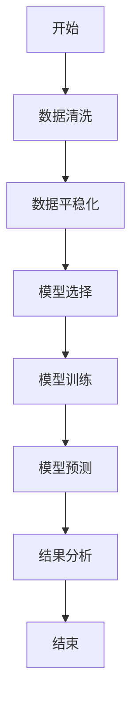
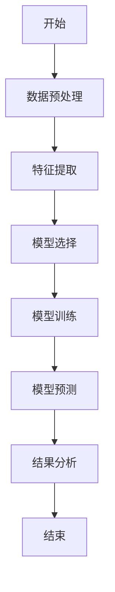
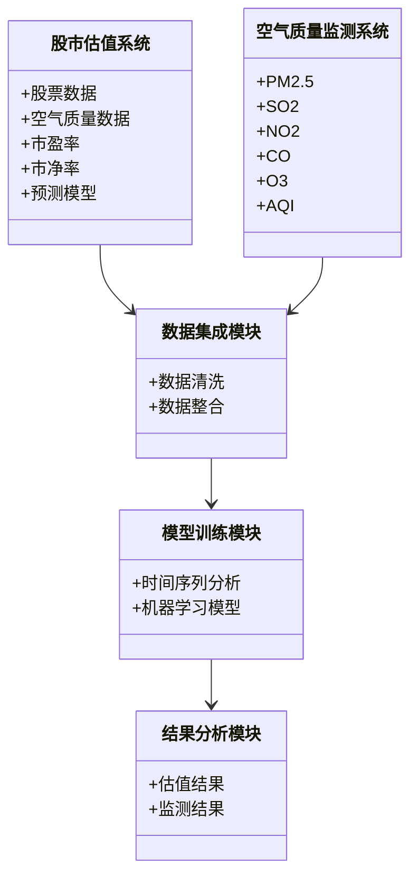
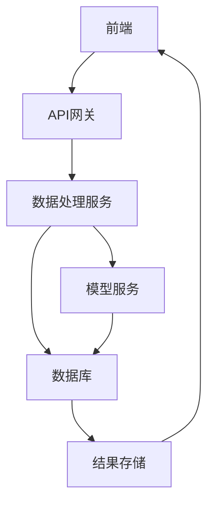
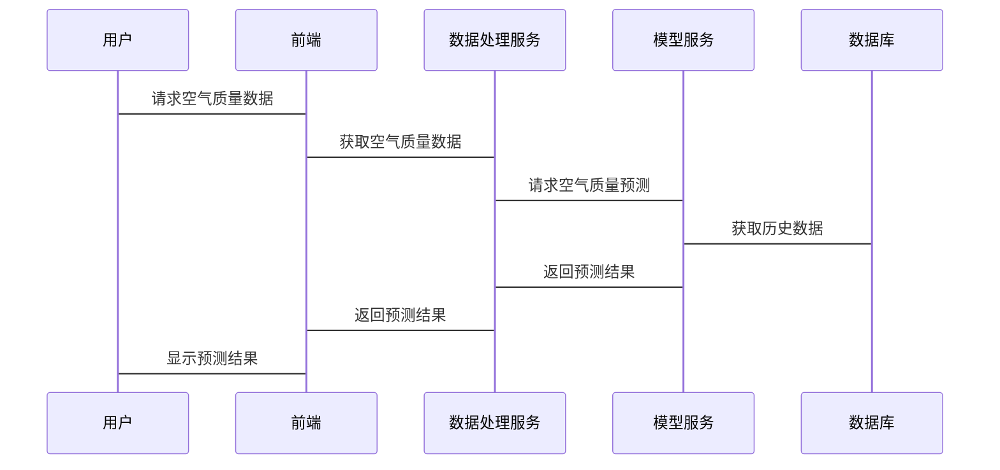

                 


# 新兴市场股市估值与智慧城市空气质量监测系统的互动

## 关键词：新兴市场，股市估值，智慧城市，空气质量监测系统，数据驱动，互动关系

## 摘要：本文探讨了新兴市场股市估值与智慧城市空气质量监测系统之间的互动关系，通过数据驱动技术分析空气质量对股市估值的影响，提出系统化的解决方案，提升智慧城市的管理水平。

---

# 第一部分: 背景介绍与核心概念

## 第1章: 新兴市场股市估值的背景与挑战

### 1.1 问题背景
#### 1.1.1 新兴市场的定义与特点
- 新兴市场是指经济发展迅速但尚未完全工业化的国家，如巴西、印度等。
- 股市特点：波动性大、信息不透明、政策影响显著。

#### 1.1.2 股市估值的基本概念
- 股市估值：通过财务指标和市场因素评估股票价值。
- 常用指标：市盈率（P/E）、市净率（P/B）、股息率等。

#### 1.1.3 新兴市场股市估值的特殊性
- 政策风险高：新兴市场政策变化快，影响股市估值。
- 数据不完整：新兴市场信息披露不规范，增加估值难度。

### 1.2 问题描述
#### 1.2.1 股市估值的核心问题
- 如何准确评估新兴市场股票的内在价值？
- 如何应对市场波动和政策风险？

#### 1.2.2 新兴市场股市的独特挑战
- 经济结构复杂：新兴市场产业结构多样，影响股市表现。
- 外部因素影响：国际经济波动、外资流动对股市估值影响显著。

#### 1.2.3 股市与经济发展的互动关系
- 股市是经济晴雨表，反映经济发展状况。
- 经济增长推动股市上涨，但过度投机可能引发泡沫。

## 第2章: 智慧城市空气质量监测系统概述

### 2.1 空气质量监测的核心要素
#### 2.1.1 空气质量监测的定义
- 空气质量监测：通过传感器和数据分析技术，实时监测空气污染物浓度。

#### 2.1.2 监测指标与标准
- 主要指标：PM2.5、PM10、SO2、NO2、CO、O3。
- 监测标准：采用国际标准如WHO指南。

#### 2.1.3 智慧城市中的空气质量管理
- 数据驱动：利用大数据和AI优化空气质量监测和治理。
- 公共健康：空气质量直接影响居民健康和生活质量。

### 2.2 空气质量监测系统的架构
#### 2.2.1 系统组成部分
- 数据采集：传感器网络实时采集空气质量数据。
- 数据传输：通过物联网技术传输数据到云端。
- 数据分析：利用机器学习模型预测空气质量趋势。

#### 2.2.2 数据采集与传输
- 传感器类型：光学传感器、电化学传感器等。
- 传输方式：无线通信（Wi-Fi、LoRa）或有线传输。

#### 2.2.3 数据分析与处理
- 数据清洗：去除噪声数据，确保数据准确性。
- 数据存储：使用数据库存储实时和历史数据。
- 数据可视化：通过图表展示空气质量变化趋势。

## 第3章: 股市估值与空气质量监测的互动关系

### 3.1 互动背景分析
#### 3.1.1 经济环境对空气质量的影响
- 工业污染：经济增长带来工业排放增加，影响空气质量。
- 政策调控：政府出台环保政策，影响企业生产和股市估值。

#### 3.1.2 股市波动与环境政策的关联
- 环保政策出台后，相关企业股票可能面临估值调整。
- 空气质量改善可能提升公众健康，间接影响股市整体表现。

#### 3.1.3 智慧城市中的经济与环境平衡
- 经济发展与环境保护需要平衡，空气质量监测为城市管理者提供决策支持。
- 股市估值反映经济发展状况，空气质量监测为城市可持续发展提供数据支持。

### 3.2 核心问题与边界
#### 3.2.1 问题边界与外延
- 研究范围：新兴市场股市与空气质量监测的互动关系。
- 不考虑的因素：自然灾害、战争等极端事件对股市的影响。

#### 3.2.2 核心概念的结构化分析
- 核心概念：股市估值、空气质量监测。
- 边界条件：新兴市场特定的经济和政策环境。

#### 3.2.3 核心要素的对比分析
- 经济因素：股市波动受经济政策、企业盈利影响。
- 环境因素：空气质量受工业排放、气象条件影响。
- 社会因素：公众健康意识影响政策制定和股市投资行为。

---

# 第二部分: 核心概念与联系

## 第4章: 核心概念原理与对比分析

### 4.1 股市估值的核心原理
#### 4.1.1 市盈率与市净率的计算
- 市盈率（P/E）= 股价 / 每股收益。
- 市净率（P/B）= 股价 / 每股净资产。

#### 4.1.2 股东权益与资产回报率分析
- 股东权益：公司净资产，反映股东投资回报。
- 资产回报率（ROA）= 净利润 / 总资产，衡量资产使用效率。

#### 4.1.3 股票估值模型的对比
- 市盈率模型：适用于盈利稳定的公司。
- 市净率模型：适用于资产密集型行业。
- 现金流量折现模型（DCF）：适用于高成长性企业。

### 4.2 空气质量监测的原理
#### 4.2.1 大气污染源分析
- 点源：工厂烟囱、汽车尾气等。
- 面源：农业秸秆燃烧、建筑施工等。

#### 4.2.2 数据采集与传感器技术
- 传感器类型：光学传感器检测PM2.5，电化学传感器检测气体污染物。
- 传感器校准：定期校准确保测量准确性。

#### 4.2.3 数据分析与预测模型
- 时间序列分析：预测未来空气质量趋势。
- 机器学习模型：使用历史数据训练预测模型。

## 第5章: 核心概念的属性特征对比

### 5.1 股市估值与空气质量监测的对比表格
| 属性           | 股市估值               | 空气质量监测           |
|----------------|-----------------------|-----------------------|
| 数据类型       | 数值型（股票价格、市盈率等） | 数值型（污染物浓度等） |
| 数据频率       | 日度、周度、月度       | 实时数据               |
| 数据来源       | 交易所数据、财务报表   | 传感器数据、气象数据   |
| 数据处理       | 财务指标计算、模型预测 | 数据清洗、特征提取     |
| 数据应用       | 投资决策、风险管理     | 环境治理、健康预警     |

### 5.2 ER实体关系图
```mermaid
er
  entity 股票(Stock) {
    key: 股票代码(Symbol)
    属性: 股票名称(Name)
    属性: 最新价格(ClosePrice)
    属性: 市盈率(PE)
    属性: 市净率(PB)
  }
  entity 空气质量(AirQuality) {
    key: 监测地点(Location)
    属性: PM2.5
    属性: PM10
    属性: SO2
    属性: NO2
    属性: CO
    属性: O3
  }
  entity 监测时间(Time) {
    key: 时间戳(DateTime)
  }
  股票 --> 关联关系(属于同一时间点的数据)
  空气质量 --> 关联关系(属于同一时间点的数据)
```

---

# 第三部分: 算法原理讲解

## 第6章: 股市估值与空气质量监测的算法原理

### 6.1 股市估值算法
#### 时间序列分析流程图


#### 代码示例
```python
import pandas as pd
import numpy as np
from sklearn.metrics import mean_absolute_error

# 数据清洗
data = pd.read_csv('stock_data.csv')
data = data.dropna()

# 时间序列分析
from statsmodels.tsa.arima_model import ARIMA

model = ARIMA(data['ClosePrice'], order=(5,1,0))
model_fit = model.fit()

# 预测
forecast = model_fit.forecast(steps=5)
print(forecast)

# 评估
y_true = data['ClosePrice'][-5:]
y_pred = forecast
print(mean_absolute_error(y_true, y_pred))
```

### 6.2 空气质量监测算法
#### 机器学习模型流程图


#### 代码示例
```python
import pandas as pd
import numpy as np
from sklearn.ensemble import RandomForestRegressor
from sklearn.metrics import mean_squared_error

# 数据预处理
data = pd.read_csv('air_quality.csv')
data = data.dropna()

# 特征提取
features = data[['PM2.5', 'SO2', 'NO2', 'CO', 'O3']]
target = data['AQI']

# 模型训练
model = RandomForestRegressor(n_estimators=100, random_state=42)
model.fit(features, target)

# 预测
new_data = pd.read_csv('new_air_quality.csv')
new_features = new_data[['PM2.5', 'SO2', 'NO2', 'CO', 'O3']]
predictions = model.predict(new_features)

# 评估
print(mean_squared_error(new_data['AQI'], predictions))
```

---

# 第四部分: 数学模型

## 第7章: 数学模型与公式推导

### 7.1 股市估值的数学模型
#### 市盈率模型
$$ P = \frac{E}{E/P} $$
其中，P为股票价格，E为每股收益。

#### 现金流量折现模型
$$ V = \sum_{t=1}^{n} \frac{CF_t}{(1 + r)^t} $$
其中，CF_t为第t年的现金流，r为折现率。

### 7.2 空气质量监测的数学模型
#### 多元回归模型
$$ AQI = \beta_0 + \beta_1 PM2.5 + \beta_2 SO2 + \epsilon $$
其中，AQI为空气质量指数，$\beta_1$、$\beta_2$为回归系数，$\epsilon$为误差项。

---

# 第五部分: 系统分析与架构设计

## 第8章: 系统分析与架构设计方案

### 8.1 问题场景介绍
- 新兴市场中，股市估值受空气质量影响显著。
- 需要通过空气质量监测数据优化股市估值模型。

### 8.2 系统功能设计


### 8.3 系统架构设计


### 8.4 接口设计
- 数据接口：提供实时股票数据和空气质量数据接口。
- 模型接口：提供股票估值和空气质量预测接口。

### 8.5 交互序列图


---

# 第六部分: 项目实战

## 第9章: 项目实战与案例分析

### 9.1 环境安装
- 安装Python、Jupyter Notebook、Pandas、Scikit-learn、Statsmodels。

### 9.2 核心代码实现
```python
# 数据清洗
def data_cleaning(df):
    df = df.dropna()
    return df

# 时间序列分析
def stock_forecast(data):
    model = ARIMA(data['ClosePrice'], order=(5,1,0))
    model_fit = model.fit()
    forecast = model_fit.forecast(steps=5)
    return forecast

# 机器学习模型
def air_quality_prediction(data):
    features = data[['PM2.5', 'SO2', 'NO2', 'CO', 'O3']]
    target = data['AQI']
    model = RandomForestRegressor(n_estimators=100, random_state=42)
    model.fit(features, target)
    return model
```

### 9.3 案例分析
- 案例一：新兴市场某股票的市盈率预测。
- 案例二：空气质量对股市估值的影响分析。

### 9.4 项目小结
- 项目实现了股市估值与空气质量监测的互动分析。
- 提供了数据驱动的解决方案，优化了智慧城市的管理水平。

---

# 第七部分: 最佳实践

## 第10章: 最佳实践与总结

### 10.1 小结
- 数据驱动技术为股市估值与空气质量监测的互动分析提供了新思路。
- 通过系统化的解决方案，提升了智慧城市的管理水平。

### 10.2 注意事项
- 数据质量和实时性是系统成功的关键。
- 模型选择和参数调优需要根据实际数据进行优化。

### 10.3 拓展阅读
- 《Data-Driven Approaches in Financial Modeling》
- 《Smart City Air Quality Monitoring Systems》

---

# 结语

通过本文的系统分析和实践案例，我们展示了新兴市场股市估值与智慧城市空气质量监测系统的互动关系，为智慧城市建设提供了数据驱动的解决方案。未来，随着技术的进步，这种互动关系将更加紧密，为城市可持续发展提供有力支持。

