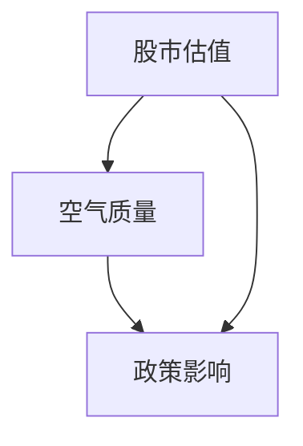
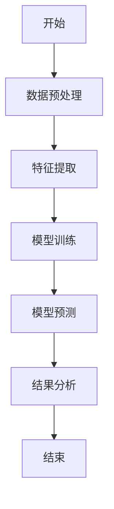

                 


# 《新兴市场股市估值与智慧城市空气质量预测系统的互动》

---

## 关键词

新兴市场、股市估值、智慧城市、空气质量预测、大数据分析、机器学习、系统互动

---

## 摘要

本文探讨新兴市场股市估值与智慧城市空气质量预测系统的互动关系。通过数据驱动的方法，分析空气质量对股市估值的影响，构建多变量时间序列模型，揭示两者之间的复杂互动。文章从背景、核心概念、算法原理、系统设计到实战分析，全面阐述互动关系的建模与应用。

---

## 第一部分：背景介绍

### 第1章：新兴市场股市估值与空气质量预测的互动背景

#### 1.1 问题背景

- **新兴市场的经济特点与发展现状**  
  新兴市场经济增长快，但股市波动大，受多种因素影响。空气质量问题日益严重，影响居民健康和经济活动。

- **股市估值在经济发展中的作用**  
  股市估值是衡量市场健康的重要指标，影响投资决策和经济政策。

- **智慧城市与空气质量问题的重要性**  
  智慧城市通过技术手段优化资源利用，改善空气质量，提升居民生活质量。

#### 1.2 问题描述

- **新兴市场股市波动的复杂性**  
  股市波动受宏观经济、政策、国际环境等多种因素影响，预测难度大。

- **空气质量对居民健康和经济活动的影响**  
  空气污染影响居民健康，进而影响劳动生产率和消费行为。

- **两者的互动关系及其研究意义**  
  空气质量可能通过影响经济活动间接影响股市估值，反之，股市波动也可能反映经济状况，间接影响空气质量改善政策。

#### 1.3 问题解决

- **数据驱动的股市估值方法**  
  使用历史数据和机器学习模型预测股市走势。

- **空气质量预测模型的构建**  
  利用环境数据和时间序列模型预测空气质量。

- **互动关系的建模与分析**  
  构建联合模型，分析两者互动，优化预测精度。

#### 1.4 边界与外延

- **研究范围的界定**  
  限定于新兴市场，主要关注PM2.5和股市指数。

- **相关概念的外延**  
  包括经济指标、政策变化、国际环境等对股市的影响，以及空气质量的多因素预测。

- **研究的局限性与未来扩展方向**  
  数据获取难度、模型复杂性，未来可扩展到更多市场和环境因素。

#### 1.5 核心概念与结构

- **核心概念的组成**  
  股市估值、空气质量预测、互动关系建模。

- **概念结构与核心要素的对比**  
  对比股市和空气质量的数据特征、模型方法。

- **系统整体架构的初步框架**  
  数据收集、模型构建、互动分析、结果应用。

---

## 第二部分：核心概念与联系

### 第2章：股市估值与空气质量预测的核心概念

#### 2.1 核心概念原理

- **股市估值的原理与方法**  
  通过PE、PB等指标评估股票价值，结合市场情绪预测走势。

- **空气质量预测的原理与模型**  
  使用时间序列模型，结合气象数据和污染源分析。

- **两者互动关系的数学表达**  
  建立联合模型，分析空气质量对股市的影响，反之亦然。

#### 2.2 概念属性特征对比

| 概念 | 数据特征 | 模型方法 | 影响因素 |
|------|----------|----------|----------|
| 股市估值 | 时间序列、多变量 | LSTM、ARIMA | 经济指标、政策、国际环境 |
| 空气质量预测 | 时间序列、地理因素 | LSTM、随机森林 | 污染源、气象条件 |

- **数据特征的差异与共性**  
  均为时间序列数据，但股市数据多变量，空气质量数据多地理因素。

- **模型适用性的对比分析**  
  LSTM适合时间序列预测，但空气质量模型需考虑地理因素，股市模型需考虑市场情绪。

#### 2.3 ER实体关系图



---

## 第三部分：算法原理讲解

### 第3章：互动关系的算法原理

#### 3.1 算法原理

- **LSTM网络的基本原理**  
  LSTM通过门控机制处理长序列数据，适合时间序列预测。

- **多变量时间序列模型的构建**  
  结合股市和空气质量数据，构建多变量LSTM模型。

- **互动关系的建模方法**  
  分别预测股市和空气质量，分析两者互动，优化模型。

#### 3.2 算法流程图



#### 3.3 数学模型与公式

- **LSTM的数学模型**  
  $$ f_t = \sigma(W_f \cdot [h_{t-1}, x_t] + b_f) $$
  $$ i_t = \sigma(W_i \cdot [h_{t-1}, x_t] + b_i) $$
  $$ o_t = \sigma(W_o \cdot [h_{t-1}, x_t] + b_o) $$
  $$ c_t = f_t \cdot c_{t-1} + i_t \cdot tanh(W_c \cdot [h_{t-1}, x_t] + b_c) $$
  $$ h_t = o_t \cdot tanh(c_t) $$

- **联合模型的构建**  
  使用多变量LSTM，同时考虑股市和空气质量数据，分析互动关系。

#### 3.4 代码实现

```python
import tensorflow as tf
from tensorflow.keras.layers import LSTM, Dense, Dropout
import pandas as pd
import numpy as np

# 数据预处理
data = pd.read_csv('data.csv')
features = data[['stock_index', 'aq_index']]
labels = data['label']

# 划分训练集和测试集
train_features = features[:800]
test_features = features[800:]
train_labels = labels[:800]
test_labels = labels[800:]

# 构建模型
model = tf.keras.Sequential([
    LSTM(64, return_sequences=True),
    Dropout(0.2),
    LSTM(32),
    Dropout(0.2),
    Dense(1)
])

# 编译模型
model.compile(optimizer='adam', loss='mean_squared_error')

# 训练模型
model.fit(train_features, train_labels, epochs=50, batch_size=32)

# 预测与评估
predictions = model.predict(test_features)
```

---

## 第四部分：系统分析与架构设计

### 第4章：系统分析与架构设计

#### 4.1 系统分析

- **问题场景介绍**  
  新兴市场股市和空气质量数据的获取与分析。

- **项目介绍**  
  构建预测系统，分析互动关系，优化预测模型。

#### 4.2 功能设计

- **领域模型设计**  
  ```mermaid
  classDiagram
  class 股市估值 {
    - stock_data
    - stock_model
  }
  class 空气质量 {
    - aq_data
    - aq_model
  }
  class 互动分析 {
    - interaction_model
  }
  ```

- **系统架构设计**  
  ```mermaid
  architecture
  Client <-> API Gateway <-> Service Layer <-> Data Layer
  ```

- **系统接口设计**  
  RESTful API接口，提供数据获取、模型预测等功能。

- **系统交互设计**  
  ```mermaid
  sequenceDiagram
  Client -> API Gateway: 获取数据
  API Gateway -> Service Layer: 调用服务
  Service Layer -> Data Layer: 获取数据
  Service Layer -> Model Layer: 进行预测
  Service Layer -> API Gateway: 返回结果
  ```

---

## 第五部分：项目实战

### 第5章：项目实战分析

#### 5.1 环境安装

- **安装必要的库**  
  ```bash
  pip install tensorflow pandas numpy matplotlib
  ```

#### 5.2 系统核心实现

```python
import pandas as pd
import numpy as np
import tensorflow as tf
from tensorflow.keras.layers import LSTM, Dense, Dropout
from sklearn.model_selection import train_test_split

# 数据加载与预处理
data = pd.read_csv('data.csv')
X = data[['stock_index', 'aq_index']]
y = data['label']

# 划分训练集和测试集
X_train, X_test, y_train, y_test = train_test_split(X, y, test_size=0.2)

# 构建模型
model = tf.keras.Sequential([
    LSTM(64, return_sequences=True, input_shape=(None, 2)),
    Dropout(0.2),
    LSTM(32),
    Dropout(0.2),
    Dense(1)
])

# 编译模型
model.compile(optimizer='adam', loss='mean_squared_error')

# 训练模型
model.fit(X_train, y_train, epochs=50, batch_size=32)

# 预测与评估
predictions = model.predict(X_test)
```

#### 5.3 实际案例分析

- **案例1：股市波动预测**  
  使用模型预测股市指数，分析空气质量对预测的影响。

- **案例2：空气质量预测**  
  分析股市波动对空气质量预测的影响，优化模型性能。

#### 5.4 代码解读与分析

- **代码功能解读**  
  加载数据、构建模型、训练模型、预测结果。

- **实际应用分析**  
  结合实际数据，分析模型预测的准确性和稳定性。

---

## 第六部分：总结与展望

### 第6章：总结与展望

#### 6.1 最佳实践 tips

- 数据质量至关重要，需清洗和特征工程。
- 模型需结合领域知识，提高可解释性。
- 系统设计需考虑可扩展性，便于后续优化。

#### 6.2 小结

本文系统分析了新兴市场股市估值与空气质量预测的互动关系，构建了多变量时间序列模型，揭示了两者的复杂互动。通过实战案例，展示了模型的应用价值。

#### 6.3 注意事项

- 数据获取难度大，需注意数据质量和完整性。
- 模型复杂性高，需优化计算资源。
- 系统设计需考虑实际应用场景和用户需求。

#### 6.4 拓展阅读

- 《时间序列分析》
- 《机器学习实战》
- 《智慧城市与环境保护》

---

## 结语

本文通过系统分析和实战应用，展示了新兴市场股市估值与空气质量预测系统的互动关系。未来研究可扩展到更多市场和环境因素，优化模型性能，为经济发展和环境保护提供支持。

