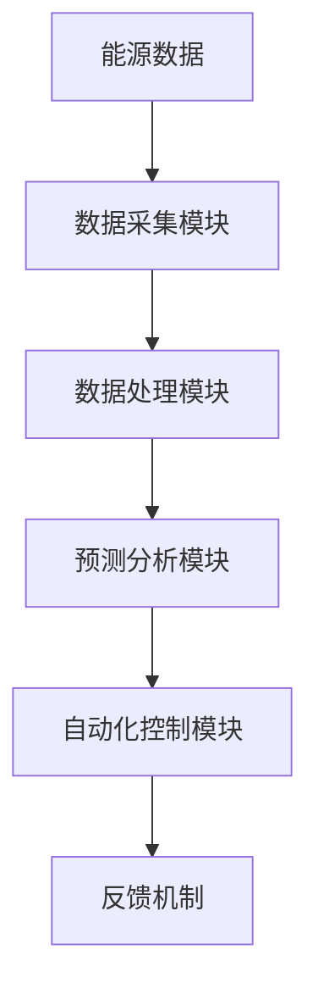
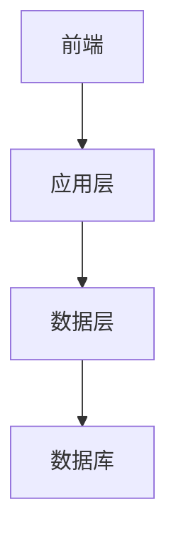
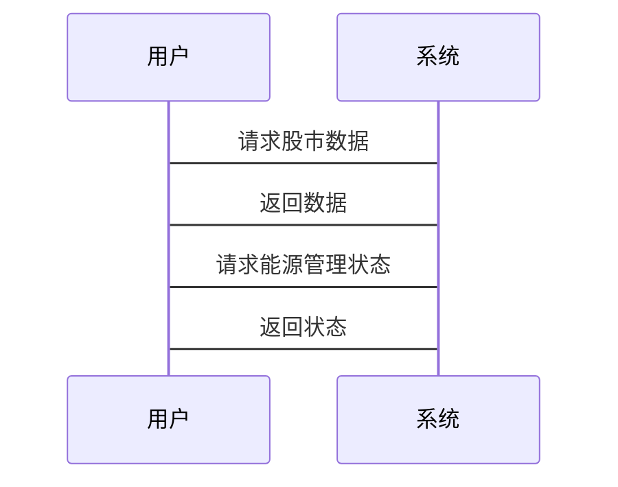

                 


# 新兴市场股市估值与智慧城市能源管理的互动

> 关键词：新兴市场、股市估值、智慧城市、能源管理、数据驱动、系统架构

> 摘要：本文探讨了新兴市场股市估值与智慧城市能源管理之间的互动关系。通过分析股市估值的核心概念、数学模型与算法原理，以及智慧城市能源管理的系统架构与数据流，本文揭示了两者在数据驱动下的相互作用。文章进一步通过项目实战，展示了如何通过系统设计实现两者的互动与优化，为未来的投资决策和能源管理提供理论与实践指导。

---

# 第一部分: 背景与核心概念

## 第1章: 新兴市场股市估值与智慧城市能源管理的背景

### 1.1 新兴市场的定义与特点

#### 1.1.1 新兴市场的定义
新兴市场是指那些经济快速发展但尚未完全工业化的国家，通常包括巴西、印度、中国等。这些市场具有高增长潜力，但也伴随着高风险。

#### 1.1.2 新兴市场的经济特征
- 经济结构多元化，但制造业和服务业占主导地位。
- 人口年轻，消费市场潜力巨大。
- 政治和经济政策不稳定，导致市场波动性高。

#### 1.1.3 新兴市场的股市特点
- 市场流动性相对较低，但波动性高。
- 估值方法复杂，需考虑多种宏观因素。
- 市场参与者包括国内外投资者，信息不对称问题突出。

### 1.2 智慧城市能源管理的定义与特点

#### 1.2.1 智慧城市能源管理的定义
智慧城市能源管理是指利用信息技术、大数据和人工智能优化城市能源的生产和分配，以提高能源效率和减少浪费。

#### 1.2.2 智慧城市能源管理的核心技术
- 数据采集与实时监控（IoT）
- 预测分析（机器学习）
- 自动化控制（智能系统）

#### 1.2.3 智慧城市能源管理的经济与社会影响
- 提高能源利用效率，降低成本。
- 减少碳排放，推动可持续发展。
- 优化城市运营，提升居民生活质量。

### 1.3 背景与问题描述

#### 1.3.1 新兴市场股市估值的挑战
- 宏观经济波动大，政策不确定性高。
- 数据获取困难，分析难度大。
- 市场流动性低，估值方法复杂。

#### 1.3.2 智慧城市能源管理的挑战
- 数据采集与处理的复杂性。
- 技术与政策的协调问题。
- 能源分配的公平性与效率问题。

#### 1.3.3 两者的互动关系与研究意义
- 股市估值为能源管理提供资金支持。
- 能源管理的效率影响股市表现。
- 两者共同推动城市可持续发展。

## 第2章: 核心概念与理论框架

### 2.1 股市估值的核心概念

#### 2.1.1 股市估值的基本原理
股市估值是通过分析公司的财务数据和市场因素，确定其股票的合理价格。

#### 2.1.2 主要估值方法
- 市盈率（PE）模型：$$ PE = \frac{\text{股价}}{\text{每股收益}} $$
- 市净率（PB）模型：$$ PB = \frac{\text{股价}}{\text{每股净资产}} $$
- 现金流折现模型（DCF）：$$ \text{企业价值} = \sum_{t=1}^{n} \frac{\text{现金流}}{(1+r)^t} $$

#### 2.1.3 新兴市场的特殊性
新兴市场的股市估值需考虑高波动性、政策风险和市场流动性等因素。

### 2.2 智慧城市能源管理的核心概念

#### 2.2.1 能源管理的定义与目标
能源管理旨在通过优化能源的生产和分配，提高效率并减少浪费。

#### 2.2.2 智慧能源管理的关键技术
- 数据采集与实时监控
- 预测分析
- 自动化控制

#### 2.2.3 智慧能源管理的系统架构


### 2.3 核心概念的对比与联系

#### 2.3.1 股市估值与能源管理的对比
| 特性 | 股市估值 | 智慧能源管理 |
|------|----------|-------------|
| 目标 | 确定股票价值 | 优化能源使用 |
| 技术 | 依赖金融模型 | 依赖大数据与AI |
| 影响 | 影响投资决策 | 影响城市运营 |

#### 2.3.2 两者的互动关系
- 能源管理的效率影响企业的盈利能力，进而影响股市估值。
- 股市估值为能源管理项目提供资金支持。
- 两者共同推动城市可持续发展。

---

# 第二部分: 核心概念的数学模型与算法原理

## 第3章: 股市估值的数学模型

### 3.1 常用估值模型的数学公式

#### 3.1.1 市盈率（PE）模型
$$ PE = \frac{\text{股价}}{\text{每股收益}} $$

#### 3.1.2 市净率（PB）模型
$$ PB = \frac{\text{股价}}{\text{每股净资产}} $$

#### 3.1.3 现金流折现模型（DCF）
$$ \text{企业价值} = \sum_{t=1}^{n} \frac{\text{现金流}}{(1+r)^t} $$

### 3.2 新兴市场股市估值的特殊性

#### 3.2.1 新兴市场的波动性分析
新兴市场的股市波动性较高，需引入高阶波动率模型（如GARCH模型）进行分析。

#### 3.2.2 新兴市场的风险溢价模型
$$ \text{风险溢价} = \alpha + \beta \times \text{市场风险溢价} $$

#### 3.2.3 新兴市场的流动性分析
流动性不足会导致股票价格与内在价值的偏离，需通过成交量分析进行调整。

## 第4章: 智慧城市能源管理的算法原理

### 4.1 能源消耗预测模型

#### 4.1.1 时间序列分析模型
时间序列预测模型用于预测未来能源消耗量，常用ARIMA模型。

#### 4.1.2 神经网络预测模型
神经网络（如LSTM）用于处理复杂的能源消耗模式。

#### 4.1.3 支持向量机（SVM）预测模型
SVM用于分类和回归分析，适用于能源消耗的非线性预测。

### 4.2 能源分配优化算法

#### 4.2.1 线性规划优化模型
$$ \text{目标函数} = \sum_{i} c_i x_i $$
$$ \text{约束条件} = \sum_{i} a_i x_i \leq b $$

#### 4.2.2 遗传算法在能源分配中的应用
遗传算法通过模拟自然选择优化能源分配方案。

#### 4.2.3 智能优化算法（如粒子群优化）
粒子群优化算法通过群体协作找到最优解。

### 4.3 能源管理系统的数据流分析

#### 4.3.1 数据流图的构建


#### 4.3.2 数据流的实时处理与反馈机制
实时数据流处理需结合流计算技术，确保快速响应。

#### 4.3.3 数据流的可视化与监控
可视化工具（如Power BI）用于监控能源管理系统的运行状态。

---

# 第三部分: 系统分析与架构设计

## 第5章: 系统分析与功能设计

### 5.1 问题场景介绍

#### 5.1.1 新兴市场股市波动对能源管理的影响
股市波动可能影响能源企业的融资能力，进而影响能源管理项目的实施。

#### 5.1.2 智慧城市能源管理对股市的影响
能源管理效率的提升可能改善企业的盈利能力，进而影响股市估值。

### 5.2 项目介绍

#### 5.2.1 项目目标
构建一个基于数据驱动的系统，实现新兴市场股市估值与智慧能源管理的互动。

#### 5.2.2 项目范围
- 数据采集与处理
- 股市估值模型开发
- 能源管理优化算法设计
- 系统集成与测试

## 第6章: 系统架构设计

### 6.1 系统架构设计

#### 6.1.1 分层架构设计


#### 6.1.2 组件间关系
- 前端：用户界面，展示股市数据和能源管理状态。
- 应用层：处理用户请求，调用数据层服务。
- 数据层：提供数据支持，包括股市数据和能源数据。
- 数据库：存储所有数据，支持高效查询。

## 第7章: 系统接口与交互设计

### 7.1 系统接口设计

#### 7.1.1 API设计
- 股市数据接口：提供实时股价和财务数据。
- 能源数据接口：提供能源消耗和生产数据。

#### 7.1.2 接口协议
- RESTful API
- JSON格式数据传输

### 7.2 系统交互设计

#### 7.2.1 用户交互流程


---

# 第四部分: 项目实战

## 第8章: 项目实战

### 8.1 环境安装

#### 8.1.1 安装Python
```bash
python --version
pip install --upgrade pip
```

#### 8.1.2 安装数据分析库
```bash
pip install numpy pandas matplotlib
```

#### 8.1.3 安装机器学习库
```bash
pip install scikit-learn tensorflow
```

### 8.2 系统核心实现

#### 8.2.1 股市估值模型实现
```python
import pandas as pd
import numpy as np

def calculate_pe(stock_data):
    pe = stock_data['股价'] / stock_data['每股收益']
    return pe.mean()
```

#### 8.2.2 能源管理优化算法实现
```python
from sklearn.linear_model import LinearRegression

def optimize_energy_allocation(constraints):
    model = LinearRegression()
    model.fit(constraints['features'], constraints['target'])
    return model.predict(new_constraints)
```

### 8.3 代码应用解读与分析

#### 8.3.1 股市估值模型解读
- 输入：股票的历史数据
- 输出：市盈率均值
- 用途：评估股票的合理估值

#### 8.3.2 能源管理优化算法解读
- 输入：能源分配的约束条件
- 输出：优化后的能源分配方案
- 用途：提高能源利用效率

### 8.4 实际案例分析

#### 8.4.1 案例背景
假设某新兴市场国家的股市和能源管理项目。

#### 8.4.2 数据分析与模型训练
- 数据清洗
- 模型训练
- 模型验证

#### 8.4.3 模型应用与结果分析
- 股市估值结果与实际市场数据对比
- 能源管理优化方案的实际效果评估

### 8.5 项目小结

#### 8.5.1 项目成果
- 成功构建了互动系统
- 提高了能源管理效率
- 改进了股市估值模型

#### 8.5.2 项目经验
- 数据质量至关重要
- 模型选择需结合实际场景
- 系统架构设计需考虑扩展性

---

# 第五部分: 总结与展望

## 第9章: 总结与展望

### 9.1 核心内容回顾

#### 9.1.1 股市估值的核心概念
- 估值方法的选择与应用
- 新兴市场的特殊性

#### 9.1.2 智慧城市能源管理的核心概念
- 数据驱动的能源管理
- 系统架构设计

### 9.2 未来研究方向

#### 9.2.1 智慧能源管理的优化算法
- 更高效的数据处理算法
- 更智能的预测模型

#### 9.2.2 股市估值与能源管理的深度结合
- 探讨更多互动机制
- 提出新的理论框架

#### 9.2.3 技术与政策的协调问题
- 如何通过政策引导技术应用
- 如何通过技术创新推动政策优化

---

# 附录

## 附录A: 算法代码示例

```python
import pandas as pd
import numpy as np
from sklearn.linear_model import LinearRegression

def calculate_pe(stock_data):
    pe = stock_data['股价'] / stock_data['每股收益']
    return pe.mean()

def optimize_energy_allocation(constraints):
    model = LinearRegression()
    model.fit(constraints['features'], constraints['target'])
    return model.predict(new_constraints)

# 示例数据
stock_data = pd.DataFrame({
    '股价': [100, 200, 300],
    '每股收益': [10, 20, 30
})
print(calculate_pe(stock_data))
```

## 附录B: 系统架构图


---

# 结语

通过本文的分析与实践，我们深入探讨了新兴市场股市估值与智慧城市能源管理的互动关系，提出了基于数据驱动的解决方案，并通过项目实战验证了理论的可行性。未来，随着技术的进步和政策的完善，两者的互动将更加紧密，为城市可持续发展提供更强大的支持。

