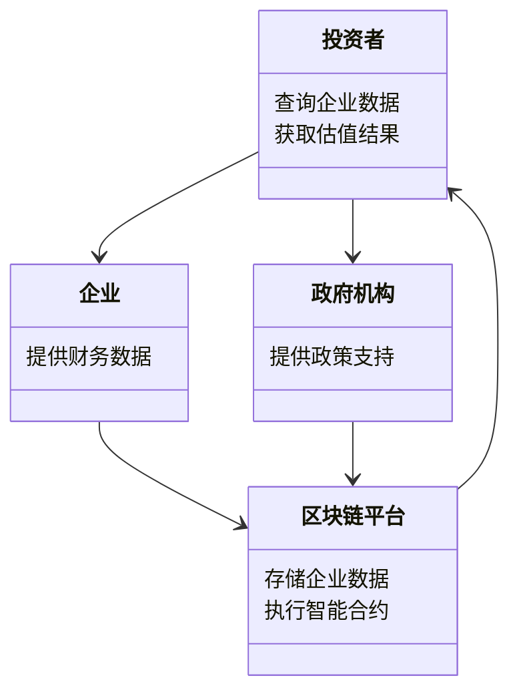
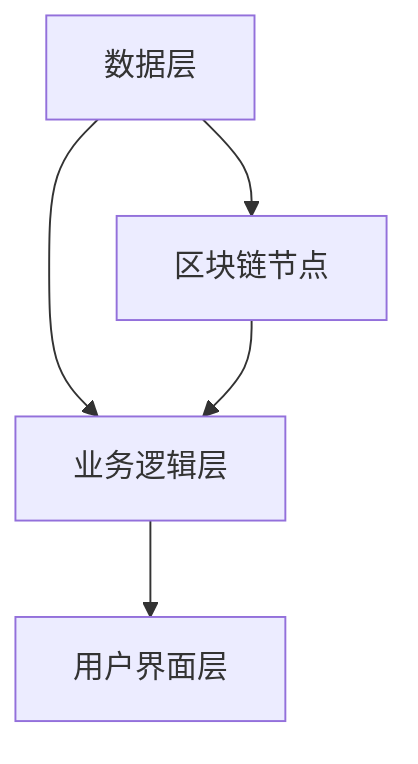
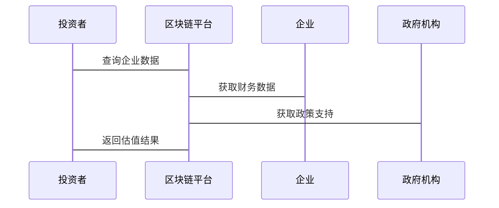

                 


# 新兴市场股市估值与智慧政务区块链应用的互动

## 关键词：
- 新兴市场股市估值
- 区块链技术
- 智慧政务
- 互动机制
- 应用案例

## 摘要：
本文探讨新兴市场股市估值与智慧政务区块链应用的互动关系，分析区块链技术如何提升股市估值的透明度和准确性，以及如何优化政府服务。通过详细的技术分析和实际案例，展示区块链在新兴市场中的潜力和应用场景。

---

# 第一部分: 新兴市场股市估值与智慧政务区块链应用的互动背景

## 第1章: 问题背景与定义

### 1.1 问题背景

#### 1.1.1 新兴市场的经济特点
新兴市场通常指经济发展迅速但尚未完全工业化的国家。这些市场具有高增长潜力，但也面临经济波动、信息不对称和监管不完善的问题。

#### 1.1.2 股市估值的重要性
股市估值是衡量企业价值的关键指标。准确的估值有助于投资者做出明智决策，促进市场稳定和经济发展。

#### 1.1.3 区块链技术的引入动机
区块链技术以其去中心化、透明和不可篡改的特性，为解决新兴市场中的信任和效率问题提供了可能。

### 1.2 核心概念定义

#### 1.2.1 股市估值的定义与指标
股市估值是对企业价值的评估，常用指标包括市盈率（P/E）、市净率（P/B）和EV/EBITDA等。

#### 1.2.2 智慧政务的定义与目标
智慧政务指通过技术手段优化政府服务流程，提升服务效率和质量，目标是实现政府服务的智能化和高效化。

#### 1.2.3 区块链技术的核心特征
区块链技术具有去中心化、透明性、不可篡改和可追溯等特点，能够有效提升数据的安全性和信任度。

### 1.3 问题描述与现状分析

#### 1.3.1 新兴市场股市估值的挑战
新兴市场股市估值面临数据不透明、信息不对称和市场波动大的问题，影响投资者决策和市场稳定。

#### 1.3.2 智慧政务中的痛点
传统政务系统存在效率低下、数据孤岛和腐败问题，亟需技术手段优化服务流程和提升透明度。

#### 1.3.3 区块链技术在两者中的潜在应用
区块链技术可以通过数据共享、智能合约和去中心化信任机制，解决股市估值和政务中的痛点。

### 1.4 互动机制的初步探讨

#### 1.4.1 股市估值与政务数据的关系
政务数据如企业财务信息和政策支持对股市估值至关重要，区块链技术可提升数据的准确性和实时性。

#### 1.4.2 区块链技术如何促进两者的互动
区块链通过数据共享、智能合约和实时更新机制，促进股市估值与政务数据的实时互动和协同。

#### 1.4.3 互动机制的初步框架
初步框架包括数据共享平台、智能合约系统和实时更新机制，实现股市估值与政务数据的动态交互。

### 1.5 研究意义与目标

#### 1.5.1 研究的理论价值
探讨区块链技术在新兴市场中的应用潜力，丰富技术与经济结合的理论研究。

#### 1.5.2 研究的实践意义
为新兴市场提供技术创新和实践指导，提升股市估值的准确性和政务效率。

---

## 第2章: 核心概念与联系

### 2.1 核心概念的原理分析

#### 2.1.1 股市估值的原理
股市估值基于对企业未来现金流的折现，常用指标包括市盈率、市净率和EV/EBITDA。

#### 2.1.2 区块链技术的工作原理
区块链通过分布式账本、共识机制和智能合约实现数据的安全性和可信度。

### 2.2 核心概念的特征对比

| 特性          | 股市估值                  | 区块链技术              |
|---------------|--------------------------|-------------------------|
| 核心目标      | 评估企业价值              | 提供安全可信的数据存储  |
| 主要挑战      | 数据不透明、信息不对称    | 交易成本高、效率低      |
| 解决方案      | 基于区块链的透明数据存储  | 智能合约、去中心化      |

### 2.3 核心概念的联系

#### 2.3.1 区块链技术如何提升股市估值
通过区块链技术实现企业财务数据的实时更新和透明共享，提升估值的准确性和实时性。

#### 2.3.2 智慧政务中的区块链应用
区块链技术可优化政务流程，提升服务透明度和效率，减少腐败和数据错误。

#### 2.3.3 互动机制的具体实现
通过区块链构建股市估值与政务数据的共享平台，实现数据实时更新和协同优化。

### 2.4 实体关系图

```mermaid
erd
  title 实体关系图
  user "投资者" --> "企业财务数据"
  政府机构 --> "政策支持"
  区块链平台 <--> "企业财务数据"
  区块链平台 <--> "政策支持"
```

---

## 第3章: 算法原理与技术实现

### 3.1 算法原理

#### 3.1.1 股市估值算法
基于技术指标的算法，如移动平均收敛散度（MACD）和相对强弱指数（RSI），用于预测股市趋势。

#### 3.1.2 区块链共识机制
通过工作量证明（PoW）或权益证明（PoS）等机制，确保区块链网络的安全性和一致性。

#### 3.1.3 智能合约算法
智能合约基于区块链平台，自动执行预设条件，实现数据的自动更新和交互。

### 3.2 技术实现

#### 3.2.1 股市估值的技术指标
使用移动平均收敛散度（MACD）算法，计算股票短期和长期趋势。

$$ MACD = EMA_{12} - EMA_{26} $$
$$ Signal = EMA_{9}(\text{MACD}) $$

#### 3.2.2 区块链共识机制
采用工作量证明（PoW）算法，确保区块的安全性和一致性。

### 3.3 算法实现的代码示例

```python
# MACD算法实现
def calculate_macd(close_prices, short_window=12, long_window=26):
    ema_short = []
    ema_long = []
    macd = []
    for price in close_prices:
        if len(ema_short) == 0:
            ema_short.append(price)
        else:
            ema_short.append(ema_short[-1] * (short_window - 1)/short_window + price * 1/short_window)
        if len(ema_long) == 0:
            ema_long.append(price)
        else:
            ema_long.append(ema_long[-1] * (long_window - 1)/long_window + price * 1/long_window)
        macd.append(ema_short[-1] - ema_long[-1])
    return macd

# 区块链共识机制实现（简化）
def proof_of_work(block):
    while True:
        nonce = random.randint(0, 1000000)
        if block.nonce_hash.startswith('0000'):
            break
    block.nonce = nonce
```

### 3.4 算法优化与性能分析
通过优化算法参数和提高计算效率，提升股市估值和区块链系统的性能，确保数据处理的实时性和准确性。

---

## 第4章: 系统分析与架构设计

### 4.1 系统分析

#### 4.1.1 问题场景介绍
新兴市场股市估值和智慧政务中的数据孤岛和信任问题，亟需技术创新解决。

#### 4.1.2 项目介绍
通过区块链技术构建共享平台，实现股市估值与政务数据的实时互动和协同优化。

### 4.2 功能设计

#### 4.2.1 领域模型设计
构建投资者、企业、政府机构和区块链平台的交互模型。



#### 4.2.2 系统架构设计
采用分层架构，包括数据层、业务逻辑层和用户界面层。



### 4.3 系统交互设计

#### 4.3.1 交互流程
投资者查询企业数据，区块链平台执行智能合约，更新估值结果。



### 4.4 系统接口设计
定义RESTful API接口，实现数据的交互和智能合约的执行。

---

## 第5章: 项目实战与案例分析

### 5.1 项目实战

#### 5.1.1 环境安装
安装必要的开发工具，如Python、区块链框架（如Ethereum）和数据可视化工具。

#### 5.1.2 核心代码实现
实现MACD算法和智能合约的部署。

```python
# 部分代码示例
from web3 import Web3
from eth_account import Account

# 连接以太坊测试网
web3 = Web3(Web3.HTTPProvider("http://127.0.0.1:8545"))

# 部署智能合约
contract_address = deploy_contract(web3, contract_abi)
```

#### 5.1.3 项目运行与测试
测试系统的数据交互和智能合约执行，验证系统的功能和性能。

### 5.2 案例分析

#### 5.2.1 实际案例
分析实际新兴市场中的企业，使用区块链技术提升估值准确性和政务效率。

#### 5.2.2 案例分析与解读
通过具体数据和图表，展示区块链技术在股市估值和政务中的实际效果。

---

## 第6章: 总结与展望

### 6.1 总结

#### 6.1.1 研究成果
通过区块链技术提升新兴市场股市估值的准确性和智慧政务的效率。

#### 6.1.2 核心发现
区块链技术在数据共享和信任机制中的应用，是解决新兴市场问题的关键。

### 6.2 展望

#### 6.2.1 技术发展
未来将探索更高效的共识机制和更智能的合约执行方式。

#### 6.2.2 应用场景
拓展区块链技术在更多领域的应用，如供应链金融和跨境支付。

#### 6.2.3 挑战与机遇
继续攻克技术难题，抓住新兴市场的巨大机遇。

---

## 最佳实践 Tips

- 在实施区块链技术前，确保数据的合法性和合规性。
- 定期更新智能合约，适应市场变化和政策调整。
- 加强跨学科合作，推动技术与经济的深度融合。

---

## 结语

通过本文的深入分析和实践，我们看到了区块链技术在新兴市场中的巨大潜力。未来，随着技术的进步和应用的拓展，股市估值与智慧政务的互动将更加紧密，推动社会的全面进步。

--- 

以上就是完整的技术博客文章内容。

