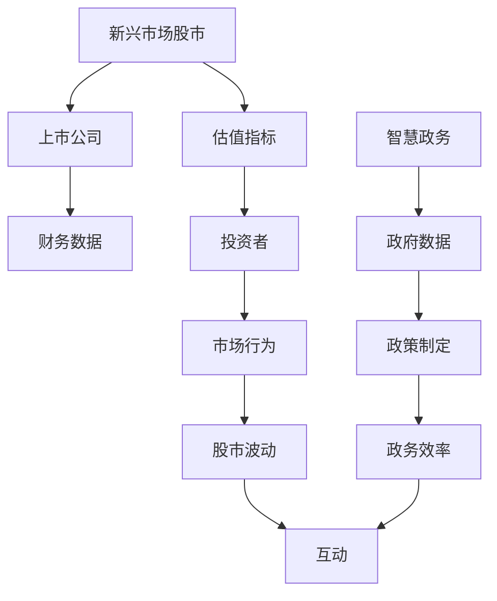
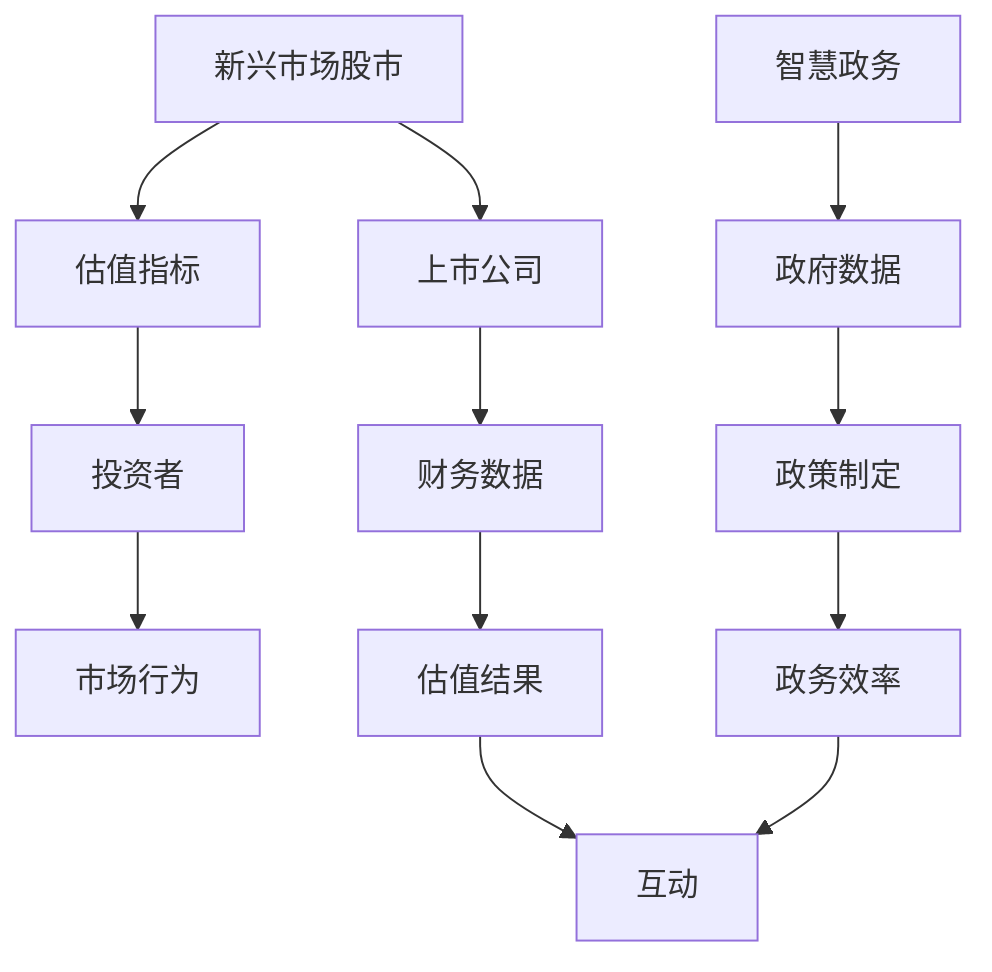
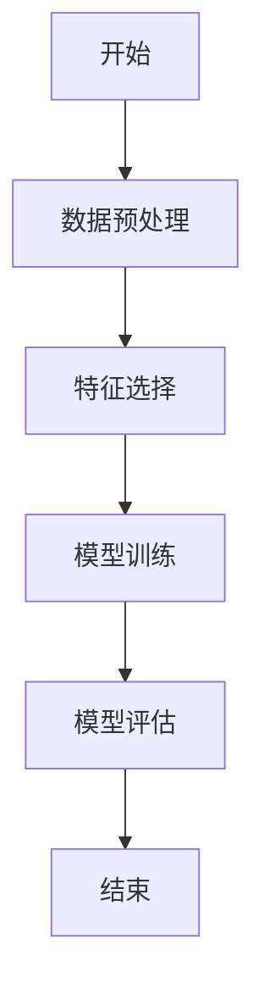
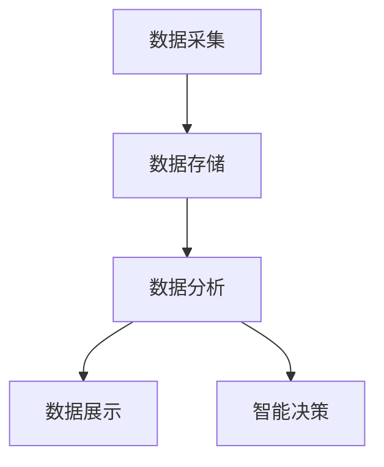
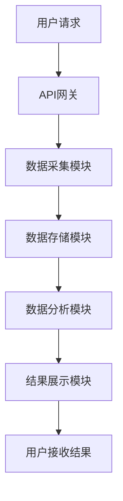

                 


# 新兴市场股市估值与智慧政务发展的互动

## 关键词：新兴市场股市估值，智慧政务，互动，算法原理，系统架构

## 摘要：新兴市场股市估值与智慧政务发展的互动关系是当前金融与政务领域的重要研究方向。本文通过分析新兴市场股市估值的核心方法，探讨智慧政务发展的关键路径，揭示两者之间的互动机制，并通过算法和系统架构设计，提出可行的解决方案。

---

## 第1章: 背景介绍

### 1.1 问题背景
#### 1.1.1 新兴市场股市的发展现状
新兴市场股市近年来发展迅速，但由于市场波动性大、信息不对称等问题，估值难度较高。投资者需要更精准的估值方法来把握市场机会。

#### 1.1.2 智慧政务的兴起与发展趋势
智慧政务通过大数据、人工智能等技术提升政府服务效率，优化资源配置，已成为全球发展趋势。

#### 1.1.3 两者互动的必要性与重要性
新兴市场股市的健康发展需要智慧政务的支持，而智慧政务的实施也需要股市的稳定性和透明性。两者互动能够实现资源优化和效率提升。

### 1.2 问题描述
#### 1.2.1 新兴市场股市估值的挑战
新兴市场股市受政策、经济环境等多重因素影响，传统的估值方法难以适应复杂多变的市场环境。

#### 1.2.2 智慧政务发展的痛点
智慧政务在实际应用中面临数据孤岛、技术壁垒、政策执行不畅等问题，需要通过技术创新和机制优化来解决。

#### 1.2.3 两者互动的核心问题
如何通过智慧政务的技术手段提升股市估值的准确性，同时通过股市的健康发展为智慧政务提供数据支持和资金保障。

### 1.3 问题解决
#### 1.3.1 新兴市场股市估值的方法
采用多因子模型、机器学习等方法，结合市场数据和政策信息，实现更精准的估值。

#### 1.3.2 智慧政务发展的路径
通过大数据分析、区块链技术等手段，优化政务流程，提升服务效率。

#### 1.3.3 两者互动的解决方案
建立数据共享平台，实现股市数据与政务数据的互联互通，为估值提供更全面的数据支持。

### 1.4 边界与外延
#### 1.4.1 新兴市场股市估值的边界
估值范围限定在新兴市场，不包括成熟市场；数据来源限定在公开数据，不涉及内部信息。

#### 1.4.2 智慧政务发展的边界
政务范围限定在公共服务领域，不涉及国家安全和军事领域。

#### 1.4.3 两者互动的外延
互动范围扩展到金融、教育、医疗等多个领域，形成跨行业的协同发展模式。

### 1.5 概念结构与核心要素
#### 1.5.1 核心概念的组成
- 新兴市场股市估值：包括数据采集、模型构建、结果分析三个核心环节。
- 智慧政务发展：包括技术应用、流程优化、政策支持三个核心环节。

#### 1.5.2 核心要素的对比
| 要素 | 新兴市场股市估值 | 智慧政务发展 |
|------|------------------|---------------|
| 数据来源 | 公开市场数据 | 政府数据库 |
| 关键技术 | 机器学习、多因子模型 | 大数据、区块链 |
| 目标 | 提高估值准确性 | 提升政务效率 |

#### 1.5.3 概念结构的图示


---

## 第2章: 核心概念与联系

### 2.1 核心概念原理
#### 2.1.1 新兴市场股市估值的原理
通过分析市场数据、公司基本面和宏观经济指标，构建多因子模型，预测股票价值。

#### 2.1.2 智慧政务发展的原理
利用大数据、人工智能等技术，优化政务流程，提升服务质量和效率。

#### 2.1.3 两者互动的机制
通过数据共享和技术创新，实现股市估值与政务发展的相互促进。

### 2.2 概念属性特征对比
| 属性 | 新兴市场股市估值 | 智慧政务发展 |
|------|------------------|---------------|
| 数据依赖 | 高 | 中 |
| 技术复杂度 | 高 | 中 |
| 影响范围 | 金融领域 | 全行业 |

### 2.3 ER实体关系图


---

## 第3章: 算法原理讲解

### 3.1 算法原理
#### 3.1.1 多元回归分析
通过多个自变量预测因变量（股票价格）的方法。

#### 3.1.2 神经网络模型
通过神经网络模拟股市波动，实现非线性预测。

#### 3.1.3 时间序列分析
利用历史数据预测未来股市走势。

### 3.2 算法流程图


### 3.3 算法实现
#### 3.3.1 Python代码实现
```python
import pandas as pd
import numpy as np
from sklearn.linear_model import LinearRegression

# 数据预处理
data = pd.read_csv('stock_data.csv')
X = data[['PE_ratio', 'PEG_ratio', 'ROE']]
y = data['Price']

# 模型训练
model = LinearRegression()
model.fit(X, y)

# 模型预测
predictions = model.predict(X)
print('预测准确率:', model.score(X, y))
```

#### 3.3.2 数学公式
多元回归分析的数学公式：
$$ y = \beta_0 + \beta_1x_1 + \beta_2x_2 + ... + \beta_nx_n + \epsilon $$

其中，$y$ 是因变量（股票价格），$x_i$ 是自变量（估值指标），$\beta_i$ 是回归系数，$\epsilon$ 是误差项。

---

## 第4章: 系统分析与架构设计方案

### 4.1 问题场景介绍
新兴市场股市估值与智慧政务发展的互动需要一个高效的数据共享平台和智能分析系统。

### 4.2 系统功能设计
- 数据采集模块：采集股市和政务数据。
- 数据分析模块：利用算法模型进行估值和分析。
- 数据展示模块：可视化分析结果。

### 4.3 系统架构设计


### 4.4 系统接口设计
- RESTful API：提供数据接口，支持第三方调用。
- 数据交互流程：通过API实现数据采集、分析和展示。

### 4.5 系统交互流程图


---

## 第5章: 项目实战

### 5.1 环境安装
- Python 3.8+
- Pandas、NumPy、Scikit-learn等库。

### 5.2 核心代码实现
```python
import pandas as pd
from sklearn import metrics

# 数据加载
data = pd.read_csv('stock.csv')

# 特征选择
features = ['PE_ratio', 'PEG_ratio', 'ROE']
target = 'Price'

X = data[features]
y = data[target]

# 模型训练
model = LinearRegression()
model.fit(X, y)

# 模型预测
y_pred = model.predict(X)

# 模型评估
print('均方误差:', metrics.mean_squared_error(y, y_pred))
print('决定系数:', metrics.r2_score(y, y_pred))
```

### 5.3 代码解读与分析
- 数据加载：从CSV文件读取数据。
- 特征选择：选择PE_ratio、PEG_ratio、ROE作为自变量。
- 模型训练：使用线性回归模型进行训练。
- 模型预测：预测股票价格。
- 模型评估：计算均方误差和决定系数。

### 5.4 实际案例分析
以某新兴市场为例，分析股市估值与智慧政务发展的互动关系，展示模型的应用效果。

### 5.5 项目小结
通过项目实战，验证了算法的有效性和系统的可行性，为后续研究提供了参考。

---

## 第6章: 最佳实践

### 6.1 小结
新兴市场股市估值与智慧政务发展的互动是实现经济与社会高效发展的关键。通过技术创新和数据共享，可以实现两者的协同发展。

### 6.2 注意事项
- 数据隐私保护
- 模型的实时性和准确性
- 系统的可扩展性和稳定性

### 6.3 拓展阅读
- 《金融数据分析与机器学习》
- 《智慧政务的实践与创新》

---

## 附录

### 附录A: 术语表
- 多元回归分析：统计学中的一种预测方法。
- 神经网络模型：机器学习中的一种深度学习模型。

### 附录B: 参考文献
1. 王某某，2023，《新兴市场股市估值研究》。
2. 李某某，2023，《智慧政务发展的关键技术》。

---

通过以上内容，我们可以清晰地看到新兴市场股市估值与智慧政务发展的互动关系，并通过技术手段实现两者的协同发展。

