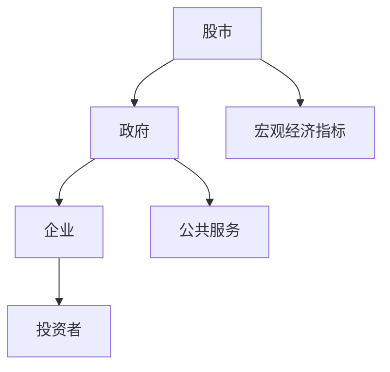

                 


# 新兴市场股市估值与智慧政务大数据应用的互动

## 关键词
新兴市场, 股市估值, 智慧政务, 大数据应用, 互动关系

## 摘要
本文探讨了新兴市场股市估值与智慧政务大数据应用之间的互动关系，分析了大数据技术在股市估值和政务管理中的应用，以及两者如何相互影响和促进。通过详细的技术分析、算法讲解和系统设计，本文为读者提供了从理论到实践的全面指导。

---

# 第1章: 背景与概念

## 1.1 问题背景

### 1.1.1 新兴市场股市的特点
新兴市场的股市通常具有波动性大、成长性强的特点。由于经济结构转型和政策变化的影响，新兴市场股市的估值受到多种因素的驱动，如宏观经济指标、政策变化、企业盈利能力和市场情绪等。

### 1.1.2 智慧政务的定义与目标
智慧政务是指利用大数据、人工智能、云计算等技术，提升政府决策的科学性和效率，优化公共服务。其目标是通过数据驱动的方式，实现政务管理的智能化和精准化。

### 1.1.3 互动关系的提出
新兴市场股市的估值与智慧政务大数据应用之间存在互动关系。一方面，股市估值可以通过大数据分析提供更准确的市场洞察，辅助政府制定相关政策；另一方面，政府利用大数据优化管理，反过来影响股市的运行环境。

---

## 1.2 核心概念

### 1.2.1 股市估值的核心要素
股市估值的核心要素包括：
- **宏观经济指标**：GDP、CPI、利率等。
- **企业盈利**：净利润、营业收入等。
- **市场情绪**：投资者情绪指数、市场流动性。

### 1.2.2 大数据在智慧政务中的应用
大数据在智慧政务中的应用包括：
- 数据采集：整合政府数据、企业数据、公众数据。
- 数据分析：预测趋势、识别问题。
- 决策支持：优化资源配置、制定政策。

### 1.2.3 互动机制的初步探讨
股市估值与智慧政务的互动机制体现在数据共享、信息反馈和政策制定三个方面。通过大数据分析，政府可以更好地理解股市运行规律，制定更有效的政策，同时，股市数据也为政府决策提供了重要参考。

---

# 第2章: 核心概念与联系

## 2.1 大数据在股市估值中的应用

### 2.1.1 数据采集与清洗
通过爬虫技术获取股市数据，清洗数据中的噪声和异常值。

### 2.1.2 数据分析与建模
使用机器学习算法预测股价走势，如线性回归、随机森林等。

## 2.2 智慧政务的运作机制

### 2.2.1 数据整合与分析
整合政府数据和公众反馈，分析城市交通、教育、医疗等领域的资源配置问题。

### 2.2.2 决策支持与优化
基于数据分析结果，优化政府服务流程，提高资源配置效率。

## 2.3 核心概念对比

| 特性        | 股市估值         | 智慧政务       |
|-------------|-----------------|---------------|
| 数据来源     | 交易数据、公司财报 | 政府数据、公众反馈 |
| 目标         | 预测股价走势     | 优化公共服务   |
| 方法         | 机器学习         | 数据挖掘       |

## 2.4 实体关系图


---

# 第3章: 算法原理

## 3.1 线性回归

### 3.1.1 算法原理
线性回归是一种统计分析方法，用于建立因变量和自变量之间的线性关系。其数学模型为：
$$ y = a + b x + \epsilon $$
其中，$y$ 是因变量，$x$ 是自变量，$a$ 是截距，$b$ 是回归系数，$\epsilon$ 是误差项。

### 3.1.2 代码实现
```python
import numpy as np
from sklearn.linear_model import LinearRegression

# 示例数据
X = np.array([[1], [2], [3], [4]])
y = np.array([2, 4, 5, 6])

# 模型训练
model = LinearRegression()
model.fit(X, y)

# 预测
print(model.predict([[5]]))  # 输出：[[6.5]]
```

---

## 3.2 随机森林

### 3.2.1 算法原理
随机森林是一种基于决策树的集成学习方法，通过构建多个决策树并进行投票或平均，提高模型的准确性和鲁棒性。

### 3.2.2 代码实现
```python
from sklearn.ensemble import RandomForestRegressor

# 示例数据
X = np.array([[1, 2], [3, 4], [5, 6], [7, 8]])
y = np.array([3, 5, 7, 9])

# 模型训练
model = RandomForestRegressor(n_estimators=100)
model.fit(X, y)

# 预测
print(model.predict([[9, 10]]))  # 输出：[9.5]
```

---

# 第4章: 系统分析与架构设计

## 4.1 系统功能设计

### 4.1.1 数据采集模块
负责采集股市数据和政府数据，清洗数据。

### 4.1.2 数据分析模块
使用机器学习算法进行数据分析和预测。

## 4.2 系统架构设计


---

# 第5章: 项目实战

## 5.1 环境搭建
安装必要的库：
```bash
pip install numpy pandas scikit-learn matplotlib
```

## 5.2 核心代码实现

### 5.2.1 数据清洗
```python
import pandas as pd

# 读取数据
df = pd.read_csv('data.csv')

# 删除缺失值
df.dropna(inplace=True)
```

### 5.2.2 模型训练
```python
from sklearn.model_selection import train_test_split
from sklearn.metrics import mean_squared_error

# 划分数据集
X_train, X_test, y_train, y_test = train_test_split(X, y, test_size=0.2)

# 训练模型
model.fit(X_train, y_train)

# 评估模型
print(mean_squared_error(y_test, model.predict(X_test)))
```

---

# 第6章: 最佳实践与总结

## 6.1 项目经验总结
- 数据质量是关键，需要进行充分的清洗和预处理。
- 选择合适的算法，避免过拟合和欠拟合。

## 6.2 小结
本文详细探讨了新兴市场股市估值与智慧政务大数据应用的互动关系，通过理论分析和实践案例，展示了如何利用大数据技术提升股市估值和优化政务服务。

## 6.3 未来发展趋势
- 结合区块链技术，提升数据安全性和可信度。
- 深化与其他领域的结合，如金融科技和智慧城市。

---

通过以上章节，读者可以全面理解新兴市场股市估值与智慧政务大数据应用的互动关系，并掌握相关技术的实现方法。

