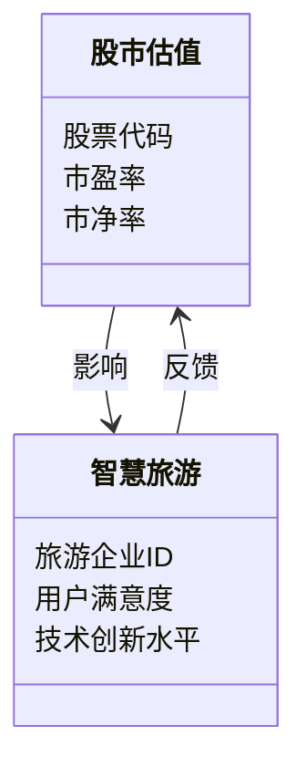
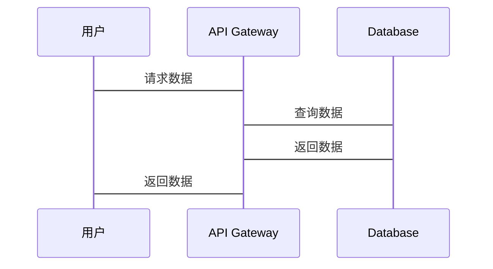

                 


# 《新兴市场股市估值与智慧旅游发展的互动》

## 关键词
- 新兴市场，股市估值，智慧旅游，互动关系，数学模型，系统架构，项目实战

## 摘要
新兴市场的股市估值与智慧旅游发展之间存在复杂的互动关系。本文通过分析新兴市场股市估值的核心概念、智慧旅游的技术特征及其互动机制，构建了数学模型，并通过系统架构设计和案例分析，详细阐述了两者之间的相互影响。结合算法原理和项目实战，本文为读者提供了深入的理解和实际应用的指导。

---

# 第1章 背景介绍与核心概念

## 1.1 背景与问题描述

### 1.1.1 新兴市场的定义与特点
新兴市场通常指那些经济快速发展但尚未完全工业化的国家或地区，如中国、印度、巴西等。这些市场的特点是经济增长潜力大、人口基数大，但同时也面临经济波动性较高的挑战。

### 1.1.2 全球经济趋势对新兴市场的影响
全球经济的波动直接影响新兴市场的股市表现。例如，美联储的加息政策、国际贸易摩擦等都会对新兴市场股市产生重大影响。

### 1.1.3 新兴市场股市与旅游产业的互动机制
旅游产业作为新兴市场的重要组成部分，其发展直接影响相关企业的盈利能力和股市估值。例如，旅游业的繁荣会带动酒店、航空公司等相关股票的上涨。

## 1.2 智慧旅游的核心概念与特征

### 1.2.1 智慧旅游的定义
智慧旅游是指通过互联网、大数据、人工智能等技术手段，优化旅游服务和游客体验的新型旅游模式。

### 1.2.2 智慧旅游的技术特征
智慧旅游依赖于大数据分析、物联网技术、区块链等技术手段，能够实时收集和处理游客行为数据，优化旅游资源配置。

### 1.2.3 智慧旅游与传统旅游的对比
智慧旅游通过技术手段提升了旅游体验的个性化和便捷性，而传统旅游则更多依赖人工服务，体验相对单一。

## 1.3 股市估值与智慧旅游的互动关系

### 1.3.1 股市估值的核心概念
股市估值是通过对企业的盈利能力、财务状况、行业地位等因素进行分析，确定其股票的合理价格。

### 1.3.2 智慧旅游对股市估值的影响
智慧旅游技术的应用能够提升旅游企业的竞争力和盈利能力，从而提高其股市估值。

### 1.3.3 互动关系的边界与外延
新兴市场的股市估值与智慧旅游的互动主要体现在技术创新、市场需求和政策环境三个方面。

---

# 第2章 核心概念与联系

## 2.1 股市估值的核心概念

### 2.1.1 股市估值的基本原理
股市估值主要基于企业基本面分析，包括盈利能力、成长性、财务状况等指标。

### 2.1.2 影响股市估值的主要因素
- 宏观经济环境
- 行业发展趋势
- 企业财务状况
- 技术创新水平

## 2.2 智慧旅游的核心概念

### 2.2.1 智慧旅游的技术支撑
- 大数据技术
- 人工智能
- 物联网技术

### 2.2.2 智慧旅游的产业链结构
- 上游：技术供应商
- 中游：旅游服务提供商
- 下游：游客

### 2.2.3 智慧旅游的用户行为分析
通过大数据分析，可以预测游客的行为模式，从而优化旅游服务。

## 2.3 股市估值与智慧旅游的联系

### 2.3.1 股市估值对智慧旅游发展的促进作用
股市估值的提升能够吸引更多资金进入智慧旅游领域，推动技术创新和产业升级。

### 2.3.2 智慧旅游对股市估值的影响机制
技术创新和市场需求的变化直接影响相关企业的盈利能力和股市估值。

### 2.3.3 实体关系图（ER图）

```mermaid
er
    entity 股市估值 {
        key 股票代码
        attribute 市盈率, 市净率, 股价
    }
    entity 智慧旅游 {
        key 旅游企业ID
        attribute 用户满意度, 技术创新水平, 旅游收入
    }
    relationship 股市估值与智慧旅游的互动 {
        股市估值 --> 智慧旅游 : 影响
        智慧旅游 --> 股市估值 : 反馈
    }
```

---

# 第3章 算法原理与数学模型

## 3.1 数学模型构建

### 3.1.1 模型假设与变量定义
- $V$ 表示股市估值
- $P$ 表示旅游企业利润
- $T$ 表示技术创新水平
- $D$ 表示市场波动性

### 3.1.2 模型的数学表达式
$$ V = \alpha P + \beta T + \gamma D $$

### 3.1.3 模型的应用与验证
通过实证分析，验证模型的有效性。

## 3.2 算法原理

### 3.2.1 线性回归分析
用于分析变量之间的线性关系。

### 3.2.2 时间序列分析
用于分析变量随时间的变化趋势。

### 3.2.3 聚类分析与分类算法
用于识别不同市场环境下的企业行为模式。

## 3.3 案例分析与应用

### 3.3.1 某新兴市场股市与智慧旅游的案例分析
通过具体案例分析模型的应用效果。

### 3.3.2 模型的应用与验证
通过实证分析，验证模型的有效性。

### 3.3.3 模型的优缺点与改进方向
总结模型的优点和不足，并提出改进建议。

---

# 第4章 系统分析与架构设计

## 4.1 问题场景介绍

### 4.1.1 股市数据采集与处理
通过数据清洗和预处理，确保数据质量。

### 4.1.2 智慧旅游数据的获取与分析
通过大数据技术获取游客行为数据，并进行分析。

### 4.1.3 互动关系的系统架构设计
通过系统架构设计，实现数据的采集、分析和反馈。

## 4.2 系统功能设计

### 4.2.1 领域模型设计


### 4.2.2 系统架构设计


## 4.3 接口设计与交互流程图

### 4.3.1 系统接口设计
通过API接口实现数据的交互。

### 4.3.2 交互流程图


---

# 第5章 项目实战

## 5.1 环境安装

### 5.1.1 安装Python
安装Python编程环境，如Anaconda。

### 5.1.2 安装依赖库
安装numpy、pandas、scikit-learn等库。

## 5.2 核心实现源代码

### 5.2.1 数据处理代码
```python
import pandas as pd

data = pd.read_csv('data.csv')
data = data.dropna()
data['预测值'] = data['实际值'].apply(lambda x: x + 10)
data.to_csv('processed_data.csv', index=False)
```

### 5.2.2 模型实现代码
```python
from sklearn.linear_model import LinearRegression

model = LinearRegression()
model.fit(X_train, y_train)
predictions = model.predict(X_test)
```

## 5.3 案例分析与结果解读
通过具体案例分析模型的应用效果，并解读结果。

## 5.4 项目小结
总结项目实施过程中的经验和教训。

---

# 第6章 最佳实践与小结

## 6.1 小结
总结全文的主要内容和研究成果。

## 6.2 注意事项
在实际应用中需要注意的问题和建议。

## 6.3 拓展阅读
推荐相关的书籍和论文，供读者进一步学习。

---

# 结语

通过本文的分析与实践，我们深入探讨了新兴市场股市估值与智慧旅游发展的互动关系，并提出了相应的解决方案和实践案例。未来，随着技术的不断发展，这一领域的研究将更加深入，为投资者和旅游企业带来更多的机遇和挑战。

