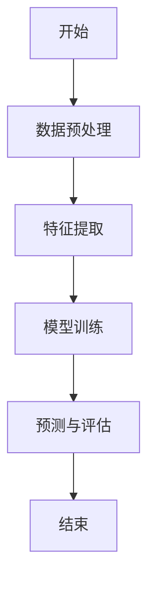
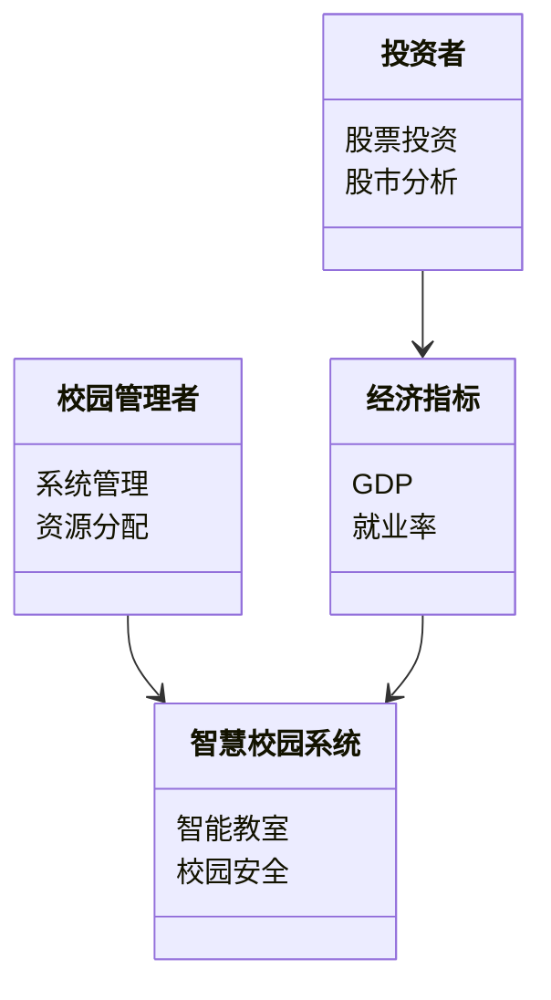
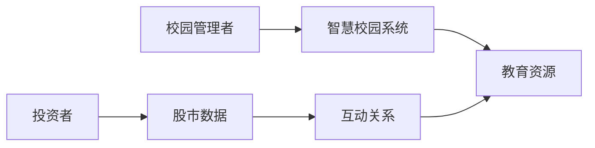

                 


# 《新兴市场股市估值与智慧校园建设的互动》

> 关键词：股市估值、智慧校园、新兴市场、互动关系、机器学习、时间序列分析、系统架构

> 摘要：本文探讨了新兴市场股市估值与智慧校园建设之间的互动关系，分析了其核心概念、互动机制、算法模型及系统架构设计，通过实际案例展示了其应用价值。文章内容涵盖背景介绍、核心概念、算法原理、系统分析、项目实战等部分，为相关领域的研究和实践提供了理论支持和实践指导。

---

## 第一章：背景介绍

### 1.1 问题背景

#### 1.1.1 新兴市场的经济特点与发展现状
新兴市场通常指那些经济快速发展但尚未完全工业化的国家。这些市场的特点是经济增长潜力大、人口年轻、技术进步快，但同时也面临经济波动大、基础设施不完善等问题。股市作为经济的晴雨表，反映了市场的波动性和不确定性。

#### 1.1.2 智慧校园建设的兴起与发展趋势
智慧校园是通过信息技术手段将校园内的教学、管理、服务等环节智能化，以提高效率和质量。随着互联网、物联网、人工智能等技术的发展，智慧校园在全球范围内迅速普及，尤其是在新兴市场，智慧校园建设成为提升教育质量和竞争力的重要手段。

#### 1.1.3 股市估值与智慧校园建设的互动关系
股市估值的变化可能影响智慧校园建设的资金投入，而智慧校园的建设又可能反过来影响股市的表现。例如，智慧校园相关的科技公司在股市中的估值可能受到政策、技术进步和市场需求的影响。

### 1.2 问题描述

#### 1.2.1 股市估值的定义与关键指标
股市估值通常指的是对股票价格的合理评估，常用的指标包括市盈率（P/E）、市净率（P/B）、股息率等。这些指标反映了市场对公司的盈利能力、成长潜力和投资回报的预期。

#### 1.2.2 智慧校园的核心概念与组成部分
智慧校园包括智能化教学、数字化管理、校园安全监控、智能设备应用等多个方面。其核心是通过技术手段优化教育资源配置，提升教育质量和管理效率。

#### 1.2.3 互动关系的定义与边界
互动关系指股市估值的变化与智慧校园建设之间的相互影响。这种关系可能涉及政策、技术、经济和市场等多个因素。

### 1.3 问题解决与边界外延

#### 1.3.1 股市估值与智慧校园互动的驱动因素
驱动因素包括政策支持、技术创新、市场需求和资本流动等。例如，政府对智慧校园的政策支持可能吸引更多的资金流入相关企业，从而影响股市估值。

#### 1.3.2 互动关系的边界与限制条件
互动关系的边界主要体现在政策、技术和市场的不确定性。例如，政策变化可能影响智慧校园的建设进度，而股市波动也可能受全球经济环境的影响。

#### 1.3.3 核心概念的结构与组成要素
核心概念的结构包括股市估值的核心指标和智慧校园的组成部分，其组成要素涉及技术、资金、政策、市场等多个方面。

---

## 第二章：股市估值与智慧校园建设的核心概念

### 2.1 核心概念原理

#### 2.1.1 股市估值的核心原理
股市估值的核心在于通过分析公司基本面、市场情绪和技术指标来预测股票价格的变化。常用的方法包括基本面分析、技术分析和算法交易。

#### 2.1.2 智慧校园建设的核心原理
智慧校园通过整合信息技术，优化教育资源配置，提升教学质量和管理效率。其核心原理包括数据采集、智能分析和系统集成。

### 2.2 概念属性特征对比

| 属性       | 股市估值                           | 智慧校园建设                     |
|------------|----------------------------------|----------------------------------|
| 核心目标   | 评估股票价值                       | 提升教育质量和管理效率           |
| 主要工具   | 财务指标、技术指标                 | 信息技术、智能系统               |
| 影响因素   | 市场情绪、政策、经济环境           | 技术创新、政策支持、资金投入     |
| 应用场景   | 投资决策、风险管理               | 教育管理、教学优化               |

#### 2.2.3 ER实体关系图
```mermaid
er
  actor: 投资者
  actor: 校园管理者
  actor: 政府机构
  entity: 股市数据
  entity: 智慧校园系统
  entity: 经济指标
  entity: 教育资源
  entity: 互动关系
  relationship: 投资者 -> 股市数据
  relationship: 校园管理者 -> 智慧校园系统
  relationship: 政府机构 -> 经济指标
  relationship: 智慧校园系统 -> 教育资源
  relationship: 股市数据 <-> 互动关系 <-> 经济指标
```

---

## 第三章：互动关系的算法分析

### 3.1 算法原理

#### 3.1.1 时间序列分析
时间序列分析用于预测股市的未来走势，常用模型包括ARIMA（自回归积分滑动平均模型）。

#### 3.1.2 机器学习模型
机器学习模型（如随机森林）可以用于分类和回归任务，帮助预测股市估值的变化。

### 3.2 算法流程图


### 3.3 数学模型与公式

#### 3.3.1 时间序列模型：ARIMA
$$ARIMA(p, d, q)$$
其中，p为自回归阶数，d为差分阶数，q为移动平均阶数。

#### 3.3.2 机器学习模型：随机森林
$$Random\ Forest$$
随机森林通过构建多个决策树并进行投票或平均，提高模型的准确性和鲁棒性。

---

## 第四章：系统分析与架构设计

### 4.1 问题场景介绍

#### 4.1.1 股市数据收集
从新兴市场的股市中获取历史数据，包括股票价格、成交量等。

#### 4.1.2 智慧校园系统集成
通过智慧校园系统收集校园运营数据，如学生数量、设备使用情况等。

### 4.2 系统功能设计

#### 4.2.1 领域模型


#### 4.2.2 系统架构设计


---

## 第五章：项目实战

### 5.1 环境安装
安装必要的开发工具和库，如Python、Pandas、NumPy、Scikit-learn等。

### 5.2 系统核心实现

#### 5.2.1 时间序列分析代码
```python
from statsmodels.tsa.arima_model import ARIMA
import pandas as pd

# 加载数据
data = pd.read_csv('stock.csv')

# 拟合ARIMA模型
model = ARIMA(data['price'], order=(5,1,0))
model_fit = model.fit()

# 预测未来价格
future_forecast = model_fit.forecast(steps=10)
print(future_forecast)
```

#### 5.2.2 机器学习模型代码
```python
from sklearn.ensemble import RandomForestRegressor
from sklearn.metrics import mean_squared_error
import pandas as pd

# 加载数据
data = pd.read_csv('stock.csv')

# 特征工程
X = data.drop('price', axis=1)
y = data['price']

# 训练模型
model = RandomForestRegressor(n_estimators=100)
model.fit(X, y)

# 预测
y_pred = model.predict(X)
print(mean_squared_error(y, y_pred))
```

### 5.3 案例分析与解读
通过实际案例分析，展示如何利用上述模型预测股市估值的变化，并评估智慧校园建设的影响。

---

## 第六章：总结与展望

### 6.1 总结
本文探讨了新兴市场股市估值与智慧校园建设的互动关系，分析了其核心概念、算法模型和系统架构设计。通过实际案例展示了理论与实践的结合。

### 6.2 注意事项
在实际应用中，需注意数据的准确性和模型的可解释性，同时关注政策和技术的变化对互动关系的影响。

### 6.3 拓展阅读
建议进一步研究其他市场环境下股市估值与智慧校园建设的互动关系，以及新兴技术（如区块链）对智慧校园的影响。

---

通过以上章节的内容，本文为读者提供了全面的理论支持和实践指导，帮助理解新兴市场股市估值与智慧校园建设的互动关系及其应用价值。

