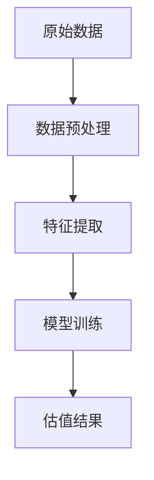
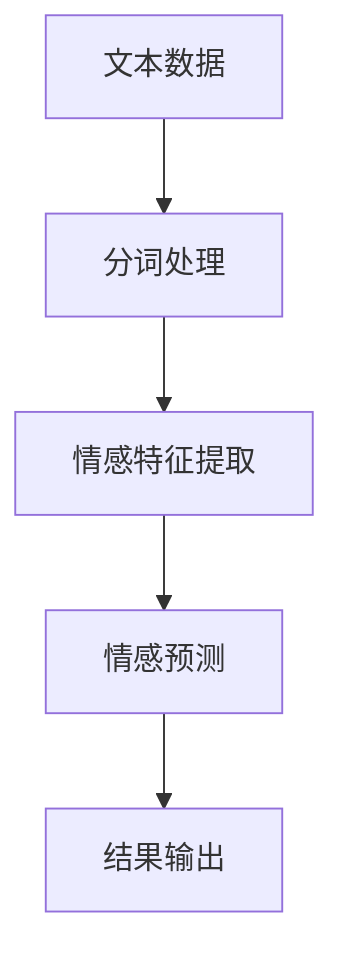

                 


# 新兴市场股市估值与智慧校园情感计算应用的互动

> 关键词：新兴市场，股市估值，智慧校园，情感计算，互动

> 摘要：本文探讨了新兴市场股市估值与智慧校园情感计算应用之间的互动关系。通过分析新兴市场股市估值的核心算法与智慧校园情感计算的技术实现，揭示了两者在数据共享、模型融合与应用场景中的互动机制。文章结合实际案例，详细解读了互动带来的创新价值与应用前景，为相关领域的研究与实践提供了新的视角。

---

# 第一部分: 引言

## 第1章: 本书主题概述

### 1.1 新兴市场股市估值与智慧校园情感计算的互动关系
新兴市场股市估值与智慧校园情感计算看似 unrelated，但它们在数据共享、模型融合和应用创新方面存在潜在的互动机会。本文将从技术与应用的角度，探索两者的互动机制。

### 1.2 本书的研究背景与意义
随着全球化进程的加速，新兴市场在经济和科技领域的重要性日益凸显。智慧校园作为教育信息化的重要组成部分，正在通过情感计算技术提升用户体验。与此同时，股市估值作为金融市场的核心问题，也在借助人工智能技术实现精准预测。两者的结合不仅能够推动技术进步，还能为教育和金融领域带来新的发展机遇。

### 1.3 本书的结构安排
本书共分为三部分：新兴市场股市估值分析、智慧校园情感计算应用、以及两者的互动关系。每一部分都从背景、算法、系统架构到实际案例进行全面解析。

---

# 第二部分: 新兴市场股市估值分析

## 第2章: 新兴市场股市估值基础

### 2.1 新兴市场的定义与特征
新兴市场通常指经济快速发展但尚未完全工业化的国家，如中国、印度等。其股市具有高增长性、高波动性和高风险性。

### 2.2 股市估值的基本概念与方法
股市估值是通过对企业基本面、市场环境和技术指标的分析，对股票的内在价值进行估算。常用方法包括市盈率（P/E）、市净率（P/B）等。

### 2.3 新兴市场股市估值的特殊性
新兴市场的股市估值受政策、经济波动和外部环境影响较大，且数据获取难度较高。

---

## 第3章: 新兴市场股市估值的核心算法

### 3.1 常用估值模型的原理与应用
传统估值模型如DCF模型，适用于企业价值评估。但新兴市场的特殊性要求我们引入机器学习算法。

### 3.2 基于机器学习的股市预测算法
- **线性回归模型**：用于预测股票价格。
- **随机森林模型**：通过特征提取提高预测精度。
- **LSTM模型**：用于时间序列分析。

### 3.3 数据流图展示：新兴市场股市估值数据流图


---

## 第4章: 新兴市场股市估值的系统架构

### 4.1 系统功能模块划分
- 数据采集模块：采集股票价格、财务数据等。
- 数据处理模块：清洗和预处理数据。
- 模型训练模块：训练估值模型。
- 结果输出模块：生成估值报告。

### 4.2 系统架构设计图


---

## 第5章: 新兴市场股市估值的项目实战

### 5.1 环境搭建与数据准备
- 使用Python和相关库（如Pandas、Scikit-learn）搭建开发环境。
- 数据来源：新兴市场股票的历史数据。

### 5.2 核心算法实现
以下是基于LSTM的股票价格预测代码示例：
```python
import numpy as np
from keras.layers import LSTM, Dense
from keras.models import Sequential

model = Sequential()
model.add(LSTM(64, input_shape=(timesteps, features)))
model.add(Dense(1))
model.compile(optimizer='adam', loss='mean_squared_error')
model.fit(X_train, y_train, epochs=10, batch_size=32)
```

### 5.3 项目案例分析与解读
以某新兴市场为例，通过模型预测股票价格的变化趋势，分析其与实际市场的吻合度。

---

# 第三部分: 智慧校园情感计算应用

## 第6章: 智慧校园情感计算基础

### 6.1 情感计算的定义与核心概念
情感计算是通过分析人的语言、表情和行为，推测其情感状态的技术。

### 6.2 智慧校园中的情感计算应用场景
- 学生情绪监测：通过分析学生的文本数据，识别其情感状态。
- 教师情感反馈：帮助教师优化教学方法。

### 6.3 情感计算与智慧校园的互动关系
情感数据可以为股市估值提供新的维度，而股市的波动也可以为情感计算提供研究素材。

---

## 第7章: 情感计算的核心算法与实现

### 7.1 情感分析算法原理
- **文本分词**：将文本分割成词语。
- **特征提取**：提取情感相关特征。
- **分类器训练**：使用SVM或随机森林进行分类。

### 7.2 基于深度学习的情感计算模型
- **BERT模型**：用于情感分析任务。
- **Transformer模型**：用于情感特征提取。

### 7.3 情感计算数据流图


---

## 第8章: 智慧校园情感计算的系统架构

### 8.1 系统功能模块设计
- 数据采集模块：采集学生和教师的行为数据。
- 数据处理模块：清洗和预处理数据。
- 模型训练模块：训练情感分析模型。
- 结果应用模块：生成情感报告。

### 8.2 系统架构设计图


---

## 第9章: 情感计算与股市估值的互动机制

### 9.1 数据共享与融合
- 将情感数据与股市数据结合，提高估值模型的准确性。

### 9.2 模型融合与优化
- 使用集成学习方法，将情感计算与股市估值模型结合起来。

### 9.3 应用互动案例分析
- 通过情感数据预测股市情绪变化，优化估值模型。

---

## 第10章: 挑战与解决方案

### 10.1 技术挑战
- 数据隐私问题：如何保护用户数据？
- 模型泛化能力：如何提高模型的通用性？

### 10.2 解决方案
- 数据匿名化处理：保护用户隐私。
- 模型优化：通过迁移学习提高泛化能力。

---

## 第11章: 结论与展望

### 11.1 研究结论
本文通过分析新兴市场股市估值与智慧校园情感计算的应用，揭示了两者的互动关系。

### 11.2 未来展望
未来的研究可以进一步探索两者在更多场景中的互动应用。

---

## 第12章: 附录

### 12.1 相关代码与数据
- 提供项目中用到的代码和数据集。

### 12.2 参考文献
- 列出本文参考的文献资料。

---

通过以上分析，我们可以看到，新兴市场股市估值与智慧校园情感计算的互动不仅能够推动技术进步，还能为教育和金融领域带来新的发展机遇。希望本文能为相关领域的研究与实践提供新的视角和思路。

