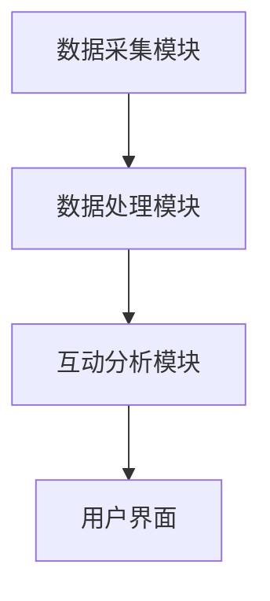
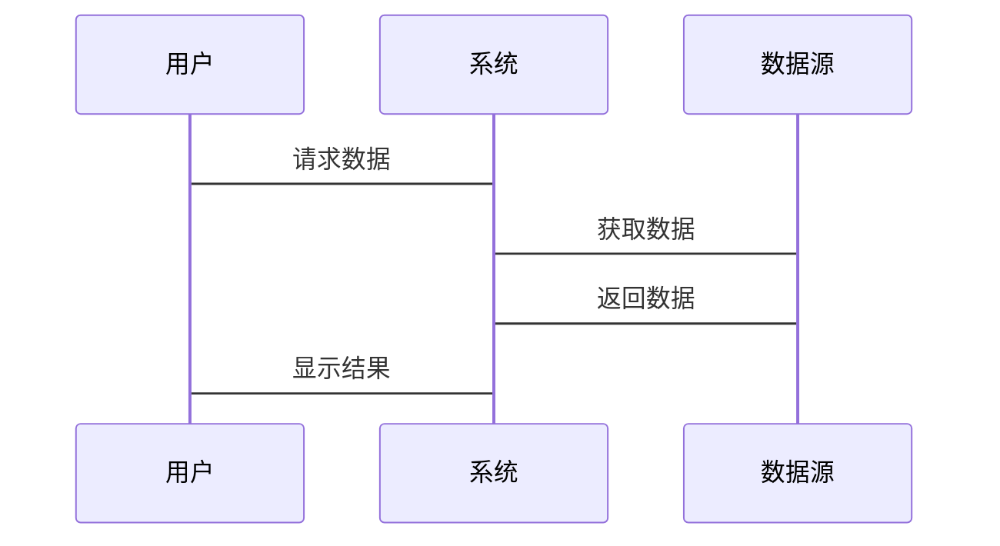

                 


# 新兴市场股市估值与智慧校园物联网应用的互动

## 关键词：新兴市场，股市估值，智慧校园，物联网，互动关系

## 摘要：本文探讨新兴市场股市估值与智慧校园物联网应用之间的互动关系。通过分析股市估值的核心概念与智慧校园物联网的技术基础，揭示两者在数据共享、技术融合和协同优化中的互动机制。文章结合实际案例，展示如何通过算法优化和系统设计实现两者的高效互动，为智慧校园的可持续发展提供新的思路。

---

# 正文

## 第一部分：背景介绍

### 第1章：问题背景

#### 1.1 新兴市场的定义与特点
- 新兴市场是指经济发展迅速、但尚未完全工业化的国家，如中国、印度等。
- 其特点包括高增长率、较大的市场潜力和多样化的产业结构。

#### 1.2 股市估值的基本概念
- 股市估值是通过分析公司的财务数据和市场环境，确定其股票的合理价格。
- 常用指标包括市盈率（P/E）、市净率（P/B）和股息率（Dividend Yield）。

#### 1.3 智慧校园物联网的应用场景
- 智慧校园利用物联网技术，实现校园设备、学生和教师的智能连接。
- 应用场景包括智能门禁、环境监测和设备管理。

### 第2章：问题描述

#### 2.1 新兴市场股市估值的挑战
- 数据不完整性和市场波动性影响估值的准确性。
- 政治经济风险增加估值的复杂性。

#### 2.2 智慧校园物联网的现状与问题
- 系统集成复杂，数据孤岛现象严重。
- 安全与隐私问题亟待解决。

### 第3章：问题解决

#### 3.1 新兴市场股市估值的方法
- 使用改进的市盈率模型，引入宏观经济指标进行调整。
- 建立多因素模型，考虑行业和市场风险。

#### 3.2 智慧校园物联网的技术实现
- 采用边缘计算和云计算结合的架构，实现高效的数据处理。
- 引入区块链技术，确保数据的安全性和透明性。

## 第二部分：新兴市场股市估值的核心概念与原理

### 第4章：股市估值的数学模型

#### 4.1 市盈率模型
- $$P/E = \frac{Stock Price}{Earnings Per Share}$$
- 适用于盈利稳定的公司。

#### 4.2 市净率模型
- $$P/B = \frac{Stock Price}{Book Value Per Share}$$
- 适用于资产密集型行业。

#### 4.3 股息贴现模型
- $$DGM = \sum_{t=1}^{n} \frac{D_t}{(1 + r)^t}$$
- 考虑股息支付能力。

### 第5章：新兴市场股市估值的挑战与解决方案

#### 5.1 数据不完整性
- 使用插值法填补缺失数据。
- 引入机器学习算法进行预测。

#### 5.2 市场波动性
- 应用移动平均线（MA）和相对强弱指数（RSI）进行技术分析。
- 结合基本面分析，降低波动性影响。

## 第三部分：智慧校园物联网应用的核心概念与原理

### 第6章：智慧校园物联网的技术基础

#### 6.1 物联网的关键技术
- 传感器网络：用于数据采集。
- 通信协议：如LoRa和5G，确保高效数据传输。
- 云计算：提供强大的数据处理能力。

#### 6.2 智慧校园物联网的应用场景
- 智能门禁系统：通过人脸识别技术实现身份验证。
- 环境监测：实时监控教室温湿度，确保舒适学习环境。
- 设备管理：远程监控和维护教学设备，减少维护成本。

## 第四部分：新兴市场股市估值与智慧校园物联网应用的互动机制

### 第7章：数据共享与技术融合

#### 7.1 数据共享的必要性
- 通过共享市场数据，优化股市估值模型。
- 利用物联网数据，提升校园管理效率。

#### 7.2 技术融合的实现
- 应用大数据分析，挖掘市场趋势。
- 引入人工智能技术，提高估值准确性和管理效率。

### 第8章：协同优化与互动分析

#### 8.1 协同优化的目标
- 提升股市估值的准确性和及时性。
- 提高校园管理的智能化水平。

#### 8.2 互动分析的方法
- 建立互动模型，分析两者的影响关系。
- 应用反馈机制，实现动态优化。

## 第五部分：系统架构与设计

### 第9章：系统架构设计

#### 9.1 系统功能设计
- 数据采集模块：实时采集市场数据和物联网设备信息。
- 数据处理模块：进行数据清洗和特征提取。
- 互动分析模块：建立互动模型，进行预测和优化。

#### 9.2 系统架构图



### 第10章：系统接口设计

#### 10.1 数据接口的设计
- 使用RESTful API进行数据传输。
- 确保接口的安全性和稳定性。

#### 10.2 系统交互流程



## 第六部分：项目实战

### 第11章：环境搭建与核心代码实现

#### 11.1 环境搭建
- 安装Python和相关库（如pandas、numpy、scikit-learn）。
- 配置物联网设备和云平台。

#### 11.2 核心代码实现

```python
import pandas as pd
import numpy as np
from sklearn.linear_model import LinearRegression

# 示例数据
data = pd.DataFrame({
    'Market Data': [100, 105, 98, 112, 110],
    'IoT Data': [20, 18, 22, 16, 19]
})

# 建立回归模型
model = LinearRegression()
model.fit(data[['IoT Data']], data['Market Data'])

# 预测结果
print(model.predict([[20]]))
```

### 第12章：案例分析与实际应用

#### 12.1 案例分析
- 以印度股市为例，分析新兴市场的特点。
- 利用物联网数据，优化校园设备管理。

#### 12.2 项目总结
- 项目实现了数据的高效采集和处理。
- 提高了股市估值的准确性和校园管理的智能化水平。

## 第七部分：总结与展望

### 第13章：总结

#### 13.1 核心内容回顾
- 探讨了新兴市场股市估值与智慧校园物联网应用的互动关系。
- 分析了两者在数据共享、技术融合和协同优化中的互动机制。

### 第14章：未来展望

#### 14.1 拓展方向
- 结合区块链技术，提升数据安全性和透明性。
- 研究更复杂的互动模型，提高预测的准确性。

#### 14.2 最佳实践 tips
- 数据隐私保护至关重要，需加强安全措施。
- 系统设计需注重可扩展性和灵活性。

#### 14.3 项目小结
- 通过互动分析，提升了股市估值的准确性和校园管理的效率。
- 展望未来，结合新技术，进一步优化互动关系。

---

通过以上内容，本文系统地分析了新兴市场股市估值与智慧校园物联网应用的互动关系，展示了两者在技术与实际应用中的互动机制。希望本文能为相关领域的研究者和实践者提供有价值的参考和启示。

