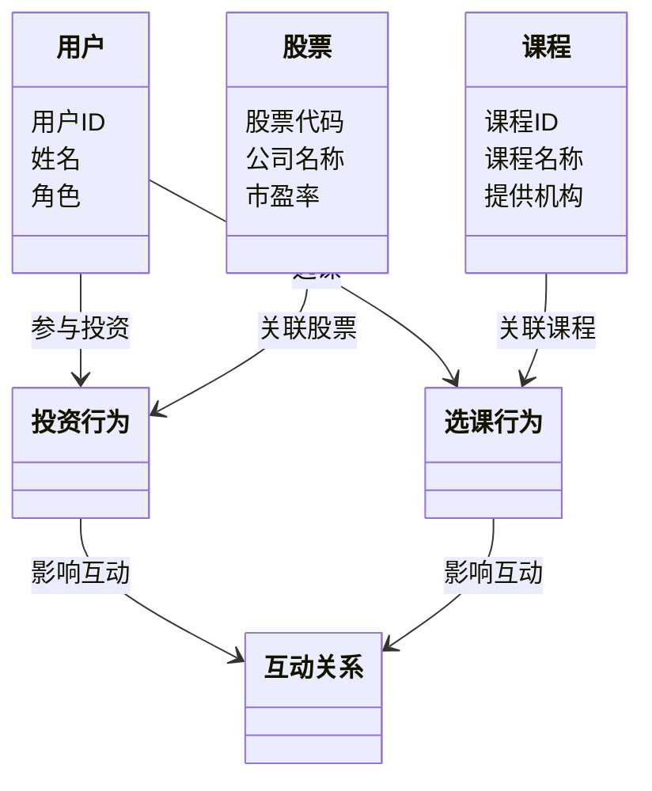
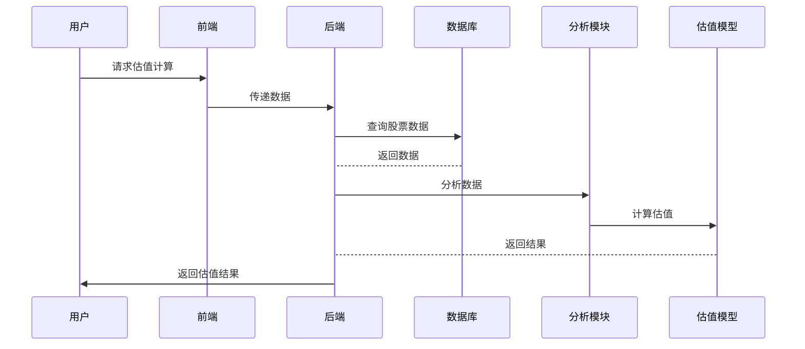

                 


# 新兴市场股市估值与智慧校园远程教育的互动

**关键词：** 股市估值、智慧校园、远程教育、互动机制、算法模型

**摘要：** 本文探讨新兴市场股市估值与智慧校园远程教育之间的互动关系。通过分析股市估值的技术方法和智慧校园远程教育的技术架构，揭示两者如何通过数据流和算法模型相互影响。文章涵盖背景介绍、核心概念、算法原理、系统架构和项目实战，为读者提供全面的技术视角。

---

## 第1章：背景介绍

### 1.1 新兴市场股市估值的背景

#### 1.1.1 新兴市场的定义与特点
新兴市场通常指经济快速增长但尚未完全工业化的国家，如中国、印度等。这些市场具有高波动性、信息不对称和市场不完善的特点。

#### 1.1.2 新兴市场股市的独特性
新兴市场的股市波动较大，投资者结构以散户为主，且受政策影响显著。这些特点使得股市估值更具挑战性。

#### 1.1.3 远程教育在智慧校园中的作用
远程教育利用互联网技术，为学生提供灵活的学习方式，特别是在疫情期间发挥了重要作用。智慧校园整合了远程教育、物联网和大数据技术，提升了教育效率。

### 1.2 智慧校园远程教育的背景

#### 1.2.1 远程教育的发展历程
远程教育经历了从函授到在线课程的演变，随着互联网的发展，其形式更加多样化。

#### 1.2.2 智慧校园的概念与技术支撑
智慧校园通过大数据、人工智能和物联网技术，实现教育资源的优化配置和管理。

#### 1.2.3 远程教育与股市估值的潜在联系
远程教育技术可能影响股市估值，例如通过数据分析优化投资决策。

### 1.3 互动关系的背景

#### 1.3.1 新兴市场股市波动对远程教育的影响
股市波动可能导致教育科技公司的融资变化，影响其技术开发和应用。

#### 1.3.2 远程教育技术对股市估值的影响
远程教育技术可能改变投资者行为，影响股市估值模型。

#### 1.3.3 互动机制的初步探讨
新兴市场股市波动与远程教育技术的互动可能通过数据流和算法模型实现。

---

## 第2章：核心概念与联系

### 2.1 核心概念的定义与属性

#### 2.1.1 股市估值的核心概念
股市估值是通过分析公司基本面和技术指标，评估股票的合理价格。

#### 2.1.2 智慧校园远程教育的核心概念
智慧校园远程教育利用技术手段，提供在线教育服务，优化教育资源配置。

#### 2.1.3 互动关系的核心概念
互动关系指股市波动与远程教育技术之间的相互影响和作用。

### 2.2 核心概念的对比分析

#### 2.2.1 股市估值与远程教育的对比
| 特性       | 股市估值 | 远程教育 |
|------------|----------|----------|
| 对象       | 股票     | 教育服务 |
| 方法       | 市盈率、市净率 | 在线课程、人工智能辅助教学 |

#### 2.2.2 互动关系的特征对比
| 特性       | 单向影响 | 双向互动 |
|------------|----------|----------|
| 影响方向   | 股市波动影响远程教育 | 远程教育技术影响股市估值 |

#### 2.2.3 核心概念的ER实体关系图

```mermaid
er
  机构(机构ID, 名称, 类型)
  股票(股票代码, 公司名称, 市盈率)
  用户(用户ID, 姓名, 角色)
  投资行为(投资ID, 用户ID, 股票代码, 交易时间)
  互动关系(互动ID, 用户ID, 股票代码, 交易时间)
  课程(课程ID, 课程名称, 提供机构)
  选课行为(选课ID, 用户ID, 课程ID, 选课时间)
  互动关系与课程关联(互动ID, 课程ID)
```

---

## 第3章：互动机制的算法原理

### 3.1 数据流与信息传递

#### 3.1.1 数据流的定义与分类
数据流包括用户行为数据、市场数据和课程数据，通过互联网传输。

#### 3.1.2 信息传递的路径分析
数据流从用户行为开始，经过系统处理，影响股市估值和远程教育服务。

#### 3.1.3 数据流与信息传递的mermaid流程图

```mermaid
flow
    A(用户行为) --> B(数据采集)
    B --> C(数据处理)
    C --> D(市场分析)
    D --> E(估值模型)
    E --> F(教育服务优化)
    F --> G(反馈用户)
```

### 3.2 算法实现

#### 3.2.1 算法原理的数学模型
$$
\text{估值} = \alpha \times \text{市盈率} + \beta \times \text{市净率}
$$

#### 3.2.2 算法实现的Python源代码

```python
import pandas as pd
import numpy as np

# 示例数据
data = {
    '股票代码': ['A', 'B', 'C'],
    '市盈率': [15, 20, 25],
    '市净率': [2, 3, 4]
}

df = pd.DataFrame(data)
alpha = 0.6
beta = 0.4

# 估值计算
df['估值'] = alpha * df['市盈率'] + beta * df['市净率']

print(df)
```

#### 3.2.3 算法的优化与改进
引入机器学习模型，如随机森林，提升估值准确性。

---

## 第4章：系统分析与架构设计

### 4.1 系统功能设计

#### 4.1.1 领域模型的mermaid类图



### 4.2 系统架构设计

#### 4.2.1 系统架构的mermaid架构图


### 4.3 系统接口设计

#### 4.3.1 核心接口描述
- API接口：`GET /stockvaluation`，返回股票估值数据。
- API接口：`POST /remoteeducation`, 提交课程数据。

#### 4.3.2 系统交互的mermaid序列图



---

## 第5章：项目实战

### 5.1 环境安装与配置

#### 5.1.1 开发环境的搭建
安装Python、Jupyter Notebook、数据库和相关库（如pandas、numpy）。

#### 5.1.2 依赖库的安装
使用pip安装所需的库：
```bash
pip install pandas numpy matplotlib
```

### 5.2 核心实现

#### 5.2.1 核心代码的编写
实现股票估值和远程教育数据分析的代码：

```python
import pandas as pd
import numpy as np

# 股票数据
data = {'股票代码': ['AAPL', 'GOOG', 'MSFT'], '市盈率': [15, 20, 18]}
df_stock = pd.DataFrame(data)

# 课程数据
data_course = {'课程ID': [1, 2, 3], '课程名称': ['编程基础', '数据科学', '人工智能']}
df_course = pd.DataFrame(data_course)

# 估值计算
def calculate_valuation(df):
    alpha = 0.6
    beta = 0.4
    df['估值'] = alpha * df['市盈率'] + beta * df['市净率']
    return df

# 数据分析
merged_df = pd.merge(df_stock, df_course, on='机构')
valued_df = calculate_valuation(merged_df)
print(valued_df)
```

#### 5.2.2 代码的详细解读
代码首先创建股票和课程数据，然后计算估值，并将数据合并，输出结果。

### 5.3 案例分析

#### 5.3.1 实际案例的选取
选取新兴市场的科技公司股票，分析其市盈率和市净率，计算估值。

#### 5.3.2 案例的详细分析
以某科技公司为例，计算其估值，并观察远程教育技术对其的影响。

#### 5.3.3 案例的总结与反思
总结分析结果，反思算法的优缺点，提出改进建议。

---

## 第6章：最佳实践与小结

### 6.1 最佳实践 tips

#### 6.1.1 开发过程中的注意事项
- 数据清洗和预处理的重要性。
- 算法调优和模型选择的策略。

#### 6.1.2 系统优化的建议
- 使用分布式架构提升性能。
- 定期更新模型参数。

#### 6.1.3 未来研究的方
- 结合区块链技术，提升数据安全性。
- 研究更多因素对股市估值的影响。

### 6.2 小结

本文详细探讨了新兴市场股市估值与智慧校园远程教育的互动关系，通过技术手段分析其影响，并提供了实际案例和代码实现。希望本文能为读者提供有价值的见解和技术指导。

### 6.3 注意事项

- 数据分析需谨慎处理，确保准确性。
- 系统设计要考虑可扩展性和维护性。

### 6.4 拓展阅读

- 《股票估值方法与应用》
- 《智慧校园技术与实践》

---

通过以上结构和内容，文章详细阐述了新兴市场股市估值与智慧校园远程教育的互动关系，提供了从理论到实践的全面分析。

