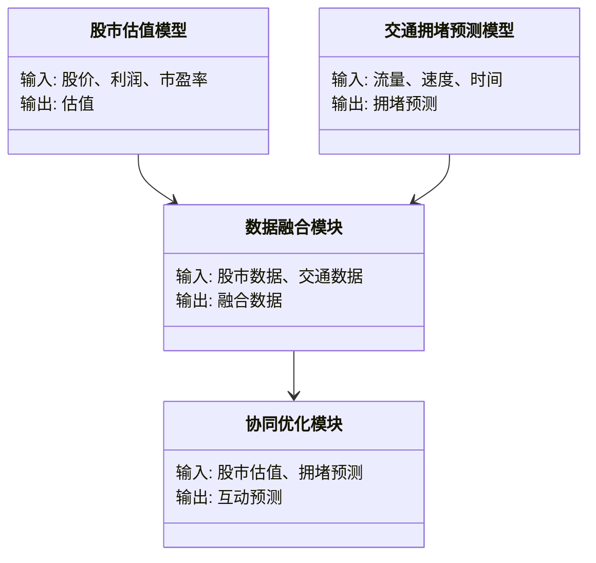

                 


# 新兴市场股市估值与智能交通拥堵预测的互动

> 关键词：新兴市场，股市估值，智能交通，拥堵预测，机器学习，数据共享，模型协同

> 摘要：本文探讨新兴市场股市估值与智能交通拥堵预测之间的互动关系，分析两者在数据、算法和系统设计上的协同优化，提出互动预测的系统架构与实现方案，并通过案例分析展示实际应用效果。

---

# 第一部分: 新兴市场股市估值与智能交通拥堵预测的互动概述

## 第1章: 背景介绍

### 1.1 新兴市场的特点与挑战

#### 1.1.1 新兴市场的定义与特征
- 新兴市场是指经济快速发展但尚未完全工业化的国家，如中国、印度等。
- 经济波动大，股市受政策和外部因素影响显著。
- 交通基础设施发展迅速，但城市化进程带来拥堵问题。

#### 1.1.2 新兴市场股市估值的独特性
- 市场流动性较低，估值受情绪影响较大。
- 缺乏长期历史数据，模型训练难度大。
- 政策变化频繁，影响市场估值。

#### 1.1.3 智能交通系统的现状与趋势
- 智能交通系统（ITS）的应用日益广泛。
- 数据采集技术进步，如GPS、摄像头和传感器。
- 交通拥堵预测的需求增加，特别是在大城市。

### 1.2 股市估值的基本概念

#### 1.2.1 股市估值的定义与方法
- 股市估值是对公司股票内在价值的评估。
- 常用指标：市盈率（P/E）、市净率（P/B）、市销率（P/S）。
- 方法：DCF模型、相对估值法、指数估值法。

#### 1.2.2 市场情绪对估值的影响
- 投资者情绪波动影响股市短期走势。
- 市场情绪可通过新闻、社交媒体等数据量化。
- 情绪指数与股市估值的相关性分析。

#### 1.2.3 新兴市场股市估值的特殊性
- 数据质量低，缺失值多。
- 市场波动大，短期因素影响显著。
- 需结合宏观因素（如GDP、利率）进行分析。

### 1.3 交通拥堵预测的核心问题

#### 1.3.1 交通拥堵的定义与分类
- 拥堵程度：轻度、中度、重度。
- 时间分布：高峰、平峰、夜间。
- 空间分布：城市中心、郊区。

#### 1.3.2 数据驱动的拥堵预测方法
- 数据来源：交通传感器、GPS、社交媒体。
- 数据特征：流量、速度、密度。
- 方法：时间序列分析、空间分析、机器学习。

#### 1.3.3 智能交通系统的应用现状
- ITS的应用案例：智能信号灯、路线优化。
- 数据共享的挑战：隐私保护、数据格式不统一。
- 系统集成的难点：多源数据融合、实时性要求。

---

## 第2章: 新兴市场股市估值的核心概念与算法原理

### 2.1 股市估值的关键指标

#### 2.1.1 市盈率（P/E）的计算与应用
- 公式：P/E = 股价 / 每股净利润。
- 用途：衡量股票的投资价值。
- 示例：某公司股价为10元，每股净利润为2元，则P/E = 5。

#### 2.1.2 市净率（P/B）的计算与应用
- 公式：P/B = 股价 / 每股净资产。
- 用途：适用于净资产驱动型行业。
- 示例：某公司股价为15元，每股净资产为5元，则P/B = 3。

#### 2.1.3 市销率（P/S）的计算与应用
- 公式：P/S = 股价 / 每股收入。
- 用途：适用于收入驱动型行业。
- 示例：某公司股价为20元，每股收入为5元，则P/S = 4。

### 2.2 股市估值的机器学习模型

#### 2.2.1 线性回归模型在估值中的应用
- 简单线性回归：y = a + bx。
- 多元线性回归：y = a + b1x1 + b2x2 + ... + bn xn。
- 应用：预测股票价格。
- 示例：使用历史数据训练模型，预测未来股价。

#### 2.2.2 支持向量机（SVM）在估值中的应用
- SVM原理：寻找最优超平面。
- 核函数：处理非线性数据。
- 应用：分类和回归。
- 示例：将股票分为高估和低估两类。

#### 2.2.3 随机森林在估值中的应用
- 随机森林原理：基于决策树的集成方法。
- 优点：抗过拟合，适合高维数据。
- 应用：预测股票价格。
- 示例：使用随机森林模型分析多因素对股价的影响。

---

## 第3章: 智能交通拥堵预测的核心概念与算法原理

### 3.1 交通拥堵预测的关键指标

#### 3.1.1 流量数据的采集与分析
- 数据来源：交通传感器、GPS、摄像头。
- 数据特征：流量、速度、密度。
- 数据预处理：清洗、归一化、插值。

#### 3.1.2 时间序列分析在拥堵预测中的应用
- 时间序列模型：ARIMA、GARCH。
- 季节性分析：周、月、年周期。
- 示例：使用ARIMA模型预测某路段的未来流量。

#### 3.1.3 空间分布分析在拥堵预测中的应用
- 空间聚类：K-means、DBSCAN。
- 空间插值：IDW、Kriging。
- 示例：分析拥堵热点区域。

### 3.2 智能交通拥堵预测的机器学习模型

#### 3.2.1 K近邻算法（KNN）在拥堵预测中的应用
- KNN原理：基于距离的分类。
- 参数选择：K值的选择。
- 应用：预测拥堵状态。
- 示例：使用KNN模型判断某路段是否拥堵。

#### 3.2.2 神经网络模型在拥堵预测中的应用
- 多层感知机（MLP）：全连接层。
- 卷积神经网络（CNN）：处理图像数据。
- 循环神经网络（RNN）：处理时间序列。
- 示例：使用LSTM模型预测交通流量。

#### 3.2.3 时间序列模型（ARIMA）在拥堵预测中的应用
- ARIMA原理：自回归积分滑动平均。
- 参数选择：p、d、q。
- 应用：预测未来交通状态。
- 示例：预测未来24小时的交通流量。

---

## 第4章: 新兴市场股市估值与智能交通拥堵预测的互动关系

### 4.1 数据共享与融合

#### 4.1.1 股市数据与交通数据的关联性分析
- 数据关联性：股市波动与交通拥堵的关系。
- 示例：股市下跌可能导致交通拥堵增加。

#### 4.1.2 数据共享的技术挑战
- 数据隐私保护。
- 数据格式不统一。
- 数据传输延迟。

#### 4.1.3 数据融合的方法与应用
- 数据清洗：去除噪声。
- 数据对齐：时间同步。
- 数据融合：特征组合。
- 示例：将股市数据与交通数据结合，预测交通拥堵。

### 4.2 模型互动与协同优化

#### 4.2.1 股市估值模型对交通拥堵预测的启示
- 估值模型的鲁棒性对拥堵预测的启示。
- 示例：使用随机森林模型进行协同预测。

#### 4.2.2 交通拥堵预测模型对股市估值的启示
- 时间序列模型的实时性对估值的启示。
- 示例：使用LSTM模型预测股市波动。

#### 4.2.3 模型协同优化的实现方法
- 联合训练：共享特征。
- 联合预测：协同输出。
- 参数调优：优化模型性能。

---

## 第5章: 系统分析与架构设计方案

### 5.1 问题场景介绍

#### 5.1.1 新兴市场股市估值的复杂性
- 数据质量低。
- 市场波动大。
- 政策影响显著。

#### 5.1.2 智能交通拥堵预测的挑战
- 数据来源多。
- 实时性要求高。
- 模型复杂。

#### 5.1.3 互动预测的现实需求
- 交通拥堵对经济的影响。
- 经济波动对交通的影响。

### 5.2 系统功能设计

#### 5.2.1 领域模型（Mermaid类图）


#### 5.2.2 系统架构设计（Mermaid架构图）
```mermaid
container 新兴市场股市估值与智能交通拥堵预测系统 {
    股市估值模型
    交通拥堵预测模型
    数据融合模块
    协同优化模块
    用户界面
}
```

---

## 第6章: 项目实战与案例分析

### 6.1 环境安装

#### 6.1.1 安装Python环境
- 安装Python 3.8及以上版本。
- 安装Jupyter Notebook。

#### 6.1.2 安装机器学习库
- scikit-learn
- xgboost
- tensorflow

#### 6.1.3 数据获取
- 股市数据：从Yahoo Finance获取。
- 交通数据：从公开数据集获取。

### 6.2 系统核心实现源代码

#### 6.2.1 数据预处理代码
```python
import pandas as pd
import numpy as np

# 股市数据预处理
df_stock = pd.read_csv('stock_data.csv')
df_stock = df_stock.dropna()
df_stock['date'] = pd.to_datetime(df_stock['date'])
df_stock.set_index('date', inplace=True)

# 交通数据预处理
df_traffic = pd.read_csv('traffic_data.csv')
df_traffic = df_traffic.dropna()
df_traffic['time'] = pd.to_datetime(df_traffic['time'])
df_traffic.set_index('time', inplace=True)
```

#### 6.2.2 模型训练代码
```python
from sklearn.ensemble import RandomForestRegressor
from sklearn.metrics import mean_squared_error

# 股市估值模型
model_stock = RandomForestRegressor(n_estimators=100, random_state=42)
model_stock.fit(X_stock_train, y_stock_train)

# 交通拥堵预测模型
model_traffic = RandomForestRegressor(n_estimators=100, random_state=42)
model_traffic.fit(X_traffic_train, y_traffic_train)
```

#### 6.2.3 模型协同优化代码
```python
from sklearn.metrics import mean_squared_error

# 股市估值协同优化
model_co = RandomForestRegressor(n_estimators=100, random_state=42)
model_co.fit(X_co_train, y_co_train)

# 评估协同优化效果
y_co_pred = model_co.predict(X_co_test)
print(mean_squared_error(y_co_test, y_co_pred))
```

### 6.3 实际案例分析与详细解读

#### 6.3.1 股市估值案例
- 数据来源：新兴市场某股票的历史数据。
- 模型预测：使用随机森林模型预测未来股价。
- 结果分析：预测与实际值的对比。

#### 6.3.2 交通拥堵预测案例
- 数据来源：某城市交通传感器数据。
- 模型预测：使用LSTM模型预测未来24小时的交通状态。
- 结果分析：预测准确率评估。

#### 6.3.3 互动预测案例
- 数据来源：结合股市和交通数据。
- 模型预测：预测交通拥堵对股市的影响。
- 结果分析：互动预测的有效性评估。

---

## 第7章: 最佳实践与总结

### 7.1 最佳实践 tips

#### 7.1.1 数据处理
- 数据清洗：去除噪声。
- 数据归一化：提高模型性能。
- 数据存储：使用数据库管理。

#### 7.1.2 模型选择
- 根据数据类型选择模型。
- 考虑模型的可解释性。
- 避免过拟合。

#### 7.1.3 系统设计
- 模块化设计：便于维护和扩展。
- 数据安全：保护隐私。
- 实时性：满足实际需求。

### 7.2 小结

- 新兴市场股市估值与智能交通拥堵预测的互动关系复杂但重要。
- 数据共享与模型协同优化是实现互动预测的关键。
- 本文提出了系统架构与实现方案，为实际应用提供了参考。

### 7.3 注意事项

- 数据隐私保护：遵守相关法律法规。
- 模型鲁棒性：确保模型在不同环境下的稳定性。
- 实时性要求：优化系统性能。

### 7.4 拓展阅读

- 《机器学习实战》
- 《时间序列分析》
- 《智能交通系统》

---

# 结语

本文系统地探讨了新兴市场股市估值与智能交通拥堵预测的互动关系，分析了两者在数据、算法和系统设计上的协同优化，并提出了互动预测的系统架构与实现方案。通过案例分析展示了实际应用效果，并总结了最佳实践和注意事项，为后续研究提供了参考。

---

# 参考文献

1.《机器学习实战》
2.《时间序列分析》
3.《智能交通系统》

---

