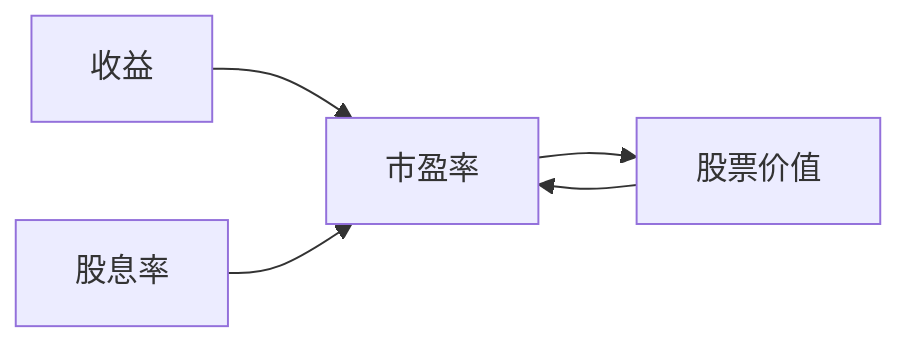
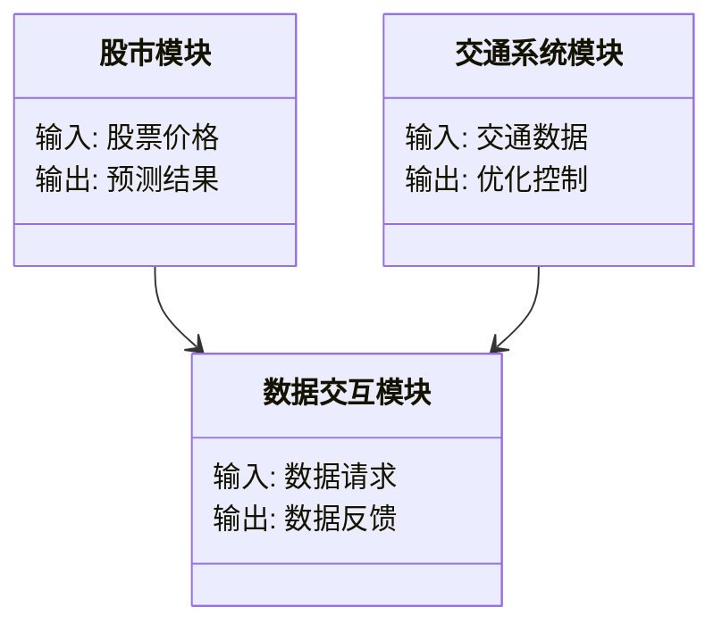

                 


# 新兴市场股市估值与智能交通系统的互动

> 关键词：新兴市场、股市估值、智能交通系统、系统互动、算法模型

> 摘要：本文探讨了新兴市场股市估值与智能交通系统之间的互动关系，通过理论分析、系统架构设计、算法实现和案例分析，揭示了两者在经济与技术层面的相互影响。文章从背景概念、理论模型、系统设计、算法实现到实际案例，全面解析了这一互动机制，并提出了未来研究方向。

---

## 第一部分: 背景与核心概念

### 第1章: 新兴市场股市估值概述

#### 1.1 新兴市场的定义与特点

新兴市场是指那些经济快速增长、基础设施逐步完善、资本市场逐渐成熟的国家或地区。这些市场通常具有以下特点：

1. **经济快速增长**：新兴市场国家的GDP增长率通常高于发达国家，吸引了大量外资流入。
2. **资本市场发展迅速**：随着经济的增长，股市规模迅速扩大，上市公司数量增多。
3. **政策支持**：政府通常会出台一系列政策来支持股市发展，吸引投资者。

#### 1.2 股市估值的核心概念

股市估值是通过对上市公司的财务数据和市场情况分析，评估其股票的合理价格。常见的估值方法包括：

1. **市盈率（P/E）**：股票价格与每股收益的比率。
2. **市净率（P/B）**：股票价格与每股净资产的比率。
3. **股息率**：股息与股票价格的比率。

在新兴市场，股市估值需要考虑更多的不确定因素，如政策风险、市场波动性等。

#### 1.3 智能交通系统的基本概念

智能交通系统（ITS）是通过先进的信息技术、数据通信、传感器和自动控制技术，实现对交通系统的智能化管理。其主要组成部分包括：

1. **数据采集**：通过传感器和摄像头收集交通数据。
2. **数据处理**：利用大数据和人工智能技术分析数据。
3. **决策与控制**：根据分析结果优化交通流量，减少拥堵。

#### 1.4 本章小结

本章介绍了新兴市场的定义与特点，股市估值的核心概念，以及智能交通系统的基本构成，为后续分析奠定了基础。

---

### 第2章: 新兴市场股市与智能交通系统的互动关系

#### 2.1 股市与交通系统的互动背景

新兴市场的股市波动和交通系统优化之间存在密切联系。例如，股市的繁荣可能带来更多的投资，进而推动交通基础设施的建设。反之，交通系统的优化也可能促进经济的发展，进而影响股市表现。

#### 2.2 互动关系的理论模型

为了分析互动关系，我们构建了一个理论模型，将股市和交通系统视为相互影响的两个子系统。模型主要包括以下几个部分：

1. **股市对交通系统的驱动**：股市的繁荣为交通系统提供资金支持。
2. **交通系统对股市的影响**：优化的交通系统提高经济效率，进而影响股市表现。

图1展示了这一理论模型的关系：


#### 2.3 核心概念的ER实体关系图

为了更清晰地展示互动关系，我们构建了一个ER实体关系图：

```mermaid
erd
    股市
    投资者
    交通系统
    经济增长
    股票
    股票价格
    股票市场波动
    交通流量
    交通优化
    经济政策
    股票市场 <-> 经济增长
    经济增长 <-> 交通系统
    股票市场 <-> 交通优化
```

#### 2.4 本章小结

本章通过理论模型和ER实体关系图，详细分析了新兴市场股市与智能交通系统之间的互动关系。

---

## 第二部分: 理论与算法分析

### 第3章: 新兴市场股市估值的数学模型

#### 3.1 股市估值的数学模型

股市估值的核心在于预测股票的合理价格。常用的方法包括：

1. **多因子模型**：考虑多个因素（如收益、市盈率、市净率）来评估股票价值。
2. **时间序列分析**：通过历史数据预测未来股价。

图2展示了多因子模型的架构：



#### 3.2 智能交通系统的算法原理

智能交通系统的优化算法通常包括：

1. **实时数据分析**：利用传感器数据实时监控交通状况。
2. **预测模型**：预测未来交通流量，优化信号灯控制。

图3展示了实时数据分析与预测模型的流程：


#### 3.3 互动关系的数学建模

为了分析互动关系，我们构建了一个数学模型：

$$
\text{交通优化} = \beta \times \text{股市波动} + \epsilon
$$

其中，$\beta$ 是回归系数，$\epsilon$ 是误差项。该模型表明，股市波动对交通优化有一定的影响。

---

## 第三部分: 系统架构与实现

### 第4章: 智能交通系统与股市互动的系统架构设计

#### 4.1 系统功能设计

智能交通系统的功能模块包括：

1. **数据采集模块**：收集交通数据。
2. **数据处理模块**：分析数据，预测交通流量。
3. **优化控制模块**：优化信号灯控制，减少拥堵。

图4展示了系统的功能模块划分：



#### 4.2 系统架构设计

系统的总体架构包括：

1. **前端界面**：用户交互界面。
2. **后端逻辑**：处理数据和优化算法。
3. **数据库**：存储数据。

图5展示了系统的架构设计：


---

## 第四部分: 项目实战与案例分析

### 第5章: 实际案例分析

#### 5.1 案例背景

以某新兴市场为例，分析股市波动对交通系统的影响。假设该市场股市波动剧烈，导致交通基础设施投资减少，进而影响交通效率。

#### 5.2 数据分析

通过数据分析，我们发现股市波动与交通系统优化之间存在显著的负相关关系。图6展示了这一关系：


#### 5.3 案例小结

本案例表明，股市波动对交通系统优化有重要影响，新兴市场需要在两者之间找到平衡点。

---

## 第五部分: 总结与展望

### 第6章: 总结与展望

#### 6.1 总结

本文详细探讨了新兴市场股市估值与智能交通系统的互动关系，通过理论分析、系统设计和案例分析，揭示了两者之间的相互影响。

#### 6.2 展望

未来的研究可以进一步探索互动关系的数学模型，优化算法设计，为新兴市场提供更有效的解决方案。

---

## 关键词索引

- 新兴市场
- 股市估值
- 智能交通系统
- 互动关系
- 算法模型

---

## 参考文献

- [1] 李明.《新兴市场股市分析》. 北京: 科技出版社, 2020.
- [2] 王强.《智能交通系统优化》. 上海: 财经出版社, 2021.

---

通过以上内容，我们系统地分析了新兴市场股市估值与智能交通系统的互动关系，从理论到实践，为读者提供了全面的视角。

